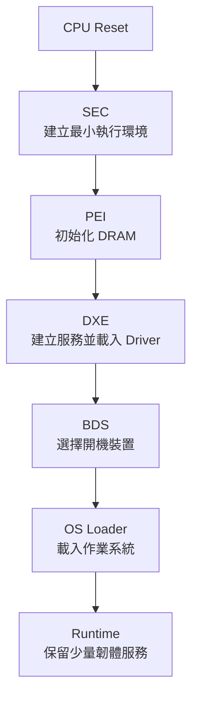
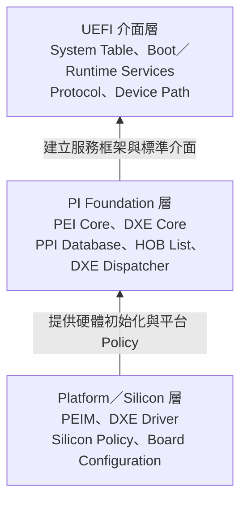
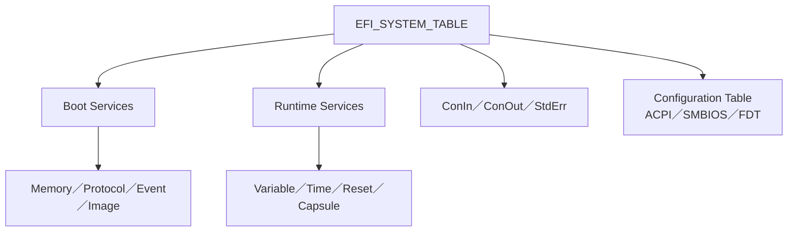
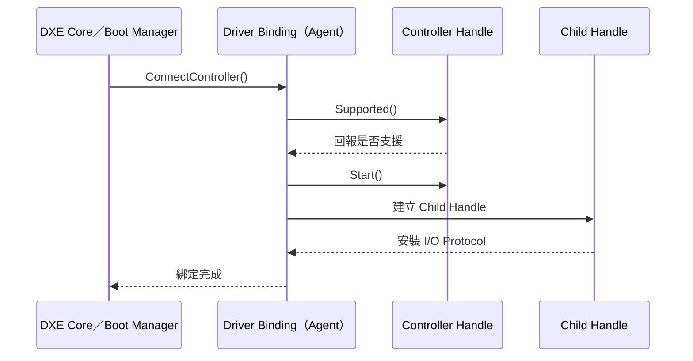
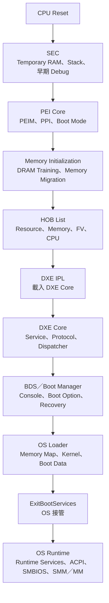

# UEFI／PI 架構與韌體執行階段

> 文件狀態：Draft 3
>
> 文件定位：BIOS／UEFI 平台初始化、除錯與設計審查的入門章節，也是後續 CPU、Memory、DXE Driver、BDS、ACPI、SMM／MM 與 Firmware Update 章節的共同基礎。
>
> 適用範圍：以 EDK II 為主要參考實作，涵蓋 x86、AArch64 及其他符合 UEFI／PI 規範的平台。若平台採用 Intel FSP、AMD AGESA、Arm TF-A、Coreboot Payload 或供應商專屬 Silicon Package，實際模組切分與交接點可能不同，但仍可用本章的「階段、輸入、輸出、交接點、觀測點」模型分析。
>
> 使用方式：先用第 0 節定位階段，再到第 4、9、13 節確認交接條件與排查順序；需要理解資料結構時查第 5、6、7 節；問題發生在 OS 接管前後時查第 8 節。

## 快速導覽

- [掌握完整開機主線](#0-5-分鐘入門uefi-開機流程速覽)：先確認 SEC、PEI、DXE、BDS 與 Runtime 的責任邊界。
- [確認規格與實作邊界](#3-uefi-與-pi-規格的定位及邊界)：區分 UEFI、PI、EDK II 與平台政策。
- [依階段分析生命週期](#4-secpei-dxebds-與-runtime-的生命週期)：查看各階段的必要條件、主要產出與完成判準。
- [追查介面與資料生命週期](#6-ppiprotocolhobevent-與-handle-database)：確認建立者、消費者、有效期間與所有權。
- [分析 Driver 派送與裝置連接](#7-architectural-protocol-與-driver-dispatch-相依關係)：區分 Dispatch、Connect 與 Driver Binding。
- [分析 OS Hand-off 與 Runtime](#8-exitbootservices-前後可用服務差異)：確認 Memory Map、服務終止、Runtime Memory 與位址轉換。
- [建立觀測與測試基準](#11-建議觀測點與-debug-資料)：統一版本、平台、階段、時間與錯誤資訊。
- [從故障現象展開排查](#13-常見問題與排查方向)：依現象、可能方向、驗證方式與調整方向縮小範圍。

### 依角色選擇閱讀路徑

| 使用情境 | 建議順序 | 閱讀目標 |
| --- | --- | --- |
| 第一次接觸 UEFI／PI | 0 → 4 → 6 → 9 → 13 | 建立階段、交接點與核心資料結構的整體模型 |
| 平台 Bring-up 與故障分析 | 13 → 4 → 9 → 6 → 8 | 從外觀定位階段，再檢查交接資料與服務狀態 |
| 韌體架構與模組設計 | 3 → 5 → 6 → 7 → 8 → 14 | 確認規格邊界、Foundation、模組相依與安全責任 |
| 測試與驗證 | 4.0 → 9 → 11 → 12 → 13 | 建立可觀測里程碑、測試矩陣與通過條件 |

### 任務導向入口

| 目前任務 | 建議先讀 | 第一批必要證據 |
| --- | --- | --- |
| 新平台第一次開機 | 0、4、9、11 | 最早 POST Code、Serial Byte、SPI Flash 活動、Reset Cause |
| Memory Training 後停住 | 4.2、5.4、6.1、6.3、13.3 | Memory Discovered、Memory Migration、HOB Dump |
| DXE Driver 沒有執行 | 4.3、7.1、7.4、13.4 | FV 內容、Depex、映像驗證、Protocol 生產者 |
| Driver 有 Entry Log，但裝置不存在 | 6.5、6.6、7.3、13.5 | Controller Handle、Supported／Start、Child Handle |
| 找到磁碟但無法啟動 | 4.4、9.1、13.1 | Partition、File System、Device Path、Boot Variable |
| `ExitBootServices()` 失敗 | 8.1、8.4、13.6 | 每次 Memory Map、Map Key、Exit Event 行為 |
| OS 進入後 Variable／Reset 異常 | 4.5、8.5、13.7 | Runtime Memory Attribute、Pointer 轉換、SMM／MM Log |

## 0. 5 分鐘入門：UEFI 開機流程速覽

> 本節寫給第一次接觸 BIOS／UEFI 的讀者。如果你已熟悉 SEC、PEI、DXE、BDS 與 Runtime，可以直接跳到第 1 節。

### 0.1 UEFI、PI、EDK II 是什麼？

| 名詞 | 解釋 |  |
| --- | --- | --- |
| UEFI（Unified Extensible Firmware Interface，統一可延伸韌體介面） | 定義韌體、UEFI 程式與 OS Loader 之間的標準介面 | 開機期間大家共同遵守的溝通規則 |
| PI（Platform Initialization，平台初始化） | 定義韌體內部如何分階段完成平台初始化 | 韌體內部的施工流程與交接規則 |
| EDK II（EFI Development Kit II） | UEFI／PI 的開源參考實作與建置框架 | 可閱讀、建置及移植的參考工程，不等同規格本身 |

區分：PI 處理「平台如何被帶起來」，UEFI 處理「平台帶起來後，韌體如何向 Driver、Application 與 OS Loader 提供一致介面」，EDK II 則提供其中一種可工作的參考實作。

### 0.2 最重要的五個階段

| 階段 | 解釋 | 失敗時常見外觀 |
| --- | --- | --- |
| SEC | 建立最小執行環境，準備進入 PEI | 無 Serial、最早期 POST Code、持續 Reset |
| PEI | 初始化 DRAM，建立永久記憶體 | Memory Training 失敗、Memory Discovered 後停住 |
| DXE | 建立 UEFI 服務並載入 Driver | Driver 未派送、裝置或 Protocol 缺失 |
| BDS | 依平台政策選擇 OS Loader | 找不到 Boot Device、BootOrder 異常 |
| Runtime | OS 接管後保留少量韌體服務 | Variable、Reset 或 Runtime Service 異常 |

> 各階段「主要完成什麼」與「如何判斷是否完成」，詳見第 4.1 至 4.5 節。

### 0.3 先建立這一條主線




### 0.4 階段定位是第一個必要判斷

> **排查原則**：在修改 Driver、Policy 或硬體設定前，應先辨識最後成功階段與下一個未完成交接點。若階段尚未確認，第一輪工作應補齊 Serial Log、POST Code、GPIO、Flash Bus 或 Trace 等觀測證據。

同樣是「開不了機」，在不同階段對應的檢查方向不同：

- SEC 沒有進展，優先看 Power、Reset、Clock、Flash Mapping 與 Temporary RAM。
- PEI 停住，優先看 DRAM Training、PPI 相依性、Memory Migration 與 HOB。
- DXE 停住，優先看 Depex、Protocol、Driver Dispatch、Controller Connect 與資源配置。
- BDS 停住，優先看 Console、Boot Variable、Device Path 與 OS Loader。
- OS 接管後才出錯，優先看 ACPI、Runtime Memory、SMM／MM 與 OS Driver 交接。


### 0.4.1 統一排查方法

本章後續排查表均使用同一個順序：

1. 現象：記錄停滯、重置、錯誤碼、耗時或裝置缺失，不先推定原因。
2. 最後成功點：找出最後一筆可信的 Log、POST Code、Protocol、PPI 或硬體訊號。
3. 下一個交接點：列出進入下一階段所需的記憶體、映像、資料結構與服務。
4. 證據比對：比對 Known-good Log、Build Report、HOB、Handle／Protocol、Memory Map 與硬體量測。
5. 最小變更驗證：一次只改一個條件，保留版本、設定、測試路徑與結果。
6. 回歸範圍：除目標路徑外，同時驗證 Cold Boot、Warm Reset、Update、Recovery 與 Runtime。

```text
Platform/Board/SKU:
Firmware Build ID / Commit:
Boot Mode / Reset Cause:
Last Known-good Phase and Checkpoint:
Expected Next Checkpoint:
Observed Evidence:
Compared Baseline:
Current Hypotheses:
Next Minimal Test:
```

### 0.5 新手閱讀路線

第一次閱讀時，可先依下列順序：

1. 讀完本節，先掌握五個階段的角色。
2. 閱讀第 4 節開頭的「階段地圖與關鍵交接點」。
3. 依序閱讀 SEC、PEI、DXE、BDS、Runtime。
4. 再讀第 6 節，理解 PPI、Protocol、HOB、Event 與 Handle。
5. 最後閱讀 `ExitBootServices()`、Debug、測試與常見問題。


## 1. 文件目的

本章建立從處理器離開 Reset 狀態，到韌體將控制權交給作業系統載入程式之間的整體視角。重點不是逐一列出所有函式，而是回答下列工程問題：

- 目前程式位於 SEC、PEI、DXE、BDS 或 Runtime 的哪一個生命週期？
- 此階段可使用哪些記憶體、服務與通訊介面？
- 模組由誰載入、依何種相依條件執行，又向下一階段交付哪些資料？
- 發生開機停滯、重置循環或資源配置異常時，應先觀察哪一個交接點？
- `ExitBootServices()` 前後，韌體與作業系統各自擁有哪些資源及責任？

本章將 UEFI 規格、PI 規格與 EDK II 實作放在同一張架構圖上理解。讀者完成本章後，應能以階段、服務、資料生命週期及控制權轉移四個面向，描述一條完整的 UEFI 開機路徑。

### 1.1 涵蓋範圍

- UEFI 與 PI 規格的責任邊界
- SEC（Security Phase）、PEI（Pre-EFI Initialization）、DXE（Driver Execution Environment）、BDS（Boot Device Selection）與 Runtime 的主要工作
- PEI Foundation、DXE Foundation、PEI Core 與 DXE Core
- PPI（PEIM-to-PEIM Interface）、Protocol、HOB（Hand-Off Block）、Event 與 Handle Database
- DXE Dispatcher、Dependency Expression 與 Architectural Protocol
- `ExitBootServices()` 前後的服務與記憶體所有權變化
- 從 Reset Vector 到 OS Loader 的時序與觀測點

### 1.2 非涵蓋範圍

下列主題只說明其在整體流程中的位置，細節由後續章節展開：

- CPU、Chipset、Memory Reference Code 與 DRAM Training
- Firmware Volume、FFS、Depex 與映像檔配置細節
- PCIe、USB、Storage、Network 與 Graphics 初始化
- ACPI、SMBIOS、Secure Boot、TPM、Capsule Update
- SMM／MM 的完整安全模型及 OS Runtime 相容性

### 1.3 目標讀者

- BIOS／UEFI 平台移植工程師
- Silicon、Board、BMC、CPLD／EC 整合工程師
- 開機效能、驗證、安全與現場問題分析人員
- 需要閱讀 EDK II 原始碼、Serial Log、POST Code 或 Build Report 的開發者


## 2. 建議先備知識

> 如果你對下列名詞還不熟悉，可以先閱讀第 0 節，再回頭查看這份清單。本章的流程圖、階段地圖與故障外觀也能協助你先建立整體概念，再逐步補齊技術細節。

閱讀本章前，建議具備下列基礎：

- C 語言、指標、函式指標、結構及 GUID 的概念
- CPU Reset、實體位址、Cache、Stack、Heap 與例外處理概念
- SPI Flash、Firmware Volume、PE／COFF Image 的基本認識
- UEFI System Table、Boot Services、Runtime Services 與 Device Path 的概念
- EDK II Package、INF、DSC、DEC、FDF 的基本用途

不熟悉上述項目時，仍可先閱讀本章的流程圖，再回到各專題章節補充細節。


## 2.1 術語與文件慣例

| 用語 | 本章中的意義 | 判讀重點 |
| --- | --- | --- |
| Must／規格要求 | 對應規格要求的外部行為 | 確認規格版本與原文條件 |
| EDK II 參考實作 | EDK II Core、Library 或常見 Package 的設計 | 不代表所有平台必須採同一模組名稱或路徑 |
| 平台政策 | Board、SKU、產品或供應商自行決定的行為 | 標示設定來源、適用範圍與預設值 |
| PPI | PEI 階段的介面或里程碑 | 檢查 GUID、安裝者、消費者與記憶體生命週期 |
| Protocol | DXE／UEFI 階段安裝在 Handle 上的介面 | 檢查所在 Handle、Open 關係與可用階段 |
| HOB | PEI 傳給 DXE 的單向交接資料 | 檢查建立者、型別、長度、內容與消費者 |
| Dispatch | Dispatcher 載入映像並執行 Entry Point | 不等同 Controller 已完成初始化 |
| Connect | Driver Binding 綁定 Controller 並執行 `Supported()`／`Start()` | 檢查 Child Handle 與 I/O Protocol 是否建立 |

文件中的「常見」表示常見實作或現象，不代表規格保證；「優先檢查」表示建議排查順序，不表示已確認成因。

## 3. UEFI 與 PI 規格的定位及邊界

UEFI 與 PI 經常被放在一起討論，但兩者解決的問題不同。

### 3.1 UEFI 規格關注 OS 與韌體之間的介面

UEFI 規格主要定義作業系統載入程式、UEFI Application、UEFI Driver 與系統韌體之間可觀察的介面，例如：

- `EFI_SYSTEM_TABLE`
- Boot Services 與 Runtime Services
- UEFI Driver Model
- Handle、Protocol 與 Device Path
- Variable Service
- Console、Block I/O、File System、Network 等 Protocol
- Boot Manager 與 Boot Option
- Secure Boot、Capsule 及 Firmware Management Protocol

簡化而言，UEFI 規格回答的是：「平台完成初始化後，要提供什麼一致介面給 OS Loader 與 UEFI 軟體？」

### 3.2 PI 規格關注平台如何完成初始化

PI 規格主要描述韌體內部的初始化模型，包括：

- SEC 與 PEI 早期初始化架構
- PEI Foundation、PEIM 與 PPI
- HOB 的建立與階段間資料傳遞
- DXE Foundation、DXE Dispatcher 與 Architectural Protocol
- Firmware Volume、Firmware File System 與 Section
- SMM／MM Foundation 及相關介面

簡化而言，PI 規格回答的是：「在 UEFI 服務可完整提供之前，平台如何從極少資源的 Reset 狀態逐步建立執行環境？」

### 3.3 EDK II 是參考實作，不等同於規格

EDK II 提供 UEFI／PI 的開源參考實作、建置系統、Library Class、Package 與平台範例。閱讀原始碼時應區分：

1. 規格要求的外部行為
2. EDK II Core 的參考實作方式
3. 平台 Package 的 Policy
4. Silicon 供應商的 Binary 或 Source Package
5. 產品自行加入的功能與限制

例如，規格可要求某個 Protocol 在特定交接點前可用，但不強制所有平台使用完全相同的 Driver 名稱、Package 結構或 Policy 資料格式。除錯時若把 EDK II 的慣例誤認為規格硬性要求，容易對平台差異做出錯誤判斷。

### 3.4 三層責任模型

可用下列三層理解整體架構：

| 層次 | 主要責任 | 常見產物或介面 |
| --- | --- | --- |
| UEFI 介面層 | 提供 OS Loader、Application 與 Driver 可使用的標準服務 | System Table、Boot Services、Runtime Services、Protocol、Device Path |
| PI Foundation 層 | 建立早期執行環境、派送模組並管理階段交接 | PEI Core、DXE Core、PPI Database、HOB List、DXE Dispatcher |
| Platform／Silicon 層 | 初始化 CPU、Memory、SoC、Chipset、Board 與產品 Policy | PEIM、DXE Driver、Library、Silicon Policy、Board Configuration |



### 3.5 `EFI_SYSTEM_TABLE`：UEFI 執行環境的核心入口

UEFI Image 的 Entry Point 會接收 `ImageHandle` 與 `EFI_SYSTEM_TABLE *SystemTable`。EDK II 常透過 `UefiBootServicesTableLib`、`UefiRuntimeServicesTableLib` 與 `UefiLib` 將常用指標整理為 `gBS`、`gRT`、`gST`，但這些全域名稱屬於 Library 提供的便利介面，不是 UEFI 規格要求的固定變數名稱。

`EFI_SYSTEM_TABLE` 可先用四類內容理解：

| 類別 | System Table 中的入口 | 用途 |
| --- | --- | --- |
| Boot Services | `BootServices`，EDK II 常以 `gBS` 存取 | 記憶體配置、Protocol／Handle、Event、Image、Controller 連接等開機期服務 |
| Runtime Services | `RuntimeServices`，EDK II 常以 `gRT` 存取 | Variable、Time、Reset、Capsule 與 Virtual Address 轉換等 OS Runtime 服務 |
| Console Protocol Interfaces | `ConIn`、`ConOut`、`StdErr` 及其 Handle | 提供文字輸入、標準輸出與錯誤輸出；它們是 System Table 直接指向的 Protocol Interface |
| Configuration Table | `ConfigurationTable` 與 `NumberOfTableEntries` | 以 GUID 發佈 ACPI、SMBIOS、FDT 等平台資料表位置 |

此外，System Table 也包含 Firmware Vendor／Revision、Console Handle 與自身 Header。Protocol 的一般探索仍透過 Boot Services 與 Handle Database 完成，不能把 System Table 理解成「存放所有 Protocol 的容器」。



常見存取方式如下：


```c
EFI_STATUS
EFIAPI
UefiMain (
  IN EFI_HANDLE        ImageHandle,
  IN EFI_SYSTEM_TABLE  *SystemTable
  )
{
  SystemTable->ConOut->OutputString (
                         SystemTable->ConOut,
                         L"Hello UEFI\r\n"
                         );

  // EDK II 使用相應 Library Class 時，也可透過 gST、gBS、gRT 存取。
  return EFI_SUCCESS;
}
```

閱讀 `gST->ConOut`、`gBS->LocateProtocol()` 或 `gRT->GetVariable()` 時，可先判斷它分別屬於 Console Protocol、Boot Services 或 Runtime Services，再確認該服務在目前階段是否仍有效。


## 4. SEC、PEI、DXE、BDS 與 Runtime 的生命週期

### 4.0 先看整張地圖：階段與交接點

進入細節前，先確認每個交接點的成功標誌與失敗外觀：

| 交接點 | 成功標誌 | 失敗時常見外觀 |
| --- | --- | --- |
| Reset → SEC | CPU 開始讀取韌體，早期觀測點出現 | 無 POST、無 Serial、持續 Reset |
| SEC → PEI | Temporary RAM、Stack、PEI Core 可用 | SEC 有活動，但 PEI 沒有輸出 |
| 暫存記憶體 → 永久記憶體 | DRAM Training 與 Memory Migration 完成 | Memory Discovered 後停住 |
| PEI → DXE | HOB List 完整，DXE Core 可載入 | DXE IPL 或 DXE Core 最早期停住 |
| DXE → BDS | UEFI Service、Console、Boot Device 基礎完成 | 無 Console、無 Boot Option、裝置缺失 |
| BDS → OS Loader | Boot Option 可解析，OS Loader 可啟動 | 找不到媒體、Security Violation |
| OS Loader → OS | `ExitBootServices()` 成功 | OS 早期 Crash、Runtime 交接異常 |

使用這張表時，依序確認：

1. 最後看見的 Log 或 POST Code 屬於哪個階段？
2. 下一個交接點需要哪些必要條件？
3. 哪一項輸入、輸出或服務缺失，能解釋目前現象？

### 4.1 SEC：建立最小可信執行環境

> 總結：DRAM 還不能正常使用時，SEC 先建立 Temporary RAM、Stack 與進入 PEI 的最低條件。

SEC 是處理器離開 Reset 後最早可辨識的 PI 階段。平台在此時通常尚未有可正常使用的 DRAM，因此 SEC 的核心任務是建立足以進入 PEI 的最小環境。

典型責任包括：

- 從 Reset Vector 進入平台入口程式
- 建立暫時性記憶體，例如 Cache-as-RAM 或平台專用 SRAM
- 建立初始 Stack
- 執行最低限度的 CPU 狀態設定
- 建立或定位第一個可執行的 Firmware Volume
- 將 SEC 平台資訊交給 PEI Foundation
- 提供非常早期的 Status Code、POST Code 或 Serial 輸出能力

SEC 不宜承擔大型裝置初始化。此階段可用資源最少，錯誤處理也最受限制。若 SEC 發生例外，常見外觀是完全沒有 Serial Log、POST Code 固定在最早值，或平台持續被 Watchdog 重置。

> 架構差異：x86 平台常以 CPU Reset Vector 作為敘事起點；AArch64 平台可能先經過 TF-A 的 BL1／BL2，RISC-V 平台也可能先由 Boot ROM 與 OpenSBI 完成部分 Machine Mode 初始化，再進入 UEFI／PI 對應流程。實際入口與模組切分可以不同，但「建立最小執行環境、提供永久記憶體、建立 UEFI 服務、交接 OS」的責任仍可用本章模型對照。

#### SEC 常見輸入

- CPU Reset 狀態與 Reset Vector
- Boot Mode、Strap、Fuse 或 Reset Cause
- Flash Mapping 與初始 Firmware Volume 位置
- 平台早期暫存器設定

#### SEC 主要輸出

- 可執行 C 程式的暫時 Stack
- 傳給 PEI Core 的入口參數
- SEC Platform Information
- 初始 Firmware Volume Base

<details>
<summary>新手最常問：如何知道 SEC 有沒有開始執行？</summary>

- 先確認平台是否有最早期 POST Code、GPIO Toggle 或 Serial Byte。
- 量測 SPI Flash CS／CLK，確認 CPU 是否嘗試讀取開機映像。
- 若有 JTAG／Trace，確認 Program Counter 是否離開 Reset Vector。
- POST Code 數值由平台定義，不能直接假設某個固定數值一定代表 SEC。

</details>
#### SEC 完成判準

- [ ] 處理器已離開 Reset Vector，且可由 Trace、POST Code、GPIO 或 Serial 證明。
- [ ] Temporary RAM 與初始 Stack 位於預期範圍，沒有覆蓋 Flash、MMIO 或保留區。
- [ ] PEI Core 與初始 Firmware Volume 可被定位及讀取。
- [ ] 傳入 PEI Core 的平台資訊、Boot Mode 與 Firmware Volume 資訊有效。

### 4.2 PEI：建立永久記憶體並描述平台狀態

> 總結：PEI 的首要任務是把 DRAM 準備好，並用 HOB 告訴 DXE「平台目前有哪些資源」。

PEI 的主要目標是完成足以啟動 DXE 的最小平台初始化，其中最重要的里程碑是 DRAM 可用。

PEI 由 PEI Foundation 與多個 PEIM 組成。PEI Foundation 負責 PEIM 探索、PPI Database、Notify、Boot Mode 與 HOB List；PEIM 則執行平台與矽晶片的早期初始化。

典型流程如下：

1. PEI Core 進入暫時性記憶體環境。
2. 探索可用 Firmware Volume 與其中的 PEIM。
3. 依 PPI 相依性派送可執行的 PEIM。
4. 執行 CPU、Chipset、Board 與 Memory 初始化。
5. DRAM 建立後安裝 Memory Discovered PPI。
6. 將 PEI Core、Stack、HOB 與必要狀態遷移至永久記憶體。
7. 建立描述資源、Firmware Volume、Memory Allocation、CPU 與平台資料的 HOB。
8. 由 DXE IPL 找到並載入 DXE Core。

PEI 通常不是完整裝置驅動環境。此階段應聚焦於 DXE 所需的前置條件，而不是提早建立所有 UEFI Protocol。

#### PEI 的重要里程碑

- Temporary RAM 可用
- Boot Mode 已確定
- Silicon Policy 已建立
- DRAM Training 完成
- Permanent Memory 可用
- HOB List 完整到足以描述 DXE 輸入
- DXE Core Image 可定位、驗證並載入

<details>
<summary>新手最常問：如何知道 PEI 是否完成？</summary>

- Serial Log 已跨過 Memory Training，並看見 Memory Discovered 相關訊息。
- HOB List 已包含可用記憶體與必要 Firmware Volume。
- DXE IPL 已找到並準備載入 DXE Core。
- 若 Memory Discovered 後立即停住，優先檢查 Memory Migration、HOB 與舊 Temporary RAM 指標。

</details>
#### PEI 完成判準

- [ ] `EFI_PEI_PERMANENT_MEMORY_INSTALLED_PPI` 對應的永久記憶體里程碑已成立。
- [ ] Temporary RAM Migration 已完成，PPI、Notify、Stack 與平台資料不再引用失效區域。
- [ ] HOB List 至少包含有效 PHIT、Resource Descriptor、Memory Allocation、CPU 與必要 Firmware Volume 資訊。
- [ ] DXE IPL 已定位並驗證 DXE Core，且具備建立 DXE Stack 的可用記憶體。

### 4.3 DXE：建立完整 UEFI Driver 與服務環境

> 總結：DXE 建立 UEFI 的主要服務框架，載入 Driver，並把控制器轉成可供開機流程使用的裝置介面。

DXE 階段開始時，永久記憶體已可用。DXE Core 接收 HOB List，建立記憶體服務、Handle Database、Protocol Database、Event 與 DXE Dispatcher，接著派送 DXE Driver。

典型責任包括：

- 消費 PEI 建立的 HOB
- 建立 GCD Memory／I/O Space Map
- 建立 Boot Services 與 Runtime Services
- 建立 Handle Database 與 Protocol Database
- 派送 CPU、PCI、USB、Storage、Network、Console 等 DXE Driver
- 安裝 Architectural Protocol
- 建立 ACPI、SMBIOS、Runtime Variable 與 SMM／MM 通訊
- 準備 BDS 所需的 Console、Boot Device 與 Boot Manager 服務

DXE 的執行順序不是單純依 FDF 檔案排列。Dispatcher 會根據 Driver 的 Dependency Expression、已安裝的 Protocol、Apriori File 及平台 Policy 決定何時派送。某個 Driver 已被載入，不代表其所管理的 Controller 已完成連接；UEFI Driver Model 的 `Supported()`、`Start()` 與 `ConnectController()` 仍可能在稍後執行。

<details>
<summary>新手最常問：Driver 有 Entry Log，為何裝置仍不存在？</summary>

- Entry Point 多半只代表 Driver 已安裝 Driver Binding Protocol。
- 接著仍需 `ConnectController()` 觸發 `Supported()` 與 `Start()`。
- Bus Driver 還需要建立 Child Handle、Device Path 與 I/O Protocol。
- 因此應同時檢查 Dispatch 與 Connect，不要只看 Driver 是否被載入。

</details>
#### DXE 完成判準

- [ ] DXE Core 已接受 HOB List，Memory Services、Handle Database、Protocol Database 與 Event 可用。
- [ ] 平台要求的 Architectural Protocol 已安裝。
- [ ] 必要 Driver 已完成 Dispatch，必要 Controller 已完成 Connect。
- [ ] Console、Boot Device、ACPI、SMBIOS、Variable 與平台要求的安全服務已達到 BDS 前置條件。

#### Driver 已載入但裝置未出現的檢查序列

1. 確認 Driver 是否安裝 `EFI_DRIVER_BINDING_PROTOCOL`。
2. 確認目標 Controller Handle 與上層 I/O Protocol 是否存在。
3. 確認平台流程是否呼叫 `ConnectController()`，或是否採用延後連接政策。
4. 記錄 `Supported()` 的輸入 Handle、Protocol Open 狀態與回傳值。
5. 記錄 `Start()` 的資源配置、硬體初始化與錯誤路徑。
6. 若為 Bus Driver，確認 Child Handle、Device Path 與目標 I/O Protocol 是否建立。

### 4.4 BDS：套用平台開機政策並選擇 OS Loader

> 總結：BDS 不再負責建立底層硬體，而是決定「從哪裡、以什麼政策啟動哪一個 OS Loader」。

BDS 可視為 DXE 後段的開機政策階段。它使用既有 Boot Services 與 Protocol 完成 Console、Boot Option 與 OS Loader 的選擇。

常見工作包括：

- 初始化或修復 `BootOrder`、`Boot####`、`BootNext`
- 連接 Console 與必要 Controller
- 處理 Front Page、Setup、Hotkey 與 Timeout
- 套用平台 Boot Policy
- 嘗試選定的 Boot Option
- 處理 Removable Media、Fallback、Recovery、PXE 或 HTTP Boot
- 載入並啟動 OS Loader

BDS 找到 OS Loader 後，不會立即失去控制權。OS Loader 仍在 Boot Services 環境中執行，並可能取得 Memory Map、載入核心與驅動、準備 ACPI／SMBIOS 資料，最後才呼叫 `ExitBootServices()`。

<details>
<summary>新手最常問：找到磁碟，為何還是不能開機？</summary>

- 找到 Controller 不等於找到可開機的檔案系統。
- 找到檔案系統不等於 `Boot####` 的 Device Path 正確。
- 找到 OS Loader 後，仍可能因 Secure Boot、映像格式或載入參數失敗。
- 應分別確認裝置、Partition、File System、Boot Option 與 Image 驗證。

</details>
#### BDS 完成判準

- [ ] Console 與必要 Controller 已依平台政策連接。
- [ ] `BootOrder`、`BootNext` 與對應 `Boot####` 的屬性及 Device Path 一致。
- [ ] 選定媒體可提供可讀取的 File System 與 OS Loader。
- [ ] 映像驗證、Secure Boot Policy 與失敗後 Recovery 路徑均有可觀測結果。

### 4.5 Runtime：OS 接管後仍保留的韌體服務

> 總結：OS 接管後，大多數 UEFI 功能結束，只留下 Variable、Time、Reset、Capsule 等少量 Runtime Services。

`ExitBootServices()` 成功後，大部分韌體開機服務終止，作業系統接管一般記憶體、裝置與中斷管理。只有標示為 Runtime 的程式與資料，以及 UEFI 規格定義的 Runtime Services，可以在 OS 執行期間繼續存在。

常見 Runtime Services 包括：

- `GetTime()`／`SetTime()`
- `GetVariable()`／`SetVariable()`／`GetNextVariableName()`
- `ResetSystem()`
- `UpdateCapsule()`／`QueryCapsuleCapabilities()`
- `SetVirtualAddressMap()` 與 `ConvertPointer()`

Runtime Driver 必須正確處理實體位址轉虛擬位址、記憶體屬性、OS 並行呼叫、SMM／MM Communication Buffer 及安全邊界。許多「OS 開機後才發生」的問題，實際上仍可能源自 Runtime Firmware。

<details>
<summary>新手最常問：OS 已經啟動，為何還要查 BIOS？</summary>

- OS 仍可能呼叫 Variable、Time、Reset 與 Capsule Runtime Service。
- ACPI Table 與 AML 仍持續影響裝置、電源與錯誤回報。
- Runtime Code／Data 或虛擬位址轉換錯誤，可能只在 OS 階段出現。
- 問題若集中在 Variable、Sleep／Wake、Reset 或 WHEA，韌體仍在排查範圍內。

</details>


#### Runtime 交接完成判準

- [ ] OS Loader 使用最新 Memory Map 與 Map Key 成功呼叫 `ExitBootServices()`。
- [ ] Exit Boot Services Callback 未非法配置記憶體，且必要 DMA／Interrupt 已停止或完成責任移交。
- [ ] Runtime Code、Runtime Data 與 Runtime MMIO Region 的型別及屬性正確。
- [ ] Virtual Address Change 後仍會使用的指標均納入轉換與驗證範圍。
- [ ] Variable、Time、Reset 與平台宣告支援的 Runtime Service 通過 OS 端測試。

## 5. PEI Foundation、DXE Foundation 與 Core 元件

### 5.1 Foundation 與平台模組的分工

Foundation 提供階段共用的執行框架，平台模組則提供硬體與產品實際內容。

| 階段 | Foundation／Core 主要責任 | 平台模組主要責任 |
| --- | --- | --- |
| PEI | PEIM 探索、PPI Database、Notify、HOB、Firmware Volume、Memory Migration | CPU／Memory／Chipset／Board 早期初始化、Policy 建立 |
| DXE | Memory Service、Handle／Protocol Database、Event、Dispatcher、System Table | 裝置驅動、ACPI／SMBIOS、Setup、BMC、Security、Boot Device |
| BDS | Boot Manager 框架、Console 初始化、Boot Option 枚舉與選擇 | Boot Order、UI、Recovery、Fallback 與產品開機政策 |

### 5.2 PEI Core 的核心資料結構

PEI Core 主要管理：

- PEI Services Table
- PPI Database
- Notify Descriptor
- Firmware Volume 資訊
- PEIM Dispatch 狀態
- HOB List
- Temporary RAM 與 Permanent Memory 遷移狀態

PEIM 不應假設所有 PPI 在進入時都存在。若必要 PPI 尚未安裝，應透過 Depex 延後派送，或註冊 Notify 等待條件成立。

### 5.3 DXE Core 的核心資料結構

DXE Core 主要管理：

- EFI System Table
- Boot Services Table
- Runtime Services Table
- DXE Services Table
- Handle Database
- Protocol Database
- Event 與 Timer
- Memory Map 與 GCD Map
- Loaded Image 與 Driver Dispatch 狀態

DXE Driver 若錯誤安裝 Protocol、重複建立 Handle、未關閉 OpenProtocol 關係，可能造成後續 Driver Binding、Controller Disconnect 或 OS Hand-off 問題。

### 5.4 DXE IPL 的交接角色

DXE IPL 位於 PEI 與 DXE 之間，主要工作通常包括：

- 定位 DXE Core
- 驗證並載入 DXE Core Image
- 建立 DXE 所需 Stack
- 傳遞 HOB List
- 將控制權移交 DXE Core

若系統已完成 Memory Training，但在 DXE 最早期沒有任何輸出，DXE IPL、DXE Core Image、映像驗證、Stack 或 HOB 完整性是優先觀察範圍。


## 6. PPI、Protocol、HOB、Event 與 Handle Database

### 6.1 PPI：PEI 階段的輕量介面

PPI 是 PEIM 之間交換服務與狀態的主要方式。PPI 以 GUID 辨識，可由 PEIM 安裝、重新安裝、定位或註冊 Notify。

常見用途：

- 表示某個初始化里程碑已完成
- 提供早期硬體存取服務
- 傳遞 Silicon 或 Platform Policy
- 觸發依賴特定能力的 PEIM

重要原則：PPI 的介面與其背後資料必須在有效生命週期內。Temporary RAM 遷移後，若 PPI 仍指向未遷移的 Stack 或暫存區域，可能在 Memory Discovered 後產生難以重現的錯誤。

#### PPI 常見誤用

- PPI Interface 或其私有資料仍指向 Temporary RAM，Memory Migration 後形成失效指標。
- 使用 Notify 補償本應由 Depex 表達的必要相依，造成執行順序難以追蹤。
- 以 PPI 是否存在代表硬體一定完成初始化，但未定義資料有效性與錯誤狀態。

### 6.2 Protocol：DXE 與 UEFI 階段的服務契約

Protocol 以 GUID 識別並安裝在 Handle 上。它可表示一項服務、裝置能力、Driver Binding 關係或狀態。

典型互動流程：

1. Producer 建立 Protocol Interface。
2. 透過 `InstallProtocolInterface()` 或相關服務安裝到 Handle。
3. Consumer 使用 `LocateProtocol()`、`HandleProtocol()` 或 `OpenProtocol()` 取得介面。
4. Driver Binding 使用 Open Protocol Information 建立 Agent／Controller 關係。
5. 卸載或停止 Driver 時，依規則關閉關係並移除 Protocol。

Protocol 是否存在，常被 Dispatcher 或 Driver 用來判斷相依條件。除錯時應同時確認「Protocol 是否已安裝」與「安裝在哪一個 Handle」，不能只看 GUID 名稱。

#### Protocol 常見誤用

- Protocol 安裝在不符合裝置模型的 Handle，導致 Consumer 找到介面卻無法建立正確 Controller／Child 關係。
- Driver 以 `HandleProtocol()` 取得介面，但未依 Driver Model 建立 `OpenProtocol()` 關係。
- Driver Stop 或卸載時未關閉 Protocol 關係，造成 Controller 無法 Disconnect 或資源無法釋放。

### 6.3 HOB：PEI 傳給 DXE 的單向資料鏈

HOB 是 Hand-Off Block 的縮寫。PEI 使用 HOB List 描述平台資源與初始化結果，DXE Core 及 DXE Driver 消費這些資料。

常見 HOB 類型包括：

- PHIT／Hand-off Information Table
- Resource Descriptor HOB
- Memory Allocation HOB
- Firmware Volume HOB
- CPU HOB
- GUID Extension HOB

HOB 適合傳遞「階段交接資料」，不適合作為任意雙向通訊機制。DXE 消費 HOB 後若需要持續更新狀態，通常應轉換成 Protocol、Configuration Table、Variable 或平台資料結構。

#### HOB 常見誤用

- 將 HOB 當作 DXE 階段的動態資料庫，在 Consumer 間修改或延伸其內容。
- GUID HOB 缺少版本、長度或有效值定義，使不同韌體版本對同一資料產生不同解讀。
- HOB 中保存 Temporary RAM Pointer、未驗證的實體位址或超出資源描述範圍的位址。

HOB 應視為 PEI 交付給 DXE 的輸入快照。若資料需要在 DXE 持續更新，應在消費後轉換為有明確所有權的 Protocol、Configuration Table、Variable 或平台資料結構。

### 6.4 Event：以時機與狀態變化觸發 Callback

UEFI Event 可用於：

- Timer
- Protocol Notify
- ReadyToBoot
- BeforeExitBootServices／ExitBootServices
- VirtualAddressChange
- Reset Notification

Event Callback 應保持短小，並遵守 Task Priority Level。Callback 中執行耗時輪詢、遞迴安裝 Protocol、取得不適合目前 TPL 的 Lock，可能造成 Deadlock、不可預期的重入或開機延遲。

#### Event 常見誤用

- Callback 執行長時間輪詢、阻塞等待或大量裝置存取。
- 在不適合的 TPL 取得 Lock、配置記憶體或呼叫受限制的服務。
- ReadyToBoot、ExitBootServices 或 VirtualAddressChange Callback 缺少重入與多次通知防護。

### 6.5 Handle Database：DXE 的物件關係圖

Handle 本身是不透明識別值。其意義來自安裝在其上的 Protocol。可將 Handle Database 視為一張動態物件關係圖：

- Controller Handle 表示裝置或 Bus Controller
- Driver Binding Handle 表示可管理 Controller 的 Driver
- Child Handle 表示由 Bus Driver 枚舉出的裝置
- Loaded Image Handle 表示已載入的 UEFI Image

分析裝置未出現時，應檢查：

1. Controller Handle 是否存在
2. Device Path 是否正確
3. Driver Binding 是否支援該 Controller
4. Driver 是否成功 Start
5. Child Handle 與 I/O Protocol 是否建立
6. OpenProtocol 關係是否符合 Driver Model

### 6.6 UEFI Driver Model 與 Controller／Agent／Child 關係

UEFI Driver Model 將「驅動程式本身」與「它所管理的 Controller」分開表示。核心角色如下：

| 角色 | 說明 |
| --- | --- |
| Driver Image／Agent Handle | 已載入的驅動映像；以 Agent 身分開啟 Controller 上的 Protocol |
| `EFI_DRIVER_BINDING_PROTOCOL` | 由 Bus Driver 或 Device Driver 安裝，提供 `Supported()`、`Start()`、`Stop()` |
| Controller Handle | 表示可被驅動管理的硬體控制器或上層 Bus 所建立的裝置節點 |
| Child Handle | Bus Driver 在 `Start()` 後為下游裝置建立的 Handle，例如 PCI、USB 或網路子裝置 |
| I/O Abstraction Protocol | 將硬體存取包裝成標準介面，例如 PCI I/O、USB I/O、Block I/O、Simple Network |

典型綁定流程：

1. DXE Dispatcher 載入 Driver，Driver 安裝 Driver Binding Protocol。
2. Boot Manager 或平台程式呼叫 `ConnectController()`。
3. Core 對候選 Driver 呼叫 `Supported()`，判斷是否能管理 Controller。
4. `Start()` 以 `OpenProtocol()` 取得上層 I/O Protocol，初始化硬體並安裝新 Protocol。
5. 若為 Bus Driver，`Start()` 會探索下游裝置並建立 Child Handle。
6. `Stop()` 必須釋放 Child、關閉 Protocol 關係並回復資源。




這個模型可解釋為何「Driver Entry Point 已執行」仍不代表裝置已可使用。Entry Point 通常只安裝 Driver Binding；真正的硬體初始化與 Child Handle 建立，多半發生在 `ConnectController()` 觸發的 `Start()` 路徑。


## 7. Architectural Protocol 與 Driver Dispatch 相依關係

### 7.1 Dependency Expression

PEIM 與 DXE Driver 可使用 Dependency Expression 描述執行前提。常見邏輯包括 GUID、AND、OR、NOT、TRUE、FALSE、BEFORE、AFTER 及 SOR，實際可用語法依模組類型與 PI 規範而定。

Dispatcher 的基本判斷是：

- 模組是否已被發現
- Depex 是否滿足
- 模組是否已派送
- 所需 PPI／Protocol 是否存在
- 是否受到 Apriori、Schedule On Request 或平台 Policy 影響

若 Driver 沒有執行，應先檢查 Depex，而不是立即假設映像檔毀損。

### 7.2 Architectural Protocol

DXE Core 的部分服務需要平台 Driver 提供低階能力。Architectural Protocol 用來表達這些能力已就緒，例如 CPU、Timer、Metronome、Reset、Real Time Clock、Variable、Watchdog、Monotonic Counter、Security、Runtime 與 Status Code 等類型。

不同 PI 版本及平台可見的 Architectural Protocol 集合可能不同。分析原則是：

- DXE Core 提供共用框架
- Architectural Driver 將平台能力接入框架
- 相關 Protocol 安裝後，依賴該能力的 Driver 才能安全執行

### 7.3 Dispatch 不等於 Connect

需要特別區分兩件事：

- Dispatch：載入並執行 Driver Entry Point
- Connect：透過 UEFI Driver Binding 將 Driver 綁定到 Controller

Driver 已 Dispatch，只表示其程式已進入並安裝必要 Protocol，不代表裝置已枚舉完成。PCI、USB、Storage 或 Network 問題常需要同時確認 Dispatcher 與 Connect Controller 路徑。

### 7.4 常見派送問題

| 現象 | 優先檢查 |
| --- | --- |
| Driver 完全沒有 Entry Log | FV／FFS 是否存在、Depex、Apriori、映像驗證、Module Type |
| Entry Point 執行後裝置仍不存在 | Driver Binding、Controller Handle、Supported／Start、資源配置 |
| Protocol Notify 永遠未觸發 | 目標 Protocol 未安裝、Notify 註冊時機、GUID 錯誤 |
| 特定 SKU 才未派送 | PCD、Feature Flag、Board ID、Silicon Policy、FDF 條件 |
| 更新後派送順序改變 | Depex、Protocol 生產者、FV 配置、Library 副作用、版本差異 |


## 8. `ExitBootServices()` 前後可用服務差異

### 8.1 OS Loader 呼叫流程

OS Loader 通常會：

1. 呼叫 `GetMemoryMap()` 取得目前 Memory Map 與 Map Key。
2. 配置核心、驅動及開機資料結構。
3. 再次取得最新 Memory Map。
4. 使用最新 Map Key 呼叫 `ExitBootServices()`。
5. 成功後停止使用任何 Boot Services。
6. 視架構與 OS 需求處理 Runtime Virtual Address Map。

若在取得 Map Key 後又配置或釋放記憶體，Memory Map 會改變，`ExitBootServices()` 可能回傳 `EFI_INVALID_PARAMETER`。OS Loader 應重新取得 Memory Map 並重試，而韌體也必須確保 Exit Boot Services Event 不產生違反規格的記憶體變動。

### 8.2 常用 Boot Services 與 Runtime Services 速查

下表只列出開發與除錯時經常使用的服務，完整定義、TPL 限制、參數所有權與回傳值仍應查閱對應 UEFI 規格。

#### 常用 Boot Services

| 服務 | 主要用途 | 常見排查情境 |
| --- | --- | --- |
| `LocateProtocol()` | 尋找第一個符合 GUID 的 Protocol Interface | 確認服務 Producer 是否已安裝 Protocol |
| `HandleProtocol()` | 從指定 Handle 取得 Protocol | 已知 Controller／Image Handle 時查詢介面 |
| `OpenProtocol()`／`CloseProtocol()` | 依 Driver Model 建立或解除 Agent／Controller 關係 | Driver Binding、Child Handle、Protocol 占用問題 |
| `InstallProtocolInterface()` | 將 Protocol 安裝到新或既有 Handle | Producer 建立服務或裝置節點 |
| `AllocatePages()`／`FreePages()` | 以 Page 配置或釋放記憶體 | DMA、映像載入、Memory Map 變化 |
| `AllocatePool()`／`FreePool()` | 配置或釋放小型動態記憶體 | Buffer 生命週期、Leak 或 Exit 前 Map 變化 |
| `CreateEvent()`／`CreateEventEx()` | 建立 Timer、Notify 或 Event Group Callback | ReadyToBoot、ExitBootServices、VirtualAddressChange |
| `ConnectController()` | 對 Controller 啟動符合條件的 Driver Binding | Driver 已載入但裝置尚未產生 Child Handle |
| `LoadImage()`／`StartImage()` | 載入並執行 UEFI Image | Option ROM、Application、OS Loader 問題 |
| `GetMemoryMap()`／`ExitBootServices()` | 完成 OS Loader 與韌體交接 | Map Key 過期、Boot Services 結束失敗 |

#### 常用 Runtime Services

| 服務 | 主要用途 | 常見排查情境 |
| --- | --- | --- |
| `GetVariable()` | 讀取 UEFI Variable | Setup、Boot Option、Secure Boot、更新狀態 |
| `SetVariable()` | 建立、更新或刪除 Variable | Attribute、權限、空間不足、FTW 問題 |
| `GetNextVariableName()` | 枚舉 Variable | Variable Store 完整性與 OS 相容性 |
| `GetTime()`／`SetTime()` | 存取平台時間 | RTC、時區、電池或 Runtime Driver 問題 |
| `ResetSystem()` | 要求 Warm、Cold、Shutdown 或 Platform-specific Reset | Reset 範圍與更新後重啟政策 |
| `UpdateCapsule()` | 提交 Capsule | OS Firmware Update 與跨重開機處理 |
| `SetVirtualAddressMap()` | 通知 Runtime Driver 虛擬位址配置 | OS 開機後 Runtime Crash 或 Pointer 未轉換 |

> 使用原則：Boot Services 只可在 `ExitBootServices()` 成功前呼叫；Runtime Services 雖可保留到 OS 階段，但仍受 Memory Type、虛擬位址轉換、並行、安全與平台實作能力限制。

### 8.2.1 案例：Map Key 在交接前失效

**現象**：OS Loader 偶發收到 `EFI_INVALID_PARAMETER`，無法完成 `ExitBootServices()`。

**證據**：第一次 `GetMemoryMap()` 後，某個 ReadyToBoot／ExitBootServices 相關路徑配置了 Pool，使 Memory Map 與 Map Key 改變；Loader 仍使用舊 Map Key 呼叫 `ExitBootServices()`。

**驗證方式**：

1. 記錄每次 `GetMemoryMap()` 的 Map Key、Descriptor Size、Descriptor Version 與 Map Size。
2. 在所有 Exit 相關 Event 前後記錄 Memory Map 變化。
3. 確認 Loader 在 `EFI_INVALID_PARAMETER` 後會重新取得 Memory Map 並重試。
4. 檢查韌體 Callback 是否能移除不必要的記憶體配置。

**調整方向**：Loader 應使用最新 Map Key 並保留規格要求的重試路徑；韌體端應避免在最後交接期間產生非必要的 Memory Map 變動。

### 8.3 服務可用性比較

| 項目 | `ExitBootServices()` 前 | `ExitBootServices()` 後 |
| --- | --- | --- |
| Boot Services | 可用 | 不可用 |
| Runtime Services | 可用 | 保留，但受 Runtime 規則限制 |
| UEFI Protocol | 可定位及呼叫 | 一般不得再由 OS 任意使用 |
| Pool／Page Allocation | 可透過 Boot Services | 由 OS 管理 |
| Event／Timer | Boot Services Event 可用 | 僅規格允許的 Runtime 行為 |
| Console／Block I/O／File System | 可用 | 由 OS Driver 接管 |
| ACPI／SMBIOS Table | 已安裝並供 OS 取得 | OS 持續使用其內容 |
| Runtime Code／Data | 由韌體配置 | 必須保留正確屬性與位址轉換 |

### 8.4 ExitBootServices Event 的使用原則

Driver 可註冊 Exit Boot Services 相關 Event 以停止 DMA、遮蔽中斷、關閉裝置或凍結狀態，但應注意：

- Callback 不應依賴稍後可能失效的 Boot Services
- 不應在最後時刻引入大量記憶體配置
- 必須與 OS Driver 的接管模型一致
- Runtime Driver 使用的裝置不得被錯誤關閉
- DMA Quiesce 與 IOMMU Policy 應有明確責任歸屬

### 8.5 Runtime Memory 與虛擬位址轉換

Runtime Code、Runtime Data 及 MMIO Runtime Region 必須在 Memory Map 中標示正確屬性。OS 呼叫 `SetVirtualAddressMap()` 後，Runtime Driver 需要在 Virtual Address Change Event 中轉換仍會使用的指標。

常見錯誤包括：

- 遺漏轉換全域指標
- 將 Boot Services Data 當成 Runtime Data
- Runtime Protocol 內仍保留 Physical Pointer
- SMM Communication Buffer 位址或屬性不一致
- MMIO Region 未標示 Runtime Attribute


### 8.6 案例：Runtime Pointer 未完成轉換

**現象**：系統已進入 OS，但第一次或特定時機呼叫 `SetVariable()` 時發生例外、重置或無回應。

**證據**：Runtime Driver 的全域 Context 已配置為 Runtime Data，但 Context 內部仍保存實體位址；Virtual Address Change Callback 只轉換最外層指標，未處理內部 Function Pointer、Buffer Pointer 或 MMIO Pointer。

**驗證方式**：

1. 列出 Runtime Driver 在 `ExitBootServices()` 後仍會存取的所有全域與巢狀指標。
2. 確認其所在頁面具備正確 Runtime Memory Type 與 Attribute。
3. 在 Virtual Address Change Callback 前後記錄指標值與轉換結果。
4. 分別測試實體位址模式與虛擬位址模式下的 Variable、Reset、Time 路徑。

**調整方向**：建立 Runtime Pointer 清單，逐項定義是否需 `ConvertPointer()`；避免 Runtime Context 引用 Boot Services Code／Data 或缺少 Runtime Attribute 的 MMIO Region。

## 9. 從 Reset 到 OS Hand-off 的整體時序




### 9.1 關鍵交接點

| 交接點 | 必要條件 | 主要資料 | 典型失敗外觀 |
| --- | --- | --- | --- |
| Reset → SEC | Flash Mapping、入口位址可用 | Reset Cause、平台早期狀態 | 無 POST、無 Serial、重置循環 |
| SEC → PEI | Temporary RAM、Stack、PEI Core 可定位 | SEC Platform Info、初始 FV | SEC 有輸出但 PEI 無輸出 |
| Temporary → Permanent Memory | DRAM Training 完成 | PPI、HOB、Stack、PEI Core 狀態 | Memory Discovered 後 Hang |
| PEI → DXE | HOB List 與 DXE Core 可用 | Resource、Memory、FV、CPU HOB | DXE IPL／DXE Core 最早期 Hang |
| DXE → BDS | Architectural Protocol、Console、Boot Device 基礎完成 | Handle／Protocol、Boot Variable | Front Page 前後 Hang、無 Boot Option |
| BDS → OS Loader | Boot Option 與載入媒體可用 | Device Path、Loaded Image、System Table | 找不到媒體、Security Violation |
| OS Loader → OS | 最新 Memory Map 與 Runtime 資源正確 | Map Key、ACPI、SMBIOS、Runtime Map | `ExitBootServices()` 失敗、OS 早期 Crash |


## 10. EDK II 中的對應位置

不同平台的 Package 名稱會不同，但可先從下列典型位置理解 Core 與 Library 的責任：

| 主題 | 常見 EDK II 位置或模組 |
| --- | --- |
| SEC Core | `MdeModulePkg/Core/Sec/` |
| PEI Core | `MdeModulePkg/Core/Pei/` |
| DXE IPL | `MdeModulePkg/Core/DxeIplPeim/` |
| DXE Core | `MdeModulePkg/Core/Dxe/` |
| BDS／Boot Manager | `MdeModulePkg/Universal/BdsDxe/`、`UefiBootManagerLib` |
| HOB Library | `MdePkg/Library/PeiHobLib/`、`DxeHobLib/` |
| PEI Services Library | `MdePkg/Library/PeiServicesLib/` |
| UEFI Boot Services Library | `MdePkg/Library/UefiBootServicesTableLib/` |
| UEFI Runtime Services Library | `MdePkg/Library/UefiRuntimeServicesTableLib/` |
| DXE Services Library | `MdePkg/Library/DxeServicesTableLib/` |

> 注意：路徑與模組可能隨 edk2 分支、平台整合方式或下游專案調整。文件應記錄實際使用的 Commit、Tag 或供應商版本，避免只寫「最新版」。


## 11. 建議觀測點與 Debug 資料

### 11.1 每個階段至少保留的識別資訊

建議每個主要階段輸出：

- 階段名稱與入口時間戳
- Firmware Version、Build ID、Git Commit／Tag
- Board ID、SKU、Silicon Stepping
- Boot Mode 與 Reset Cause
- 前一階段交接資料的摘要
- 當前 FV、已派送模組或關鍵 Protocol／PPI 狀態
- 失敗時的 Status Code、POST Code 與錯誤分類

### 11.2 Serial Log 最小格式

```text
[TSC/Time][Phase][Module][Level] Message
```

例如：

```text
[00001234][PEI][MemoryInit][INFO] BootMode=ColdBoot, BoardId=0x03
[00005678][PEI][MemoryInit][ERROR] Memory training failed, Channel=1, Status=0x...
[00008000][DXE][DxeCore][INFO] HOB list accepted, MemoryTop=0x...
```

避免只輸出無上下文的十六進位值。至少應能從 Log 判斷階段、模組、平台版本及失敗類型。

### 11.3 建議的階段性檢查

#### SEC

- Reset Vector 是否進入
- Temporary RAM 是否建立
- Stack 是否落在預期範圍
- Flash 是否可讀
- PEI Core 是否成功定位

#### PEI

- Boot Mode 是否正確
- PEIM 是否因 Depex 被延後
- Memory Training 是否完成
- Memory Discovered PPI 是否安裝
- HOB List 是否包含完整資源描述
- DXE Core 是否通過驗證

#### DXE

- DXE Core 是否成功解析 HOB
- Architectural Protocol 是否齊備
- Driver 是否完成 Dispatch
- Controller 是否完成 Connect
- Memory Map 是否合理
- ACPI／SMBIOS／Boot Variable 是否建立

#### BDS／OS Hand-off

- `BootOrder` 與 `Boot####` 是否一致
- Device Path 是否可解析
- OS Loader 是否通過安全驗證
- `GetMemoryMap()` 與 `ExitBootServices()` 是否成功
- Runtime Memory Attribute 是否正確


## 11.4 各階段建議交付物

| 階段 | 最低交付物 | 審查問題 |
| --- | --- | --- |
| SEC | Reset Vector 說明、Flash Mapping、Temporary RAM 範圍、最早觀測點 | 無 DRAM 時是否仍能辨識執行進度與失敗類型？ |
| PEI | Boot Mode、Memory Training 結果、Memory Map 摘要、HOB Dump | Temporary RAM 中的資料與指標是否都完成遷移？ |
| DXE | FV／FFS 清單、Depex、Architectural Protocol、Handle／Protocol 摘要 | Driver 是未 Dispatch，還是未 Connect？ |
| BDS | Console、Boot Variable、Device Path、Boot Policy 與 Recovery 規則 | 每個 Boot Option 的來源、優先權與失敗後路徑是否明確？ |
| Runtime | Runtime Memory Map、Virtual Address Change 處理、SMM／MM 邊界 | OS 接管後仍存活的程式、資料與指標是否完整標示？ |
| 全流程 | Build ID、Commit、工具鏈版本、Known-good Log、測試矩陣 | 其他人能否用相同輸入重現映像與測試結果？ |

## 12. 驗證與測試重點

### 12.1 基本測試矩陣

| 測試類型 | 建議覆蓋 | 主要觀測點 |
| --- | --- | --- |
| Cold Boot | G3／S5 到 S0 | SEC 入口、Memory Training、完整 Dispatch |
| Warm Reset | OS／UEFI 發起 Reset | Boot Mode、Memory Fast Path、Variable 保留 |
| Global／Cold Reset | 平台支援的 Reset 類型 | Reset Cause、Silicon 狀態清除範圍 |
| AC Cycle | 不同斷電間隔 | RTC、NVRAM、Boot Order、BMC／CPLD 協同 |
| Default／CMOS Clear | Standard／Manufacturing Default | Setup、Boot Variable、Secure Boot 狀態 |
| Firmware Update | 升版、同版、降版與失敗復原 | FV、Variable Migration、Boot Success |
| 不同 SKU | CPU、Memory、Board Revision、裝置組合 | Policy、Depex、Resource HOB、ACPI 差異 |

### 12.2 階段交接負向測試

- 模擬 Temporary RAM 不足
- 模擬 DRAM Training 失敗或 Memory Discovered PPI 缺失
- 移除必要 PPI／Protocol，確認 Dispatcher 行為與錯誤訊息
- 建立錯誤 Resource HOB 或重疊 Memory Resource，確認防護
- 讓 DXE Driver Depex 永遠不滿足，確認可觀測性
- 在 `GetMemoryMap()` 後改變 Memory Map，確認 OS Loader 重試路徑
- 模擬 Runtime Pointer 未轉換，確認測試可在發佈前攔截

### 12.3 Pass／Fail 判定原則

測試案例不應只以「能進 OS」作為 Pass。至少應同時確認：

- 各階段依預期順序抵達
- 沒有非預期 ASSERT、Exception、Watchdog 或重試
- Memory Map、HOB、Protocol 與 Handle 數量在合理範圍
- Boot Time 未出現顯著回歸
- OS Event Log、WHEA／AER／MCE 沒有新增韌體相關錯誤
- Runtime Variable、Reset 與 Capsule 查詢可正常使用
- Cold／Warm／Update／Recovery 路徑結果一致


## 13. 常見問題與排查方向

### 13.1 現象速查表

| 現象 | 優先檢查 | 第一輪如何驗證 |
| --- | --- | --- |
| 完全沒有 Serial 輸出 | Power／Reset／Clock、Reset Vector、Temporary RAM | 量測電源與 Reset、觀察 SPI Flash、POST Code、JTAG PC |
| SEC 有活動，但 PEI 沒有輸出 | PEI Core、初始 FV、Stack 與入口參數 | 確認 PEI Core 位於映像、早期 Status Code、Stack 範圍 |
| PEI 有輸出，但 DXE 沒有 | Memory Migration、HOB、DXE IPL、DXE Core 驗證 | Dump HOB、確認 DXE Core FFS、檢查映像驗證結果 |
| Driver 已載入，但裝置不存在 | Driver Binding、Controller Connect、Child Handle | UEFI Shell 檢查 Handle／Protocol，加入 `Supported()`／`Start()` Log |
| 找得到磁碟，但沒有 Boot Option | Partition、File System、Device Path、Boot Variable | 檢查 `BootOrder`／`Boot####`、Device Path 與 OS Loader 路徑 |
| `ExitBootServices()` 失敗 | Memory Map Key 過期、Exit Event 改變 Memory Map | 記錄每次 `GetMemoryMap()` 與 Map Key，確認 Loader 有重試 |
| OS 啟動後 Variable／Reset 異常 | Runtime Memory、Pointer 轉換、SMM／MM、Variable Store | 檢查 Runtime Attribute、Virtual Address Event、FTW 與 OS Log |

以下小節保留各類問題的詳細排查順序。

### 13.2 完全沒有輸出

建議順序：

1. 確認 Power、Clock、Reset 與 Boot Strap。
2. 量測 SPI Flash 讀取活動。
3. 確認 Reset Vector 與映像 Mapping。
4. 使用 POST Port、GPIO Toggle 或硬體 Trace 縮小範圍。
5. 檢查 Temporary RAM、Stack 與早期 Exception Vector。

### 13.3 Memory Discovered 後立即 Hang

可能方向：

- Temporary RAM 遷移遺漏資料或指標
- PPI／Notify 指向舊 Stack 或暫存記憶體
- HOB List 損壞或未對齊
- Permanent Memory 範圍錯誤
- DXE IPL Stack／Page Allocation 問題

#### 案例：HOB 長度錯誤使 DXE 最早期停止

**現象**：Memory Training 完成，DXE IPL 已找到 DXE Core，但 DXE Core 進入後立即產生例外。

**分析資料**：某 GUID HOB 的 Payload 結構已增加欄位，但建立 HOB 時仍使用舊長度。後續 HOB 走訪取得錯誤邊界，使 Consumer 讀取到不完整資料。

**驗證方式**：

1. Dump 完整 HOB List，逐項檢查 Header Type、HobLength、Alignment 與 End-of-HOB Marker。
2. 核對 GUID HOB 的結構版本、Payload 長度與 Consumer 預期大小。
3. 與 Known-good 版本比較 HOB 順序與總長度。
4. 在建立端與消費端加入長度、版本及欄位範圍檢查。

**調整方向**：為跨模組 GUID HOB 加入版本與長度欄位，建立端使用實際結構大小，消費端拒絕小於最低支援長度的資料。

### 13.4 DXE Driver 沒有執行

| 現象 | 可能方向 | 驗證方式 | 調整方向 |
| --- | --- | --- | --- |
| FV 中找不到 Driver | FDF 未納入、條件式排除、載入了不同 FV | 檢查 Build Report、FV／FFS Dump 與實際 Flash Image | 修正 FDF、SKU 條件或 Firmware Volume 配置 |
| Driver 存在但無 Entry Log | Depex 未滿足、Apriori／SOR、映像驗證失敗 | 解碼 Depex，列出所需 Protocol，檢查 Security／Image Verification Log | 修正 Depex 或 Protocol 生產時機；若為安全拒絕，修正簽章或 Policy |
| 只有特定 SKU 未執行 | PCD、Feature Flag、Board ID、Silicon Policy 或 FDF 條件不同 | 比對兩個 SKU 的 Build Report、PCD、FV 與早期 Policy Log | 將產品差異集中於可追蹤的 Policy 或建置條件 |
| 更新版本後順序改變 | Protocol 生產者、Depex、Library Constructor 或 FV 配置改變 | 比對 Dispatch Log、Protocol 安裝時間與版本差異 | 恢復明確相依，避免依賴偶然的派送順序 |
| Entry Point 被呼叫後立即返回錯誤 | Library／Protocol 前置條件、資源配置或平台 Policy 不符 | 記錄 Entry Point 回傳值、ASSERT、Status Code 與依賴資源 | 修正錯誤路徑並保留可辨識的失敗資訊 |

建議排查順序：

1. 從實際 Flash Image 確認 FFS 是否存在，不只檢查編譯目錄。
2. 確認 Machine Type、Subsystem、Section 與 Module Type 可被目前平台載入。
3. 解碼 Depex，逐項核對所需 Protocol 是否已安裝及安裝時間。
4. 檢查 Security Architectural Protocol、映像簽章與測量結果。
5. 比對 Known-good 版本的 Dispatch 順序、FV 配置與平台 Policy。

#### 案例：Depex 依賴的 Protocol 未被生產

**現象**：Network DXE Driver 存在於 FV，映像驗證成功，但整個開機過程沒有 Entry Log。

**分析資料**：Driver Depex 需要平台專屬 Network Policy Protocol；該 Protocol 的 Producer 因 Board ID 判斷不符而提前返回，Dispatcher 因此持續保留 Consumer Driver。

**驗證方式**：

1. 從 FFS Section 取得並解碼 Driver Depex。
2. 在 EndOfDxe 前 Dump Protocol Database，確認目標 GUID 未出現。
3. 追查 Producer Driver 的派送狀態、Board ID 輸入與回傳值。
4. 比對正常 SKU 的 Board Policy 與 Protocol 安裝時間。

**調整方向**：若該 Protocol 為必要依賴，修正 Producer 的平台條件或錯誤處理；若依賴並非必要，重新檢視 Depex 與 Driver 內部能力判斷的責任分配。

### 13.5 Driver 已執行但裝置不存在

建議確認：

- Root Bridge 與 Controller Handle 是否存在
- Driver Binding `Supported()` 是否接受裝置
- `Start()` 是否因資源或 Policy 失敗
- Child Handle、Device Path 與 I/O Protocol 是否建立
- PCI／USB／Storage Bus Driver 是否完成 Connect

### 13.6 `ExitBootServices()` 失敗

常見成因：

- Map Key 過期
- Exit 前仍有模組配置或釋放記憶體
- Event Callback 改變 Memory Map
- OS Loader 未實作重新取得 Memory Map 的重試流程
- Memory Descriptor 對齊、版本或大小不一致

### 13.7 OS 進入後 Runtime Service 異常

建議確認：

- Runtime Code／Data Memory Type
- Runtime Attribute
- Virtual Address Change Event
- 全域指標是否完成 `ConvertPointer()`
- SMM／MM Communication Buffer 的位址與權限
- Variable Store 空間、FTW 與鎖定狀態


## 14. 安全性與相容性注意事項

### 14.1 信任邊界隨階段擴張

啟動初期可用的驗證與保護能力有限，但執行權限最高。設計上應盡早建立可用的信任根，並避免在映像驗證、記憶體保護或 Policy 尚未就緒前載入不必要的模組。

應特別檢視：

- SEC／PEI 載入下一階段映像前的驗證責任
- Firmware Volume 與 Section Authentication
- HOB、PPI、Protocol 與 Communication Buffer 的輸入驗證
- DXE Driver 與 Option ROM 的來源及簽章
- End-of-PEI、ReadyToBoot、End-of-DXE 及 ExitBootServices 前的 Lockdown
- Runtime 與 SMM／MM 介面的指標、長度、權限及重入防護

### 14.2 規格版本與平台相容性

本章以 UEFI 2.11 與 PI 1.9 的公開規格世代作為參考，但實際產品可能鎖定較舊版本。文件與程式中應明確記錄：

- `UEFI_SPECIFICATION_VERSION`
- `PI_SPECIFICATION_VERSION`
- edk2 Commit／Tag
- Silicon Package／FSP／AGESA／TF-A 版本
- Compiler 與 BaseTools 版本
- 支援的 CPU Architecture 與 Silicon Stepping

導入新版規格時，不應只更新版本巨集。需要同時檢查結構大小、Protocol Revision、Memory Attribute、演算法能力、錯誤回報方式與 OS 相容性。

### 14.3 資料生命週期

跨階段傳遞的資料應明確標示：

- 建立者與消費者
- 所屬記憶體區域
- 有效起訖階段
- 是否需要遷移或轉換位址
- 是否包含敏感資料
- 失敗或 Reset 後是否持久保存

這項紀律可降低 Temporary RAM 遷移、HOB 消費、Runtime Pointer 及 SMM Communication 所造成的隱性錯誤。


## 15. 本章摘要

UEFI／PI 開機流程可以濃縮成五個連續問題：

1. SEC 是否建立了可執行 PEI 的最小環境？
2. PEI 是否建立永久記憶體，並以 HOB 描述平台狀態？
3. DXE 是否建立完整服務、派送 Driver 並連接 Controller？
4. BDS 是否依平台政策選到可啟動的 OS Loader？
5. `ExitBootServices()` 後，Runtime Code、Data 與 OS 交接是否符合規格？

遇到問題時，先判斷最後成功的階段與交接點，再檢查該處的必要條件、資料結構與服務可用性，通常比直接追查單一 Driver 更有效率。


## 15.1 讀完本章後，你應該能回答的問題

- [ ] 我能說明 UEFI、PI 與 EDK II 的差異。
- [ ] 我能說出 SEC、PEI、DXE、BDS、Runtime 各自的主要責任。
- [ ] 我能指出 Temporary RAM、Permanent Memory 與 Memory Migration 發生在哪裡。
- [ ] 我能區分 PPI、Protocol、HOB、Event 與 Handle 的用途。
- [ ] 我知道 HOB 主要用於 PEI 到 DXE 的單向交接，不是一般雙向通訊介面。
- [ ] 我能解釋 Driver Dispatch 與 `ConnectController()` 的差異。
- [ ] 我能說明 Driver、Controller Handle、Agent Handle 與 Child Handle 的關係。
- [ ] 我知道 `EFI_SYSTEM_TABLE` 中 Boot Services、Runtime Services、Console 與 Configuration Table 的位置。
- [ ] 我能說出 `ExitBootServices()` 前後哪些服務與資源所有權發生變化。
- [ ] 遇到開機停滯時，我會先找最後成功的階段與交接點，而不是直接修改單一 Driver。
- [ ] 我知道 x86、AArch64／TF-A 與 RISC-V／OpenSBI 的入口可以不同，但仍可套用相同責任模型。
- [ ] 我能區分「能進 OS」與「所有交接、Runtime、Log、效能均符合基準」兩種不同驗收標準。

如果有三項以上無法回答，建議回到第 0、4、6、8、9 節重新閱讀，並搭配實際平台 Serial Log 標示每個階段的起訖點。


## 15.2 本章重點濃縮

- 先辨識階段，再選擇工具與排查方向。
- PI 描述平台初始化責任，UEFI 描述標準介面，EDK II 是參考實作。
- PEI 的關鍵成果是永久記憶體與 HOB，DXE 的關鍵成果是服務、Protocol、Handle 與可連接的 Driver。
- Driver 已 Dispatch 不等於 Controller 已 Connect。
- `ExitBootServices()` 是韌體與 OS 資源所有權的主要分界。
- OS 啟動後發生的 Variable、ACPI、Reset 或 Runtime Crash，仍可能屬於韌體問題。


## 16. 參考資料

- [UEFI Specification 2.11](https://uefi.org/specs/UEFI/2.11/)
- [UEFI Forum Specifications](https://uefi.org/specifications)
- [TianoCore EDK II Documentation](https://tianocore-docs.github.io/)
- [EDK II Module Writer's Guide](https://tianocore-docs.github.io/edk2-ModuleWriteGuide/draft/)
- [EDK II Driver Writer's Guide](https://tianocore-docs.github.io/edk2-UefiDriverWritersGuide/draft/)
- edk2 原始碼：`MdeModulePkg/Core/`、`MdePkg/Include/` 與平台實際使用的 Package
- 平台供應商文件：Intel FSP／Platform Design Guide、AMD AGESA／PPR、Arm TF-A／ServerReady 或實際 Silicon Vendor 的初始化指南
- 處理器與平台除錯文件：Architecture Reference Manual、Reset／Exception、MSR／System Register、Memory Map 與 Debug Port 說明
- 常用硬體工具：JTAG、ITP／XDP、Trace Probe、Logic Analyzer、Oscilloscope；本章只界定用途，接線、權限與命令由平台 Debug 文件說明
- 專案資源：Schematic、Board Design Guide、Silicon Errata、版號矩陣、POST Code 表、Known-good Log 與 Issue Tracker

> 供應商文件通常受版本、平台與授權限制。專案文件應記錄實際文件名稱、Revision、發布日期與適用 Silicon Stepping，不應只寫「參考 Vendor 文件」。

> 參考規格版本應在專案開始時固定，並在文件首頁或平台版本矩陣中記錄。若規格、edk2 或 Silicon Package 升版，應重新執行階段交接、Memory Map、Driver Dispatch、ExitBootServices 與 Runtime Service 回歸測試。

## 附錄 A：本版修訂重點

- 增加依角色區分的閱讀路徑，明確分隔階段、元件、交接與故障分析視角。
- 將階段辨識提升為獨立排查原則，避免在交接點尚未定位前直接修改 Driver 或 Policy。
- 為 SEC、PEI、DXE、BDS 與 Runtime 增加可測量的完成判準。
- 為 PPI、Protocol、HOB 與 Event 增加常見誤用及資料生命週期限制。
- 增加 Depex 未滿足、HOB 長度錯誤、Map Key 過期及 Runtime Pointer 未轉換等分析案例。
- 將 DXE Driver 未執行改為「現象、可能方向、驗證方式、調整方向」結構。
- 維持工程文件語氣，不使用口訣化、擬人化或過度簡化的教學措辭。
