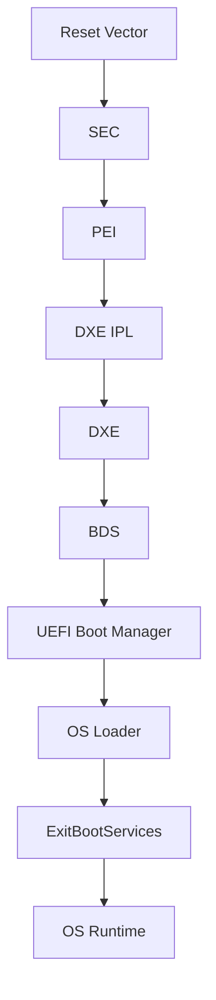
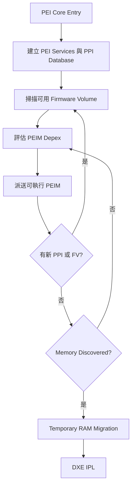
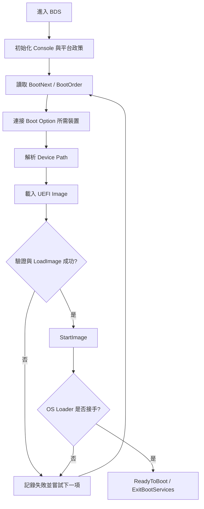
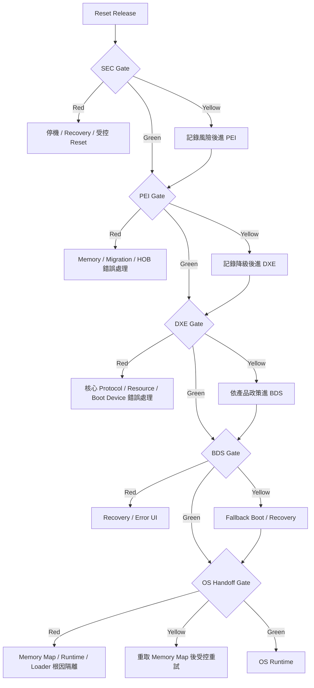

# 2. SEC、PEI、DXE 與 BDS 開機流程

## 適用範圍

本章說明採用 UEFI Platform Initialization（PI）架構之平台，從處理器離開 Reset 狀態、進入 SEC，經過 PEI、DXE 與 BDS，直到控制權交給 OS Loader 的主要流程。內容著重各階段的責任、輸入與輸出、模組派送機制、階段交接介面，以及早期開機問題的觀測與排查方式。

本章涵蓋：

- Reset Vector、SEC Entry 與最初始執行環境。
- Temporary RAM、Cache-as-RAM（CAR）與初始 Stack。
- PEI Core、PEIM、PPI、HOB 與永久記憶體建立。
- DXE IPL、DXE Core、DXE Driver、Protocol 與事件機制。
- BDS、Boot Option、Boot Manager 與 OS Loader 交接。
- ReadyToBoot、ExitBootServices 與 Runtime Services。
- POST Code、Serial Log、Checkpoint 與各階段停機問題。

本章不深入描述特定處理器的微架構、記憶體控制器訓練演算法、Secure Boot 金鑰佈署細節、ACPI AML 編寫方式，或特定 BIOS 供應商介面的內部設計。這些內容應由對應平台章節或安全性章節補充。

> 注意：不同 CPU、PCH、SoC、IBV、EDK II 分支與專案可能調整模組名稱、派送順序、POST Code 與 Log 格式。本文描述通用 PI/UEFI 架構，實際行為應以專案來源碼、平台設定與使用中的規格版本為準。

## 適用讀者

- BIOS、UEFI、EDK II、BSP 與平台韌體開發人員。
- 執行新平台移植、Silicon Bring-up、記憶體初始化、PCIe 裝置整合或開機流程除錯的人員。
- 分析開機停機、重置迴圈、無畫面、無 Serial Log、Boot Option 異常或 OS Loader 交接失敗的人員。
- 需要理解 BIOS 與 BMC、CPLD、ME／PSP、TPM、Option ROM、OS Loader 之間交互關係的人員。

## 快速導覽

- [建立整體視角](#21-uefi-pi-開機架構概觀)：從 Reset Vector 到 OS Loader 的主流程。
- [理解 SEC](#22-reset-vector-sec-與-temporary-ram)：最初始執行環境、Temporary RAM 與 SEC 到 PEI 的交接。
- [理解 PEI](#23-pei-core-peim-與永久記憶體建立)：PEIM 派送、PPI、Memory Init 與 HOB。
- [理解 DXE](#24-dxe-ipl-dxe-core-與-driver-dispatch)：DXE Core、Protocol、Driver Dispatch 與系統資源建立。
- [理解 BDS](#25-bds-boot-manager-與-os-loader)：Boot Policy、Boot Option 與載入 OS。
- [理解 UEFI 與 OS 的邊界](#26-readytoboot-exitbootservices-與-runtime)：Boot Services 結束及 Runtime Services 保留方式。
- [排查停機問題](#27-觀測點-post-code-與-serial-log)：依階段收集證據並縮小問題範圍。
- [執行驗證](#28-驗證與測試策略)：Cold Boot、Warm Reset、AC Cycle、錯誤注入、Timing 與功耗監控。
- [查閱常見問題](#29-常見問題與排查流程)：依症狀建立分叉點並完成根因隔離。
- [使用階段閘門](#211-階段閘門與決策樹)：以 Green／Yellow／Red 條件判斷是否可進入下一階段。

## 2.1 UEFI PI 開機架構概觀

UEFI PI 將平台初始化拆成多個執行階段，使處理器初始化、記憶體建立、驅動程式派送、開機政策與 OS 交接具有明確責任邊界。簡化後的流程如下：

### 2.1.1 各階段責任

| 階段 | 主要責任 | 典型輸入 | 典型輸出或交接資料 |
|---|---|---|---|
| Reset Vector | 建立最初始處理器執行路徑 | 硬體 Reset 狀態、Boot Strap | SEC Entry 所需的最低執行狀態 |
| SEC | 建立可信且可執行的早期環境 | Reset 狀態、Firmware Volume | Temporary RAM、初始 Stack、SEC 到 PEI 的交接資訊 |
| PEI | 完成早期平台與記憶體初始化 | SEC 交接資訊、PEIM、PPI | Permanent Memory、HOB List、可供 DXE 使用的平台資訊 |
| DXE IPL | 定位並載入 DXE Core | HOB List、Firmware Volume | DXE Core Entry 與必要參數 |
| DXE | 建立完整 UEFI Driver 執行環境 | HOB、DXE Drivers、Protocol | 系統資源、裝置、Console、Boot Services、Runtime Services |
| BDS | 套用平台開機政策並選擇開機目標 | UEFI Variables、Boot Options、裝置路徑 | 被選定的 UEFI Application 或 OS Loader |
| OS Loader | 載入 OS 所需映像與資料 | UEFI Protocol、Boot Services、系統表 | 呼叫 ExitBootServices 後將控制權交給 OS |
| Runtime | 提供 OS 執行期間仍可使用的 UEFI 服務 | Runtime Services、Runtime Memory Map | Variable、Time、ResetSystem 等平台服務 |

### 2.1.2 開機資訊如何跨階段傳遞

跨階段資訊不是以單一全域資料結構傳遞，而是依階段使用不同機制：

- SEC 到 PEI：透過 SEC Platform Information 與 PEI Core Entry 參數交接。
- PEI 內部：透過 PPI 提供服務，透過 HOB 記錄要交給後續階段的資訊。
- PEI 到 DXE：DXE IPL 依 HOB List 與 Firmware Volume 資訊載入 DXE Core。
- DXE 內部：透過 Protocol、Handle Database、Event 與 UEFI System Table 協作。
- DXE/BDS 到 OS Loader：透過 UEFI Boot Services、Runtime Services、Configuration Table、Device Path 與 Variable 交接。

### 2.1.3 建立開機問題的階段觀念

排查時先判斷「最後一個確定完成的階段」，再確認下一階段所需的輸入是否成立。例如：

1. 完全沒有 POST Code 或 Serial Output，先查 Reset Vector、映像映射、CPU Reset 狀態與最初始硬體條件。
2. 有 SEC Log，但沒有 PEI Core Log，優先檢查 Temporary RAM、PEI Core 定位與 Firmware Volume。
3. PEI 可執行但 Memory Discovered 未出現，優先檢查 Memory Init、Silicon Policy、SPD、供電與時序條件。
4. DXE 已開始但裝置不存在，檢查 HOB、Protocol 安裝、Driver Binding、PCI Enumeration 與裝置資源。
5. BDS 已執行但無法啟動 OS，檢查 Boot Option、Device Path、檔案系統、Secure Boot 驗證與 OS Loader。

> 在進入各階段細節前，讀者可先參閱 [2.11 階段閘門與決策樹](#211-階段閘門與決策樹)，先將目前狀態分類為 Green、Yellow 或 Red，再進入細節分析。這可避免在尚未建立分叉點時直接修改原始碼、更換硬體或反覆重刷韌體。

## 2.2 Reset Vector、SEC 與 Temporary RAM

### 2.2.1 Reset Vector 與 SEC Entry

處理器離開 Reset 後，會從架構定義或平台重映射後的 Reset Vector 開始取指。此時可使用的硬體資源非常有限，DRAM 通常尚未初始化，PCI 裝置、Console 與完整韌體服務也尚未可用。

Reset Vector 到 SEC Entry 的常見工作包含：

- 建立最低限度的處理器模式與控制暫存器狀態。
- 處理 Reset 類型或 Boot Mode 的最初始判斷。
- 定位 SEC 程式與早期 Firmware Volume。
- 建立 Temporary RAM 或準備進入建立 Temporary RAM 的流程。
- 將控制權交給 SEC Core 或平台 SEC 模組。

### 2.2.2 SEC 階段的主要責任

SEC 是 PI 架構的第一個正式階段，主要責任包括：

- 建立可執行 C 程式的最低環境。
- 建立 Temporary RAM 與初始 Stack。
- 在需要時進行早期信任驗證或量測。
- 尋找 PEI Foundation／PEI Core。
- 整理 SEC 到 PEI 的交接資訊並呼叫 PEI Core Entry。

SEC 不應假設永久記憶體已可使用，也不應在此階段引入大量複雜服務。此階段的設計重點是小、穩定、可觀測，並能在硬體資源有限時完成後續階段所需的最低準備。

### 2.2.3 Temporary RAM、CAR 與 Stack

在 DRAM 可用前，平台需要一塊暫時儲存區保存 Stack、早期資料與部分 PEI 資料。常見方式包含：

| 方式 | 說明 | 主要注意事項 |
|---|---|---|
| Cache-as-RAM | 將 CPU Cache 的一部分當作暫時記憶體 | Cache 設定、MTRR／架構限制、大小與對齊 |
| SRAM | 使用 SoC 內建 SRAM | 容量通常有限，需確認生命週期與存取屬性 |
| 特定晶片暫存區 | 使用平台提供的早期記憶體區域 | 平台相依性高，需確認與其他元件的共用方式 |

Temporary RAM 必須至少容納：

- 初始 Stack。
- SEC／PEI 早期資料。
- PEI Core 執行所需的暫存空間。
- 在永久記憶體建立前產生的必要 HOB 或服務資料。

#### CAR 常見失效型態

CAR 問題通常不是以「CAR 初始化失敗」這種清楚訊息呈現，而是透過下列次生症狀出現：

- 進入 C 函式後立即發生例外，例如 x86 的 `#GP`、`#PF` 或 `#DF`，實際向量需依例外紀錄判讀，不宜只以單一 `0x0D` 作為 CAR 問題的充分條件。
- `RSP`／`ESP` 落在未被規劃為 Temporary RAM 的範圍，或 Stack Guard、返回位址與區域變數出現不一致。
- 相同映像在 Debug Build 可啟動，但在 Release Build、不同最佳化或函式呼叫深度下失敗。
- 寫入 Checkpoint 後讀回資料不一致，或在關閉 CAR、切換 MTRR／Cache Policy 前後出現隨機停機。
- AP 啟動、Microcode、MTRR 或 Cache 初始化順序改變後，只有部分 CPU／Stepping 可通過。

x86 平台調整 MTRR、Cache Enable 狀態或結束 CAR 時，必須遵循處理器供應商規定的序列，包括必要的 Cache Flush、序列化與同步。`WBINVD`、Fence 或其他指令是否需要、放置位置及執行核心範圍，應以對應處理器手冊與 Silicon 初始化套件為準，避免將單一固定序列套用到所有平台。

CAR 收斂方向：

1. 先驗證 Stack Base／Size、對齊與 Guard 區。
2. 在最早可用位置保存 `RSP`、例外向量、`CR0`、`CR3`、`CR4`、MTRR 與相關 Cache 狀態。
3. 以固定 Pattern 測試 Temporary RAM 的寫入、讀回及邊界。
4. 比較 CAR 開啟、Memory Discovered、Migration 前後的位址範圍。
5. 若只有特定 CPU／Stepping 失敗，再比對 Microcode、Silicon Package 與 Cache 初始化序列。

### 2.2.4 Temporary RAM Migration

當 PEI 完成 DRAM 初始化後，原先位於 Temporary RAM 的 Stack 與必要資料需搬移到永久記憶體。遷移流程通常包含：

1. Memory Init PEIM 建立可用 DRAM。
2. 安裝 Memory Discovered PPI。
3. PEI Core 配置永久記憶體。
4. 搬移 Stack、Heap 與需要保留的早期資料。
5. 更新內部指標與執行內容。
6. 在平台允許時停用或回收 CAR／Temporary RAM。

Temporary RAM Migration 的本質不只是複製資料，而是把 PEI Core、Stack、Heap 與相關內部參照重新錨定到永久記憶體。若遷移後仍有絕對指標、快取位址或模組私有資料指向已停用的 Temporary RAM，後續讀到的可能是已回收或不再一致的內容，可視為一種「幽靈資料（Ghost Data）」現象。

具體症狀可能是 PEI Dispatcher 的目前模組 Context、PEIM Private Data、PPI Database Entry 或 Notify Descriptor 仍保留 CAR 位址，使後續 PPI 查找、Notify Callback 或下一個 PEIM 派送取得錯誤結構。EDK II 分支、IBV 實作與專案可能使用不同欄位名稱，因此應以實際 Map File、Private Header 與 Migration Log 確認，不宜只依賴單一欄位名稱。

因此，遷移問題可能造成隨機重置、返回位址錯誤、區域變數損壞、遷移後立即停機，或只在特定編譯最佳化與記憶體配置下出現。根因隔離時除了比對複製範圍，也應檢查 PEI Core 內部資料庫、PPI 介面、Notify Descriptor、Stack Frame，以及平台私有指標是否已重定位或重新建立。

### 2.2.5 SEC 階段主要檢查點

- Reset Vector 是否映射到正確 Firmware Region。
- SEC Entry 是否執行。
- Temporary RAM 初始化是否成功。
- Stack Base、Stack Size 與對齊是否合理。
- PEI Core 所在 Firmware File／Section 是否可被定位。
- SEC 到 PEI 的交接結構是否有效。
- 早期驗證或量測失敗時是否有可辨識的錯誤路徑。

#### SEC 階段閘門

- **Green**：Temporary RAM 測試通過、Stack 位址有效、PEI Core 可被定位，SEC 能以有效交接參數呼叫 PEI Core。
- **Yellow**：SEC 可前進，但存在非致命的校正、量測、平台識別或早期 Log 缺口。可進 PEI，但需保留風險與補測項目。
- **Red**：Temporary RAM、Stack、映像驗證或 PEI Core 定位失敗。系統不得以未定義狀態繼續，應進入平台定義的停機、Recovery 或受控 Reset 路徑。

## 2.3 PEI Core、PEIM 與永久記憶體建立

### 2.3.1 PEI 的目的

PEI（Pre-EFI Initialization）負責在有限環境中初始化足以進入 DXE 的平台狀態。最重要的里程碑是建立永久記憶體，並產出可被 DXE 使用的 HOB List。

PEI 的典型工作包含：

- 判斷 Boot Mode。
- 初始化必要的 Silicon、Clock、Power、GPIO 與平台裝置。
- 執行記憶體偵測、訓練與初始化。
- 建立 HOB，描述記憶體、Firmware Volume、CPU、資源與平台資料。
- 定位 DXE Firmware Volume 並由 DXE IPL 載入 DXE Core。

### 2.3.2 PEI Core 與 PEIM Dispatch

PEI Core 負責管理 PEI Services、PPI Database 與 PEIM Dispatcher。PEIM 通常透過下列條件被派送：

- PEIM 位於可被 PEI Core 掃描的 Firmware Volume。
- PEIM 的 Depex 已滿足。
- 所需 PPI 已安裝。
- 平台 Boot Mode 或其他條件允許該模組執行。

簡化流程：

### 2.3.3 PPI 的角色

PPI（PEIM-to-PEIM Interface）是 PEI 階段模組間的服務介面。常見動作包括：

- InstallPpi：安裝新的 PPI。
- LocatePpi：尋找已安裝的 PPI。
- ReInstallPpi：以新介面替換既有 PPI。
- NotifyPpi：在特定 PPI 安裝時通知其他 PEIM。

PPI 問題常見於 GUID 不一致、介面生命週期錯誤、Notify 時機不符、Depex 未滿足，或模組存在但所在 Firmware Volume 尚未被發現。

### 2.3.4 Boot Mode

Boot Mode 會影響 PEIM 執行路徑與後續初始化政策。常見模式包括：

- Full Configuration。
- Minimal Configuration。
- No Configuration Changes。
- S3 Resume。
- Flash Update。
- Recovery。

實際支援項目依平台而定。排查時需確認 Boot Mode 的判定來源、設定時機，以及後續 PEIM 是否使用相同認知。

#### Boot Mode 的分叉點判斷

- **一般 Cold Boot／Full Configuration**：執行完整 Silicon 與 Memory 初始化，適合建立基準 Log 與效能資料。
- **S3 Resume**：通常走平台定義的記憶體恢復路徑，而非完整的 Cold-Boot Training，並依 ACPI S3 Boot Script 或等效保存資料恢復晶片組與裝置狀態。實際是否略過哪些 Memory Init 步驟由 Silicon 設計決定，不應一概視為完全不執行記憶體初始化。
- **S4 Resume**：硬體初始化通常較接近一般開機，差異主要由 OS Loader 與休眠映像恢復流程處理。韌體仍需提供相容的 ACPI、Memory Map 與開機裝置路徑。
- **Warm Reset**：多數平台仍會重新進入 Reset Vector、SEC、PEI、DXE 與 BDS，但部分 Silicon、DRAM、PCIe 或周邊狀態可能被保留。韌體需先辨識 Reset Cause，再決定哪些初始化可以重用、哪些狀態必須清除。
- **Recovery／Flash Update**：應限制非必要功能，保留映像驗證、斷電保護、版本政策與失敗回復能力。

> **S4／Hibernate 防禦性檢查**：S4 在硬體初始化層面通常接近 Cold Boot，不使用 S3 Boot Script 作為主要恢復路徑。OS Loader 會依休眠資訊、平台識別與韌體提供的系統描述判斷是否能恢復休眠映像。若 S4 前後的 ACPI Table、FACS 相關資訊、記憶體拓撲、保留區域或裝置路徑出現不相容變化，OS 可能放棄 Resume 並轉為一般開機。實際判定條件依 OS 與平台而異，排查時應保存 S4 前後的 ACPI Dump、Memory Map、Boot Variable 與 Loader Log，不宜只比對單一 DSDT 位址。

S3 問題的常見收斂方向包括 Boot Script 保存或執行不完整、PCIe／RefClk（Reference Clock）／Reset 狀態未被正確恢復、裝置 Link Training 狀態與預期不同，或 Resume Path 使用了 Cold Boot 才會建立的資料。這些現象不宜直接歸因於記憶體控制器本身，需先以 Resume Checkpoint、Boot Script 與裝置恢復紀錄建立分叉點。

S3 Boot Script 的內容通常保存在 ACPI NVS 或平台專屬的保留記憶體，實際位置與格式依 PI 實作、Silicon Package 與平台設計而定。若 Resume Path 誤走完整 Memory Training、保留區域遭覆寫，或 Script 所記錄的 PCIe／Chipset 設定已不符合目前裝置拓撲，可能造成 Resume 停機、裝置遺失或立即重置。根因隔離時應比對 S3 進入前的 Boot Script Save 紀錄、保存區域完整性，以及 Resume 時 Boot Script Execute 的返回狀態與失敗項目。

### 2.3.5 Memory Init 與 Memory Discovered

Memory Init 是 PEI 的關鍵路徑，可能包含：

- 讀取 SPD 或平台記憶體拓撲設定。
- 套用 CPU／SoC／記憶體控制器 Policy。
- 執行 DRAM Training。
- 建立可用記憶體區域。
- 保留韌體、SMRAM、TSEG、ME／PSP、UMA 或其他平台區域。
- 安裝 Memory Discovered PPI。

Memory Discovered 是重要分界點。其前後常呈現不同的 Stack、記憶體配置與可用服務，因此 Log 應明確標記：

- Memory Init 開始與結束。
- 所選記憶體 Policy／Profile。
- 記憶體容量、通道、DIMM 與速度。
- Training 失敗項目與重試狀態。
- Permanent Memory Base／Size。
- Temporary RAM Migration 完成狀態。

### 2.3.6 HOB 的角色

HOB（Hand-Off Block）用來把 PEI 所取得或建立的資訊交給 DXE。常見類別包括：

| HOB 類型 | 用途 |
|---|---|
| PHIT HOB | 描述 HOB List 與初始記憶體配置 |
| Resource Descriptor HOB | 描述系統記憶體、MMIO、I/O 等資源 |
| Memory Allocation HOB | 描述已配置或保留的記憶體 |
| Firmware Volume HOB | 指出後續可掃描的 Firmware Volume |
| CPU HOB | 描述實體位址寬度與 I/O 位址寬度等資訊 |
| GUID HOB | 傳遞平台或元件自訂資料 |

GUID HOB 適合傳遞跨階段必要資料，但應管理版本、長度、欄位對齊與資料有效性，避免 DXE Driver 對 PEI 內部結構形成不透明相依。

### 2.3.7 PEI 階段主要檢查點

- PEI Core 是否進入並開始派送。
- 目標 PEIM 是否位於已發現的 Firmware Volume。
- PEIM Depex 與 PPI 相依是否滿足。
- Boot Mode 是否符合本次啟動情境。
- Memory Init 是否開始、完成或停在特定 Training Step。
- Memory Discovered PPI 是否安裝。
- Temporary RAM Migration 是否完成。
- HOB List 是否包含 DXE 所需的資源與平台資訊。
- DXE IPL 是否被派送。

#### PEI 階段閘門

- **Green**：Memory Discovered 已發生、Temporary RAM Migration 完成、HOB List 可解析、DXE Firmware Volume 可定位，DXE IPL 可被派送。
- **Yellow**：永久記憶體與 DXE 入口成立，但記憶體降速、部分通道停用、可復原 Training Warning 或非關鍵平台 Policy 未完成。可依產品政策繼續，但必須記錄降級狀態。
- **Red**：Memory Init、Migration、HOB 完整性或 DXE IPL 前置條件失敗。系統應進入受控錯誤處理、Recovery 或 Reset Loop Protection，不應直接跳入 DXE。

## 2.4 DXE IPL、DXE Core 與 Driver Dispatch

### 2.4.1 DXE IPL

DXE IPL（DXE Initial Program Load）位於 PEI 與 DXE 之間，負責：

- 找到包含 DXE Core 的 Firmware Volume。
- 載入或解壓縮 DXE Core 映像。
- 準備 HOB List 與 DXE Core Entry 參數。
- 將控制權交給 DXE Core。

若 PEI 已完成但 DXE Core 未執行，可先以 DXE Firmware Volume HOB 作為收斂起點、DXE Core FFS／Section、映像驗證、解壓縮介面與載入位址。

### 2.4.2 DXE Core 的主要責任

DXE Core 建立完整 UEFI 驅動環境，主要負責：

- 建立 Boot Services 與 Runtime Services 基礎。
- 建立 Handle Database、Protocol Database 與 Event 機制。
- 解析 HOB List 並建立系統資源認知。
- 掃描 Firmware Volume 並派送 DXE Drivers。
- 建立 UEFI System Table、Boot Services Table 與 Runtime Services Table。
- 在條件滿足後轉入 BDS。

### 2.4.3 DXE Driver Dispatch 與 Depex

DXE Dispatcher 會掃描 Firmware Volume 中的 Driver，評估依賴條件，並派送可執行模組。派送成功不代表 Driver 一定已管理裝置，兩者需分開判讀：

1. Driver Image 被載入。
2. Driver Entry Point 執行。
3. Driver 安裝 Protocol 或 Driver Binding Protocol。
4. ConnectController 將 Driver 與 Controller 配對。
5. Driver Binding Supported／Start 成功。
6. 裝置產生新的 Handle、Protocol 或 Child Handle。

### 2.4.4 Protocol 與 Handle Database

DXE 與 UEFI Driver 透過 Protocol 交換服務。典型流程如下：

- Driver 在 Handle 上安裝 Protocol。
- 其他 Driver 以 GUID 尋找 Protocol。
- Event 或 Protocol Notify 用於監聽新介面出現。
- Driver Binding 將驅動程式與 Controller Handle 配對。

裝置未出現時，可用下列分叉點完成根因隔離：

- Bus Driver 是否已建立 Controller Handle。
- 需要的 Protocol 是否已安裝。
- Driver Binding Supported 是否接受該 Controller。
- Start 是否因資源、Policy 或硬體回應失敗。
- Child Handle 是否建立。
- Device Path 是否完整且穩定。

### 2.4.5 系統資源與記憶體地圖

DXE 需整合 PEI 提供的資源資訊，並建立 UEFI Memory Map。常見資源包括：

- System Memory。
- Reserved Memory。
- MMIO 與 PCI Aperture。
- I/O Port Space。
- ACPI Reclaim／NVS Memory。
- Runtime Code／Data。
- Firmware Device 與特殊保留區。

資源描述錯誤可能導致 PCI BAR 配置失敗、OS 記憶體地圖異常、Runtime Service 失效、ACPI Table 位址衝突，或只在大容量記憶體／特定插卡配置下發生問題。

#### 32-bit／64-bit MMIO Window 與 Resource Conflict

PCIe 裝置的 BAR 需求可能落在 4 GB 以下或 4 GB 以上。平台若未保留足夠的 32-bit MMIO Hole，或未正確建立 Above-4G／64-bit MMIO Window，可能出現以下現象：

- 大型 GPU、Accelerator、NVMe Switch 或多張 PCIe Card 同時存在時，部分裝置 BAR 無法配置。
- 韌體可掃描到裝置，但 `Start` 或資源配置階段失敗，OS 內看不到裝置或顯示資源衝突。
- 啟用／停用 Above 4G Decoding、Resizable BAR 或特定插卡後，裝置可見性改變。
- PCI Host Bridge Resource Allocation 流程回報 `EFI_OUT_OF_RESOURCES`、要求重新提交資源，或無法滿足相容區間。

根因隔離時應同時檢查：

1. 各 Root Bridge 的 Bus、I/O、MMIO32、PMEM32、MMIO64 與 PMEM64 Aperture。
2. 裝置 BAR 的大小、64-bit／Prefetchable 屬性與對齊要求。
3. DRAM Remap、TOLUD／TOUUD 或平台等效資源邊界。
4. `PciHostBridgeResourceAllocation` 相關 Protocol 流程、返回狀態與資源提案。
5. ACPI `_CRS` 是否與韌體實際配置一致。

「裝置被枚舉」與「裝置取得可用資源」是兩個不同的過關條件。Debug Log 應分別留下 BDF 掃描結果、BAR 需求、分配位址與最終啟用狀態。

### 2.4.6 PCI Enumeration 與裝置初始化

DXE 常見裝置流程包含：

1. Root Bridge 建立。
2. 掃描 PCI Bus／Device／Function。
3. 計算 I/O、MMIO32、MMIO64 與 Prefetchable 資源需求。
4. 配置 Bus Number 與 BAR。
5. 啟動裝置 Driver。
6. 建立 Block I/O、Simple File System、Network、Graphics Output 等高階 Protocol。

若裝置在 Setup 或 OS 看不到，需分辨問題位於：

- 硬體 Link 未成立。
- PCI Enumeration 未找到裝置。
- 資源配置失敗。
- Driver 未派送或未 Binding。
- 高階 Protocol 未建立。
- BDS 未連接對應裝置路徑。

### 2.4.7 DXE 階段主要檢查點

- DXE Core 是否開始執行。
- HOB List 是否能被正確解析。
- DXE Firmware Volume 是否被發現。
- 目標 DXE Driver 是否派送。
- 必要 Protocol 是否安裝。
- PCI／USB／Storage／Network／Console 是否完成初始化。
- UEFI Memory Map 與資源分配是否合理。
- Variable Service、Timer、Watchdog 與 Runtime Driver 是否可用。
- EndOfDxe 等關鍵事件是否發生。
- 是否成功進入 BDS。

#### DXE 階段閘門

- **Green**：關鍵 Driver 已派送、必要 Protocol 已建立、裝置與資源配置完成、Console／Variable／Runtime 基礎服務可用，系統可進入 BDS。
- **Yellow**：非開機必要裝置失敗、資源降級、Option ROM 或附加功能不可用，但開機路徑與安全政策仍完整。是否繼續由產品政策決定。
- **Red**：Boot Device 所需 Controller、核心 Protocol、System Table、Memory Map、Variable Service 或 Runtime 基礎失敗。應停止進入一般 BDS，改走錯誤介面或 Recovery。

## 2.5 BDS、Boot Manager 與 OS Loader

### 2.5.1 BDS 的角色

BDS（Boot Device Selection）將 DXE 建立的韌體能力轉為實際開機政策。其典型責任包括：

- 建立或連接 Console。
- 連接開機所需的 Controller。
- 讀取 BootOrder、Boot####、BootNext 等 UEFI Variables。
- 套用平台 Boot Policy。
- 顯示 Setup、Boot Menu 或錯誤介面。
- 嘗試啟動 UEFI Application、Recovery Image 或 OS Loader。

### 2.5.2 UEFI Boot Option

Boot Option 通常由下列資訊組成：

- Attributes。
- Description。
- EFI Device Path。
- Optional Data。

常見相關 Variable：

| Variable | 用途 |
|---|---|
| BootOrder | 指定 Boot#### 的嘗試順序 |
| Boot#### | 描述單一 Boot Option |
| BootNext | 指定下一次開機優先嘗試的項目 |
| BootCurrent | 表示本次實際使用的 Boot Option |
| DriverOrder／Driver#### | 管理 UEFI Driver Option，是否使用依平台需求而定 |

Boot Option 存在不代表一定有效。還需確認 Device Path 可解析、對應 Controller 已連接、檔案系統可讀、Loader 存在，並通過安全性驗證。

### 2.5.3 Boot Manager 流程

簡化流程：

### 2.5.4 Removable Media 與預設路徑

UEFI 支援可移除媒體預設開機檔名。實際檔名依處理器架構而異。排查 USB 或可移除媒體開機時，需確認：

- 分割表與 EFI System Partition 是否符合預期。
- 檔案系統是否被韌體支援。
- 預設 Loader 路徑與架構是否正確。
- Secure Boot Policy 是否允許該映像。
- USB／Storage Controller 是否已在 BDS 嘗試前連接。

### 2.5.5 Secure Boot 與映像驗證邊界

若平台啟用 Secure Boot，LoadImage／StartImage 路徑可能包含映像簽章與信任資料庫檢查。根因隔離時應區分：

- 找不到裝置。
- 找不到檔案。
- PE/COFF 映像格式不被接受。
- 映像驗證失敗。
- Loader 已啟動但自行返回錯誤。

安全性問題應保留驗證失敗狀態與事件紀錄，不應以永久關閉驗證作為正式修正方式。

### 2.5.6 BDS 階段主要檢查點

- Console Input／Output／Error 是否建立。
- BootOrder、BootNext 與 Boot#### 是否可正常讀取。
- Boot Option 的 Device Path 是否指向現有裝置。
- 對應 Controller 是否已 Connect。
- Block I/O 與 Simple File System Protocol 是否存在。
- Loader 是否成功 LoadImage／StartImage。
- Secure Boot 驗證結果是否符合 Policy。
- 啟動失敗後是否會嘗試下一個 Boot Option 或進入 Recovery。

#### BDS 階段閘門

- **Green**：Boot Option 可解析、所需 Controller 已連接、Loader 通過驗證並成功 `StartImage()`。
- **Yellow**：第一順位 Boot Option 失敗，但替代 Boot Option、Removable Media Fallback 或受控 Recovery 可成功接手，且失敗原因已有紀錄。
- **Red**：所有允許的 Boot Option 均失敗、Variable Store 不可用、安全政策遭破壞，或 Loader 無法被驗證。系統應進入明確的 Recovery／Error UI，不應無限重試。

## 2.6 ReadyToBoot、ExitBootServices 與 Runtime

### 2.6.1 ReadyToBoot

ReadyToBoot Event 表示平台即將進入 OS Loader 的最後開機階段。不同 Driver 可利用此事件完成必要收尾，例如：

- 更新或安裝最終平台資料表。
- 完成部分安全量測或事件紀錄。
- 鎖定某些平台設定。
- 儲存開機統計資訊。

ReadyToBoot 不等同於 Boot Services 已結束。此時 OS Loader 仍可使用 Boot Services。

### 2.6.2 GetMemoryMap 與 MapKey

OS Loader 在呼叫 ExitBootServices 前，需取得最新 UEFI Memory Map 與對應 MapKey。若其間又有記憶體配置或釋放，MapKey 可能失效，ExitBootServices 會失敗。因此常見 Loader 流程為：

1. 呼叫 GetMemoryMap 取得所需 Buffer Size。
2. 配置足夠 Buffer。
3. 再次呼叫 GetMemoryMap 取得最新 Memory Map 與 MapKey。
4. 避免再做不必要的記憶體配置。
5. 呼叫 ExitBootServices。
6. 若因 MapKey 改變而失敗，重新取得 Memory Map 後再嘗試。

### 2.6.3 ExitBootServices

ExitBootServices 成功後：

- UEFI Boot Services 不再可用。
- Boot Services Code／Data 可由 OS 回收。
- OS 接管中斷、記憶體與裝置管理。
- 僅 Runtime Services 與標示為 Runtime 的區域可依規格繼續保留。

韌體 Driver 不應在 ExitBootServices 後繼續依賴 Boot Services Protocol、Event 或記憶體配置功能。

### 2.6.4 Runtime Services

常見 Runtime Services 包括：

- GetTime／SetTime。
- GetVariable／SetVariable。
- GetNextVariableName。
- ResetSystem。
- SetVirtualAddressMap／ConvertPointer。
- UpdateCapsule／QueryCapsuleCapabilities，實際可用性依平台與 OS 支援而定。

Runtime Driver 與資料需使用正確的 Runtime Memory Type，並在虛擬位址切換時處理指標轉換。相關錯誤可能只在 OS 啟動後、變數存取、RTC 存取、Reset 或 Capsule Update 時出現。

#### SetVirtualAddressMap 與 ConvertPointer

OS 呼叫 `SetVirtualAddressMap()` 後，Runtime Driver 不可繼續使用僅在實體位址階段有效的指標。典型設計包括：

- Runtime Code／Data 配置在具有 Runtime 屬性的記憶體類型中。
- 在 `EVT_SIGNAL_VIRTUAL_ADDRESS_CHANGE` 事件中，以 `ConvertPointer()` 轉換仍會於 Runtime 使用的全域指標、函式指標、MMIO 對映指標與私有 Context。
- 不把 Boot Services 配置的 Buffer、Protocol Interface 或 Boot-Time Handle 當成 Runtime 永久資料。
- 確認 Runtime Memory Descriptor 與頁面屬性可被 OS 正確映射。

常見失敗型態包括 OS 在位址切換後重置、第一次讀寫 UEFI Variable 時 Fault、RTC／ResetSystem 失效，或僅在特定 OS／虛擬化環境出現。全域變數本身是否位於 Runtime Data、其內部指標是否完成轉換，以及 Driver 是否仍呼叫 Boot Services，是三個需要分開驗證的分叉點。

### 2.6.5 ExitBootServices 前後的責任邊界

| 項目 | ExitBootServices 前 | ExitBootServices 後 |
|---|---|---|
| 記憶體配置 | 可使用 Boot Services | 由 OS 管理 |
| Protocol／Handle | 可查詢與連接 | 不應再由 OS Loader 依賴 |
| 裝置驅動 | UEFI Driver 可控制裝置 | 由 OS Driver 接管 |
| Console | UEFI Console 可用 | 依 OS 接管狀態而定 |
| Runtime Services | 已建立，可被呼叫 | 僅保留規格允許的 Runtime 服務 |
| Memory Map | 仍可能變動 | ExitBootServices 後固定交由 OS 解讀 |

#### OS 交接階段閘門

- **Green**：最新 Memory Map 與 MapKey 有效、`ExitBootServices()` 成功、Runtime Descriptor 完整，OS 可接管平台。
- **Yellow**：第一次 `ExitBootServices()` 因 MapKey 改變而失敗，但 Loader 能重新取得 Memory Map 並成功重試，且沒有持續的晚期配置來源。
- **Red**：Memory Map 持續變動、Runtime 區域屬性錯誤、位址轉換失敗，或 OS 接管後立即重置。需回到 Loader／Runtime Driver 邊界完成根因隔離。

## 2.7 觀測點、POST Code 與 Serial Log

### 2.7.1 建立可觀測性

早期開機除錯的困難在於完整 Console 尚未建立。建議依平台能力分層配置觀測點：

1. Hardware Checkpoint／POST Code。
2. GPIO Toggle 或 Logic Analyzer 訊號。
3. Early Serial Port。
4. BMC／CPLD 擷取的 Port 80／Checkpoint。
5. RAM Log／Trace Hub／平台除錯介面。
6. UEFI Shell、Debug Protocol 與 OS Log。

### 2.7.2 POST Code 設計原則

POST Code 應具備：

- 階段可辨識性，例如 SEC、PEI-before-memory、PEI-after-memory、DXE、BDS。
- 重要里程碑與錯誤點使用不同區間或編碼方式。
- 文件化 Code、模組、條件與可能下一步。
- 避免不同模組重複使用同一 Code 而無法區分。
- 對重置前最後 Code 提供保存方式，必要時由 BMC／CPLD 記錄。

### 2.7.3 Serial Log 應包含的資訊

建議至少包含：

- 韌體版本、Build ID、平台 ID、Board Revision 與 Boot Mode。
- 階段進入與離開標記。
- 重要模組名稱與返回狀態。
- Memory Init 結果與記憶體摘要。
- DXE Driver Dispatch、Protocol／Controller 失敗摘要。
- BootOrder、被選 Boot Option 與 LoadImage／StartImage 結果。
- ReadyToBoot、ExitBootServices 嘗試與 Runtime 交接資訊。

敏感資料、金鑰、驗證材料、未遮罩的序號或認證資訊不應寫入一般 Log。

### 2.7.4 階段對應的觀測建議

| 最後觀測點 | 優先檢查 | 常用資料 |
|---|---|---|
| 無輸出 | Reset、映像映射、供電、RefClk（Reference Clock）／System Clock、Strap | 示波器、SPI Trace、JTAG、CPLD 狀態 |
| SEC | Temporary RAM、Stack、PEI Core 定位 | POST Code、Early Serial、Map File |
| PEI Before Memory | PEIM Depex、Silicon Init、SPD、Memory Policy | PEI Log、Training Log、硬體量測 |
| PEI After Memory | Migration、HOB、DXE FV、DXE IPL | HOB Dump、Firmware Volume 結構 |
| DXE | Driver Dispatch、Protocol、PCI／Storage／Console | DXE Log、Handle/Protocol Dump |
| BDS | Boot Variable、Device Path、File System、Secure Boot | Boot#### Dump、Device Path、驗證狀態 |
| OS Loader | Memory Map、ACPI、ExitBootServices、Loader 自身 | Loader Log、Memory Map、ACPI Dump |
| OS Runtime | Runtime Mapping、Variable、RTC、Reset、Capsule | OS dmesg／Event Log、Runtime Driver Log |

## 2.8 驗證與測試策略

### 2.8.1 測試基準資訊

每次測試應記錄：

- BIOS 版本、Commit ID、Build Type 與設定檔。
- CPU／SoC Stepping、PCH、Board Revision、CPLD／BMC／ME／PSP 版本。
- DIMM、PCIe Card、Storage、USB 與其他外接裝置配置。
- Secure Boot、TPM、CSM／Legacy Mode 等功能狀態。
- Boot Mode、BootOrder 與 Variable 初始狀態。
- 電源條件、環境溫度及是否使用外部除錯工具。

### 2.8.2 開機情境覆蓋

| 情境 | 驗證目的 | 建議觀測項目 |
|---|---|---|
| Cold Boot | 完整初始化路徑 | 各階段時間、Memory Training、裝置枚舉 |
| Warm Reset | 重置後狀態清理、保留與重新初始化 | Reset Cause、Boot Mode、DRAM／PCIe 保留狀態、Variable、Watchdog |
| AC Cycle | 失去待機電源後的完整恢復 | Strap、CPLD/BMC 時序、RTC、NVRAM |
| S3 Resume | Resume 專用路徑 | Boot Script、記憶體內容、裝置恢復 |
| Firmware Update 後首次開機 | 新映像與資料格式轉換 | Capsule 結果、Variable Migration、Recovery |
| Recovery Boot | 主映像失效時復原能力 | Recovery FV、媒體偵測、映像驗證 |
| 不同 SKU | 平台差異與資源配置 | Board ID、Policy、GPIO、PCIe、Memory Topology |

### 2.8.3 錯誤注入

可依專案條件執行：

- 移除或替換 DIMM、Storage、USB 開機媒體。
- 建立無效 Boot Option 或遺失 Loader。
- 使用不受信任或損壞的 UEFI Image。
- 模擬 Firmware Volume、Variable Store 或 Capsule 損壞。
- 讓指定裝置不回應、Link Down 或資源不足。
- 在更新過程模擬斷電，驗證回復與資料完整性。

錯誤注入應在可控環境進行，並預先準備硬體復原、SPI 重燒與 Variable 清除方式。

### 2.8.4 Pass／Fail 定義

Pass／Fail 不應只以「有進 OS」判斷。建議同時確認：

- 所有預期階段與關鍵事件均出現。
- 無未處理 ASSERT、Exception、Watchdog Reset 或重試迴圈。
- Memory Map、SMBIOS、ACPI 與裝置資源符合平台規格。
- Boot Option 選擇與安全政策符合設定。
- ExitBootServices 成功，OS 無 Runtime／ACPI／PCI 資源錯誤。
- 開機時間與各階段時間落在規格範圍。
- 失敗情境能進入預期的錯誤處理或 Recovery 路徑。

### 2.8.5 時序與功耗監控

功能可開機不代表平台已達到可交付狀態。現代平台還需同步評估 Boot Time、瞬間電流、供電時序與熱／功耗限制，避免冷機、低溫、高負載插卡或不同電源供應器下出現間歇性重置。

#### 建議量測區段

| 區段 | 時序觀測 | 功耗／硬體觀測 | 常見風險 |
|---|---|---|---|
| Reset 到 SEC | Reset Release、SPI 首次取指 | Standby Rail、Core Rail、Clock | Reset 抖動、Flash 讀取錯誤、Power Good 不穩 |
| SEC／PEI Before Memory | CAR 建立、Silicon Init | CPU 瞬間電流、VR Telemetry | 早期功耗峰值、Cache／Microcode 路徑差異 |
| Memory Training | 每個 Training Step、重試次數 | DIMM 電源、溫度、VDD/VDDQ | Cold Boot Reset、Training Timeout、降速 |
| DXE Dispatch | FV 讀取量、Driver 派送時間 | CPU Package Power、SPI 頻寬 | Flash 存取瓶頸、Driver Depex 或重複 Connect |
| PCIe／Storage Init | Link Training、裝置掃描 | Slot Power、PERST#、RefClk | 插卡湧入電流、Link Retry、裝置晚到 |
| BDS／OS Loader | Boot Option、檔案讀取、驗證 | Storage／USB／Network 功耗 | 媒體 Timeout、Secure Boot 驗證耗時 |

#### 建議指標

- Reset 到首個 Checkpoint、Memory Discovered、DXE Core、BDS、ReadyToBoot 與 OS Loader Entry 的時間戳。
- 每個 PEIM／DXE Driver 的派送與執行時間，區分等待、I/O 與運算成本。
- SPI Flash 頻率、模式、Cache／Shadow 行為與 Firmware Volume 讀取量。
- Memory Training 各步驟時間、重試、降速及失敗碼。
- CPU／SoC Package Power、VR Current、PL1／PL2 或平台等效限制。PL1／PL2 是否適用及生效時點依處理器架構而定。
- PCIe Slot Power、PERST#、CLKREQ#、RefClk 與 Link Up 時間。

#### 冷開機重置的收斂方向

若問題只出現在 AC Cycle、低溫、滿插卡或高容量記憶體配置，應把「軟體執行點」與「電源／時序事件」放在同一時間軸比對。單看最後 POST Code 可能把供電跌落、Watchdog、Thermal／Power Limit 或裝置湧入電流造成的重置誤判為純韌體邏輯問題。

建議同步保存示波器／電源分析儀波形、VR Telemetry、Reset Cause、Watchdog 狀態、POST Code 與階段時間戳，建立可重現的跨領域證據鏈。

#### 跨領域證據鏈結

冷開機重置應將軟體與硬體事件對齊到同一時間基準。若平台提供對應訊號，可同步量測 `PLTRST#`、CPU／SoC Thermal Throttle 或 `PROCHOT#`、VR Fault／Power Good、Watchdog Timeout GPIO，以及 POST Code Strobe。訊號名稱與可量測性依平台而異，不應假設所有架構都有相同腳位。

例如，最後一筆 Serial Log 停在 Memory Training，不代表 Training 演算法一定失效。若在 Reset 前先出現 Thermal／Power Limit 或 VR Over-Current 事件，再由平台重置訊號接手，收斂方向應先放在功耗預算、VR 保護、上電時序或散熱條件；若硬體訊號穩定而 Watchdog 先到期，再回頭檢查 Training Timeout、死迴圈與 Log 阻塞。

建議建立下列關聯：

- Serial／Trace 時間戳對應 POST Code。
- POST Code 對應 `PLTRST#`、Power Good 與 Watchdog Transition。
- VR Telemetry 對應 CPU／DIMM／PCIe 上電與 Training 區段。
- Reset Cause Register 對應 BMC／CPLD 保存的最後事件。

此證據鏈的目的，是先區分「韌體停止前觸發硬體保護」與「韌體未前進而被 Watchdog 重置」，再分派後續分析範圍。

## 2.9 常見問題與排查流程

### 2.9.1 根因隔離順序

1. 固定測試條件與映像版本。
2. 取得最後 POST Code、最後 Serial Log 與 Reset Cause。
3. 以最後完成的階段建立第一個分叉點（Bifurcation Point），再套用 [2.9.4 分層棋盤法（Layered Diagnostic Matrix）](#294-根因隔離範例bds-回傳-efi_not_found-或沒有可用-boot-option) 逐層推進。
4. 對照下一階段所需輸入、介面與資源，定義收斂方向。
5. 比較正常板與異常板、正常版本與異常版本的差異。
6. 一次只改動一個變因，保留完整測試紀錄。
7. 修正後覆蓋 Cold Boot、Warm Reset、AC Cycle、不同 SKU 與更新情境。

### 2.9.2 常見症狀

| 症狀 | 可能所在階段 | 優先觀測點 | 建議排查方向 |
|---|---|---|---|
| 完全無 POST Code | Reset／SEC | Reset Pin、SPI CS/CLK、Boot Strap | 映像映射、供電、RefClk（Reference Clock）／System Clock、CPU Reset、Flash 存取 |
| SEC 後立即停機 | SEC | Temporary RAM Checkpoint、Stack | CAR／SRAM 設定、Stack、PEI Core 定位 |
| 每次停在不同早期位置 | SEC／PEI | Exception、Watchdog、Migration Log | Stack／記憶體損壞、未初始化資料、時序不穩 |
| Memory Init 失敗 | PEI | Training Code、SPD、Memory Policy | DIMM 拓撲、供電、RefClk（Reference Clock）／Memory Clock、Policy、Silicon 版本 |
| Memory Discovered 後重置 | PEI | Migration 前後 Log、HOB | Temporary RAM Migration、永久記憶體配置、指標 |
| DXE Core 未進入 | PEI／DXE IPL | DXE IPL Log、FV/HOB | DXE FV、DXE Core FFS、解壓縮、驗證、載入位址 |
| 某 DXE Driver 未執行 | DXE | Dispatcher Log、Depex | FV 掃描、Depex、Protocol、映像驗證 |
| PCIe 裝置不存在 | DXE | Link、Bus Scan、BAR 配置 | Reset/RefClk（Reference Clock）、Lane 設定、Enumeration、MMIO 資源 |
| Storage 可見但不可開機 | DXE／BDS | Block I/O、File System、Boot#### | Partition、Device Path、Loader 路徑、安全驗證 |
| Boot Option 消失或順序改變 | BDS | Variable Store、BootOrder | Variable 寫入、Default Policy、裝置路徑穩定性 |
| ExitBootServices 失敗 | OS Loader | Memory Map、MapKey、Event | GetMemoryMap 重試、晚期配置、Loader 問題 |
| OS 啟動後 Variable／RTC 異常 | Runtime | Runtime Map、OS Log | Runtime Memory Type、SetVirtualAddressMap、Driver |
| 更新失敗後無法復原 | Update／Recovery | Capsule Status、Recovery Log | A/B Layout、映像驗證、斷電保護、回復政策 |

### 2.9.3 根因隔離範例：有 PEI Log，但沒有 DXE Log

建議依序查：

1. Memory Discovered PPI 是否已安裝。
2. Temporary RAM Migration 是否成功。
3. HOB List 是否有效，DXE Firmware Volume HOB 是否存在。
4. DXE IPL 是否被派送，Depex 是否滿足。
5. DXE Core FFS 與 PE/COFF Section 是否存在且可解析。
6. 映像驗證、解壓縮與重定位是否成功。
7. DXE Core Entry 前後加入最小 Checkpoint，區分載入失敗與 Entry 後失敗。

### 2.9.4 根因隔離範例：BDS 回傳 EFI_NOT_FOUND 或沒有可用 Boot Option

不要一開始就重建 `Boot####`。先使用「分層棋盤法（Layered Diagnostic Matrix）」：依「物理層 → Controller／Protocol 層 → 分割區／檔案系統層 → Variable／Device Path 層 → Image Policy 層」逐層建立證據。

#### 第一道分叉：物理裝置是否成立

- PCIe／SATA／USB／NVMe 裝置的 Presence、Power、Reset 與 RefClk 是否穩定。
- PCIe Link 是否完成 Training，BDF 是否可讀，BAR 是否取得資源。
- 裝置是否因上電時間過長而晚於第一次 Connect／Enumerate。

若物理層未成立，後續建立 Boot Option 不會改變結果。

#### 第二道分叉：Controller 與 Block I/O 是否成立

- Controller Handle 是否存在。
- Bus Driver 與裝置 Driver 是否成功 Binding／Start。
- `EFI_BLOCK_IO_PROTOCOL` 是否安裝在預期的磁碟或 Child Handle。
- 若只有 Device Path，沒有 Block I/O，收斂方向通常在 Controller Driver、資源配置或 Driver Binding，而不是 Boot Variable。

#### 第三道分叉：分割區與檔案系統是否成立

- Partition Driver 是否建立對應 Child Handle。
- GPT／MBR 與 EFI System Partition 是否有效。
- `EFI_SIMPLE_FILE_SYSTEM_PROTOCOL` 是否安裝。
- Loader 檔案是否存在，架構與 PE/COFF 格式是否符合平台。

若磁碟 Handle 有 Block I/O，但分割區 Handle 沒有 Simple File System，需檢查分割表、檔案系統與 Partition／File System Driver 派送狀態。

#### 第四道分叉：Boot Variable 與 Device Path 是否對得上

- Dump `BootOrder`、`BootNext`、`BootCurrent` 與全部 `Boot####`。
- 將 Boot Option 內的 Device Path 與目前 Handle Database 的 Device Path 逐節比對。
- 檢查硬體節點、分割區 Signature、檔案路徑與 Optional Data，避免只比較顯示名稱。
- UEFI File Path Node 使用 Unicode 字串。實際檔案名稱大小寫行為取決於檔案系統與驅動，不應只以字串大小寫推定匹配結果；更重要的是節點格式、分割區識別及路徑分隔是否正確。

#### 第五道分叉：Image Load 與安全政策

- 記錄 `LoadImage()` 與 `StartImage()` 的返回狀態。
- 區分 `EFI_NOT_FOUND`、`EFI_UNSUPPORTED`、`EFI_SECURITY_VIOLATION`、`EFI_LOAD_ERROR` 與 Loader 自行返回錯誤。
- 若 Secure Boot 啟用，確認信任鏈、db／dbx／KEK／PK 狀態與映像簽章，但不要以永久關閉驗證作為正式修正。

#### 分層判定

- **Green**：Block I/O、Simple File System、Boot Device Path 與 Loader 均成立，`StartImage()` 成功。
- **Yellow**：主要 Boot Option 失效，但 Removable Media Fallback 或 Recovery 正常，需修復 Variable 或裝置路徑持久性。
- **Red**：物理裝置、資源配置、Block I/O、檔案系統或映像驗證任一關鍵層失敗，BDS 無法建立合法開機路徑。

## 2.10 安全性與相容性注意事項

### 2.10.1 信任邊界

- SEC／PEI 屬於早期可信運算基礎，任何未驗證外部資料都應限制解析範圍。
- Firmware Volume、PEIM、DXE Driver、Option ROM 與 UEFI Application 的驗證政策應一致。
- TPM 量測與 Secure Boot 驗證是不同機制，應分別確認結果與失敗處理。
- Debug Interface、Manufacturing Mode 與測試金鑰需有量產關閉策略。

### 2.10.2 Variable 與敏感資料

- UEFI Variable 應依需求設定 Non-Volatile、Boot Service、Runtime 與 Authenticated 屬性。
- Log 不應輸出私鑰、明文密碼、完整認證資料或可被濫用的秘密。
- Variable Store 滿載、損壞、回收與更新失敗都需要明確復原政策。

### 2.10.3 相容性

需確認：

- UEFI Specification 與 PI Specification 版本。
- EDK II／IBV 分支與工具鏈版本。
- CPU／SoC／PCH Stepping 與 Microcode／Silicon Package。
- OS 對 ACPI、SMBIOS、Runtime Services 與 Capsule 的支援。
- 現有產品 Variable、Capsule、Flash Layout 與更新格式的向前／向後相容性。

## 2.11 階段閘門與決策樹

本節不把開機流程視為一串靜態勾選項，而是把每個階段定義為可量測的閘門。工程師應先取得證據，再將目前狀態分類為 Green、Yellow 或 Red。

### 2.11.1 狀態定義

| 狀態 | 定義 | 處理原則 |
|---|---|---|
| Green | 本階段輸出完整，下一階段的必要輸入已成立 | 可進入下一階段，保存基準時間與 Log |
| Yellow | 核心路徑可前進，但存在降級、警告或非關鍵功能缺口 | 依產品政策繼續，建立風險、Owner 與回歸項目 |
| Red | 本階段必要輸出缺失，或繼續執行會進入未定義／不安全狀態 | 停止一般流程，轉入錯誤處理、Recovery 或受控 Reset |

### 2.11.2 整體決策樹

### 2.11.3 SEC Gate

**必要證據**：

- Reset Vector 與 Firmware Mapping 正確。
- Temporary RAM 可讀寫，Stack 位址、大小與對齊有效。
- PEI Core 可定位，交接參數有效。

**Red 條件**：Temporary RAM、Stack、早期驗證或 PEI Core 定位失敗。

### 2.11.4 PEI Gate

**必要證據**：

- PEIM／PPI／Depex 形成可完成的派送鏈。
- Memory Discovered 已發生。
- Temporary RAM Migration 完成，遺留指標已處理。
- HOB List 與 DXE Firmware Volume 可解析。

**Red 條件**：Memory Init、Migration、HOB 完整性或 DXE IPL 前置條件失敗。

### 2.11.5 DXE Gate

**必要證據**：

- DXE Core 與關鍵 Driver 已派送。
- Boot Device 所需 Protocol、Controller 與資源配置完成。
- MMIO32／MMIO64 Window 可滿足必要裝置 BAR。
- Variable、Console、Boot Services 與 Runtime 基礎可用。

**Red 條件**：核心 Protocol、Boot Device、System Table、Variable Service 或資源配置無法支援後續開機。

### 2.11.6 BDS Gate

**必要證據**：

- Boot Option Device Path 可解析至有效 Handle。
- Block I/O、Simple File System 與 Loader 路徑成立。
- `LoadImage()`／`StartImage()` 與安全驗證結果符合 Policy。

**救援路徑（Escape Hatch）**：若平台支援 UEFI Shell，BDS 判定為 Red 前可檢查內建 Shell、Recovery Volume、可移除媒體預設路徑或平台定義的強制進入 Shell 按鍵是否可用。進入 Shell 後，可使用 `map`、`dh`、`drivers`、`devices`、`bcfg` 等指令檢查檔案系統映射、Handle／Protocol、Driver Binding 與 Boot Option。Shell 能提供診斷能力，但不應繞過 Secure Boot、映像驗證或產品安全政策。若 Shell 可正常進入且核心 Protocol 完整，可將狀態由 Red 暫時調整為 Yellow，並保留正式 Boot Path 仍失敗的風險紀錄。

**Red 條件**：所有合法 Boot Option、允許的 UEFI Shell 救援路徑與 Recovery／Fallback 均不可用，或安全政策不允許繼續。

### 2.11.7 OS Handoff Gate

**必要證據**：

- 最新 Memory Map 與 MapKey 有效。
- `ExitBootServices()` 成功。
- Runtime Code／Data、Virtual Address Change Event 與 `ConvertPointer()` 路徑已驗證。
- OS 啟動後 Variable、RTC、Reset 與 ACPI 行為正常。

**Red 條件**：Memory Map 持續改變、Runtime Descriptor／位址轉換錯誤，或 OS 接管後立即重置。

### 2.11.8 回歸放行條件

版本可進入整合或發佈前，至少需要：

- Cold Boot、Warm Reset、AC Cycle、S3／S4（若支援）、Recovery 與更新情境通過。
- 不同 DIMM、Storage、PCIe Card、Board Revision 與 SKU 覆蓋完成。
- Boot Time、Memory Training、DXE Dispatch 與 OS Handoff 時間符合預算。
- 功耗、供電時序、Reset Cause 與高負載插卡情境無未解異常。
- 正常與異常 Log、POST Code、波形、版本與硬體配置可回查。
- Yellow 狀態均有風險說明、負責人、移除條件與回歸範圍；不得以未記錄 Yellow 狀態視同 Green。

## 2.12 本章重點

- UEFI PI 將開機流程拆成 SEC、PEI、DXE 與 BDS，各階段具有不同資源條件與交接介面。
- SEC 的重點是建立 Temporary RAM、初始 Stack，並把控制權交給 PEI Core。
- PEI 的關鍵里程碑是 Memory Discovered、Temporary RAM Migration 與 HOB List 建立。
- DXE 透過 Driver Dispatch、Protocol 與 Handle Database 建立完整 UEFI 執行環境。
- BDS 依平台政策與 UEFI Variables 選擇 Boot Option，並啟動 OS Loader。
- ExitBootServices 是韌體與 OS 的重要責任邊界，Runtime Services 需使用正確的記憶體屬性與位址轉換流程。
- 排查時應以 Stage Gate 建立分叉點，從最後一個 Green 階段向下一個 Red／Yellow 階段收斂，避免同時改動過多變因。
- Boot Time、SPI 存取、Memory Training、MMIO Window、供電與功耗限制均屬於開機流程的一部分，不能只以是否進入 OS 判斷品質。

## 2.13 參考資料

- UEFI Forum, *UEFI Specification*。
- UEFI Forum, *UEFI Platform Initialization Specification*。
- TianoCore EDK II Documentation 與 EDK II Source Tree。
- TCG, *PC Client Platform Firmware Profile Specification*，依平台適用性引用。
- ACPI Specification、SMBIOS Specification 與 PCI Firmware Specification，依章節內容引用。
- CPU／SoC／PCH 供應商 Firmware Support Package、BIOS Writer's Guide 與平台設計文件。
- 專案內部 Firmware Map、POST Code、Boot Flow、Issue、驗證報告與硬體設計文件。
