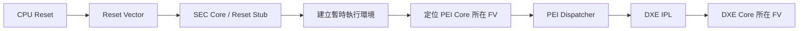
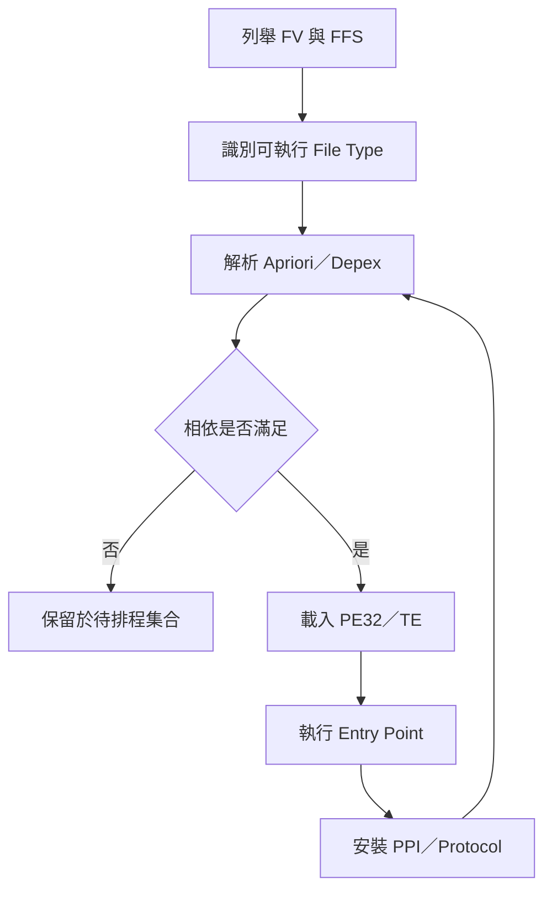
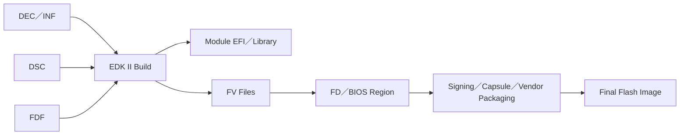

# 3. Firmware Volume、FFS 與映像檔配置

狀態：Draft  
適用範圍：UEFI PI 架構、EDK II 平台韌體、BIOS Flash 映像檔分析與移植  

> 本章以通用 UEFI PI 與 EDK II 架構說明 Firmware Device、Firmware Volume、FFS 與映像檔配置。實際 Flash Region、FV 名稱、容量、Base Address、Erase Block、簽章與更新策略，仍應以目標平台的 FDF、DSC、DEC、Flash Descriptor、Silicon 文件及量產更新規格為準。

## 適用讀者

- 負責 BIOS／UEFI 韌體設計、平台移植、建構整合及問題排查的人員。
- 需要分析 BIOS image、FV、FFS、PE/COFF、TE、Depex 或模組載入順序的人員。
- 負責 BIOS 更新、映像檔簽章、容量規劃、版本差異比對及量產驗證的人員。

## 快速導覽

- [3.1 Flash Region 與 Firmware Device 拓樸](#31-flash-region-與-firmware-device-拓樸)：先建立實體 Flash、邏輯 Region、Firmware Device 與 FV 的整體關係。
- [3.2 FV Header、Block Map 與 Alignment](#32-fv-headerblock-map-與-alignment)：說明 FV 如何描述容量、Erase Block、屬性及對齊需求。
- [3.3 FFS File Type、Section Type 與 GUID](#33-ffs-file-typesection-type-與-guid)：說明 FV 內的檔案與 Section 階層。
- [3.4 Compression、GUID-defined Section、PE/COFF 與 TE Image](#34-compressionguid-defined-sectionpecoff-與-te-image)：說明模組內容如何封裝、壓縮及載入。
- [3.5 Apriori、Depex 與模組載入順序](#35-aprioridepex-與模組載入順序)：說明 PEI／DXE Dispatcher 如何決定模組可否執行及執行順序。
- [3.6 FDF 佈局、空間預算與 Free Space](#36-fdf-佈局空間預算與-free-space)：從平台建構設定追到最終 BIOS image。
- [3.7 映像檔解析、版控與差異比對方式](#37-映像檔解析版控與差異比對方式)：提供可重複使用的解析、比對與排查流程。

## 3.1 Flash Region 與 Firmware Device 拓樸

### 3.1.1 為什麼要先理解 Flash 拓樸

BIOS image 並不等同於單一、連續且可任意配置的 FV。平台可能先由 Flash Descriptor、SoC ROM 或平台規格切分數個 Region，再由 BIOS Region 內的 Firmware Device 配置一個或多個 FV。部分平台另有 EC、GbE、Management Engine、安全處理器、NVRAM、Recovery 或 OEM 資料區域。

分析映像檔時，建議由外而內建立下列層級：

```text
Physical Flash
└── Flash Region
    └── Firmware Device（FD）
        └── Firmware Volume（FV）
            └── Firmware File System File（FFS）
                └── Section
                    └── PE/COFF、TE、Raw Data、UI、Version、Depex...
```

這個層級可協助區分三類常被混用的資訊：

1. 實體層：Flash 容量、Erase Block、讀寫限制、Top Swap、Boot Block。
2. 映像層：Region Offset、FD Base、FV Base、FV Length、Padding、Free Space。
3. 模組層：FFS GUID、File Type、Section Type、載入位址與執行相依。

### 3.1.2 常見 Region 與責任邊界

| 區域 | 常見內容 | 主要責任 | 變更時應同步確認 |
|---|---|---|---|
| Descriptor／Map | Flash Region 定義、存取權限 | 決定各區域 Offset、Size 與主體存取權 | 燒錄工具、更新範圍、讀寫保護 |
| BIOS Region | SEC、PEI、DXE、BDS、Setup、Option ROM、Microcode 等 | 平台初始化與 OS 開機 | FDF、FV 容量、簽章、Recovery |
| NVRAM／Variable | UEFI Variable Store、FTW、保留區 | 保存設定與更新交易狀態 | Variable 格式、擦除粒度、升降版相容性 |
| Recovery／Backup | Recovery FV、備援映像或更新暫存 | 開機失敗或更新失敗復原 | Boot selector、Top Swap、Recovery policy |
| Platform Data | Board ID、SKU、MAC、製造資料 | 平台識別與量產設定 | 權限、資料保留、更新排除範圍 |

> 不同 Silicon 供應商對 Region 命名與切分方式不同。文件中應明確區分「通用 UEFI 結構」與「特定平台 Flash Map」。

### 3.1.3 從 Reset Vector 到第一個 FV

CPU Reset 後，執行位置通常位於架構規定的 Reset Vector。平台設計必須讓該位址映射到可執行的 Flash 內容，並銜接 SEC Core 或等效的早期初始化程式。常見關係如下：



排查 Reset 後無輸出時，先確認：

- Reset Vector 是否位於映像檔與實體 Flash 的預期位置。
- Boot mapping、Top Swap 或 address alias 是否改變可見位址。
- SEC／PEI FV 是否可被 CPU 讀取，FV Header 是否完整。
- Early debug port、POST code 或 trace 是否在故障點之前已初始化。

### 3.1.4 平台 Flash Map 建議表格

專案文件至少應維護下列表格，並由建構產物或解析工具回查：

| 起始 Offset | 結束 Offset | 大小 | 區域／FV | 用途 | 更新範圍 | 寫入保護 |
|---:|---:|---:|---|---|---|---|
| `<待填>` | `<待填>` | `<待填>` | `<待填>` | `<待填>` | Full／Capsule／不更新 | `<待填>` |

## 3.2 FV Header、Block Map 與 Alignment

### 3.2.1 FV 的角色

Firmware Volume 是 Firmware Device 內可由 PI Firmware Volume Block／Firmware Volume Protocol 辨識的邏輯容器。FV Header 說明此 Volume 的長度、屬性、檔案系統 GUID、Header 長度、Checksum 及 Block Map。Dispatcher 或 FV Driver 依此建立可搜尋的 FFS 檔案集合。

### 3.2.2 FV Header 重要欄位

| 欄位 | 用途 | 排查重點 |
|---|---|---|
| FileSystemGuid | 指出 FV 使用的檔案系統格式 | GUID 是否為工具與韌體支援的格式 |
| FvLength | FV 總長度 | 是否超出 FD 邊界，是否與 FDF 配置一致 |
| Signature | FV 識別簽章 | 簽章是否存在且位於正確 Offset |
| Attributes | Read／Write／Lock／Alignment 等屬性 | 是否符合 Flash 能力及執行階段需求 |
| HeaderLength | FV Header 總長度 | Block Map 是否完整包含於 Header |
| Checksum | Header 完整性檢查 | 修改映像後是否重新計算 |
| ExtHeaderOffset | 延伸 Header 位置 | 若存在，Offset 是否在 FV 範圍內 |
| Revision | FV Header Revision | 工具鏈與解析器是否支援 |

### 3.2.3 Block Map 與 Erase Block

Block Map 以「區塊數量 × 每區塊長度」描述 FV 所涵蓋的儲存範圍。所有 Block Map 項目的容量總和應與 `FvLength` 一致。

```text
FV Size = Σ (NumBlocks[i] × BlockLength[i])
```

如果 FDF 宣告的 Block Size、實體 Flash Erase Size 與更新程式的擦除單位不一致，可能出現：

- 更新時擦除到相鄰 FV 或 Variable Store。
- FTW／Variable 寫入跨越不支援的邊界。
- 映像檔可建出，但實機更新或首次開機失敗。
- 工具解析正常，但平台 Firmware Volume Block Driver 無法正確提供 Block I/O。

### 3.2.4 Alignment

Alignment 可能同時存在於 FD、FV、FFS、Section 及可執行映像。文件應避免只記錄單一「對齊值」，而應指出是哪一層的要求。

| 層級 | 對齊目的 | 常見風險 |
|---|---|---|
| Flash／FD | 配合擦除粒度與硬體映射 | Region 互相覆蓋、更新範圍錯誤 |
| FV | 讓 Volume Base 符合屬性與載入要求 | FV 無法被辨識或 Shadow |
| FFS | 符合檔案系統排列規則 | 下一個 FFS Header 被誤判 |
| Section | 讓 Section Header 與 payload 可正確解析 | Section chain 中斷 |
| PE/COFF | SectionAlignment、FileAlignment、Image Base | Relocation 或載入失敗 |

### 3.2.5 FV Header 檢查流程

1. 由 Flash Map 找到預期 FV Base。
2. 確認 Signature、FvLength、HeaderLength 與 Checksum。
3. 加總 Block Map，確認等於 FvLength。
4. 確認 FV End 不超出所屬 Region／FD。
5. 檢查第一個 FFS Header 的位置與對齊。
6. 對照 FDF、Build Report 與實際 image，確認三者一致。

## 3.3 FFS File Type、Section Type 與 GUID

### 3.3.1 FFS 檔案結構

FV 內以 FFS File 為主要管理單位。每個檔案通常由 Name GUID 識別，並具有 File Type、Attributes、State、Size 及完整性檢查資訊。File 內容再由一個或多個 Section 組成。

```text
FFS File
├── FFS Header
├── UI Section
├── Version Section
├── Depex Section
├── PE32 or TE Section
└── Raw／Freeform／GUID-defined／Compression Section
```

### 3.3.2 常見 FFS File Type

| 類型 | 常見用途 | 關注重點 |
|---|---|---|
| SEC Core | 最早期執行核心 | Reset Vector 銜接、架構與入口點 |
| PEI Core | PEI Dispatcher 與服務 | 是否位於可被 SEC 找到的 FV |
| PEIM | Pre-EFI Initialization Module | PEI Depex、PPI、Shadow 行為 |
| DXE Core | 建立 DXE Foundation | DXE IPL 傳遞資訊是否完整 |
| Driver | DXE Driver | Depex、Protocol、Unload／Runtime 屬性 |
| Application | UEFI Application | 是否由 Shell、BDS 或工具載入 |
| Firmware Volume Image | 巢狀 FV | 何時解壓、何時建立新 FV Handle |
| Freeform／Raw | Microcode、設定、OEM binary 等 | 解析責任在何模組、格式版本 |
| Pad | 填補對齊或空間 | 不應誤判為有效模組 |

### 3.3.3 常見 Section Type

| Section | 用途 | 解析／載入時機 |
|---|---|---|
| PE32 | 完整 PE/COFF 映像 | Image Loader 載入、重定位後執行 |
| TE | 精簡後的可執行映像 | 常用於降低韌體體積 |
| UI | 人類可讀模組名稱 | 工具顯示與問題定位 |
| Version | 模組版本字串 | 版本盤點與比對 |
| PEI Depex | PEIM 執行相依 | PEI Dispatcher 評估 |
| DXE Depex | DXE Driver 執行相依 | DXE Dispatcher 評估 |
| Compression | 壓縮後的子 Section 集合 | 先解壓再遞迴解析 |
| GUID-defined | 由 GUID 指定特殊處理方式 | 可能需解密、驗證或自訂解壓 Driver |
| FV Image | 內嵌 Firmware Volume | 產生或安裝新的 FV |
| Raw | 不由 PI 定義內容格式 | 由消費該資料的模組解讀 |

### 3.3.4 GUID 管理

GUID 不只是名稱。它可能代表 FFS File、Firmware Volume File System、Protocol、PPI、HOB、Variable Namespace 或 GUID-defined Section 的處理格式。建議建立專案 GUID 對照表：

| GUID | C Name／Symbol | 類型 | 所屬模組 | 用途 | 來源檔 |
|---|---|---|---|---|---|
| `<待填>` | `<待填>` | FFS／Protocol／PPI／HOB | `<待填>` | `<待填>` | DEC／INF／FDF／Header |

排查「同名模組不存在」時，不應只查 UI Name。應同時查：

- INF 的 `FILE_GUID`。
- FDF 的 `FILE`／`INF` 配置。
- 解析後映像中的 FFS Name GUID。
- Build Report 中模組與 FV 的對應。

## 3.4 Compression、GUID-defined Section、PE/COFF 與 TE Image

### 3.4.1 為什麼映像檔需要分層解析

一個 FFS File 的可執行 Section 不一定直接位於檔案第一層。它可能先包在 Compression Section，再包在 GUID-defined Section，或置於巢狀 FV 中。因此分析工具必須遞迴解析，不能只搜尋 PE Header 字串。

```text
FFS
└── Compression Section
    └── GUID-defined Section
        ├── Depex Section
        └── PE32／TE Section
```

### 3.4.2 Compression Section

Compression 可降低 Flash 使用量，但會增加解壓需求、暫存記憶體與早期開機時間。採用前應評估：

- 解壓模組是否在需要解壓的 FV 之外，並能更早執行。
- SEC／PEI 階段可用記憶體是否足夠。
- 壓縮後節省的容量與解壓成本是否符合平台需求。
- Recovery path 是否具備相同解壓能力。
- 更新工具、簽章工具與離線解析工具是否支援該格式。

### 3.4.3 GUID-defined Section

GUID-defined Section 由 GUID 指定其處理方式。若 Section Attributes 表示必須經處理後才能存取內容，平台需先取得對應的處理服務。常見用途包含自訂壓縮、驗證、簽章封裝或供應商格式。

排查時應記錄：

1. Section Definition GUID。
2. Data Offset 與 Attributes。
3. 處理該 GUID 的模組及其所在 FV。
4. 處理服務何時可用。
5. 處理失敗時的 Status、POST code 或 debug log。

### 3.4.4 PE/COFF 與 TE Image

PE/COFF Section 保留較完整的映像 Header；TE Image 透過裁減部分 Header 降低體積。兩者都可能需要 Image Loader 解析、分配記憶體、複製 Section、套用 Relocation、處理記憶體屬性後再轉移控制權。

| 項目 | PE/COFF | TE |
|---|---|---|
| Header | 較完整 | 精簡 |
| 體積 | 通常較大 | 通常較小 |
| 工具支援 | 一般較完整 | 需確認工具能正確還原位址關係 |
| 排查重點 | Machine、Subsystem、Entry Point、Relocation | StrippedSize、EntryPoint、BaseOfCode、Relocation |

常見載入失敗方向：

- Machine Type 與目標架構不符。
- Relocation 被移除，但實際載入位址與連結位址不同。
- Section 或 Image Alignment 不符合 Loader 要求。
- 映像被壓縮或封裝後完整性損壞。
- 安全驗證拒絕該映像。
- 所需 Depex 尚未滿足，實際上尚未進入 Image Loader。

## 3.5 Apriori、Depex 與模組載入順序

### 3.5.1 Dispatcher 的基本判斷

PEI 與 DXE Dispatcher 不單純依 FV 內的物理排列順序啟動模組。一般流程是先列舉可用 FFS，解析 Depex，檢查所需 PPI／Protocol 或條件，再將可執行模組放入排程。



### 3.5.2 Apriori

Apriori File 可指定一組優先考慮的模組 GUID。它可用於早期建立關鍵服務，但不應被當成取代 Depex 的一般排序工具。

使用 Apriori 前應確認：

- 模組即使被優先考慮，必要的 PPI／Protocol 是否仍已存在。
- GUID 是否與實際 FFS Name GUID 一致。
- PEI Apriori 與 DXE Apriori 是否放在正確 FV。
- 新增順序依賴是否掩蓋模組介面設計問題。

### 3.5.3 Depex

Depex 描述模組可被 Dispatcher 啟動的條件。常見邏輯包含 `AND`、`OR`、`NOT`、`TRUE`、`FALSE`，及依階段定義的特殊表示方式。

排查模組未啟動時，建議依序確認：

1. 模組是否真的存在於已被列舉的 FV。
2. FFS File Type 是否符合目前 Dispatcher。
3. Depex Section 是否存在且可正確解析。
4. 每一個相依 GUID 是否已由其他模組安裝。
5. 提供者是否因自身 Depex、載入錯誤或安全檢查而未執行。
6. 是否有循環相依或 Dispatch 多輪後仍無法滿足的條件。

### 3.5.4 載入順序問題的觀測點

| 現象 | 優先觀測 | 可能方向 |
|---|---|---|
| 模組完全沒有 log | FV／FFS 列舉紀錄、Depex dump | 模組未進 FV、FV 未發現、Depex 未滿足 |
| Entry Point 未到達 | Image Loader Status、安全驗證 log | PE/COFF 錯誤、Relocation、簽章拒絕 |
| Protocol 一直不存在 | 提供者狀態、Handle Database | 提供者未執行或安裝失敗 |
| 改 FDF 排列後偶爾正常 | Apriori、Depex、未宣告的順序假設 | 模組間存在隱性先後關係 |
| Recovery path 才失敗 | Recovery FV 內容與 Depex | 缺模組、缺解壓服務、不同 Apriori |

## 3.6 FDF 佈局、空間預算與 Free Space

### 3.6.1 FDF 在映像產生流程中的位置

EDK II 專案通常由 DSC 決定平台模組與 PCD 組合，由 INF 描述單一模組，再由 FDF 決定 FD、FV、FILE、Section 及 Capsule 等映像配置。不同專案可能再由 DSC include、FDF include、build script 或供應商工具包裝最終映像。



### 3.6.2 FDF 常見配置單位

| 配置單位 | 用途 | 回查方式 |
|---|---|---|
| `[FD]` | 定義 Base、Size、Erase Polarity、Block Size 與 Region | 對照 Flash Map 與最終 image offset |
| `[FV]` | 定義 FV 屬性及包含的 FFS／INF | 解析 FV Header、檢查模組清單 |
| `INF` | 將指定模組放入 FV | 對照 INF FILE_GUID 與 Build Report |
| `FILE` | 明確建立特定 File Type 與 Section | 解析 FFS Type、GUID 與 Section tree |
| `APRIORI` | 指定 PEI／DXE 優先模組清單 | 解析 Apriori FFS 內容 |
| `[Capsule]` | 定義更新封裝 | 對照更新工具、簽章與版本政策 |
| `!include`／巨集 | 重用平台配置與 SKU 差異 | 展開後確認實際生效內容 |

### 3.6.3 空間預算

FV 空間規劃不應只以「目前還放得下」判定。建議至少分成：固定內容、可成長模組、壓縮波動、簽章／對齊額外成本、更新需求及保留空間。

```text
FV Budget = Fixed Content
          + Growth Reserve
          + Alignment/Padding
          + Compression Variance
          + Authentication Metadata
          + Recovery/Update Reserve
```

建議維護下列表格：

| FV | 配置容量 | 已使用 | Free Space | 使用率 | 主要成長來源 | 最低保留門檻 |
|---|---:|---:|---:|---:|---|---:|
| `<待填>` | `<待填>` | `<待填>` | `<待填>` | `<待填>` | Setup／Microcode／Driver／Logo | `<待填>` |

### 3.6.4 Free Space 與 Pad File

Free Space 是 FV 尚未配置為有效 FFS 的區域；Pad File 則可能是檔案系統為了對齊或填充而建立的有效 FFS 類型。兩者在工具畫面中可能都顯示為空白或 Padding，但維護意義不同。

需要確認：

- Free Space 是否連續，能否容納預期新增檔案。
- 新增模組後是否因對齊產生超出預期的 Padding。
- 大型 FFS 是否跨越平台更新或驗證工具的限制。
- FV 擴大後是否侵入 Variable、Recovery 或其他 Region。
- 壓縮率變化是否造成不同 Build 結果偶發超過容量。

### 3.6.5 容量不足的處理順序

1. 先確認模組是否重複放入多個 FV。
2. 查找 Debug 資訊、未使用字串、Logo、Setup 資源及可移除功能。
3. 檢查 PE32／TE 與壓縮策略是否符合平台政策。
4. 檢查 Library／Feature PCD 是否可縮減內容。
5. 評估跨 FV 移動模組時，早期可見性、Depex、Recovery 與安全驗證影響。
6. 最後才調整 FV／Region 容量，並完整檢查 Flash Map 與更新相容性。

## 3.7 映像檔解析、版控與差異比對方式

### 3.7.1 建議分析輸入

每次分析應固定以下資訊：

- BIOS／UEFI source revision、tag 或 manifest。
- EDK II BaseTools、Compiler、Assembler、Linker 版本。
- DSC、FDF、Build Target、Toolchain Tag、Architecture、SKU。
- Silicon stepping、Board revision、Flash 容量與 Region 配置。
- 未簽章 FD、簽章後 image、Capsule 及量產封裝檔。
- Build Report、Map file、FV report、模組 GUID 清單。

### 3.7.2 由外而內的解析流程

```text
Step 1  識別最終封裝格式與總容量
Step 2  依平台 Flash Map 切出各 Region
Step 3  掃描並驗證 FV Header
Step 4  列出每個 FV 的 FFS GUID、Type、Size、State
Step 5  遞迴列出 Section tree
Step 6  對 PE32／TE 擷取 Machine、Entry Point、Subsystem、Size
Step 7  對照 Build Report、INF、FDF 與符號檔
Step 8  產出可版控的文字／JSON／CSV 清單
```

### 3.7.3 建議工具分工

| 類型 | 目的 | 注意事項 |
|---|---|---|
| EDK II Build Report／GenFds log | 回查模組如何被建入 FV／FD | 保存與 binary 同版的 log |
| UEFI image parser | 查看 FV、FFS、Section tree | 確認支援目標 PI／FFS 格式 |
| Hex editor | 驗證 Offset、Signature、Padding | 避免只依 GUI 判讀 |
| PE/COFF parser | 查看 Header、Section、Relocation、Debug Data | TE 需使用支援工具 |
| GUID database／source search | 將 GUID 對回模組與介面 | 專案 GUID 應納入版控 |
| Binary diff | 找出 byte-level 差異 | 簽章、時間戳、壓縮可能放大差異 |
| Structural diff | 比較 FV／FFS／Section 清單 | 較適合判斷模組新增、刪除與大小變化 |

### 3.7.4 版控與差異比對策略

單純對兩個 BIOS image 執行 binary diff，容易被重建時間、簽章、壓縮排列或 Pad 變化干擾。建議建立三層差異報告：

1. 封裝層：總容量、Region Offset／Size、簽章與 Capsule Header。
2. 結構層：FV 清單、FFS GUID／Type／Size、Section tree、Free Space。
3. 模組層：PE/COFF hash、版本字串、Depex、UI Name、PDB／debug path。

建議輸出格式：

```text
Image A: <版本>
Image B: <版本>

Region changes:
- BIOS Region: size unchanged
- Variable Region: excluded from comparison

FV changes:
- FV_DXE free space: 1024 KiB -> 880 KiB

FFS changes:
- Added: <GUID> <Module Name> 96 KiB
- Removed: <GUID> <Module Name> 40 KiB
- Changed: <GUID> <Module Name> 120 KiB -> 132 KiB
```

### 3.7.5 常見問題與排查

| 現象 | 優先檢查 | 後續方向 |
|---|---|---|
| 工具找不到 FV | Base Offset、FV Signature、Header Checksum | Region 切分錯誤、FV 損壞、封裝未先拆除 |
| FV 可見但模組缺少 | FDF 條件、SKU、Build Report | 模組未納入、巨集條件不同、建到其他 FV |
| FFS 可見但 Section 無法展開 | Compression／GUID-defined handler | 工具不支援、資料損壞、處理 GUID 缺失 |
| 模組存在但未啟動 | File Type、Apriori、Depex、Image Loader log | 相依未滿足、映像載入或驗證失敗 |
| 新增模組後 FV overflow | 模組大小、Padding、壓縮波動 | 移除重複內容、調整配置、保留成長空間 |
| Build 相同但 image hash 不同 | Timestamp、簽章、壓縮、工具版本 | 建立 reproducible build 基準與結構化比對 |
| 更新後變磚 | Region 邊界、Erase Block、更新清單、斷電流程 | Recovery、Top Swap、簽章與 rollback policy |

### 3.7.6 映像檔分析檢查清單

- [ ] 最終檔案大小符合 Flash 容量或更新封裝規格。
- [ ] Region Offset 和 Size 與平台 Flash Map 一致。
- [ ] 所有預期 FV Header 可被辨識，Checksum 正確。
- [ ] Block Map 總和等於 FV Length。
- [ ] FV 不互相重疊，也未超出所屬 Region。
- [ ] 關鍵 SEC、PEI Core、DXE Core、Recovery 模組存在。
- [ ] Apriori 與 Depex 可解析，GUID 對應正確。
- [ ] 壓縮與 GUID-defined Section 有對應處理模組。
- [ ] PE32／TE 架構與平台一致，Relocation 狀態符合載入方式。
- [ ] 各 FV Free Space 高於專案最低保留門檻。
- [ ] 未簽章、簽章後及 Capsule 內容的差異符合預期。
- [ ] 更新排除區域，如 Variable／製造資料，未被意外覆寫。

## 3.8 驗證與測試重點

### 3.8.1 測試矩陣

| 分類 | 建議案例 | 主要觀測點 |
|---|---|---|
| 基本開機 | Cold Boot、Warm Reset、AC Cycle | SEC／PEI／DXE log、POST code、Boot Time |
| 映像版本 | Debug／Release、不同 Toolchain | FV 使用率、模組大小、hash 與結構差異 |
| 更新 | Full image、Capsule、背景更新 | Region 寫入範圍、Version、簽章、Reset 行為 |
| 失敗復原 | 更新中斷電、映像損壞、主 FV 驗證失敗 | Recovery／Top Swap、錯誤碼、可復原性 |
| SKU／Board | 不同 Board ID、Silicon Stepping、Flash 容量 | 條件式 FDF、模組集合、PCD 與 Flash Map |
| 容量邊界 | FV 接近滿載、Options 增加 | GenFds 結果、Free Space、最小保留門檻 |

### 3.8.2 Pass／Fail 建議

Pass／Fail 應由可觀測資料判定，例如：

- 所有指定 FV Header、Checksum、Block Map 均有效。
- 關鍵 FFS GUID 與 Section 集合符合 Golden Manifest。
- Cold Boot、Warm Reset、AC Cycle 均可完成至 OS Loader。
- Capsule 更新只修改允許區域，版本與簽章狀態正確。
- 更新中斷後可由既定 Recovery 流程恢復。
- FV Free Space 不低於專案門檻，且沒有 GenFds overflow。

## 3.9 安全性與相容性注意事項

### 3.9.1 信任邊界

FV、FFS 與 Section 是內容封裝格式，本身不等同於信任判定。平台仍需定義哪些區域由硬體 Root of Trust、Boot Guard、Secure Boot、Capsule Authentication 或供應商機制驗證。

應特別確認：

- 驗證涵蓋的是完整 Region、FV、FFS，或個別 payload。
- 壓縮／解壓前後的驗證順序與涵蓋範圍。
- 公鑰、憑證、Key Manifest、Rollback data 的保存位置與更新權限。
- Recovery image 是否受相同或獨立的信任政策保護。
- Debug／Factory image 是否可能繞過量產安全政策。

### 3.9.2 相容性

調整 Flash Layout 或 FFS 內容時，至少評估：

- 舊版更新程式是否理解新的 Region／Capsule 格式。
- 升版與降版時 Variable Store、FTW、平台資料是否可保留。
- 新舊 Boot Block／Recovery 是否能讀取另一版本的映像。
- 不同 Flash 容量、Erase Size、Board SKU 是否共用同一 FDF。
- Silicon Stepping 對 Microcode、初始化模組與安全政策的差異。
- OS、Option ROM、ACPI／SMBIOS 介面是否因模組重組而受到影響。

## 3.10 本章重點

- 解析 BIOS image 時，先區分 Physical Flash、Region、FD、FV、FFS 與 Section 的層級。
- FV Header、Block Map、Alignment 與實體 Flash 擦除粒度需一致回查。
- FFS File Type 決定檔案角色，Section Type 決定內容如何被解析或載入，GUID 則用來識別檔案、介面與特殊處理格式。
- 壓縮與 GUID-defined Section 需要對應的解壓、驗證或處理服務，並應確認其在開機階段的可用時機。
- Apriori 只提供優先考慮清單，模組是否能執行仍需配合 Depex、映像載入與安全驗證結果判讀。
- FDF 決定 FD／FV／FFS 的映像配置；DSC、INF、FDF、Build Report 與最終 binary 應能互相對應。
- 容量規劃需保留成長、對齊、壓縮波動、簽章及更新需求，不能只以單次 Build 未 overflow 判定。
- 版本差異應同時進行封裝層、結構層與模組層比對，降低 binary diff 的雜訊。

## 3.11 參考資料

- UEFI Specification。
- UEFI Platform Initialization Specification，Volume 1 至 Volume 5，依專案採用版本確認。
- EDK II Build Specification。
- EDK II DEC、DSC、FDF、INF File Specification。
- EDK II BaseTools、GenFds 與 Build Report 相關文件及來源碼。
- TCG、平台 Boot Guard／Root of Trust、安全更新與 Capsule 規格。
- Silicon 供應商 Flash Descriptor、Boot Flow、Recovery 與 Firmware Update 文件。
- 專案內部 Flash Map、FDF、Build Report、BIOS 更新設計、測試報告與 Issue 紀錄。
