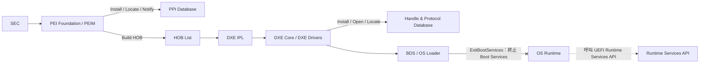
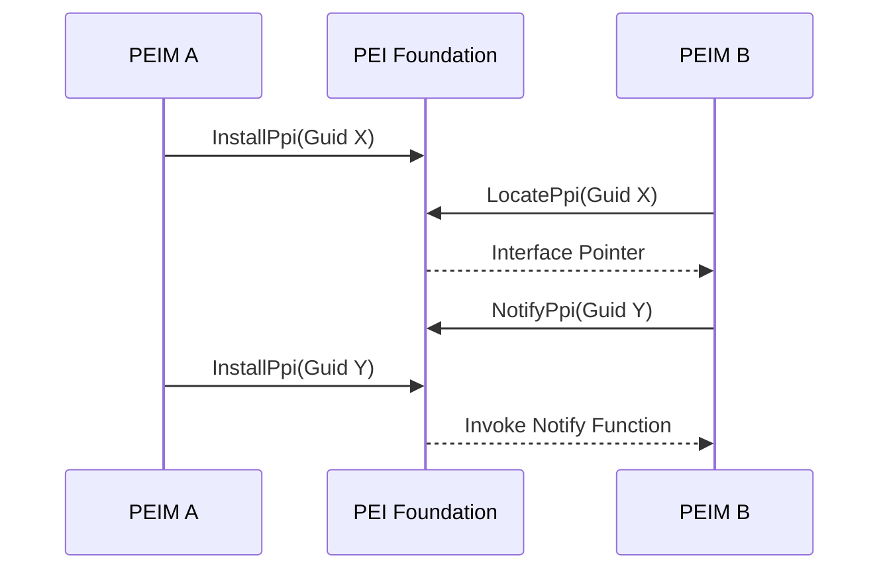
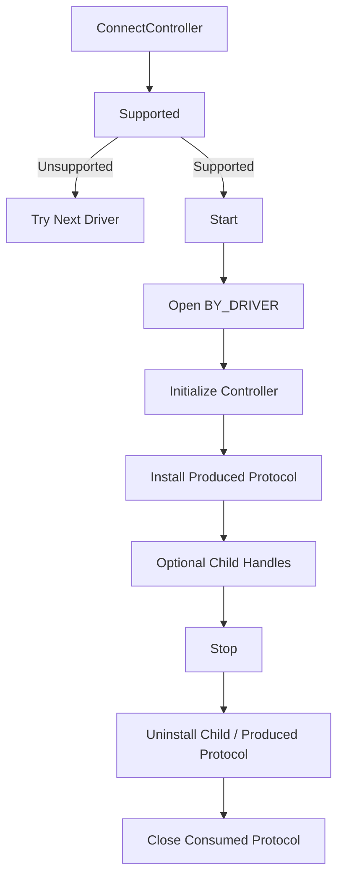
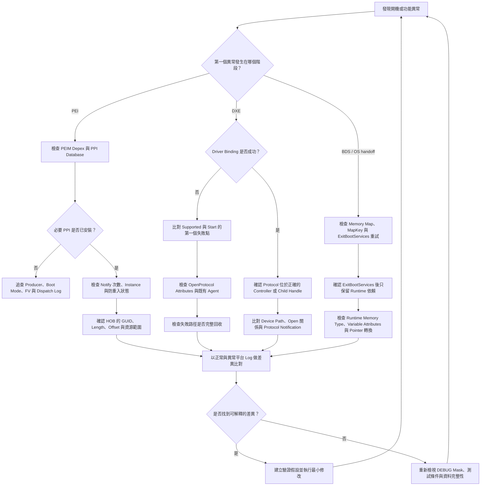

## 4. HOB、Protocol、PPI 與 UEFI Service


### 適用範圍

本章說明 UEFI Platform Initialization 架構中，HOB、PPI、Protocol 與各類 Service 的角色及彼此關係，涵蓋 PEI 到 DXE 的資料交接、模組間介面發布與查找、Handle Database、Driver Binding，以及常見生命週期與記憶體所有權問題。

本章聚焦於 BIOS 移植、平台初始化與早期開機問題排查。SEC 的 CPU 初始狀態、完整 DXE Dispatcher 演算法、BDS 開機選項政策、作業系統 Runtime 行為及特定晶片供應商私有介面，僅在與本章主題直接相關時補充。

> **平台適用性聲明**：本章所有介面、結構與行為以 UEFI／PI Specification 與 EDK II 主流實作為基礎。實際平台可能因 Silicon Vendor 的私有 PPI／Protocol、GUID HOB 欄位、Reset／Resume 行為、Silicon Package 或 BSP 整合方式而不同。進行 BIOS 移植、設計審查或問題排查時，仍應以專案採用的規格版本、供應商文件與 BSP 為最終依據。

### 適用讀者

- 負責 BIOS、UEFI、EDK II、平台初始化或韌體移植的開發與整合人員。
- 需要排查 PEI、DXE、BDS 階段模組相依、介面找不到、HOB 資料錯誤或 Driver Binding 問題的人員。
- 撰寫 PEIM、DXE Driver、UEFI Driver、Application 或平台共用 Library 的工程人員。

### 名詞與縮寫

| 縮寫 | 英文全名 | 本章語意 |
|---|---|---|
| HOB | Hand-Off Block | PEI 向後續階段傳遞資訊的資料結構 |
| PPI | PEIM-to-PEIM Interface | PEI 階段的模組間介面 |
| PHIT | Phase Handoff Information Table | HOB List 的第一個 HOB，描述交接及記憶體邊界 |
| FV | Firmware Volume | 保存 Firmware File 與模組的韌體容器 |
| TPL | Task Priority Level | UEFI Boot Services Event 的執行優先層級 |
| BDS | Boot Device Selection | 選擇與啟動開機目標的階段或邏輯 |
| GCD | Global Coherency Domain | DXE Core 管理系統 Memory Space 與 I/O Space 的資源模型 |
| EBS | ExitBootServices | OS Loader 結束 Boot Services 的生命週期切換點 |

### 快速導覽

- [理解 PEI 到 DXE 的資料與介面模型](#41-整體架構與資料流)：HOB、PPI、Protocol、Service 的責任邊界。
- [查閱 HOB 的建立與消費方式](#42-hob-list-的建立傳遞與消費)：HOB List、PHIT、End of HOB List 與 DXE IPL 交接。
- [選擇合適的 HOB 類型](#43-常用-hob-類型與自訂-guid-hob)：資源、記憶體、Firmware Volume 與 GUID HOB。
- [理解 PPI Database 與 Notify](#44-ppi-database-與-notify-機制)：Install、Reinstall、Locate、Notify 與 PEIM 相依。
- [管理 Protocol 與 Handle](#45-protocol-installlocateopen-與-close)：Protocol Database、Protocol Notification 與使用追蹤。
- [區分 UEFI 各類 Service](#46-boot-serviceruntime-service-與-dxe-service)：可使用階段、記憶體限制與 ExitBootServices 邊界。
- [理解 Driver Binding](#47-handleagentcontroller-與-driver-binding)：Supported、Start、Stop 與控制器拓樸。
- [排查生命週期與所有權問題](#48-生命週期記憶體所有權與除錯)：常見錯誤、觀測點與驗證順序。
- [執行驗證與回歸](#附錄-a驗證與測試檢查表)：測試矩陣、Pass／Fail 判定與紀錄欄位。
- [快速選擇排查入口](#附錄-b極簡除錯決策樹)：依 PEI、DXE 與 OS Handoff 分流。

### 建議使用場景

- **新專案啟動或平台移植**：依序閱讀 4.1 至 4.7，建立 HOB、PPI、Protocol、Service 與 Driver Binding 的整體視角，再以 4.8 準備除錯觀測點。
- **特定問題排查**：先查閱 4.8.2 的常見問題表與附錄 B 決策樹，再回到相對應的技術章節確認生命週期、所有權與介面契約。
- **設計審查與程式審查**：使用 4.11 檢查清單，逐項確認 Producer／Consumer、記憶體類型、錯誤回收、Open／Close 關係與 Runtime 邊界。
- **測試與回歸規劃**：使用附錄 A 建立測試矩陣、Pass／Fail 條件與測試紀錄。

---

### 4.1 整體架構與資料流

HOB、PPI 與 Protocol 都可傳遞資訊，但服務的階段與使用模型不同：

| 機制 | 主要階段 | 主要用途 | 典型特性 |
|---|---|---|---|
| HOB | PEI 建立，DXE 消費 | 跨階段傳遞平台與資源資訊 | 線性資料結構，交接後通常視為唯讀 |
| PPI | PEI | PEIM 之間發布功能或狀態 | 由 GUID 識別，透過 PEI Services 管理 |
| Protocol | DXE、BDS、UEFI 執行環境 | Driver、Application 與 Controller 之間提供介面 | 安裝在 Handle 上，可追蹤開啟關係 |
| PEI Services | PEI | HOB、PPI、記憶體、FV 與 PEIM 支援服務 | 只適用 PEI 執行環境 |
| Boot Services | DXE 至 ExitBootServices 前 | 記憶體、事件、Protocol、Image 與裝置服務 | ExitBootServices 成功後不得再呼叫 |
| Runtime Services | 開機期間與 OS Runtime | Variable、Time、Reset、Capsule 等服務 | Runtime 映射後仍需遵守 Runtime 記憶體規則 |
| DXE Services | DXE Core 內部與 DXE Driver | GCD、Dispatcher、FV 等 PI 層服務 | 不等同於 UEFI Boot Services |

簡化資料流如下：



圖中的叉線代表生命週期切換，而非一般資料傳遞。虛線代表 OS 透過 UEFI System Table 向 Firmware 的 Runtime Services API 發起呼叫，而非 Firmware 主動向 OS 推送資料。`ExitBootServices()` 成功後，Boot Services 不再可用；OS 僅能依 UEFI Runtime 規則呼叫 Firmware 保留的 Runtime API。若 OS 已呼叫 `SetVirtualAddressMap()`，後續 Runtime 呼叫與相關指標必須使用該虛擬位址映射。

判讀問題時，可先依兩個問題分類：

1. 問題是否跨越 PEI 與 DXE？若是，先檢查 HOB 的建立內容與交接時點。
2. 問題是否為同一階段內的模組相依？PEI 優先檢查 PPI，DXE 優先檢查 Protocol、Handle 與 Driver Binding。

### 4.2 HOB List 的建立、傳遞與消費

#### 4.2.1 HOB 的角色

HOB（Hand-Off Block）是 PI 架構使用的交接資料結構。PEI 階段完成最低限度的平台初始化後，透過 HOB List 將記憶體配置、資源描述、Firmware Volume、CPU 能力、開機模式及平台自訂資料交給 DXE。

HOB 適合傳遞「DXE 必須知道，但無法或不應重新探測」的資訊，例如：

- PEI 已辨識的系統記憶體與保留區域。
- DXE Core 或模組所在的 Firmware Volume。
- SEC／PEI 使用的 Stack、Module 或特殊記憶體配置。
- 平台早期初始化結果、Silicon Policy 摘要或一次性狀態。

HOB 不適合取代 DXE Protocol。若資料需要在 DXE 期間持續更新、提供函式介面或管理多個 Controller，通常應在 DXE 建立對應 Protocol 或其他長期服務。

#### 4.2.2 HOB List 結構

HOB List 為連續排列的可變長度資料項目。每個 HOB 具有通用 Header，至少包含 HOB Type 與 HOB Length。走訪時依目前 HOB 的長度移到下一個 HOB，直到 `EFI_HOB_TYPE_END_OF_HOB_LIST`。

第一個 HOB 為 PHIT（Phase Handoff Information Table），用來描述開機模式、HOB List 邊界與可用記憶體資訊。建立或搬移 HOB List 時，需保持下列條件：

- HOB 位址與長度符合規格要求的對齊。
- `HobLength` 不得為 0，也不得超出 HOB List 邊界。
- PHIT 的 FreeMemoryTop、FreeMemoryBottom 與 EndOfHobList 必須一致。
- 最後必須存在 End of HOB List，避免消費端無限走訪或讀到無效記憶體。

#### 4.2.3 PEI 建立與 DXE 消費

EDK II 中常透過 HobLib 建立及查找 HOB。概念性流程如下：

```c
VOID *Data;

Data = BuildGuidHob (&gMyPlatformInfoGuid, sizeof (MY_PLATFORM_INFO));
if (Data == NULL) {
  return EFI_OUT_OF_RESOURCES;
}

CopyMem (Data, &PlatformInfo, sizeof (MY_PLATFORM_INFO));
```

DXE 消費端應先確認 HOB 存在，再驗證長度、版本及內容：

```c
VOID                  *GuidHob;
MY_PLATFORM_INFO      *Info;
UINTN                  DataSize;

GuidHob = GetFirstGuidHob (&gMyPlatformInfoGuid);
if (GuidHob == NULL) {
  return EFI_NOT_FOUND;
}

DataSize = GET_GUID_HOB_DATA_SIZE (GuidHob);
if (DataSize < sizeof (MY_PLATFORM_INFO)) {
  return EFI_COMPROMISED_DATA;
}

Info = GET_GUID_HOB_DATA (GuidHob);
```

對自訂 HOB，建議資料結構包含 `Revision`、`Length` 與保留欄位，使不同 BIOS 版本或 SKU 能判斷相容性。

#### 4.2.4 重要警示：HOB 內嵌指標

> **不得在 HOB 中保存虛擬位址，亦不得保存指向 Temporary RAM、PEI Stack 或其他僅於 PEI 有效區域的指標。** PEI 遷移至永久記憶體後，原始位址可能已失效；DXE 的位址配置與生命週期也不同。消費端若直接解引用這類欄位，可能讀取錯誤資料、觸發 Page Fault，或在部分 Boot Mode 下形成難以重現的損毀。

跨階段資料建議使用以下表達方式：

- **Offset**：相對於 HOB 資料起點或已定義 Buffer 起點的位移，並同時保存總長度。
- **Physical Address**：只有在該實體區域已由 Resource Descriptor／Memory Allocation HOB 保留，且 DXE 明確理解其屬性與有效期限時使用。
- **Length／Count**：任何可變長度內容都需提供邊界資訊，消費端在加法與乘法前應檢查溢位。
- **Inline Data**：資料量合理時，優先把內容直接接在 GUID HOB 後方，避免額外位址相依。

若資料結構無法避免位址欄位，欄位名稱應帶出語意，例如 `PhysicalAddress` 或 `DataOffset`，不要使用含糊的 `Buffer`／`Pointer`。

### 4.3 常用 HOB 類型與自訂 GUID HOB

| HOB 類型 | 主要內容 | BIOS 移植時的檢查重點 |
|---|---|---|
| PHIT HOB | Boot Mode、HOB List 與記憶體邊界 | 第一個 HOB、邊界一致性、Boot Mode |
| Resource Descriptor HOB | System Memory、MMIO、I/O、保留資源 | Base／Length、重疊、屬性與 GCD 對應 |
| Memory Allocation HOB | Stack、Module、Boot／Runtime 記憶體配置 | Memory Type、Owner GUID、是否被後續覆寫 |
| Firmware Volume HOB | FV Base 與 Length | FV 是否可讀、範圍是否在有效資源內 |
| CPU HOB | 實體位址與 I/O 位址寬度 | CPU 能力是否與平台及 GCD 設定一致 |
| GUID Extension HOB | 平台或元件自訂資料 | GUID 唯一性、Revision、Length、輸入驗證 |

#### 4.3.1 Resource Descriptor 與 Memory Allocation 的差異

Resource Descriptor HOB 描述「平台有哪些資源」，Memory Allocation HOB 描述「其中哪些區域已分配給特定用途」。兩者的 Base／Length 不一定一一對應，但不得造成自相矛盾的資源視圖。

常見問題包括：

- DRAM 被描述為 System Memory，但部分保留區未另行標示，後續可能被配置器使用。
- MMIO Hole 與 System Memory 重疊，造成 PCI 資源或 DMA 問題。
- PEI Stack、DXE Core 或 Runtime 區域的 Memory Type 不正確。
- 同一範圍由多個 HOB 重複描述，且屬性不同。

#### 4.3.2 自訂 GUID HOB 設計原則

- GUID 代表資料契約，不應因產品名稱相近而重複使用。
- 結構需避免未定義 padding，必要時明確定義欄位寬度。
- 不在 HOB 中保存只對 PEI 有效的指標，例如 Temporary RAM 位址。
- 若必須保存位址，需明確說明實體位址、虛擬位址或 Offset 語意。
- 消費端不得只依 `sizeof()` 假設版本一致，應檢查實際資料長度。
- 敏感資訊、金鑰或可重放認證資料不應以一般 GUID HOB 長期暴露。

### 4.4 PPI Database 與 Notify 機制

#### 4.4.1 PPI 的定位

PPI（PEIM-to-PEIM Interface）是 PEI 階段的模組介面。PEIM 透過 GUID 發布 PPI，其他 PEIM 使用 `LocatePpi()` 取得介面。PPI 可表示函式集合、資料介面或初始化完成狀態。

常用 PEI Services：

| Service | 用途 | 注意事項 |
|---|---|---|
| `InstallPpi()` | 新增 PPI Descriptor | Descriptor 與 Interface 的生命週期需涵蓋後續使用期間 |
| `ReInstallPpi()` | 以新 Descriptor 取代既有 PPI | 舊介面持有者是否仍保存舊指標需評估 |
| `LocatePpi()` | 依 GUID 與 Instance 查找 PPI | 同 GUID 可有多個 Instance，不應固定假設只有一個 |
| `NotifyPpi()` | 註冊 PPI 出現時的通知 | Dispatch Notify 與 Callback Notify 的執行時點不同 |

#### 4.4.2 Notify 與 Depex 的差異

- Depex 決定 PEIM 何時具備被 Dispatcher 執行的條件。
- Notify 用來在指定 PPI 已存在或稍後安裝時執行回呼。

若模組的主功能完全依賴某個 PPI，通常優先以 Depex 表達。若模組可先初始化，再於某 PPI 出現時補做動作，Notify 較合適。過度依賴 Notify 可能使執行順序難以追蹤，也容易形成重入或隱性相依。

> **PEI 與 DXE 的通知模型需分開理解。** PPI Notify 執行於 PEI Foundation 環境，PEI 規格並未把 UEFI Boot Services 的 TPL 模型套用到 PPI Notify，因此不應將 `TPL_CALLBACK`、`WaitForEvent()` 或 Boot Services `Stall()` 直接寫成 PPI Notify 的限制。PPI Notify 仍應保持短小、避免重入，並避免在回呼中安裝會反覆觸發同一通知的 PPI。若工作量較大，可拆成狀態 PPI、後續 PEIM 或其他明確的 PEI 排程點。

DXE 的 Protocol Notification Event 才需要遵守 UEFI TPL 規則。事件在 `TPL_NOTIFY` 執行時不得阻塞；需要較長處理時，應只記錄必要狀態並 Signal 另一個較低 TPL 的 Event。`WaitForEvent()` 只能在 `TPL_APPLICATION` 呼叫，其他 Service／Protocol 也需依規格所列 TPL 限制使用。

##### PPI Notify 防重入實作模式

Notify 回呼可能因回呼內再次安裝相關 PPI，或因多個 Instance 依序出現而被重複觸發。防護不能只依靠單一靜態旗標，因為同一 PEIM 可能需要處理多個合法 Instance，Temporary RAM 遷移也可能影響狀態保存。建議依介面契約選擇以下方式：

1. **完成 PPI 檢查**：回呼開始時先 `LocatePpi()` 查找專用的完成 PPI；若已存在，表示工作已完成，可直接返回。
2. **狀態機／Instance 去重**：需要處理多個 Instance 時，以明確狀態與已處理 Instance 集合區分「尚未開始、執行中、完成、失敗」，不要用單一 Boolean 誤擋合法通知。
3. **執行中防護**：進入工作前設定 `InProgress`，所有返回路徑都需清除或轉成終止狀態，避免錯誤路徑永久封鎖後續處理。
4. **兩階段拆分**：Notify 僅驗證必要條件、記錄狀態並安裝「Ready／Completion PPI」，實際工作交由 Depex 依賴該 PPI 的後續 PEIM。這種方式較容易維持 PEI Dispatcher 的確定性，也符合 PEI 應縮短早期處理路徑的原則。

概念性防護如下：

```c
Status = PeiServicesLocatePpi (
           &gMyWorkCompletePpiGuid,
           0,
           NULL,
           (VOID **)&CompletionPpi
           );
if (!EFI_ERROR (Status)) {
  return EFI_SUCCESS;
}

if (Context->InProgress) {
  return EFI_ALREADY_STARTED;
}

Context->InProgress = TRUE;
Status = ValidateAndPublishReadyPpi ();
Context->InProgress = FALSE;
return Status;
```

上述 `Context` 必須位於回呼有效期間內仍可靠的儲存區；若通知可能跨越 Temporary RAM 遷移，需使用 PEI Foundation 可正確遷移的配置方式，或改以可查找的 PPI／HOB 表示狀態。

若狀態必須跨越 Temporary RAM 遷移，不應保存 Stack 位址，也不宜只依賴可能因 PEIM Shadow／重新載入而重設的模組靜態變數。實務上可使用 `BuildGuidHob()` 將狀態放入 HOB List，並在每次使用時以 GUID 重新查找，不要長期快取遷移前取得的 HOB 資料指標。若永久記憶體已安裝，也可透過 PEI Memory Services 的 `AllocatePages()` 配置狀態；配置前須確認服務在目前 Boot Mode 與時間點可用，並由明確的 PPI、HOB 或資料結構保存其實體位址及長度。

#### 4.4.3 常見時序



排查 PPI 問題時，建議記錄 GUID、Instance、Descriptor Flags、安裝者、查找者、Notify 類型及返回狀態。

### 4.5 Protocol Install、Locate、Open 與 Close

#### 4.5.1 Protocol 與 Handle Database

DXE 中的 Protocol 是由 GUID 識別的介面，安裝在 EFI Handle 上。一個 Handle 可安裝多個 Protocol，用來表示同一個 Controller、Image 或邏輯物件的能力集合。

可把 Handle 理解成一個可擴充的「物件標籤」或能力集合索引，而不是硬體位址。Protocol 則是貼在這個標籤上的能力描述。例如，一個複合式控制器若同時提供儲存與網路功能，韌體可能在相關 Handle 上發布 `EFI_BLOCK_IO_PROTOCOL` 與 `EFI_SIMPLE_NETWORK_PROTOCOL`，讓消費端依 GUID 尋找所需能力。實際的 PCI Device／Function 通常由 Device Path、PCI I/O Protocol 與父子 Handle 關係描述，因此 Handle 不應直接等同於 PCI BDF。

常用服務及適用情境：

| Service | 適用情境 | 主要風險 |
|---|---|---|
| `InstallProtocolInterface()` | 在新或既有 Handle 發布單一 Protocol | 安裝失敗後的資源回收 |
| `InstallMultipleProtocolInterfaces()` | 一次發布多個相關 Protocol | 中途失敗時的完整性與回復 |
| `UninstallProtocolInterface()` | 移除不再提供的 Protocol | 仍被其他 Agent 開啟時可能失敗 |
| `LocateProtocol()` | 只需任一符合 GUID 的介面 | 多 Instance 時結果不代表特定 Controller |
| `LocateHandleBuffer()` | 列出符合條件的 Handle | 回傳 Buffer 由呼叫端釋放 |
| `HandleProtocol()` | 已知 Handle 時取得 Protocol | 不記錄 Driver Model 的開啟關係 |
| `OpenProtocol()` | Driver Binding 或需追蹤使用關係 | Attributes、AgentHandle、ControllerHandle 必須正確 |
| `CloseProtocol()` | 解除先前 Open 關係 | 參數需與 Open 時一致 |

#### 4.5.2 LocateProtocol 與 OpenProtocol 的選擇

`LocateProtocol()` 適合取得全域、單一 Instance 或不屬於特定 Controller 的服務。UEFI Driver Model 中若 Driver 要管理 Controller，應使用 `OpenProtocol()` 並選擇合適 Attributes，使 Core 能追蹤 Agent、Controller 與 Child Controller 關係。

常見 Attributes：

- `EFI_OPEN_PROTOCOL_GET_PROTOCOL`：取得介面，不宣告管理權。
- `EFI_OPEN_PROTOCOL_TEST_PROTOCOL`：只測試 Protocol 是否存在。
- `EFI_OPEN_PROTOCOL_BY_DRIVER`：Driver 宣告管理 Controller 的介面。
- `EFI_OPEN_PROTOCOL_BY_CHILD_CONTROLLER`：建立 Bus Driver 與 Child Handle 關係。
- `EFI_OPEN_PROTOCOL_EXCLUSIVE`：要求排他存取，使用前需確認對其他 Driver 的影響。

#### 4.5.3 Protocol Notification

當模組需要等待某 Protocol 安裝，可建立 Event 並以 `RegisterProtocolNotify()` 註冊。回呼被觸發後，仍需反覆取得尚未處理的 Handle，不宜假設一次通知只對應一個 Protocol Instance。

回呼函式應保持精簡，避免長時間阻塞、在高 TPL 執行不允許的服務，或再次觸發同一通知而形成遞迴。

### 4.6 Boot Service、Runtime Service 與 DXE Service

| 類別 | 提供者／入口 | 有效期間 | 典型功能 |
|---|---|---|---|
| PEI Services | PEI Foundation | PEI | PPI、HOB、PEIM、FV、PEI Memory |
| Boot Services | UEFI System Table 的 BootServices | DXE 至 ExitBootServices 成功前 | Memory、Event、Protocol、Image、Controller、Timer |
| Runtime Services | UEFI System Table 的 RuntimeServices | 開機期間與 OS Runtime | Variable、Time、Reset、Capsule、Virtual Address |
| DXE Services | DXE Services Table | DXE | GCD Memory／I/O Space、FV、Dispatcher |

#### 4.6.1 記憶體類型配置策略

記憶體類型不是單純的分類名稱，它會影響 `ExitBootServices()` 後由誰管理、是否出現在 Runtime Map，以及 OS／ACPI 何時可以回收。配置時應先確認資料的**存活期間**與**接手者**，再選 Memory Type。

| Memory Type | 適用內容 | 生命週期與注意事項 |
|---|---|---|
| `EfiBootServicesCode`／`EfiBootServicesData` | DXE／UEFI Boot Service Driver 的程式與資料 | ExitBootServices 後可由 OS 回收，不得被 Runtime 路徑引用 |
| `EfiRuntimeServicesCode`／`EfiRuntimeServicesData` | ExitBootServices 後仍需執行或存取的 Runtime Driver／資料 | 必須保留給 Firmware，並納入 Runtime Memory Map 與虛擬位址轉換策略 |
| `EfiACPIReclaimMemory` | ACPI Table、OS 解析完成前必須保留的 ACPI 資料 | OS 讀取並接手 ACPI Table 後可以回收；不適合放永久 Runtime 狀態 |
| `EfiACPIMemoryNVS` | S3 Resume、平台韌體與 ACPI 需跨睡眠保留的狀態 | 一般不由 OS 當作可用 RAM；內容、完整性與 Resume 路徑需同步驗證 |
| `EfiReservedMemoryType` | 不應交給一般 OS 配置器的保留實體區域 | 不代表自動具備 Runtime 可呼叫性；需清楚說明保留原因、屬性與擁有者 |
| `EfiLoaderCode`／`EfiLoaderData` | UEFI Application／OS Loader | ExitBootServices 後由 OS Loader／OS 管理，不應拿來保存 Firmware Runtime 狀態 |

配置判斷可依下列順序：

1. ExitBootServices 後是否仍由 Firmware 存取？若是，評估 Runtime Code／Data。
2. 是否為 ACPI Table，且 OS 解析完成後即可回收？若是，評估 `EfiACPIReclaimMemory`。
3. 是否需跨 S3 保存，並由 Resume Firmware／AML 使用？若是，評估 `EfiACPIMemoryNVS`。
4. 是否只是避免一般配置器使用？若是，才評估 `EfiReservedMemoryType`，並留下資源用途。
5. 不要只因「資料很重要」就選 Runtime 或 Reserved。錯誤類型會增加 OS 保留記憶體、破壞 S3 Resume，或使 Runtime Pointer 轉換不完整。

S4 通常由 OS 以休眠映像保存與恢復系統狀態，其資料契約與 S3 的 ACPI NVS 不完全相同。平台若支援 S3／S4，應分別驗證 Memory Map、ACPI Table、NVS 內容、Variable 與 Resume Flow。

> **S3／S4 邊界提醒**：S3 一般會保留 DRAM 供電，Resume 時由 Firmware 重新進入早期恢復路徑，通常包括 PEI 與平台所需的有限 DXE／S3 Resume 元件；`EfiACPIMemoryNVS` 內的資料必須在進入 S3 前準備完成，並在恢復期間保持完整。S4（Hibernation）進入後系統可完全斷電，恢復時由 OS 從休眠映像重建狀態，Firmware 不應將 S3 路徑的 NVS 內容視為有效。若同一結構同時參與 S3 與 S4 判斷，必須另外設計有效性標記、Boot Mode 檢查及冷啟動失效規則，避免把殘留或未初始化的 NVS 當成有效恢復資料。

#### 4.6.2 ExitBootServices 邊界

OS Loader 呼叫 `GetMemoryMap()` 取得 Memory Map 與 MapKey，再呼叫 `ExitBootServices()`。兩次呼叫之間若配置或釋放記憶體，MapKey 可能失效，因此 Loader 通常需要重新取得 Memory Map 後重試。

ExitBootServices 成功後：

- 不得再呼叫 Boot Services。
- Boot Services Code／Data 可由 OS 回收。
- Runtime Driver 只能依賴 Runtime Code／Data 與允許的 Runtime Services。
- 事件、Protocol 或一般 Pool 指標若仍被 Runtime 路徑引用，可能造成轉址後失效。

#### 4.6.3 Runtime Driver 注意事項

- 需要跨越 ExitBootServices 的函式與資料應放在正確 Runtime Memory Type。
- 若 OS 進行虛擬位址切換，需處理 `SetVirtualAddressMap()` 相關轉址需求。
- Runtime 路徑不應間接呼叫 Boot Services Library。
- Variable、Capsule、Reset 等介面需納入權限、輸入長度與非預期重入檢查。

### 4.7 Handle、Agent、Controller 與 Driver Binding

#### 4.7.1 基本角色

- Handle：Protocol 的容器，本身是不透明識別值。
- Agent Handle：發起 `OpenProtocol()` 的 Image，通常是 Driver Binding 所屬 Driver Image。
- Controller Handle：Driver 要管理的裝置或匯流排控制器。
- Child Handle：Bus Driver 建立的子裝置 Handle。

#### 4.7.2 Driver Binding 三個入口

| 函式 | 目的 | 檢查重點 |
|---|---|---|
| `Supported()` | 判斷 Driver 能否管理 Controller | 不應留下持續性副作用；暫時開啟的 Protocol 要關閉 |
| `Start()` | 開啟 Controller Protocol、初始化硬體、安裝新 Protocol | 任何失敗路徑都需逆序回收資源 |
| `Stop()` | 停止 Child 或 Controller 並解除 Protocol | Child 數量、Open 關係與 Uninstall 順序需一致 |

典型流程：



`Supported()` 成功不保證 `Start()` 一定成功，因為資源、硬體狀態或其他 Driver 的開啟關係可能在兩者之間改變。

### 4.8 生命週期、記憶體所有權與除錯

#### 4.8.1 所有權原則

每個配置、安裝、開啟與註冊動作，都應能回答下列問題：

1. 由誰建立？
2. 哪些模組可持有或修改？
3. 有效期限到哪一個階段或事件？
4. 成功與失敗路徑由誰回收？
5. Reset、S3 Resume、Capsule Update 或 ExitBootServices 後是否仍有效？

| 資源 | 建立方式 | 一般回收責任 |
|---|---|---|
| Pool／Pages | AllocatePool／AllocatePages | 配置者或明確接手所有權者 |
| LocateHandleBuffer 結果 | LocateHandleBuffer | 呼叫端 `FreePool()` |
| Event | CreateEvent／CreateEventEx | 建立者 `CloseEvent()`，或依事件生命週期保留 |
| Protocol Interface | InstallProtocolInterface | 安裝者在停止服務前 Uninstall |
| Open Protocol 關係 | OpenProtocol | 同一 Agent／Controller 依契約 CloseProtocol |
| GUID HOB 資料 | BuildGuidHob | 隨 HOB List 交接，消費端通常不釋放 |

#### 4.8.2 常見問題與排查

| 現象 | 優先觀測點 | 可能方向 | 驗證方式 |
|---|---|---|---|
| DXE 找不到 PEI 資料 | HOB List、GUID、資料長度 | HOB 未建立、建立太晚、GUID 不一致 | Dump HOB，確認 Build 與 Get 使用同一 GUID |
| PEIM 一直未執行 | Depex、PPI Database、Dispatcher Log | 必要 PPI 未安裝或 Depex 錯誤 | 開啟 PEI Dispatcher／PPI DEBUG Log |
| Notify 未進入 | Notify Flags、註冊時點、GUID | Descriptor 類型錯誤或回呼已在其他時點執行 | 記錄註冊與安裝順序 |
| Protocol 已安裝但 Locate 失敗 | Handle Database、Protocol GUID | GUID 實例不一致、安裝失敗未檢查 | 列出 Handle 與 Protocol，檢查 Status |
| UninstallProtocol 失敗 | OpenProtocolInformation | 仍有 Agent 開啟 | 查 Agent／Controller／Attributes 關係 |
| Driver Supported 成功但 Start 失敗 | Start 第一個失敗點 | Protocol 競爭、資源不足、硬體未就緒 | 保留完整 Status、Open 關係與硬體狀態 |
| ExitBootServices 偶發失敗 | Memory Map、MapKey | 取得 MapKey 後仍有配置或事件活動 | 重新 GetMemoryMap，追蹤配置來源 |
| OS Runtime 階段當機 | Runtime Memory、轉址清單 | 保存 Boot Services 指標或未轉換 Pointer | 檢查 Memory Type 與 Virtual Address Change |
| Warm Reset 才失敗 | 殘留狀態、Boot Mode、S3／Reset 路徑 | 初始化假設只適用 Cold Boot | 比對 Cold／Warm Log 與 HOB／Variable |

#### 4.8.3 建議除錯輸出

```text
[PEI][PPI] Install GUID=<guid> Ppi=<ptr> Flags=<flags> Status=<status>
[PEI][HOB] Build Type=<type> GUID=<guid> Base=<base> Size=<size>
[DXE][PROTO] Install Handle=<handle> GUID=<guid> If=<ptr> Status=<status>
[DXE][OPEN] Agent=<agent> Controller=<ctrl> GUID=<guid> Attr=<attr> Status=<status>
[DXE][DRV] Supported/Start/Stop Controller=<ctrl> RemainingChildren=<n> Status=<status>
[UEFI][EBS] MapKey=<key> DescriptorSize=<size> Count=<n> Status=<status>
```

Log 應避免只輸出「成功／失敗」，至少保留階段、GUID、Handle、位址、長度、Attributes 與 `EFI_STATUS`。

##### Log 與 Shell 命令對照表

| Log 中的關鍵訊息 | 對應 Shell 診斷方向 | 驗證目的 |
|---|---|---|
| `[DXE][PROTO] Install Handle=<handle>` | `dh <handle>` | 確認 Handle 上的 Protocol 集合與 Device Path 是否符合預期 |
| `[DXE][OPEN] Agent=<agent> Controller=<ctrl>` | `openinfo <ctrl>` | 比對 Agent、Controller、Protocol GUID 與 Open Attributes |
| `[DXE][DRV] Supported/Start/Stop` | `drivers`、`devices` | 檢查 Driver Binding 狀態、Controller 與 Child Handle 關係 |
| `[UEFI][EBS] MapKey=<key>` | `memmap` | 比對 ExitBootServices 前的 Memory Map 類型、範圍與異常變化 |
| Variable／Runtime 相關 Status | `dmpstore <VariableName>` | 確認 Variable 的 GUID、Attributes、資料大小與可見階段 |

Shell 命令的參數與輸出格式可能隨 UEFI Shell 版本或平台整合內容不同，應先以 `help <command>` 確認。Handle 值只適合在同一次開機中與 Log 對照，不應跨開機硬性比對數字。

#### 4.8.4 Driver Binding 交叉比對矩陣

當 `Start()` 失敗時，不要只從最後一筆錯誤往回猜測。建議同步比對 Driver 行為、Handle Database 與硬體狀態：

| 比對面向 | 要確認的問題 | 建議證據 |
|---|---|---|
| `Supported()` 副作用 | 是否寫入暫存器、切換 BAR、配置資源或開啟 Protocol 後未還原 | `Supported()` 進出前後的 Register Dump、OpenProtocolInformation |
| Protocol 開啟模式 | 是否誤用 `EFI_OPEN_PROTOCOL_EXCLUSIVE`，或已有其他 Agent 以 `BY_DRIVER` 開啟 | Agent／Controller／Attributes、`openinfo` 或 Core Debug Log |
| Controller 能力 | `Start()` 需要的 Protocol 是否都位於同一 Controller Handle，或其實在 Parent／Child Handle | Device Path、Handle Protocol 清單、父子拓樸 |
| 平台基礎 Driver | PCI Host Bridge、PCI Bus、IOMMU 或其他 Bus Driver 是否尚未完成資源配置 | Driver Binding 執行順序、PCI I/O 狀態、Resource Allocation Log |
| 失敗回收 | `Start()` 中途失敗後是否逆序 Uninstall、Close 與 Free | 第二次 Connect 結果、配置計數與 Handle 差異 |

UEFI Shell 可先使用下列方向縮小範圍，實際參數以平台 Shell 版本的 `help` 為準：

```text
dh                 # 列出 Handle Database
dh -p <Protocol>   # 依 Protocol 篩選 Handle；不同 Shell 版本語法可能不同
openinfo <Handle>  # 查看 Protocol 的 Open 關係
drivers            # 查看 Driver Binding 與管理狀態
devices            # 查看 Controller／Child 關係
```

若目前 Shell 不支援 `dh -p`，可先執行 `dh` 取得 Handle 清單，再使用 `dh <Handle>` 逐一檢視 Protocol。部分 EDK II Shell 版本亦支援 `dh -d` 顯示較詳細的 Device Path 或 Handle 資訊。實際參數應先以 `help dh` 確認，避免把不同 Shell 版本的選項直接混用。

建議以「正常平台／異常平台」或「第一次 Connect／第二次 Connect」做差異比對，並把 Handle 值視為單次開機內的識別值，不要假設跨開機固定。

### 4.9 實作與排查入口

EDK II 常見查閱位置如下，實際路徑可能隨 branch 調整：

| 主題 | 常見位置／工具 |
|---|---|
| HOB 定義 | `MdePkg/Include/Pi/PiHob.h` |
| PEI Services 與 PPI Descriptor | `MdePkg/Include/Pi/PiPeiCis.h` |
| UEFI Boot／Runtime Services | `MdePkg/Include/Uefi/UefiSpec.h` |
| Driver Binding Protocol | `MdePkg/Include/Protocol/DriverBinding.h` |
| HOB Library | `MdePkg/Library/PeiHobLib`、`DxeHobLib` 或 branch 對應實作 |
| PEI Core | `MdeModulePkg/Core/Pei` |
| DXE Core 與 Handle Database | `MdeModulePkg/Core/Dxe` |
| UEFI Shell | `dh`、`drivers`、`devices`、`openinfo`、`memmap`、`dmpstore` |

建議原始碼搜尋：

```bash
grep -R "BuildGuidHob" -n --include='*.c' --include='*.h' .
grep -R "InstallPpi\|NotifyPpi\|LocatePpi" -n --include='*.c' .
grep -R "InstallProtocolInterface\|OpenProtocol" -n --include='*.c' .
grep -R "gEfiDriverBindingProtocolGuid" -n --include='*.inf' --include='*.c' .
```

### 4.10 安全性與相容性注意事項

- 將 HOB、Protocol 與 Runtime Service 的輸入視為跨信任邊界資料，檢查長度、版本、範圍與 Integer Overflow。
- 特別檢查 UEFI Variable 的名稱、Vendor GUID、`DataSize`、Attributes 與認證資料。`GetVariable()`／`SetVariable()` 可由 OS Runtime 呼叫，不能把輸入視為可信。除了限制資料長度與 NVRAM 配額，也需拒絕規格未定義的 Attribute 組合，確認既有 Variable 更新時的屬性相容性，並依政策檢查 `EFI_VARIABLE_NON_VOLATILE`、`EFI_VARIABLE_BOOTSERVICE_ACCESS`、`EFI_VARIABLE_RUNTIME_ACCESS` 及 authenticated-write 類屬性。安全敏感 Variable 不應只依名稱判斷權限。
- 不透過 GUID HOB、Variable 或一般 DEBUG Log 暴露金鑰、密碼、Token 或敏感量測資料。
- 安裝或覆寫安全相關 Protocol 前，確認呼叫階段、SMM／MM 邊界及存取權限。
- 自訂 GUID 資料結構應具版本策略，避免 BIOS 更新後舊 DXE Driver 或 Capsule 路徑誤讀。
- Resource Descriptor 與 Memory Type 錯誤可能影響 DMA、記憶體保護與 OS 資源管理，需納入安全測試。
- 規格版本、EDK II branch、Silicon Package 與編譯器版本應一併記錄，避免只比較**名稱相同但語意不同**的介面。

### 4.11 本章檢查清單

- [ ] 已標示每個自訂 HOB 的 Producer、Consumer、GUID、Revision 與資料長度。
- [ ] HOB List 邊界、對齊、End of HOB List 與資源重疊已驗證。
- [ ] PPI 的 Install、Locate、Notify 與 Depex 關係有文件可回查。
- [ ] Protocol 安裝失敗與 Driver Start 中途失敗都有逆序回收流程。
- [ ] `OpenProtocol()` 的 Agent、Controller、Attributes 與 `CloseProtocol()` 成對。
- [ ] Driver Binding 的 Supported、Start、Stop 可重複執行且不殘留狀態。
- [ ] ExitBootServices 前後的服務使用與 Memory Type 已分界。
- [ ] Runtime Pointer 與 Virtual Address Change 處理符合平台需求。
- [ ] 已覆蓋 Cold Boot、Warm Reset、AC Cycle、更新前後及不同 SKU。
- [ ] Log 可識別 GUID、Handle、Instance、Address、Length、Attributes 與 EFI_STATUS。

### 4.12 本章重點

- HOB 用於 PEI 到 DXE 的資料交接；PPI 與 Protocol 分別服務 PEI 與 DXE／UEFI 執行環境。
- HOB 是資料契約，不應保存 Temporary RAM 指標，也不應取代需要持續互動的 Protocol。
- PPI Notify 與 PEIM Depex 解決的問題不同，應依相依是否為模組執行前提來選擇。
- Protocol 不只是一個函式指標；Handle、Agent、Controller 與 Open Attributes 共同描述 Driver Model 關係。
- ExitBootServices 是明確生命週期邊界，Runtime 路徑不可保留對 Boot Services Code／Data 的依賴。
- 排查時先確認階段，再沿著 Producer、Database、Consumer、所有權與回收順序縮小範圍。

### 修訂歷史

| 版本 | 修訂摘要 |
|---|---|
| Rev 1 | 建立 HOB、PPI、Protocol、UEFI Service、Driver Binding、測試與排查的完整初稿 |
| Rev 2 | 新增 HOB 指標警示、Handle 直覺說明、記憶體類型策略與 Driver Binding 交叉比對 |
| Rev 3 | 補充 PPI Notify 防重入、S3／S4 邊界、Log 與 Shell 對照、Variable 安全性及除錯決策樹 |
| Rev 4 | 完成 Runtime 圖形語意、CAR 遷移指引、Shell 相容方案、決策樹閉合與 DEBUG 資料清單 |
| Final 1.0 | 新增縮寫表、平台適用性聲明、使用場景與修訂歷史，移除草稿狀態並定稿 |

### 4.13 參考資料

- UEFI Forum, UEFI Specification: https://uefi.org/specifications
- UEFI Forum, Platform Initialization Specification: https://uefi.org/specifications
- TianoCore EDK II: https://github.com/tianocore/edk2
- TianoCore EDK II Documentation: https://github.com/tianocore-docs
- 專案採用的 EDK II branch、Silicon Package、平台設計文件、Issue 與測試報告。

> 規格名稱、函式名稱與欄位定義應以專案採用的 UEFI／PI Specification 及 EDK II branch 為準。本章提供可重複使用的 BIOS 移植與排查架構，不取代平台供應商文件。

---

## 附錄 A：驗證與測試檢查表

### A.1 測試矩陣

| 類別 | 建議覆蓋 |
|---|---|
| 開機型態 | Cold Boot、Warm Reset、AC Cycle、S3 Resume（若支援） |
| 韌體狀態 | 更新前、更新後、Recovery、設定恢復預設值 |
| 平台差異 | 不同 SKU、記憶體容量、CPU Stepping、PCIe 裝置組合 |
| 資源條件 | 低記憶體、裝置缺席、Protocol／PPI 延遲出現 |
| 錯誤注入 | HOB 長度錯誤、PPI 缺席、Protocol 被占用、Start 中途失敗 |
| OS 交接 | 多次 GetMemoryMap、ExitBootServices 重試、Runtime Variable／Reset |

### A.2 Pass／Fail 判定

- HOB List 可完整走訪，無零長度、越界、重疊或缺少結尾項目。
- 必要 PPI 與 Protocol 在預期階段出現，Instance 數量符合平台設計。
- Driver Binding 可完成 Connect、Disconnect、Reconnect，不殘留 Open 關係。
- 所有失敗路徑可回收已配置資源及已安裝介面。
- ExitBootServices 後無 Boot Services 存取，Runtime 功能在支援的 OS 上可重複執行。
- Cold Boot、Warm Reset 與不同 SKU 的 Log 差異均可由設計解釋。

### A.3 測試紀錄欄位

- BIOS／BMC／CPLD／EC 版本與 Git revision。
- 主機板版本、CPU／SoC Stepping、記憶體與 PCIe 裝置組合。
- Boot Mode、Reset Type、測試前置條件與重現率。
- 第一個異常階段、Status Code、POST Code、Serial Log 時間點。
- HOB／PPI／Protocol／Handle 差異，以及 Memory Map 與 Open 關係。
- Pass／Fail 判定、已知限制、回歸範圍與附件位置。

---

## 附錄 B：極簡除錯決策樹



### B.1 最小資料收集清單

- 第一個異常階段與可重現的 Reset／Boot Mode。
- 第一筆錯誤 `EFI_STATUS`，不要只保留最後一筆連鎖錯誤。
- 涉及的 GUID、Handle、Agent、Controller、Instance 與 Open Attributes。
- HOB Dump、PPI／Protocol 安裝順序、Memory Map 與 Device Path。
- 正常平台與異常平台使用相同 DEBUG Mask、相同測試條件的差異 Log。
- DEBUG Mask 與 Serial Log 輸出層級，包括實際啟用的 `DEBUG_ERROR`、`DEBUG_WARN`、`DEBUG_INFO`、`DEBUG_VERBOSE` 或專案自訂分類；同時記錄 Baud Rate、是否遺失早期 Log，以及 Log Buffer 是否截斷。
- 修改前後的韌體 revision、硬體版本及回歸結果。
