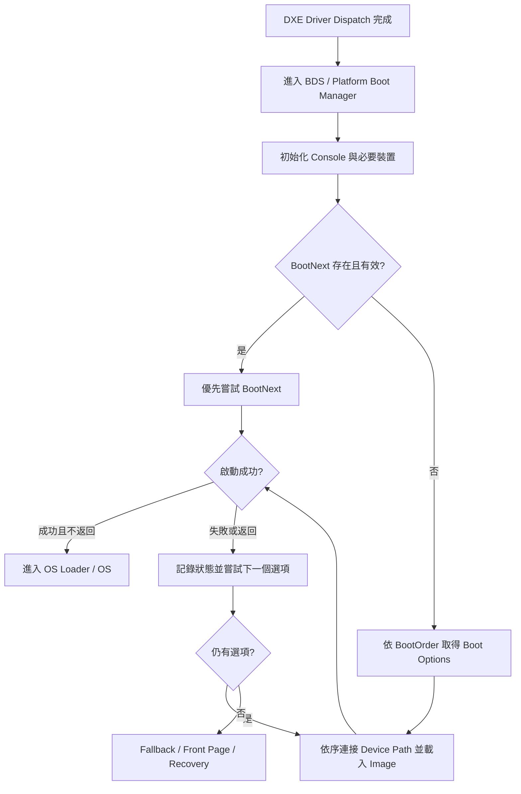
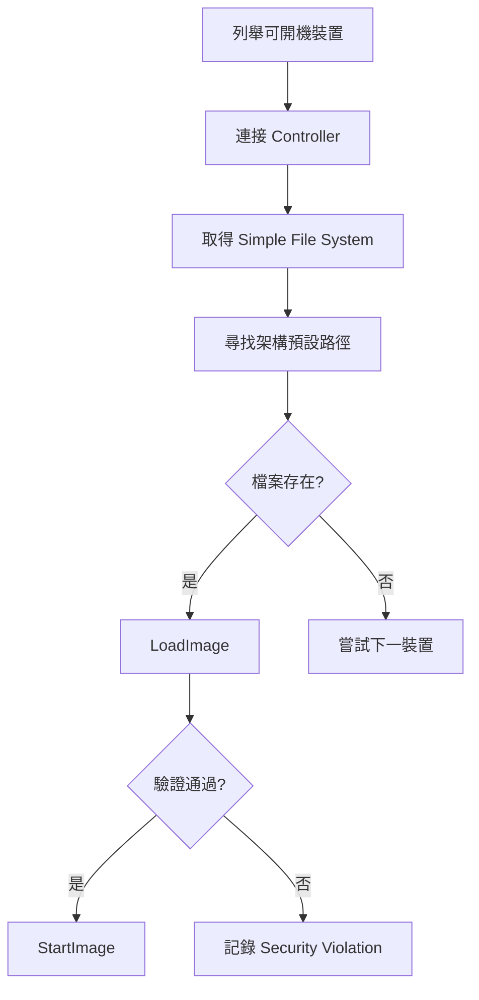
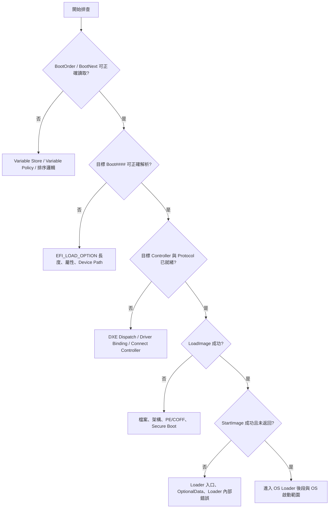

# 5. Boot Manager、Boot Option 與開機順序

## 適用範圍

本章說明 UEFI Boot Manager 如何管理 Boot Option、BootOrder、BootNext、Device Path 與平台開機政策，並整理從 DXE 後段進入 BDS、載入 OS Loader，到失敗後執行 fallback 或 recovery 的主要流程。

本章聚焦於下列內容：

- `Boot####`、`BootOrder`、`BootNext` 與 `Driver####` UEFI Variable
- `EFI_LOAD_OPTION` 結構與 Device Path
- Platform Boot Policy、預設順序與動態排序
- Removable Media、預設檔名、fallback 與 recovery
- Hotkey、Front Page、Timeout 與 Setup
- Boot Option 的建立、刪除、去重、排序與持久化
- Secure Boot、PXE、HTTP Boot 與 OS Loader 對開機流程的影響
- 測試方法、觀測點與常見問題排查

本章不深入說明 PEI、DXE Driver Dispatch、作業系統核心啟動細節，以及特定廠商 Setup Browser 的全部 HII 實作。需要平台專屬資訊的位置，以 `<Platform>`、`<Vendor>` 或 `<Project>` 標示，應由章節負責人依專案補齊。

## 適用讀者

- 負責 BIOS／UEFI、EDK II、BDS、Setup、Secure Boot 或開機流程的開發與整合人員
- 執行新平台移植、Boot Policy 客製、OS 相容性、量產設定或問題排查的人員
- 驗證 Cold Boot、Warm Reset、AC Cycle、Recovery、PXE／HTTP Boot 與韌體更新情境的人員

## 快速導覽

- [理解 Boot Manager 與變數模型](#51-boot-manager-與-uefi-variable-模型)
- [解析 EFI_LOAD_OPTION 與 Device Path](#52-efi_load_option-與-device-path)
- [理解平台開機政策](#53-platform-boot-policy-與預設順序)
- [處理 Removable Media 與失敗復原](#54-removable-mediafallback-與-recovery)
- [處理 Hotkey、Front Page 與 Timeout](#55-hotkeyfront-pagetimeout-與-setup)
- [管理 Boot Option 的生命週期](#56-boot-option-建立刪除去重與排序)
- [釐清 Secure Boot 與網路開機](#57-secure-bootpxehttp-boot-與-os-loader)
- [執行驗證與問題排查](#58-驗證測試與問題排查)

---

## 5.1 Boot Manager 與 UEFI Variable 模型

### 5.1.1 Boot Manager 與 DXE／BDS 的交接點（EDK II 參考實作）

在典型 EDK II 流程中，DXE Dispatcher 完成可派送 Driver 的處理後，控制權進入 BDS Entry；平台再透過 BDS／Platform Boot Manager 相關函式執行 Console 初始化、裝置連接、Boot Option 更新與選擇，最後載入目標 UEFI Image。

進入這一階段時，Boot Services、Runtime Services 與 DXE Architectural Protocol 應已可供後續流程使用。不過「進入 Boot Manager」不代表所有 Controller 都已完整連接。部分平台會依 Boot Policy、Fast Boot 或目標 Device Path，延後連接 Storage、USB、Network 等 Controller。因此，Boot Manager 仍可能呼叫 `ConnectController()` 或 `ConnectDevicePath()` 補足目標所需的 Driver Binding 與 Protocol。

`ReadyToBoot` 的時間點也要和「進入 Boot Manager」區分。一般而言，它應在韌體即將把控制權交給選定的 OS Loader 或其他 boot application 前觸發，而不是一進入 Boot Manager 就視為已完成。實際觸發位置仍需依專案採用的 BDS／Boot Manager 流程確認。

建議把問題分成兩類：

| 類型 | 典型現象 | 優先觀測點 |
|---|---|---|
| DXE／Controller 尚未就緒 | 找不到 Block I/O、Simple File System、Load File 或網路 Protocol | Driver Dispatch、Driver Binding、Controller Handle、`ConnectController()` |
| Boot Option／Image 問題 | Variable 可讀、裝置已連接，但路徑解析、`LoadImage()` 或驗證失敗 | `Boot####`、Device Path、Image 格式、Secure Boot 狀態 |

因此，若 `ConnectDevicePath()` 或 `LoadImage()` 失敗，不宜先假設 Boot Option 已損毀。應先確認目標 Controller 是否已有適用 Driver、所需 Protocol 是否已安裝，以及 Fast Boot 是否略過必要初始化。

### 5.1.2 Boot Manager 的角色

UEFI Boot Manager 位於平台韌體與 OS Loader 之間，主要責任是：

1. 取得平台目前可用的開機來源。
2. 讀取非揮發性 UEFI Variables 中的 Boot Option 與順序。
3. 套用一次性開機、使用者選擇及平台政策。
4. 連接必要的裝置與檔案系統。
5. 載入並啟動對應的 UEFI Image。
6. 處理回傳、失敗、fallback、Front Page 或 recovery。

簡化流程如下：



### 5.1.3 Boot####、BootOrder 與 BootNext

| Variable | 內容 | 典型用途 | 生命週期 |
|---|---|---|---|
| `Boot####` | 一筆 `EFI_LOAD_OPTION` | 描述單一開機選項 | 通常為 Non-Volatile |
| `BootOrder` | `UINT16` 陣列 | 定義一般開機嘗試順序 | 通常為 Non-Volatile |
| `BootNext` | 單一 `UINT16` | 指定下一次開機優先項目 | 一次性，使用後應移除 |
| `BootCurrent` | 單一 `UINT16` | 表示目前啟動所使用的 Boot Option | Runtime 可讀，通常不持久保存 |
| `Timeout` | 秒數 | Boot Manager 選單或倒數時間 | 依平台政策保存 |

`Boot####` 中的 `####` 為四位十六進位索引，例如 `Boot0000`、`Boot000A`。`BootOrder` 保存的是這些索引，不直接保存完整 Device Path。

例如：

```text
BootOrder = { 0003, 0000, 0007 }

Boot0003 = UEFI OS on NVMe
Boot0000 = UEFI PXE IPv4
Boot0007 = USB Removable Media
```

此例中，平台會先嘗試 `Boot0003`，失敗後再嘗試 `Boot0000`，最後嘗試 `Boot0007`。

### 5.1.4 BootNext 的一次性語意

`BootNext` 用於「只影響下一次開機」的情境，例如：

- OS 要求下一次進入韌體更新環境
- 遠端管理工具要求下一次從 PXE 啟動
- 使用者由 Boot Menu 選擇一次性裝置
- 測試流程要暫時切換開機來源

建議流程：

1. 讀取 `BootNext`。
2. 驗證對應的 `Boot####` 是否存在且格式有效。
3. 在嘗試啟動前移除或標記已消耗，避免 reset loop 重複使用。
4. 嘗試指定選項。
5. 若失敗，依平台政策回到 `BootOrder` 或進入 recovery。

平台應明確定義 `BootNext` 對應選項失敗後的行為。常見選擇為回到一般 `BootOrder`，但 recovery、Capsule Update 或企業管理情境可能另有政策。

### 5.1.5 BootCurrent

當 Boot Manager 透過某筆 Boot Option 啟動 image 時，通常會更新 `BootCurrent`，供 OS Loader、作業系統或診斷工具判斷本次從哪一筆選項啟動。

排查時可比對：

- `BootCurrent` 是否對應預期的 `Boot####`
- 對應 Device Path 是否指向實際載入來源
- 開機後 OS 所見的 EFI Variable 是否與韌體顯示一致

### 5.1.6 Driver Option 與 Boot Option 的差異

`Driver####` 與 `DriverOrder` 也使用 `EFI_LOAD_OPTION`，但目的為載入 UEFI Driver，而非啟動 OS Loader。兩者不應混用。

| 類型 | 目標 | 常見內容 |
|---|---|---|
| Boot Option | 可啟動映像 | OS Loader、UEFI Shell、網路開機程式、Recovery Image |
| Driver Option | UEFI Driver | Option ROM Driver、裝置支援 Driver、平台擴充 Driver |

---

## 5.2 EFI_LOAD_OPTION 與 Device Path

### 5.2.1 EFI_LOAD_OPTION 結構

`Boot####` 的 Variable Data 依 `EFI_LOAD_OPTION` 格式排列：

```c
typedef struct {
    UINT32 Attributes;
    UINT16 FilePathListLength;
    CHAR16 Description[];
    EFI_DEVICE_PATH_PROTOCOL FilePathList[];
    UINT8 OptionalData[];
} EFI_LOAD_OPTION;
```

實際解析時要注意 `Description` 為變動長度的 UTF-16 字串，結尾包含 Null；`FilePathList` 緊接在字串後方；`OptionalData` 的起點由 `FilePathListLength` 決定。

### 5.2.2 主要欄位

| 欄位 | 說明 | 排查重點 |
|---|---|---|
| `Attributes` | 啟用狀態、是否強制重連等屬性 | 選項是否 Active、是否被平台政策略過 |
| `FilePathListLength` | Device Path List 長度 | 是否越界、是否與實際資料一致 |
| `Description` | 顯示名稱 | 是否為合法 UTF-16、是否造成重複名稱誤判 |
| `FilePathList` | 啟動來源 Device Path | 是否可被 Locate／Connect、節點是否完整 |
| `OptionalData` | Loader 或平台自訂資料 | 格式由建立者定義，避免把內容誤當通用欄位 |

### 5.2.3 Device Path 的作用

Device Path 用一串節點描述「如何找到目標」。對本機磁碟開機選項，常見結構包含：

```text
PCI Root
  -> PCI Device
  -> NVMe / SATA / USB Controller
  -> Hard Drive Media Device Path
  -> File Path Media Device Path
  -> End Device Path
```

對網路開機，常見節點可能包含 MAC、IPv4／IPv6、URI 或相關 Messaging Device Path。實際組合依 PXE、HTTP Boot、網路協定與平台 Driver 而異。

### 5.2.4 短型與完整 Device Path

OS 建立的開機選項可能使用以 Partition Signature 為核心的短型 Hard Drive Device Path，而平台自動建立的選項可能包含較完整的硬體路徑。

兩種路徑可能都指向同一個 Loader，因此去重時不能只做 byte-by-byte 比對。建議比對層次如下：

1. Partition Signature 或 GPT Partition GUID
2. File Path
3. 裝置類型及必要的硬體節點
4. Description 與 OptionalData 僅作輔助，不作唯一識別

若平台直接以完整 Device Path 當唯一鍵，硬體拓樸、PCI Bus Number、USB Port 或控制器枚舉變動時，可能重複建立新的 Boot Option。

#### 正規化範例

下列兩條 Device Path 可能代表同一個 loader：

```text
HD(1,GPT,12345678-1234-1234-1234-123456789ABC,0x800,0x32000)
/\EFI\ubuntu\grubx64.efi
```

```text
PciRoot(0x0)/Pci(0x1,0x0)/Sata(0x0,0x0,0x0)
/HD(1,GPT,12345678-1234-1234-1234-123456789ABC,0x800,0x32000)
/\EFI\ubuntu\grubx64.efi
```

第一條為以 Hard Drive Media Device Path 為主的短型路徑，第二條包含前段硬體節點。去重時可將兩者轉換為穩定的比較鍵：

```text
PartitionIdentity = GPT Partition GUID
NormalizedFilePath = \EFI\ubuntu\grubx64.efi
OptionalIdentity = 需要區分啟動模式時才納入 OptionalData
```

概念上的比較鍵可表示為：

```text
<GPT Partition GUID> + <Normalized File Path> + <必要的 OptionalData Identity>
```

若需要啟動短型 Device Path，平台仍應透過裝置連接與路徑擴展找到相符的 Partition Handle；去重鍵只用於判斷是否代表同一啟動目標，不應取代可實際傳給 Boot Services 的合法 Device Path。

概念上的比較鍵可使用下列資料結構表達。這是設計參考，不是 UEFI 規格或 EDK II 強制要求的資料結構：

```c
// 設計參考：實際欄位、配置方式與生命週期依專案調整。
typedef struct {
    EFI_GUID  PartitionGuid;     // 從 Hard Drive Media Device Path 取得
    CHAR16    *FilePath;         // 標準化路徑，不含前綴硬體節點
    UINT32    OptionalDataHash;  // 需要區分啟動模式時才納入
    BOOLEAN   HasOptionalHash;   // 表示 OptionalDataHash 是否參與比對
} BOOT_OPTION_NORMALIZED_KEY;
```

建立此比較鍵時，應另外定義：

- `FilePath` 的分隔符號、大小寫與重複分隔符號正規化規則。
- 非 GPT 分割區使用何種穩定識別，例如 MBR Signature 與 Partition Number。
- `OptionalData` 是否參與比對，以及使用完整內容或摘要。
- 動態配置欄位的所有權與釋放時機。
- Hash collision 發生時是否回到原始內容做第二次確認。

### 5.2.5 File Path 與預設 Loader

固定磁碟上的 OS Boot Option 通常指向明確的 loader 路徑。Removable Media 則可依架構使用預設檔名，例如 x64 平台常見 `\EFI\BOOT\BOOTX64.EFI`。

排查 File Path 時，應確認：

- EFI System Partition 是否可讀
- 檔名與目錄大小寫在目標檔案系統上的行為
- Device Path 中的 File Path 是否完整
- Loader 是否為符合目前 CPU 架構的 PE/COFF image
- Secure Boot 驗證是否允許載入

### 5.2.6 建議的解析與檢查工具（EDK II／工具實務）

UEFI Shell 可先執行：

```text
Shell> bcfg boot dump -v
Shell> dmpstore BootOrder
Shell> dmpstore BootNext
Shell> dmpstore BootCurrent
Shell> dmpstore Boot0000
Shell> map -r
Shell> devices
Shell> drivers
```

`dmpstore Boot####` 中的 `####` 應替換為實際編號，例如 `Boot0003`。不同 UEFI Shell 版本支援的參數可能略有差異，應以該 Shell 的 `help bcfg` 與 `help dmpstore` 輸出為準。

Linux 可使用：

```bash
sudo efibootmgr -v
efibootmgr -V
```

`efibootmgr -v` 適合檢查目前 `BootCurrent`、`BootNext`、`BootOrder` 與各筆 Boot Option 的文字化內容；`efibootmgr -V` 顯示工具版本，不會列出 Boot Variables。

EDK II Debug Log 可在 Boot Option 列舉與啟動點加入類似輸出：

```c
DEBUG ((DEBUG_INFO, "[BDS] BootOrder: %u entries\n", BootOrderCount));
DEBUG ((DEBUG_INFO, "[BDS] Option %04x: %s\n",
        BootOptionNumber,
        Description));
DEBUG ((DEBUG_INFO, "[BDS] DevicePath: %s\n",
        ConvertDevicePathToText (DevicePath, FALSE, FALSE)));
```

實際函式名稱、字串型別與記憶體釋放方式需依專案使用的 Library Class 調整。若 `ConvertDevicePathToText()` 回傳配置後的字串，使用完畢後應依對應 Library 規範釋放。

也可使用自製 Dump 工具列出 Attributes、Description、Device Path Text 與 OptionalData 長度。

輸出 Boot Option 時，建議同時保留：

```text
Variable Name
Attributes
Boot Option Number
Description
Active State
Device Path Text
Optional Data Length
Creation Source
```

---

## 5.3 Platform Boot Policy 與預設順序

### 5.3.1 Policy 的責任邊界（規格與平台政策）

UEFI 規格定義變數與 Boot Manager 行為基礎，但「哪些選項優先、何時重建、失敗後去哪裡」多半由平台政策決定。

平台政策通常涵蓋：

- 預設裝置類型順序
- 是否保留 OS 建立的 Boot Option
- 新裝置插入後的位置
- 網路開機是否預設啟用
- Legacy／CSM 是否存在及其相對順序
- BootNext 失敗後的下一步
- 連續失敗次數及 recovery 條件
- Setup 恢復預設值時是否重建 BootOrder

### 5.3.2 建議的政策分層（平台設計）

| 層級 | 內容 | 建議來源 |
|---|---|---|
| 規格層 | Variable 與 Load Option 格式 | UEFI Specification |
| 共用韌體層 | Boot Manager Library、Device Path、Variable 服務 | EDK II／IBV 共用模組 |
| Silicon 層 | 控制器與裝置初始化條件 | Silicon Package／FSP／AGESA 等 |
| 平台層 | 裝置優先權、Setup 欄位、Recovery | Board／Platform Package |
| 產品層 | SKU、客戶、量產與安全策略 | Product Configuration |
| OS／管理層 | OS Loader 建立選項、BootNext、遠端一次性開機 | OS、BMC 或管理工具 |

排查時先確認政策位於哪一層，避免只修改 Setup 顯示層，卻被後續 Boot Option Refresh 或平台 callback 覆蓋。

### 5.3.3 建議的預設排序模型（平台政策）

以下僅為架構範本，實際順序應依產品需求填寫：

```text
1. Firmware Update / Recovery（條件成立時）
2. BootNext（若存在）
3. OS 建立且有效的固定磁碟選項
4. 平台預設固定磁碟選項
5. Removable Media
6. PXE / HTTP Boot
7. UEFI Shell / Diagnostics
8. Front Page / Recovery UI
```

伺服器、用戶端、產線與資料中心產品的預設值通常不同。例如伺服器可能需要 BMC One-Time Boot 覆蓋一般順序；消費型產品可能優先保留 OS Loader；產線映像可能暫時提高 USB 或網路開機優先權。

### 5.3.4 Boot Option Refresh（平台政策）

平台可能在每次開機或特定事件後掃描可啟動裝置，新增、更新或移除選項。Refresh 策略應避免破壞使用者與 OS 已建立的設定。

建議原則：

- 不因裝置短暫不存在就立即刪除 OS 管理的選項
- 不以 Description 作為唯一去重依據
- 不在每次開機無條件重寫 `BootOrder`
- 僅在資料格式錯誤、恢復預設值、平台版本遷移或明確政策要求時重建
- 保存 Boot Option 的來源與管理責任，若現有架構沒有欄位，可由平台內部資料結構追蹤

### 5.3.5 Setup 與 Variable 的同步（平台實作）

Setup 畫面可能只是 `BootOrder` 的視覺化，也可能維護另一份內部排序資料。若兩者並存，應清楚定義同步方向。

建議檢查：

1. Setup 進入時從何處讀取順序。
2. 使用者按 Save 後寫入哪些 Variables。
3. 是否有 callback 再次排序。
4. 恢復預設值時是否保留 OS Boot Option。
5. Firmware Update 後 Variable Migration 是否改變順序。

---

## 5.4 Removable Media、Fallback 與 Recovery

### 5.4.1 Removable Media Boot Behavior

當沒有可用的持久 Boot Option，或平台政策允許掃描 removable media 時，Boot Manager 可在支援的裝置上尋找預設 loader。

典型流程：



### 5.4.2 案例：ESP 存在，但 Boot Menu 看不到裝置

若裝置已能取得 Simple File System，但 Boot Manager 找不到架構預設 loader，建議依序確認：

- 分割區型別是否符合 EFI System Partition 的要求，GPT 與 MBR 應分別檢查對應的 Partition Type。
- 檔案系統是否為 UEFI 可支援的 FAT 檔案系統，且檔案系統結構未損毀。
- 架構預設路徑是否存在，例如 x64 常見 `\EFI\BOOT\BOOTX64.EFI`。
- Loader 是否為目前 CPU 架構可載入的 PE／COFF image。
- Device Path 是否確實指向該 Partition 與檔案。
- Secure Boot 是否拒絕該 image。
- Fast Boot 或平台政策是否略過該裝置類型的掃描。

FAT 檔名比對一般不區分大小寫，因此大小寫外觀通常不是首要原因；但仍應確認實際目錄、檔名與路徑字元完整，避免隱藏字元、非預期副檔名或複製流程造成的差異。

建議觀測流程：

```text
Device Handle
  -> Block I/O 是否存在
  -> Partition Handle 是否建立
  -> Simple File System 是否可開啟
  -> 預設 Loader 是否存在
  -> LoadImage() 回傳值
  -> Image Authentication 結果
```

### 5.4.3 固定磁碟與可移除媒體

「Removable Media Boot Behavior」不等同只支援 USB 隨身碟。實際候選裝置及預設路徑處理依規格、裝置類型與平台 Driver 而定。

平台文件應列出：

| 裝置類型 | 是否掃描 | 預設優先權 | Secure Boot 要求 | 失敗後行為 |
|---|---:|---:|---|---|
| USB Mass Storage | `<填寫>` | `<填寫>` | `<填寫>` | `<填寫>` |
| SATA／NVMe ESP | `<填寫>` | `<填寫>` | `<填寫>` | `<填寫>` |
| SD／eMMC | `<填寫>` | `<填寫>` | `<填寫>` | `<填寫>` |
| Virtual Media | `<填寫>` | `<填寫>` | `<填寫>` | `<填寫>` |

### 5.4.4 Fallback 與 Recovery 的差異

- Fallback：一般 Boot Option 無法使用後，嘗試其他合法開機來源，例如 removable media 預設路徑。
- Recovery：平台判定一般開機流程不可繼續，進入受控的韌體或系統復原流程。

Recovery 可能由下列條件觸發：

- 韌體映像驗證失敗
- 更新中斷或 slot 標記異常
- 連續開機失敗計數達門檻
- 使用者按鍵、GPIO Strap 或服務模式
- BMC／管理控制器要求 recovery
- 關鍵 Variable 損毀且無法修復

### 5.4.5 避免無限重試

每個 fallback 路徑都應定義終止條件。建議至少保存：

- 本次開機已嘗試的 Option
- 每個 Option 的回傳狀態
- 是否由 `BootNext` 觸發
- Recovery 計數或 Boot Success 記錄
- Reset 原因

若 recovery 本身啟動失敗，平台應進入可診斷狀態，例如顯示錯誤碼、保留 serial log、等待管理介面介入，而非持續無限 reset。

---

## 5.5 Hotkey、Front Page、Timeout 與 Setup

### 5.5.1 輸入與 Console 前置條件

Hotkey 能否生效，取決於鍵盤裝置、Console Input 與事件註冊是否在時間窗內完成。USB keyboard、serial console、remote KVM 的初始化時序可能不同。

排查 Hotkey 時，先確認：

1. `ConIn` 指向哪些裝置。
2. 對應 Driver 是否已連接。
3. Key Notification 或輪詢是否在正確時間啟動。
4. Fast Boot 是否跳過必要裝置初始化。
5. Remote KVM 的按鍵是否在 timeout 前送達。

### 5.5.2 Timeout 行為

`Timeout` 可控制選單等待時間，但平台也可能使用 Setup 內部值或固定政策。文件應明確說明實際資料來源。

| 設定 | 行為建議 |
|---|---|
| `0` | 不等待，直接依政策開機 |
| 正整數 | 顯示倒數並接受 Hotkey／Boot Menu 輸入 |
| 特殊值 | 若平台支援無限等待，需明確定義及驗證 |

### 5.5.3 Front Page 與 Boot Menu

Front Page 通常提供 Setup、Boot Manager、Device Manager、Boot Maintenance Manager 或診斷入口。Boot Menu 則偏向一次性選擇，不應在未經使用者確認時永久改寫 `BootOrder`。

建議區分：

- One-Time Boot：只影響本次啟動
- Change Boot Order：更新持久 `BootOrder`
- Enter Setup：進入 HII／Setup Browser
- Boot From File：由使用者選擇檔案，是否建立持久選項由平台政策決定

### 5.5.4 Fast Boot 的影響

Fast Boot 可能延後或略過部分裝置連接，因此會影響：

- USB 鍵盤與 Hotkey
- 新插入的 storage 掃描
- PXE／HTTP Boot 網卡初始化
- 可移除媒體 fallback
- 完整 Boot Option Refresh

若平台支援 Fast Boot，測試矩陣應分別涵蓋啟用與停用狀態。

---

## 5.6 Boot Option 建立、刪除、去重與排序

### 5.6.1 Boot Option 的來源

Boot Option 可能由多個來源建立：

- OS Installer 或 OS Loader
- 使用者透過 Setup／Boot Maintenance Manager
- 平台自動掃描與預設政策
- Capsule／Firmware Update 流程
- BMC、Redfish Host Interface 或遠端管理工具
- UEFI Shell 工具

多來源管理時，平台應避免把 OS 管理的選項誤判為暫時裝置後刪除。

### 5.6.2 建立流程

建議流程：

1. 確認目標 Device Path 可解析。
2. 驗證目標 image 或開機來源是否存在。
3. 正規化 Device Path，以供去重。
4. 搜尋現有 `Boot####` 是否代表同一目標。
5. 若已存在，更新必要欄位，不新增重複項目。
6. 若不存在，配置未使用的 `####` 編號。
7. 寫入新的 `Boot####`。
8. 更新 `BootOrder`。
9. 重新讀回並驗證 Variable 完整性。

寫入 `Boot####` 與 `BootOrder` 並非交易式更新。若中途斷電，可能產生孤兒 `Boot####` 或 `BootOrder` 指向不存在的項目，因此平台應具備啟動時一致性檢查。

### 5.6.3 去重策略

不建議只比對 Description。較穩定的順序為：

```text
同一 Partition Identity
+ 同一 File Path
+ 相容的 Device Path 類型
+ 必要時比對 OptionalData
```

常見誤判：

| 誤判方式 | 可能結果 |
|---|---|
| 只比 Description | 不同磁碟上的同名 Loader 被合併 |
| 完整 byte compare | 硬體路徑微調後重複建立 |
| 只比 File Path | 不同 Partition 上同一路徑被合併 |
| 忽略 OptionalData | 特定 Loader 的不同啟動模式被合併 |

去重時建議先將每筆 Boot Option 正規化為穩定的比較鍵，再進行比對，相關概念與資料結構參見 5.2.4 的正規化範例。`Description` 通常只適合顯示或輔助診斷；`OptionalData` 則應依 Loader 與平台定義，判斷是否需要納入啟動模式識別，不宜一律忽略或一律作為主要鍵值。

簡化流程如下：

```text
解析 EFI_LOAD_OPTION
  -> 擷取 Partition Identity
  -> 正規化 File Path
  -> 依政策處理 OptionalData Identity
  -> 建立 Normalized Key
  -> 比對既有 Boot Options
  -> 更新既有項目或建立新項目
```

### 5.6.4 刪除與垃圾回收

刪除 Boot Option 時，至少要同步處理：

- 對應的 `Boot####`
- `BootOrder` 中的索引
- `BootNext` 是否指向該項目
- Setup 的快取或內部表格
- 平台自訂的 Boot Option Metadata

建議只在下列條件刪除：

- 使用者明確要求
- Variable 內容損毀且不可修復
- 平台可確認該項目由自己建立，且對應功能已永久移除
- 恢復預設政策明確要求重建

裝置暫時不存在不必然代表 Boot Option 應刪除。可攜式磁碟、可抽換 NVMe、SAN 與遠端 Virtual Media 都可能在後續重新出現。

### 5.6.5 排序與穩定性

排序時可考慮：

1. 使用者明確設定
2. One-Time Boot 或管理控制器要求
3. Option 類型優先權
4. 裝置是否目前存在
5. OS Loader／Recovery／Network 等分類
6. 穩定的次排序鍵，避免每次開機順序漂移

不建議每次枚舉後依目前 Handle 順序重排，因為 Handle 建立順序不保證跨版本或跨開機穩定。

### 5.6.6 Variable 空間與寫入失敗

大量重複 `Boot####` 可能消耗 Variable Store。排查 `SetVariable()` 失敗時，應記錄：

- Variable 名稱與 Data Size
- Attributes
- 回傳狀態
- Variable Store 剩餘空間
- 是否需要 Garbage Collection
- 是否存在大量孤兒或重複 Boot Option

不可在未保留必要安全變數的前提下，直接以「清空全部 NVRAM」作為正式修復方式。

---

## 5.7 Secure Boot、PXE／HTTP Boot 與 OS Loader

### 5.7.1 Secure Boot 的影響位置

Secure Boot 主要影響 image 的信任驗證，不只影響磁碟 Loader，也會影響 USB、PXE、HTTP Boot、Option ROM 及 recovery image。

開機失敗時，需區分：

```text
找不到裝置
找不到檔案
LoadImage 失敗
Image Authentication 失敗
StartImage 回傳錯誤
Loader 已啟動但 OS 後續失敗
```

這些症狀的排查層級不同，不宜全部歸類為「Boot Option 無效」。

### 5.7.2 `LoadImage()` 常見回傳值與判讀

| 回傳值 | 常見意義 | 建議檢查 |
|---|---|---|
| `EFI_SECURITY_VIOLATION` | Image 的安全驗證未通過，或安全政策判定不可直接信任 | 檢查簽章鏈、db、dbx、Secure Boot Mode 與平台 Security Architectural Protocol 行為 |
| `EFI_ACCESS_DENIED` | 載入動作受到存取或平台政策拒絕；是否由 Secure Boot 直接造成，需依實作與 Log 判斷 | 檢查呼叫情境、Image 來源、Authentication Log 與平台安全政策 |
| `EFI_LOAD_ERROR` | Image 無法正確載入，常見於 PE／COFF 格式、Machine Type、Relocation 或檔案損毀 | 檢查 image 架構、檔案完整性與 PE／COFF header |
| `EFI_NOT_FOUND` | 指定來源或 Device Path 無法取得 image | 檢查檔案、Load File Protocol、Device Path 與 Controller 連接狀態 |
| `EFI_OUT_OF_RESOURCES` | 載入 image 所需資源不足 | 檢查記憶體配置、映像大小、記憶體碎片與先前資源洩漏 |

注意：不能只依單一回傳值推導 Secure Boot 模式。例如 Audit Mode 的記錄與是否允許 image 繼續執行，取決於規格狀態、Security Architectural Protocol 與平台政策。應同時保存 `LoadImage()` 回傳值、Image Authentication 記錄及當下的 Secure Boot Variables。

### 5.7.3 常見 Secure Boot 觀測點

- Secure Boot 是否啟用
- Platform Key 與信任資料庫狀態
- Image 簽章鏈是否被允許
- Image hash 或 certificate 是否位於拒絕資料庫
- Security Violation 或 Image Authentication Log
- Setup Mode／User Mode 狀態
- 韌體更新後金鑰與 Variables 是否保留

平台不得為了讓 fallback 成功而繞過既有的 Secure Boot 政策。Recovery Image 也應具備清楚的信任來源。

### 5.7.4 PXE Boot

PXE Boot 依賴：

- 網卡及 SNP／UNDI 等 UEFI 網路支援
- DHCP
- IPv4 或 IPv6 Policy
- Boot Server 回應
- 下載 NBP
- NBP image 驗證與啟動

常見排查順序：

1. 網卡是否被列舉且 Driver 已啟動。
2. MAC Device Path 是否正確。
3. Link 是否建立。
4. DHCP 是否成功。
5. Server 與 boot file 是否取得。
6. NBP 是否下載完成。
7. Secure Boot 是否允許該 image。
8. NBP 是否進一步找到 OS Loader 或安裝環境。

### 5.7.5 HTTP Boot

HTTP Boot 除了網路基礎條件，還要確認 URI、DNS、HTTP／HTTPS 支援、憑證政策及下載資源。

平台文件應明列：

- IPv4／IPv6 支援狀態
- HTTP 或 HTTPS 支援狀態
- URI 來源與保存位置
- TLS 憑證驗證政策
- Proxy 是否支援
- 下載大小與 timeout 限制
- 失敗後是否回到下一個 Boot Option

### 5.7.6 OS Loader 建立或更新 Boot Option

OS Installer 通常會建立自己的 Boot Option 並調整 `BootOrder`。韌體應尊重合法且格式正確的 OS 項目，除非產品政策另有明確要求。

Firmware Update 或恢復預設後，應特別驗證：

- OS Boot Option 是否仍存在
- `BootOrder` 是否被不必要地重置
- Short-form Device Path 是否仍可解析
- 多磁碟、多 OS、BitLocker／磁碟加密情境是否受影響
- `BootCurrent` 與 OS 所見內容是否一致

---

## 5.8 驗證、測試與問題排查

### 5.8.1 測試環境紀錄

每次測試至少記錄：

| 類別 | 必要資訊 |
|---|---|
| 韌體 | BIOS 版本、Build ID、設定預設值、Secure Boot 狀態 |
| 硬體 | Board Revision、CPU／SoC、Storage、NIC、USB 裝置 |
| OS | OS 版本、Loader 路徑、安裝模式 |
| 開機型態 | Cold Boot、Warm Reset、AC Cycle、S4／S5、Watchdog Reset |
| 管理端 | BMC 版本、One-Time Boot 設定、Virtual Media 狀態 |
| 工具 | UEFI Shell、`efibootmgr`、serial console、Variable dump 工具 |

### 5.8.2 基本功能測試

- 建立一筆新的 Boot Option，重開機後仍存在
- 修改 `BootOrder`，確認實際啟動順序一致
- 設定 `BootNext`，確認只生效一次
- 刪除選項後，`BootOrder` 無殘留索引
- 裝置暫時拔除再插回，選項不被不當刪除或重複建立
- 恢復 Setup Defaults 後，行為符合產品政策
- Firmware Update 前後，Boot Variables 與 OS 啟動能力保持一致

### 5.8.3 邊界與錯誤注入

- `BootOrder` 含不存在的 `Boot####`
- `BootNext` 指向不存在或非 Active 選項
- `EFI_LOAD_OPTION` 長度錯誤或 Description 未終止
- Device Path 缺少 End Node
- ESP 存在但 loader 檔案缺少
- Loader 損毀或架構不符
- Secure Boot 拒絕 image
- Variable Store 空間不足
- PXE DHCP timeout、HTTP 404、DNS 失敗
- 開機選項啟動後立即返回
- 更新或 Variable 寫入期間斷電

#### 負向測試的構造方式

部分錯誤情境可透過 UEFI Shell、OS Variable 工具或專用測試程式構造：

| 測試情境 | 構造方式 | 主要確認項目 |
|---|---|---|
| `BootOrder` 含不存在的編號 | 備份 Variables 後，寫入一個沒有對應 `Boot####` 的索引 | 韌體是否略過無效索引並繼續後續選項 |
| 孤兒 `Boot####` | 建立 `Boot####`，但不把編號加入 `BootOrder` | Refresh 或清理政策是否保留、回收或重新加入 |
| 損毀的 `EFI_LOAD_OPTION` | 使用專用測試程式寫入錯誤長度、缺少字串終止字元或不一致的 `FilePathListLength` | 邊界檢查、錯誤回傳及 Variable 修復政策 |
| Device Path 缺少 End Node | 在測試資料中截斷 Device Path 尾端 | Parser 是否拒絕越界走訪，且不造成 exception |
| `BootNext` 指向無效項目 | 寫入不存在或非 Active 的編號 | 是否正確消耗 `BootNext`，以及是否回到 `BootOrder` |
| Variable Store 空間不足 | 於可回復環境填入測試 Variables，保留必要安全與平台資料 | `SetVariable()` 錯誤處理、GC 與復原行為 |

`dmpstore` 是否支援從檔案還原、覆寫特定 Variable，以及其參數格式，會依 UEFI Shell 版本而異。執行前應先查看 `help dmpstore`，並完整備份原始 Variables。對長度錯誤、截斷 Device Path 等破壞性資料，建議使用具備邊界控制與清理流程的專用測試程式，不建議直接在量產機或唯一可用的開發板上修改。

這類測試應限定於實驗室環境，並預先確認下列復原條件：

- 可清除或還原 Variable Store。
- 可透過 SPI Programmer、Recovery Image、BMC 或其他除錯介面恢復。
- Secure Boot Key、TPM／TCG 狀態及裝置加密復原資料已依公司政策妥善保存。
- 測試腳本會在完成後移除測試 Variables，並驗證正常 Boot Order 已恢復。

### 5.8.4 建議 Log 節點

```text
[BDS] Enter PlatformBootManager
[BDS] BootNext = Boot#### / Not Found
[BDS] BootOrder count = N
[BDS] Try Boot####: <Description>
[BDS] DevicePath: <Text>
[BDS] ConnectDevicePath: <Status>
[BDS] LoadImage: <Status>
[BDS] Authentication: <Status>
[BDS] StartImage: <Status>
[BDS] Fallback reason: <Reason>
[BDS] Enter FrontPage / Recovery
```

正式產品需依安全政策決定 Log 細節，避免輸出敏感 URI、憑證資料、金鑰內容或不必要的磁碟識別資訊。

### 5.8.5 Diagnostic Flow：先辨識階段，再縮小範圍

本節延續第一章 0.4.1 的統一排查方法：

```text
現象
  -> 最後成功點
  -> 下一個交接點
  -> 證據比對
  -> 最小變更驗證
  -> 回歸範圍
```

Boot 問題可先依下列分界判斷：



若 `BootOrder` 讀取正確，但 `LoadImage()` 失敗，優先檢查 Device Path、檔案、image 格式與安全驗證。若 `BootOrder` 本身異常、順序漂移或選項重複，優先檢查 Variable 管理、Refresh、去重與平台排序政策。

### 5.8.6 症狀與排查入口

| 症狀 | 優先檢查 | 可能方向 |
|---|---|---|
| Setup 看得到選項但不會啟動 | `BootOrder`、Active、Device Path、`LoadImage` 狀態 | 順序未保存、路徑失效、image 驗證失敗 |
| 每次開機新增相同選項 | 去重鍵、短型／完整 Device Path、Refresh Policy | 只做 byte compare、硬體路徑不穩定 |
| `BootNext` 每次都生效 | Variable 是否被消耗與刪除 | 刪除時機或寫入失敗 |
| USB Boot Menu 看不到裝置 | USB Driver、Console／Storage Connect、Fast Boot | 裝置未連接、掃描被略過 |
| 更新 BIOS 後 OS 順序改變 | Default／Migration／Variable Preserve Policy | 更新流程重建 `BootOrder` |
| PXE 有 Link 但不下載 | DHCP、Server 回應、boot file | 網路政策或伺服器設定 |
| Loader 存在但回報 Security Violation | Secure Boot DB／DBX、簽章鏈 | image 不受信任或被撤銷 |
| Boot Option 消失 | Variable Store、刪除政策、NVRAM reset | GC、Variable 損毀、預設值流程 |

### 5.8.7 建議收斂順序

遇到 Boot 問題時，可依下列順序縮小範圍：

1. 確認問題發生在裝置枚舉、Boot Option 管理、Image 載入、Image 驗證，或 OS Loader 後段。
2. Dump `BootOrder`、`BootNext`、`BootCurrent` 與相關 `Boot####`。
3. 將 Device Path 轉為文字並確認每個節點。
4. 確認對應 Block I/O、Simple File System、Load File 或網路 Protocol 是否存在。
5. 記錄 `ConnectDevicePath()`、`LoadImage()`、`StartImage()` 的回傳值。
6. 分別以 Secure Boot 開啟／關閉、Fast Boot 開啟／關閉做對照。
7. 比對 Cold Boot、Warm Reset、AC Cycle 與更新前後結果。
8. 最後再檢查平台排序、去重、Migration 與 Recovery Policy。

### 5.8.8 回歸測試矩陣

| 維度 | 測試值 |
|---|---|
| Reset | Cold Boot、Warm Reset、AC Cycle、Watchdog Reset |
| Storage | SATA、NVMe、USB、Virtual Media、無磁碟 |
| Network | PXE IPv4、PXE IPv6、HTTP IPv4、HTTP IPv6、無 Link |
| Security | Secure Boot On／Off、有效映像、拒絕映像 |
| Variable | 正常、缺項、孤兒項、空間不足、恢復預設 |
| Update | 更新前、更新後、降版、更新中斷、Recovery |
| SKU | 各 Board Revision、NIC／Storage 組合、客戶設定 |

---

## 平台例外註記

第五章的流程與測試門檻需依產品型態調整，但例外條件應在平台設計文件與測試報告中明確留下依據：

- Headless Server 可能沒有本機顯示器與鍵盤，應改以 Serial Console、BMC SOL、Remote KVM、Redfish 或其他管理介面驗證 Boot Menu 與 One-Time Boot。
- 無 Serial Build 應提供替代觀測點，例如 Memory Log、BMC BIOS Log、POST Code、Status Code 或可擷取的 Variable／Boot Attempt 紀錄。
- 停用 Boot Menu／Hotkey 的 SKU 不必套用本機按鍵門檻，但仍應驗證遠端一次性開機、Setup Policy 與失敗復原路徑。
- Fast Boot SKU 可能刻意略過部分 USB、Network 或 Storage 掃描，需明列哪些裝置只在 Full Configuration、錯誤復原或使用者要求時連接。
- 封裝式 Silicon Package 或 IBV 模組可能隱藏部分 Driver Dispatch 與 BDS 細節，此時應以可取得的 Protocol、Status Code、Callback 與平台 Log 作為交接證據。
- 僅允許固定 OS Loader 的封閉式產品，可限制動態 Boot Option，但仍應記錄與 UEFI 標準行為的差異、更新相容性及 recovery 入口。

平台例外不代表略過驗證。每一項例外至少應記錄適用 SKU、啟用條件、替代觀測點、Pass／Fail 判準，以及 Firmware Update 與恢復預設值後的回歸範圍。

---

## 5.9 安全性、相容性與維護建議

### 5.9.1 安全性

- Boot Option 與 Device Path 來自可變資料，解析時要做長度與邊界檢查。
- 不可信的 `OptionalData` 不應直接解參考為平台私有結構。
- Secure Boot、Recovery 與 Capsule Update 應維持一致的信任邊界。
- 遠端 One-Time Boot 需具備權限控管與稽核紀錄。
- Log 不應揭露金鑰、完整憑證、帳密或敏感網路資訊。

### 5.9.2 相容性

- 支援 OS Installer 建立的標準 Boot Option 與 short-form Device Path。
- Firmware Update 不應無條件清除 OS Boot Variables。
- 新版排序政策應提供舊版 Variable Migration。
- 不同 Silicon Stepping、Controller Firmware 與 Option ROM 版本需納入驗證。
- 若產品仍支援 CSM／Legacy Boot，應另章說明與 UEFI Boot Order 的交互作用。

### 5.9.3 維護原則

- 將「規格行為」「共用 Boot Manager 邏輯」「平台政策」「產品預設值」分開管理。
- 每個自動建立的 Boot Option 應能追溯建立來源與去重依據。
- 修改排序或刪除政策時，同步更新測試矩陣與 Firmware Update 回歸項目。
- 對外提供的 Setup 欄位、BMC API 與 OS 工具行為應保持一致。

---

## 5.10 本章重點

- `Boot####` 保存完整 `EFI_LOAD_OPTION`，`BootOrder` 保存索引順序，`BootNext` 只影響下一次開機。
- Device Path 是 Boot Option 的核心識別資訊，但去重時需處理 short-form 與完整路徑差異。
- UEFI 規格提供共通模型，實際預設順序、Refresh、Fallback 與 Recovery 由平台政策補足。
- Boot Option 不應因裝置短暫不存在就被刪除，也不應在每次開機無條件重建。
- Boot Menu 的一次性選擇與持久 `BootOrder` 修改應分開處理。
- Secure Boot 失敗、找不到檔案與 OS Loader 後段失敗是不同層級，需用回傳狀態與 Log 區分。
- 排查順序應從 Variable、Device Path、Protocol、`LoadImage()`、驗證、`StartImage()`，再進入平台政策。
- 進入 Boot Manager、Controller 已連接與 `ReadyToBoot` 已觸發是不同時間點，排查時應分開確認。
- UEFI Shell、Linux 與 EDK II Debug Log 應保留一致的 Boot Option 證據，避免只依 Setup 畫面判讀。
- Boot Option 去重應先建立穩定的正規化比較鍵，再依專案需求判斷 `OptionalData` 是否參與識別。
- 負向 Variable 測試應在具備可靠復原能力的實驗室環境執行，不應直接套用到量產環境。
- Headless、Fast Boot、無 Serial 與封閉式 Loader 等平台例外，應定義替代觀測點及明確的 Pass／Fail 判準。
- Firmware Update、降版、斷電、不同 SKU 與各種 Reset 類型都應納入回歸。

## 5.11 參考資料

- UEFI Specification：Boot Manager、Load Options、Device Path、Image Services、Secure Boot 相關章節
- UEFI Platform Initialization Specification
- EDK II MdePkg：UEFI Protocol、Device Path、Variable 與 Library 定義
- EDK II MdeModulePkg：BDS、Boot Manager、Front Page、Boot Maintenance Manager 相關模組
- TCG、ACPI、SMBIOS、PCI-SIG 與平台供應商規格，依產品功能補充
- `<Project>` BIOS Design Specification
- `<Project>` Setup／Boot Policy 文件
- `<Project>` Firmware Update、Recovery 與 Secure Boot 測試報告

> 文件狀態：Draft。規格版本、EDK II 分支、IBV 架構、平台 PCD／Variable 名稱、Setup 欄位、預設順序與測試結果，仍需由章節負責人依實際專案補充及驗證。
