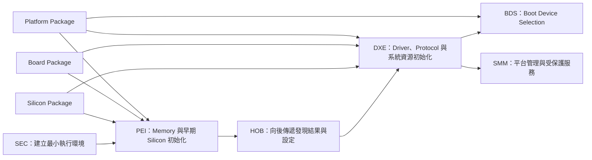
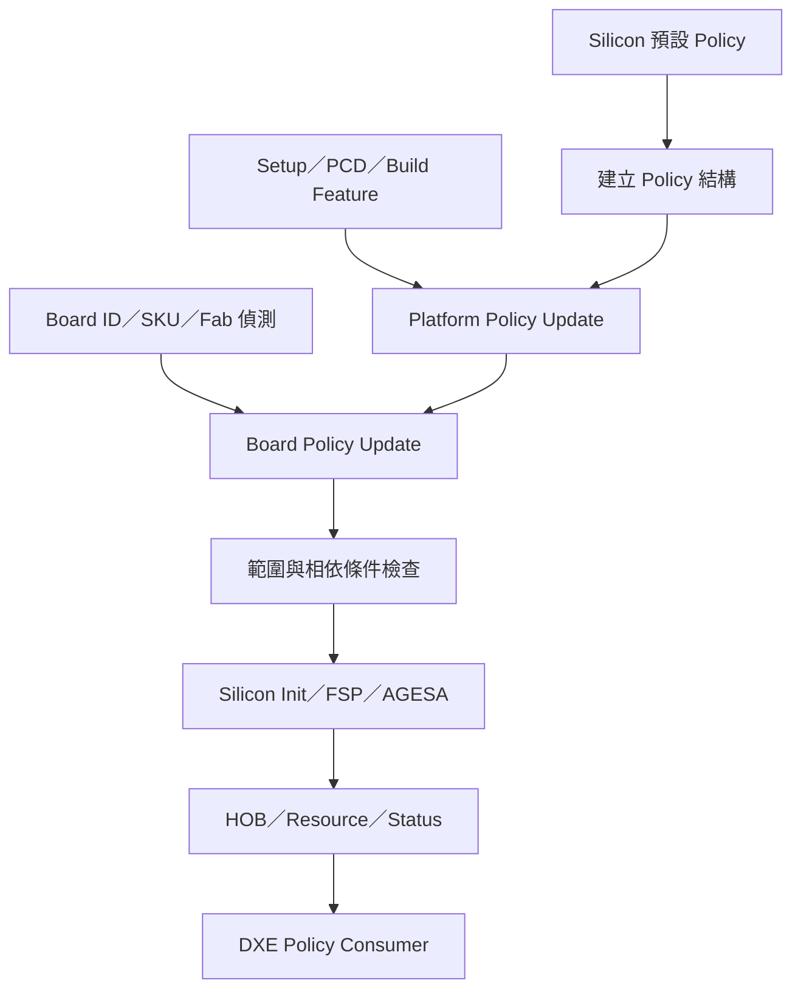
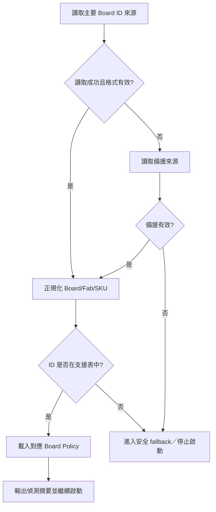

# 6. Platform、Silicon 與 Board Package 結構

狀態：Draft  
文件用途：說明 BIOS／UEFI 專案中 Platform、Silicon 與 Board Package 的責任邊界、相依關係、設定傳遞、平台差異管理，以及建置與驗證方式。本文以 EDK II／UEFI PI 架構為主要脈絡；實際 package 名稱、FSP／AGESA／Silicon Init 介面、PCD、GUID、Board ID、SKU 與建置命令，仍須依專案來源碼與供應商文件校正。

## 適用範圍

本章涵蓋下列內容：

- Platform、Silicon 與 Board Package 的分層目的與責任邊界。
- DSC、FDF、DEC、INF、Library Class、PCD、Protocol、PPI 與 HOB 在 package 整合中的角色。
- Silicon Policy 從預設值、平台修訂到矽晶片初始化模組取用的資料流。
- Board ID、Fab Revision、SKU、Silicon Stepping 與 Feature Strap 的辨識及設定選擇。
- 共用程式、SoC 差異、板級差異與產品差異的拆分方式。
- Vendor drop、submodule、patch queue、版本鎖定與升版驗證策略。
- FV、FD、PEI/DXE module、MAP、PCD database、flash region 等建置產物的歸屬驗證。
- Bring-up、回歸測試、常見問題與排查入口。

本章不深入說明下列主題：

- 單一硬體 IP 的 register programming 細節。
- 作業系統驅動程式與應用程式行為。
- Secure Boot、Measured Boot、Capsule Update 的完整設計。相關內容僅在 package 邊界、金鑰與更新相容性處說明。
- 特定供應商框架的全部欄位定義。專案若使用 Intel FSP、AMD AGESA 或其他 Silicon Init binary，應另附對應版本的整合文件。

## 適用讀者

- 負責 BIOS／UEFI、EDK II、Intel FSP、AMD AGESA、SoC 初始化或平台移植的人員。
- 負責新主機板 Bring-up、Board ID／SKU 管理、GPIO／PCIe／Memory／Power 設定整合的人員。
- 負責 Firmware CI、建置系統、版本整合、patch 維護及 BIOS 映像驗證的人員。
- 需要依模組歸屬分析 PEI、DXE、BDS、SMM 或 flash layout 問題的人員。

## 快速導覽

- [6.1 架構總覽](#61-架構總覽)：先理解三層 package 與 PI boot phase 的關係。
- [6.2 責任邊界](#62-platformsiliconboard-package-的責任邊界)：判斷設定與程式應放在哪一層。
- [6.3 Package 相依與 Override](#63-package-相依library-class-與-override-規則)：釐清 DEC、DSC、INF、Library Class 與 PCD。
- [6.4 Silicon Policy](#64-silicon-policy-的建立更新與下傳)：追蹤設定從預設值到 Silicon Init 的資料流。
- [6.5 Bring-up 流程](#65-新平台-bring-up-系統化流程)：按啟動階段驗證 Package、Policy 與硬體前置條件。
- [6.6 Board ID 與 SKU](#66-board-idsku-偵測及設定選擇)：建立可靠的板型辨識與 Red／Yellow fallback。
- [6.7 共用程式與差異碼](#67-共用程式與平台差異碼的拆分方式)：以資料化與穩定介面降低平台耦合。
- [6.8 版本與 Patch 管理](#68-版本整合patch-管理與升版策略)：管理 vendor drop、binary integrity 與升版風險。
- [6.9 建置產物驗證](#69-建置產物及模組歸屬驗證)：由 build output 反查模組、library 與 flash region。
- [6.10 常見問題](#610-常見問題與排查)：依發生階段選擇觀測點。
- [6.11 驗證清單](#611-驗證與測試清單)：確認 Cold Boot、Reset、SKU 與升版覆蓋範圍。

## 建議目錄地圖

以下為概念性目錄，實際名稱依專案調整：

```text
Firmware/
├── SiliconVendorPkg/               # SoC／CPU／PCH 共用初始化與 silicon library
│   ├── Include/
│   ├── Library/
│   ├── FspBin/ or AgesaModulePkg/
│   └── SiliconVendorPkg.dec
├── CompanySiliconPkg/              # 公司維護的 silicon wrapper、policy update
│   ├── Include/
│   ├── Library/
│   └── CompanySiliconPkg.dec
├── CompanyPlatformPkg/             # 產品線共用流程、DSC/FDF、平台 policy
│   ├── Include/
│   ├── Library/
│   ├── Pei/
│   ├── Dxe/
│   ├── Smm/
│   └── CompanyPlatformPkg.dec
├── BoardPkg/
│   ├── BoardA/
│   │   ├── Include/
│   │   ├── Library/
│   │   ├── BoardA.dsc
│   │   └── BoardA.fdf
│   └── BoardB/
└── Conf/
    ├── target.txt
    ├── tools_def.txt
    └── build_rule.txt
```

| 區域 | 主要內容 | 常見變更 | 不建議放置 |
|---|---|---|---|
| Silicon Package | CPU／SoC／PCH 共用初始化、silicon policy 結構、silicon library | 新 stepping、memory／PCIe policy 欄位、vendor 修正 | 特定主機板 GPIO 表、產品名稱、板級裝置表 |
| Platform Package | 產品線共用啟動流程、policy orchestrator、feature policy、DSC／FDF 共用片段 | 功能開關、共用模組、flash layout、共用 setup 行為 | 單一板卡才存在的 GPIO／SPD／clock 設定 |
| Board Package | Board ID、GPIO、SPD、I2C、PCIe slot、clock、retimer、板級差異 | 新 Fab、SKU、裝置人口配置、板級 table | 可跨多板共用的 silicon algorithm 或通用 driver |

## 6.1 架構總覽

Platform、Silicon 與 Board Package 的拆分目的，是讓矽晶片初始化、產品功能與實體主機板差異可以獨立演進。判斷歸屬時可先問三個問題：

1. 這項設定是否由 CPU／SoC／PCH 規格決定，且多數使用相同 silicon 的平台都需要？若是，優先歸入 Silicon 層。
2. 這項行為是否屬於產品線共用政策，例如啟用某項功能、選擇開機路徑或組合 DXE driver？若是，優先歸入 Platform 層。
3. 這項資料是否直接來自主機板 schematic、BOM、strap、GPIO、SPD、clock、retimer 或 slot wiring？若是，優先歸入 Board 層。

### 6.1.1 與 PI Boot Phase 的關係



- SEC 階段通常僅保留建立 temporary RAM、切換執行環境與進入 PEI 所需的最小程式。
- PEI 是 Board ID、memory topology、early GPIO、Silicon Policy 與 memory initialization 的主要整合點。
- DXE 依 HOB 與 policy 安裝 Protocol、建立 ACPI／SMBIOS table、初始化 PCI bus 與平台裝置。
- BDS 處理 boot option、boot order 與啟動裝置選擇。
- SMM 模組須另外檢查信任邊界、通訊 buffer 驗證與變數／flash 存取權限。

### 6.1.2 關鍵資料流



原則上應能回答：誰建立 policy、誰修改、修改順序、誰鎖定、誰使用，以及錯誤時如何回報。

## 6.2 Platform／Silicon／Board Package 的責任邊界

### 6.2.1 Silicon Package

Silicon Package 應保存與特定 CPU、SoC、PCH 或 silicon family 直接相關的內容：

- Silicon Policy 結構、預設值與欄位檢查。
- Memory controller、PCIe root port、USB、SATA、eSPI、IOMMU 等 IP 的初始化介面。
- Silicon stepping／SKU capability 查詢。
- 與 FSP、AGESA 或 vendor binary 的 wrapper 與 UPD／parameter translation。
- Silicon 相關 PPI、Protocol、HOB、GUID 與 library interface。
- 共用 register 定義及需由 firmware 控制的初始化序列。

Silicon Package 不應直接依賴某一塊板子的 Board ID 或 GPIO table。若 silicon 初始化需要板級資訊，應透過 policy、callback、PPI、Protocol 或明確的 board service interface 傳入。

### 6.2.2 Platform Package

Platform Package 負責把 silicon 能力、產品需求與 boot flow 組合成可建置的平台：

- DSC／FDF、Firmware Volume 組成與 module selection。
- Platform-wide feature policy，例如 debug、recovery、manufacturing、secure feature。
- Silicon Policy 的平台層更新順序。
- 跨多塊板共用的 PEIM、DXE driver、SMM driver 與 library instance。
- Setup variable 與 policy 的轉換。
- ACPI、SMBIOS、boot option、capsule、event log 等產品線共用流程。
- Board service 的介面定義與 board instance 選擇。

Platform Package 應避免以大量 `#if BOARD_A` 維護板差。板級差異宜由不同 library instance、table、PCD 或 Board Package 提供。

### 6.2.3 Board Package

Board Package 應對應 schematic、BOM 與板級組態：

- Board ID、Fab Revision、SKU、strap 與 EEPROM／FRU 讀取。
- GPIO pad、early GPIO、native function、interrupt routing。
- SPD 位址、memory topology、DIMM population 與 soldered-down memory 資料。
- PCIe slot／root port mapping、clock、PERST、WAKE、retimer、bifurcation。
- I2C／SMBus device、sensor、CPLD、EC、Super I/O 與板級裝置表。
- Board-specific ACPI／SMBIOS 補充資料。
- 板級 power sequence、reset sequence 與特殊 workaround。

### 6.2.4 邊界判斷表

| 需求 | 建議歸屬 | 判斷依據 |
|---|---|---|
| 新增 CPU stepping 判斷 | Silicon | 與 silicon revision／capability 直接相關 |
| 產品預設啟用 VT-d | Platform | 屬於產品政策，可能跨多塊板一致 |
| 某板 PCIe Port 3 接 x8 slot | Board | 由 schematic wiring 決定 |
| 共用 AC recovery policy | Platform | 屬於產品線行為 |
| GPIO pad table | Board | 由板級 pin mux 與電路決定 |
| FSP UPD 欄位轉換 | Silicon 或 Company Silicon wrapper | 與 vendor 初始化介面耦合 |
| Debug build 加入 Shell | Platform build profile | 屬於映像組成，不是板級硬體差異 |

## 6.3 Package 相依、Library Class 與 Override 規則

### 6.3.1 DEC、DSC、FDF、INF 的分工

| 檔案 | 主要用途 | 排查時關注 |
|---|---|---|
| DEC | 宣告 package 對外提供的 include、GUID、PPI、Protocol、PCD、Library Class | 名稱是否唯一、依賴 package 是否完整 |
| INF | 描述單一 module 的 source、package、library、PCD、depex 與 module type | module type、library class、entry point、depex |
| DSC | 選擇 platform build 組態、component、library instance、PCD 值與 SKU | library mapping、PCD override、component 是否進入 build |
| FDF | 定義 FD、FV、file placement、section、flash region 與 capsule 組成 | module 是否進 FV、region offset／size、對齊與空間 |

DSC 決定「建置哪些 module，以及使用哪個 library instance」；FDF 決定「將建好的內容放入哪個 FV／FD 區域」。某個 module 編譯成功但未出現在 BIOS image 時，應分別檢查 DSC component 與 FDF placement。

### 6.3.2 Library Class 與 Instance

Library Class 是介面契約，Library Instance 是實際內容。建議將通用呼叫端依賴 Library Class，由 DSC 依平台或 module type 選擇 instance。

```ini
# BoardPkg.dec
[LibraryClasses]
  BoardIdLib|Include/Library/BoardIdLib.h
  BoardInitLib|Include/Library/BoardInitLib.h
```

```ini
# Platform.dsc 概念片段
[LibraryClasses]
  BoardIdLib|BoardPkg/Library/BoardIdLib/BoardIdLib.inf

[LibraryClasses.PEIM]
  BoardInitLib|BoardPkg/Library/PeiBoardInitLib/PeiBoardInitLib.inf

[LibraryClasses.DXE_DRIVER]
  BoardInitLib|BoardPkg/Library/DxeBoardInitLib/DxeBoardInitLib.inf
```

設計時需確認：

- Library constructor 是否有隱含初始化順序。
- 同一 Library Class 在 PEI、DXE、SMM 是否需要不同 instance。
- Instance 是否反向依賴上層 package，造成循環相依。
- Library function 是否含不可見的全域狀態或硬體副作用。

### 6.3.3 Override 優先順序

專案應明確定義設定優先順序。例如：

```text
Silicon default
  < Platform default
  < Board/Fab/SKU override
  < Manufacturing override
  < Setup variable or authenticated policy
  < Runtime safety clamp
```

此順序不是所有專案的固定規則。若 Setup 不允許覆寫安全限制，應在最後套用 safety clamp，並記錄最終值與修訂來源。

### 6.3.4 PCD 使用原則

- FeatureFlag／FixedAtBuild：適合建置期固定功能，應避免拿來承載執行期偵測結果。
- PatchableInModule：適合受控的 binary patch 情境，需記錄 patch 方法與驗證方式。
- Dynamic／DynamicEx：適合跨模組共享且需在執行期更新的值；需注意設定時機與 token space。
- SKU-enabled PCD：適合 build-time SKU 組態，不應與執行期 Board ID 機制混為一談。

排查 PCD 時，不只查看 DSC 文字，也要確認最終 build report 或 PCD database 中的值。

> **執行期可觀測性：** 對 Dynamic／DynamicEx PCD，可在適當的 Debug Build 中使用 `PcdGet8()`、`PcdGet16()`、`PcdGet32()`、`PcdGet64()`、`PcdGetBool()` 或 `PcdGetPtr()` 讀取並輸出最終值。若平台已納入 `DumpPcd` 或同類 UEFI Shell 工具，也可用來比對執行期 PCD 與 BuildReport 中建置期／預設值的差異。輸出 pointer 類 PCD 時，仍需依資料結構解碼，並避免在 release log 洩漏敏感內容。

### 6.3.5 相依規則

建議相依方向如下：

```text
Board Package ─┐
               ├─> Company Platform Package ─> MdeModulePkg／通用基礎 package
Silicon Package┘
```

若 Platform Package 同時被 Board Package 與 Silicon Package 低層 library 反向引用，容易形成循環相依。可將共用介面抽到較低層的 `CommonPkg`，但 CommonPkg 僅應保存穩定介面與共用資料型別，不宜成為所有內容的集中區。

## 6.4 Silicon Policy 的建立、更新與下傳

### 6.4.1 Policy 生命週期

1. 建立 policy 結構並載入 silicon default。
2. 取得 silicon capability、stepping 與 fuse／strap 資訊。
3. 套用 platform-wide policy。
4. 辨識 Board ID、Fab Revision 與 SKU，套用 board table。
5. 套用 Setup、manufacturing 或 recovery 模式需求。
6. 執行欄位範圍、相依條件與互斥條件檢查。
7. 將 policy 交給 FSP／AGESA／Silicon Init consumer。
8. 將必要結果封裝至 HOB、PPI 或 Protocol，供後續 phase 使用。
9. 在 debug build 輸出安全的 policy 摘要與來源資訊。

### 6.4.2 Policy 欄位表範本

| 欄位 | 預設來源 | 可覆寫層級 | 生效階段 | 驗證方式 |
|---|---|---|---|---|
| Memory frequency | Silicon default | Platform／Board | Pre-memory PEI | MRC log、HOB、SMBIOS |
| PCIe bifurcation | Silicon default | Board／SKU | PEI／DXE | PCI enumeration、link width |
| USB port enable | Platform default | Board／Setup | PEI／DXE | controller register、OS enumeration |
| VT-d／IOMMU | Platform policy | Setup／safety policy | PEI／DXE | DMAR table、capability register |
| Debug interface | Build profile | Manufacturing policy | SEC／PEI | build report、serial log |

實際文件應補上結構名稱、欄位 full path、合法範圍、預設值、consumer 與對應規格版本。

### 6.4.3 Policy 更新介面

建議使用清楚分層的 update function：

```c
EFI_STATUS
UpdateSiliconPolicyByPlatform (
  IN OUT SILICON_POLICY *Policy
  );

EFI_STATUS
UpdateSiliconPolicyByBoard (
  IN     BOARD_ID        BoardId,
  IN     BOARD_REVISION  Fab,
  IN OUT SILICON_POLICY *Policy
  );

EFI_STATUS
ValidateSiliconPolicy (
  IN CONST SILICON_POLICY *Policy
  );
```

介面設計重點：

- 函式名稱需反映層級與時機。
- 修改者僅更動自己負責的欄位，避免整個結構覆寫。
- 所有索引、port number、GPIO number 與 table length 均需做範圍檢查。
- policy 結構若跨 binary boundary 傳遞，需管理 revision、size 與 backward compatibility。
- release log 不應輸出金鑰、密碼、敏感製造資料或可被濫用的 debug secret。

### 6.4.4 FSP／AGESA 類介面的轉換層

若專案使用 vendor initialization binary，建議將平台 policy 與 vendor parameter 分開，透過單一轉換層對應：

```text
Platform/Board Policy
        │
        ▼
Policy Translation Layer
        │  欄位映射、版本判斷、範圍限制
        ▼
FSP UPD／AGESA parameter／Vendor Silicon Init API
```

如此可降低 vendor drop 升版時，板級程式散布修改 vendor 結構欄位的範圍。

## 6.5 新平台 Bring-up 系統化流程

本流程將「能建置」「能進 SEC／PEI」「完成 memory init」「進入 DXE」「完成裝置初始化」「進入 OS」分開驗證，避免同時修改過多層級。

### 6.5.1 階段 0：固定基準

- 固定 edk2、silicon package、vendor binary、toolchain 與 microcode 版本。
- 保存參考板可開機的 image、build log、serial log 與 flash layout。
- 建立 Board ID、schematic revision、CPU／SoC stepping、DRAM 類型與 flash part 資訊。
- 準備 serial console、SPI programmer、POST code、JTAG／DCI 或平台可用的低階除錯工具。

### 6.5.2 階段 1：建立 Board Package 骨架

- 建立 DEC、DSC、FDF、Board library 與最小 module 清單。
- 先沿用最接近的參考板 silicon policy 與 flash layout。
- 確認 package dependency、Library Class 與 PCD 可解析。
- 產生 BIOS image，並確認 FV／FD 大小與 module list。

出口條件：可重現建置，最終 image 結構可被解析，且無未說明的 binary 差異。

### 6.5.3 階段 2：最小早期啟動

- 確認 reset vector、SEC entry、temporary RAM 與 serial debug。
- 建立 early POST code／checkpoint。
- 僅放入進入 PEI 所需的最小 PEIM，暫停非必要功能。
- 驗證 Board ID 的 pre-memory 來源是否可用。

出口條件：Cold Boot 可穩定到達 PEI，serial／POST code 可辨識停點。

### 6.5.4 階段 3：Memory Init

- 對齊 SPD、memory topology、routing、frequency、training policy。
- 驗證 policy translation 與 vendor memory init status。
- 區分固定失敗與 margin／temperature／不同 DIMM 才發生的失敗。
- 保存完整 memory training log 與關鍵 HOB。

出口條件：多次 AC Cycle 均能完成 permanent memory，容量與頻率符合預期。

### 6.5.5 階段 4：DXE 與基本裝置

建議依序導入：

1. PCI host bridge 與 root bridge。
2. SPI／variable／fault-tolerant write。
3. GPIO、I2C／SMBus、CPLD／EC。
4. USB、storage、network。
5. PCIe slot、retimer、bifurcation 與 hot-plug。
6. ACPI、SMBIOS、BDS 與 boot option。
7. SMM、power management、sleep／resume。

每次僅導入一組可觀測的功能，保留前一階段可用 image 作為對照。

### 6.5.6 階段 5：產品功能與安全設定

- 導入 Setup、Secure Boot、Measured Boot、capsule、recovery 與製造模式。
- 確認 debug interface 在 release profile 的狀態。
- 驗證 variable policy、flash write protection、SMM communication 與更新失敗復原。
- 對照 ACPI／SMBIOS／PCI／TCG 等外部介面輸出。

### 6.5.7 Bring-up 收斂順序

```text
可重現建置
  → SEC／serial／POST code
  → Board ID
  → Memory Init
  → DXE Core／PCI host bridge
  → SPI／Variable
  → 基本 I/O
  → PCIe／Storage／Network
  → ACPI／SMBIOS／BDS
  → SMM／Power State
  → Security／Update／Recovery
  → 全 SKU／Fab／Stepping 回歸
```

## 6.6 Board ID／SKU 偵測及設定選擇

### 6.6.1 常見偵測來源

- GPIO strap。
- CPLD／EC register。
- I2C EEPROM、FRU 或 manufacturing data。
- SMBIOS／firmware variable 中的受控製造資訊。
- SoC fuse 或 package／SKU capability。
- 建置期固定值，僅限單板、單映像且不可能混用的產品。

### 6.6.2 偵測時機

| 時機 | 可用資源 | 適用資料 | 風險 |
|---|---|---|---|
| Pre-memory PEI | temporary RAM、有限 GPIO／I2C | memory topology、early GPIO、必要 strap | driver 與 bus 尚未完整，錯誤處理能力有限 |
| Post-memory PEI | permanent memory、更多 PEIM | 完整 board table、SKU policy | 太晚才取得的資料不能影響 memory init |
| DXE | Protocol、完整 driver stack | ACPI／SMBIOS、非早期裝置差異 | 不可回頭修改已完成的 silicon init |

若某項設定會影響 memory initialization，就必須在 memory init 前可靠取得，不應依賴 DXE 才可用的服務。

### 6.6.3 Board ID 資料模型

```c
typedef struct {
  UINT16 BoardId;
  UINT8  FabId;      // PCB 的實體改版（Fab Revision），不同於 Silicon Stepping
  UINT8  SkuId;
  UINT8  BomId;
  UINT8  Reserved;
} PLATFORM_BOARD_INFO;
```

> **術語約定：** 本章統一使用 **Fab Revision** 表示 PCB／主機板的實體改版，欄位名稱可使用 `FabId`；Silicon 的修訂版本則使用 **Silicon Stepping**。兩者不可共用同一欄位或簡稱為未限定對象的 `Revision`。

建議同時保留：

- Raw value：硬體讀回的原始資料。
- Normalized value：經過 mask、版本轉換後的統一表示。
- Detection status：成功、CRC 錯誤、bus timeout、未知 ID、使用 fallback。
- Source：GPIO、CPLD、EEPROM 或 build default。

### 6.6.4 選擇流程



安全 fallback 需依風險分級，不應將所有未知 Board ID 都視為相同情境：

- **Red，停止啟動：** 若 Board ID 會影響 Memory Init、Voltage Regulator、power sequence、GPIO electrical setting、flash layout、PCIe lane wiring 或其他可能造成硬體損壞／資料毀損的設定，未知或讀取失敗時必須停機。系統應留下可辨識的 POST code、serial log 或 recovery indication。
- **Yellow，受限降級：** 若差異僅涉及 console output、非必要 USB port、LED 或可安全停用的周邊，可套用「最保守的通用 Policy」繼續啟動。所有高風險功能維持關閉，並在 log 明確輸出 `WARNING: UNKNOWN BOARD ID, USING SAFE FALLBACK`。
- **Green，正常匹配：** Board ID、Fab Revision、SKU 與資料完整性均通過檢查，才載入完整 Board Policy。

Red／Yellow 的分類應由 BIOS、硬體與安全負責人事先審查，並以 table 或 policy 固定，不應在錯誤處理路徑中臨時猜測最接近的板型。

### 6.6.5 Board table 管理

```c
typedef struct {
  UINT16                BoardId;
  UINT8                 MinFab;
  UINT8                 MaxFab;
  CONST GPIO_INIT_TABLE *GpioTable;
  UINTN                 GpioTableCount;
  CONST PCIE_PORT_MAP   *PcieMap;
  UINTN                 PcieMapCount;
} BOARD_CONFIG_ENTRY;
```

建議：

- 對 table count 與索引做靜態及執行期檢查。
- Fab range 不可重疊；若允許重疊，需明定匹配優先權。
- 未支援 ID 應有明確 log 與 POST code。
- 板型表應可由 unit test 或 host-side parser 驗證重複 ID、空指標與範圍錯誤。

## 6.7 共用程式與平台差異碼的拆分方式

### 6.7.1 建議拆分原則

- Algorithm 與 data 分離：共用流程放 library，板差放 table。
- Interface 與 instance 分離：呼叫端只依賴 Library Class，由 DSC 選 instance。
- Build-time 與 runtime 差異分離：能在執行期依 Board ID 選 table 的內容，不必為每個 SKU 複製整包 image。
- Hardware fact 與 product policy 分離：slot wiring 屬於 Board，是否啟用裝置屬於 Platform／Setup policy。
- Vendor interface 與公司 policy 分離：透過 translation layer 限縮 vendor 結構散布範圍。

### 6.7.2 常見做法比較

> **黃金法則（Golden Rule）：差異應該被「資料化（Datafy）」，而不是被「程式化（Codify）」。** 能用 Table 表示的差異，就不要用 `if-else`；能用 `if-else` 表示的差異，就不要用 `#ifdef`；能用 `#ifdef` 表示的差異，也應先評估是否真的需要複製整個 Package。這項原則的目的不是排除所有條件分支，而是讓板級差異維持可列舉、可檢查、可測試與可追蹤。

| 做法 | 適用情境 | 優點 | 風險 |
|---|---|---|---|
| 不同 Library Instance | 同一介面、不同 phase 或平台內容 | 邊界清楚、DSC 可選擇 | instance 太多時需維護 mapping |
| 資料表加 Board ID 索引 | 流程相同、資料不同 | 減少重複程式 | table schema 需穩定並檢查範圍 |
| Dynamic PCD | 少量跨模組執行期值 | 取用方便 | 設定時機不清時易讀到預設值 |
| Build flag／FeatureFlag PCD | 映像組成或固定產品功能 | 可裁切 binary | SKU 數量多時 build matrix 膨脹 |
| `#ifdef` | 極少量、無法抽象的編譯差異 | 快速 | 長期容易形成不可組合的條件網路 |
| 複製 package | 架構完全不同且無共同維護需求 | 初期隔離清楚 | 修正難同步、差異持續擴大 |

### 6.7.3 反模式與程式碼腐壞氣味（Anti-patterns and Code Smells）

- **全域變數耦合（Global Variable Coupling）：** Board Package 直接修改 Silicon Package 的全域變數。  
  症狀：資料流無法追蹤；Silicon 模組調整初始化順序後，特定 Board 的行為可能跟著改變。
- **各自解讀（Decentralized Decoding）：** 多個 module 分別讀取 Board ID，並各自定義 mask、轉換與 fallback。  
  症狀：同一張板子可能在 PEI 與 DXE 被辨識為不同 ID，錯誤處理也不一致。
- **多重覆寫（Policy Pinball）：** 同一 policy 欄位在多個 phase 或 library 中反覆改寫，卻沒有 owner、順序與最後值紀錄。  
  症狀：來源碼中看到的設定值與 Silicon Init 實際收到的值不同。
- **字串驅動分支（String-driven Branching）：** 使用 board name 字串作為核心判斷，缺少穩定的 enum／ID／schema。  
  症狀：大小寫、名稱改動或別名導致不易察覺的分支錯誤。
- **萬用 Hook（God Hook Library）：** 將 GPIO、Policy、ACPI、Setup、Board ID 等差異集中到單一大型 `PlatformHookLib`。  
  症狀：任何平台改動都需要修改同一 library，責任邊界與回歸範圍持續擴大。
- **為建置而替換（Build-to-pass Substitution）：** 為了消除 linker／Library Class 錯誤，在 DSC 任意更換 library instance，未確認 module type、phase 與依賴語意。  
  症狀：建置可通過，但 constructor、PPI／Protocol 或硬體存取發生在錯誤階段。
- **複製式分支（Package Fork by Copy）：** 只為少量板差就複製整個 Board／Platform Package。  
  症狀：同一修正需套用多份，版本差異逐步失控，安全修正也可能漏接。

## 6.8 版本整合、Patch 管理與升版策略

### 6.8.1 需要鎖定的版本

- edk2／edk2-platforms commit 或 tag。
- Silicon vendor package、FSP／AGESA／binary blob 版本。
- BaseTools、compiler、IASL、NASM／ASL toolchain 版本。
- Microcode、GOP、network／storage option ROM 版本。
- Signing tool、key manifest／policy format 版本。
- Board Package 與 Platform Package 的相容版本。

建議在 release manifest 中記錄每個來源的 repository、commit、tag、binary hash、license 與 owner。

> **Binary Integrity 驗證：** 對預編譯的 FSP／AGESA binary、GOP、Option ROM、microcode 或其他 binary blob，除了版本號，也應記錄 **SHA-256 hash**。CI 可執行 `CompareBinaries.py` 或功能相同的內部腳本，比對核准清單、檔案大小、SHA-256 與預期路徑；只要 binary 被替換、重打包或來源不明，即應中止 release build 並要求重新審查。比較工具的輸出也應保留在 build artifact，避免僅依檔名或內嵌版本字串判斷。

### 6.8.2 Patch 分類

| 類型 | 建議位置 | 升版處理 |
|---|---|---|
| Upstream bug fix | 獨立 commit，保留 upstream link | 升版先確認是否已納入 upstream |
| Vendor errata／workaround | Company Silicon wrapper 或 vendor patch queue | 對照新 silicon release note |
| Board 差異 | Board Package | 依 schematic／Fab 回歸 |
| Product policy | Platform Package | 依產品需求與 Setup 行為回歸 |
| 暫時 debug patch | 開發 branch 或 debug profile | release 前移除並由 CI 檢查 |
| Security correction | 最小可審查 patch，保留 advisory／風險說明 | 安全測試與 affected version 追蹤 |

### 6.8.3 升版步驟

1. 保存升版前可重現的 baseline：source revision、toolchain、BIOS image hash、build report 與測試結果。
2. 閱讀 release note、breaking change、PCD／API／structure revision 變更。
3. 僅更新一個主要變因，例如先更新 edk2，再更新 silicon binary。
4. 解決 build break，記錄 API／Library Class／PCD／FDF 變更。
5. 比較 build report、module list、FV size、flash layout 與 binary hash 差異。
6. 執行最小開機測試，再擴展到 memory、PCIe、USB、storage、network、S3／S4／S5、warm reset、capsule 等測項。
7. 對所有 Board ID、Fab、SKU 與 silicon stepping 執行相容性矩陣。
8. 更新 manifest、SBOM／license 資料與 release note。

### 6.8.4 Patch 提交資訊

每個 patch 建議包含：

- 問題現象與發生 phase。
- 適用 board、SKU、Fab、stepping 與版本。
- 修改原因與影響欄位／module。
- 測試環境與 Pass／Fail 判定依據。
- 是否預計送 upstream，以及移除條件。
- 對安全、效能、boot time、flash size 與相容性的影響。

## 6.9 建置產物及模組歸屬驗證

### 6.9.1 常見建置方式

```bash
# 初始化 EDK II 建置環境
source edksetup.sh

# 依專案 DSC 建置
build -a X64 -t GCC5 -b DEBUG -p BoardPkg/BoardA/BoardA.dsc

# 產生較完整的 build report
build -a X64 -t GCC5 -b DEBUG \
  -p BoardPkg/BoardA/BoardA.dsc \
  -y Build/BoardA/DEBUG_GCC5/BuildReport.txt
```

實際 architecture、toolchain tag、build target 與 DSC 路徑需依專案調整。

### 6.9.2 主要輸出

| 產物 | 用途 | 驗證重點 |
|---|---|---|
| FD／ROM／BIN | 最終 BIOS 映像 | 大小、hash、region offset、signing 狀態 |
| FV | PEI／DXE／SMM 等 Firmware Volume | module 是否存在、空間是否足夠 |
| FFS／PE32／TE | 個別 firmware file／section | GUID、module type、壓縮與 section 結構 |
| MAP | 位址與 symbol mapping | module base、symbol、size |
| Build report | module、library、PCD、depex、flash 資訊 | instance、PCD 最終值、FV placement |
| AutoGen／Makefile | EDK II 展開後的建置資訊 | 巨集、include、library resolution |
| AsBuilt INF | module 實際使用的 package、library、PCD | 與設計預期是否一致 |

### 6.9.3 驗證模組是否被建入

排查順序：

1. 在 DSC 的 `[Components]` 確認 module 被選入。
2. 確認 module INF 的 architecture、module type 與 dependency 可建置。
3. 在 build report 確認使用的 library instance 與 PCD 最終值。
4. 在 FDF 確認 module 被放入預期 FV。
5. 使用 UEFITool、GenFv／GenFw 或專案核准工具確認最終 image 內的 FFS GUID。
6. 於實機 log 確認 module entry point 或功能性 side effect。

### 6.9.4 Library Instance 反查

若行為與來源碼預期不同，優先確認實際連結的 library instance，而非只看同名 Library Class：

```bash
# 依實際 Build 路徑調整
find Build -name '*.map' -o -name 'BuildReport.txt'
grep -R "BoardInitLib" Build/BoardA/DEBUG_GCC5 | head
```

同一 Library Class 可能在全域、module override、architecture section 或 module-type section 被不同 instance 覆寫。

### 6.9.5 Flash Layout 驗證

- FD region 的 offset、size、alignment 不得重疊。
- FV growth 需保留合理餘量，避免 minor change 即超出 region。
- Variable、FTW working、FTW spare、recovery 與 capsule staging region 需符合更新策略。
- Descriptor、ME／PSP、EC、GbE 等非 BIOS region 若存在，需確認映像合成工具不會誤寫。
- Signed region 的邊界與 hash coverage 需與 signing policy 一致。

## 6.10 常見問題與排查

### 6.10.1 建置與相依問題

| 現象 | 建議排查方向 | 主要觀測點 |
|---|---|---|
| Library Class instance 找不到 | DSC mapping、INF LibraryClasses、DEC 宣告、architecture section | build error、BuildReport |
| Module 有編譯但 image 找不到 | DSC 有 component，但 FDF 未放入 FV | BuildReport、FDF、UEFITool |
| PCD 值不是預期 | override section、SKU、Dynamic PCD 設定時機 | BuildReport、PCD database、debug log |
| Package dependency 循環 | Board／Platform／Silicon 反向引用 | INF Packages、library dependency |
| FV size 超出 | 新增 module、debug symbol、壓縮率或 alignment 改變 | FDF、FV report、module size |
| 不同主機建置結果不同 | toolchain、BaseTools、環境變數或未固定 binary | manifest、compiler version、image hash |

### 6.10.2 Board ID 與設定選擇問題

| 現象 | 建議排查方向 | 驗證方式 |
|---|---|---|
| 偶發辨識成錯誤板型 | GPIO pull、I2C readiness、讀取時機、debounce／重試 | raw value、讀取 status、示波器／register |
| 新 Fab 套到舊 table | Fab range 重疊、default branch 過寬 | table unit test、完整 ID log |
| Cold Boot 失敗但 Warm Reset 正常 | pre-memory bus／power sequencing 尚未穩定 | AC Cycle trace、early checkpoint |
| 未知 Board ID 仍繼續開機 | fallback 規則過寬 | unsupported ID 測試、POST code |

### 6.10.3 Silicon Policy 問題

| 現象 | 建議排查方向 | 驗證方式 |
|---|---|---|
| 設定值已修改但硬體無變化 | 修改發生在 consumer 之後、改錯 structure instance | policy dump、call order、pointer identity |
| 某 SKU 才失敗 | capability 與 board override 不一致 | silicon capability、SKU matrix |
| 升版後欄位偏移或預設值改變 | structure revision／size、vendor default 變更 | header diff、UPD／parameter dump |
| PCIe lane／port 對應錯誤 | Board table、bifurcation、clock／reset mapping | PCI config、link status、schematic |

### 6.10.4 開機階段判讀

| 停止階段 | 首要資料 | 常見方向 |
|---|---|---|
| Reset／SEC 前 | SPI image、reset vector、strap、flash mapping | image 未寫入正確 region、簽章或向量錯誤 |
| SEC | serial／POST code、temporary RAM | CAR／temporary RAM、microcode、CPU mode |
| Pre-memory PEI | PEIM dispatch、Board ID、early policy | GPIO／I2C、policy、memory 前置條件 |
| Memory Init | vendor status、training log、SPD | topology、SPD、frequency、power／timing |
| Post-memory PEI | HOB、resource、firmware volume discovery | HOB 不完整、FV 找不到、resource conflict |
| DXE | dispatcher、Protocol、depex、PCI enumeration | depex、driver binding、resource allocation |
| BDS | boot option、device path、file system | boot order、storage driver、簽章／映像 |
| SMM／Runtime | SMI source、communication buffer、variable | pointer validation、lock timing、runtime mapping |

### 6.10.5 通用排查流程

1. 固定失敗 image、source revision、硬體與重現步驟。
2. 確認問題第一次出現在哪個 boot phase 與 checkpoint。
3. 收集 serial、POST code、build report、policy dump、Board ID raw value。
4. 以最近可用版本做二分或單一變因比較。
5. 先驗證設定是否到達預期 consumer，再檢查硬體結果。
6. 若使用 fallback 或暫時規避，記錄適用範圍、風險與移除條件。
7. 修正後執行受影響 Board／SKU／Fab／stepping 與 reset type 的回歸。

## 6.11 驗證與測試清單

### 6.11.1 建置與靜態檢查

- [ ] 所有 repository、binary、toolchain 與 BaseTools 版本已鎖定。
- [ ] DEC／DSC／FDF／INF 可解析，無未說明的 warning。
- [ ] BuildReport 中 library instance、PCD 與 module list 符合預期。
- [ ] 最終 FD／FV 大小、offset、alignment 與空間餘量符合 flash layout。
- [ ] Debug／Release／Manufacturing profile 的 module 與功能差異已審查。
- [ ] 未知 Board ID、重複 Board ID、Fab range 重疊與 table count 已由工具檢查。
- [ ] release image 不含非預期 shell、debug agent、test key 或敏感 log。

### 6.11.2 啟動與重置

- [ ] Cold Boot。
- [ ] Warm Reset。
- [ ] Global Reset／Platform Reset。
- [ ] AC Cycle，包含快速斷電重上電與規格要求的最小斷電時間。
- [ ] Watchdog reset。
- [ ] Recovery boot。
- [ ] 更新成功後第一次啟動。
- [ ] 更新中斷電與復原。
- [ ] 允許降版時的降版測試；禁止降版時的拒絕行為。

### 6.11.3 硬體矩陣

- [ ] 每個 Board ID。
- [ ] 每個 Fab Revision。
- [ ] 每個產品 SKU／BOM。
- [ ] 支援的 CPU／SoC／PCH stepping。
- [ ] 支援的 memory population／DIMM vendor。
- [ ] PCIe card、storage、USB、network 與 retimer 組合。
- [ ] 高低溫、低電壓或 margin 測試，依產品規格執行。

### 6.11.4 功能與介面

- [ ] Memory 容量、頻率、ECC 與 training 結果。
- [ ] PCIe topology、link width／speed、AER 與 hot-plug。
- [ ] USB、SATA／NVMe、network、I2C／SMBus 與板級裝置。
- [ ] ACPI table、SMBIOS type、UEFI variable 與 boot option。
- [ ] S3／S4／S5、Modern Standby 或平台支援的 power state。
- [ ] Secure Boot、Measured Boot、TPM event log 與 firmware update。
- [ ] 作業系統安裝、啟動、重新啟動與關機。

### 6.11.5 Pass／Fail 證據

每個測項至少記錄：

- BIOS image version 與 hash。
- Board ID、Fab、SKU、silicon stepping。
- 測試工具與版本。
- reset／boot 類型與執行次數。
- 關鍵 log、register、table、Protocol／HOB 或 OS 枚舉結果。
- 預期結果、實際結果與判定。

## 6.12 安全性與相容性注意事項

### 6.12.1 信任邊界

- Board ID 或 manufacturing data 若可被外部匯流排修改，不應未驗證即決定安全政策。
- SMM、runtime service 與 capsule handler 必須驗證輸入 buffer、size、pointer range 與授權狀態。
- Setup variable 若會影響安全功能，需定義存取權限、authenticated variable 或 physical presence 條件。
- Test key、debug unlock、manufacturing override 必須與 production profile 分離。
- Policy dump 與 serial log 不應輸出 private key、password、secret、完整敏感 provisioning data。

### 6.12.2 版本相容性

- Policy structure 應有 revision／size，consumer 不應假設所有版本欄位都存在。
- 升級 Silicon Init binary 時需同步 header、wrapper 與 policy translation。
- ACPI、SMBIOS、UEFI、PI、TCG 與 PCIe 規格版本應在 release manifest 中記錄。
- 新版 BIOS 必須考慮舊 variable store、舊 capsule metadata 與舊 boot option 的相容性。
- 降版可能遇到 variable schema、firmware rollback protection 或 flash layout 不相容，需事先定義支援政策。

### 6.12.3 更新與失敗復原

- 更新前驗證 image 格式、平台 ID、版本政策、簽章與 region 邊界。
- 更新期間避免破壞 recovery path、FTW region 或 active boot block。
- 斷電後應能辨識更新狀態並進入可驗證的復原流程。
- A／B bank 或 recovery image 的版本與相容條件需明確。
- 更新完成後應核對 image version、hash、variable migration 與第一次啟動狀態。

## 6.13 提交前檢查清單

- [ ] 變更已歸入正確的 Platform、Silicon 或 Board 層。
- [ ] 沒有新增不必要的反向依賴或循環相依。
- [ ] Library Class、instance 與 module type 選擇符合預期。
- [ ] Policy 修改順序、最後值與 consumer 已可追蹤。
- [ ] Board ID／SKU／Fab 未知值與錯誤讀取有明確處理。
- [ ] PCD、table、GUID、Protocol／PPI／HOB 的命名與版本一致。
- [ ] DSC、FDF、INF、DEC、build report 與最終 image 已交叉驗證。
- [ ] Debug 與 release profile 均完成必要建置。
- [ ] Cold Boot、Warm Reset、AC Cycle 與更新前後已覆蓋。
- [ ] 受影響的 Board、Fab Revision、SKU 與 stepping 已完成回歸。
- [ ] patch 已記錄問題、原因、影響範圍、測試與移除條件。
- [ ] 安全、flash size、boot time、相容性與回復能力已評估。

## 6.14 本章重點

本章可收斂為三個關鍵問題：

1. **誰擁有它？（歸屬）**  
   這個設定或程式，是 Silicon 的規格、Platform 的政策，還是 Board 的接線／BOM？內容應放入對應 Package，並維持單向且可說明的相依關係。
2. **誰改變它？（流程）**  
   Policy 從 Silicon default、Platform、Board、Manufacturing 到 Setup／安全限制的修改順序是否清楚？每次修改是否有 owner，最終值是否能由 BuildReport、policy dump 或硬體狀態觀測？
3. **誰驗證它？（測試）**  
   當 Board ID、Fab Revision、SKU、Silicon Stepping、vendor binary 或 toolchain 改變時，CI 與實機測試是否能涵蓋對應組合，並留下可判定 Pass／Fail 的證據？

若這三個問題都能由文件、來源碼與測試紀錄回答，Package 分層才不只是目錄分類，而是可長期維護的韌體架構。
## 6.15 參考資料

- UEFI Specification。
- UEFI Platform Initialization Specification。
- EDK II Build Specification、INF／DEC／DSC／FDF File Format Specification。
- EDK II 原始碼與 edk2-platforms 參考平台。
- 平台採用的 Intel FSP、AMD AGESA 或其他 Silicon Init Integration Guide。
- ACPI Specification、SMBIOS Specification、TCG PC Client Platform Firmware Profile。
- PCI Express Base Specification 與相關 ECN。
- CPU／SoC／PCH datasheet、BIOS Writer's Guide、errata、schematic 與 board design guide。
- 專案內部架構文件、release manifest、issue、patch review 與測試報告。

> 文件維護提醒：正式發佈前，請將本文中的概念名稱替換為專案實際 package、DSC／FDF、policy structure、PCD token、GUID、Board ID 與建置命令，並由 BIOS、硬體、驗證及安全負責人共同審查。
