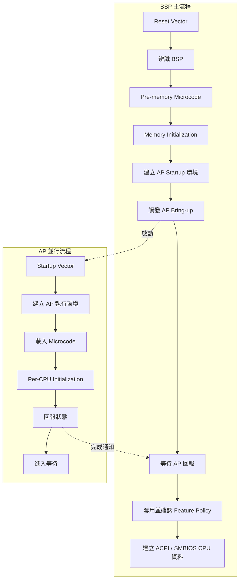

# 7. CPU 初始化與微碼更新

狀態：Draft  
文件用途：本章以 BMC 第七章的章節編排方式作為寫作架構參考，但內容僅聚焦 BIOS 的 CPU 初始化與微碼更新，不沿用 BMC／Yocto／BitBake／DTS 等技術內容。CPU 型號、Silicon Package、PCD、MSR、暫存器、微碼版本及平台流程仍須由章節負責人依專案補充與驗證。

## 適用範圍

本章說明 BIOS 在系統重置後，如何建立 CPU 基本執行環境、辨識處理器能力、載入微碼、啟動其他邏輯處理器，並完成快取、記憶體屬性、功耗、虛擬化與安全功能初始化。

涵蓋項目：

- Reset 後 CPU 初始狀態與執行起點
- BSP 與 AP 的角色及初始化順序
- Microcode Patch 的來源、選擇、載入與驗證
- CPUID、CPU Feature Detect 與平台 Policy
- MTRR、PAT、Cache 與記憶體屬性
- AP Bring-up、CPU Topology 與 MP Services
- 功耗、虛擬化及處理器安全功能
- 初始化失敗時的錯誤處理、降級與排查

不涵蓋項目：

- DRAM Training 的詳細演算法
- PCIe、PCH 或周邊裝置初始化細節
- 作業系統 CPU Scheduler 與 Runtime 微碼更新
- CPU 供應商未公開的內部初始化流程
- Secure Boot 金鑰管理的完整設計

## 適用讀者

- BIOS、UEFI、EDK II 與平台韌體開發人員
- CPU、Silicon、Board Bring-up 人員
- 微碼版本管理與韌體更新負責人
- Cold Boot、Warm Reset、Resume 與 Recovery 驗證人員
- 排查 CPU Hang、AP 啟動失敗、功能缺失或效能異常的人員

## 7.1 Reset 後 CPU 狀態與 BSP／AP

### 7.1.1 Reset 後的執行起點

系統在 Power-on Reset、Cold Reset 或 Warm Reset 後，CPU 進入架構定義的初始狀態，並由 Reset Vector 開始執行平台韌體。BIOS 在早期階段通常需要：

1. 建立最小可執行環境。
2. 確認目前執行緒是否為 BSP。
3. 建立暫時堆疊或暫時記憶體。
4. 初始化必要的 CPU 控制狀態。
5. 載入適用的微碼。
6. 進入 Silicon 與記憶體初始化。
7. 在永久記憶體可用後遷移堆疊與必要資料。
8. 啟動 AP 並建立 Processor Topology。
9. 將 CPU 能力與啟用狀態提供給 DXE、ACPI、SMBIOS 與作業系統。

### 7.1.2 BSP 與 AP

BSP 負責主要 BIOS 流程、CPU Policy 建立、AP 啟動與 Topology 收集。AP 則進入指定的 Startup Vector，建立個別執行環境、載入微碼、執行 Per-CPU 初始化並回報狀態。

BSP 與 AP 最終應具備一致的微碼版本、MTRR／PAT 設定與 CPU Feature Policy。若不同 Processor 狀態不一致，作業系統可能觀察到不一致的 CPUID、功能位元或執行行為。

### 7.1.3 初始化階段

CPU 初始化同時包含 BSP 主流程與 AP 並行流程。AP 通常在永久記憶體及 Startup Exchange Data 準備完成後，由 BSP 觸發進入 Startup Vector；BSP 則等待 AP 完成 Per-CPU 初始化，再繼續套用或確認系統層級 Policy。



實際工作分界可能由 SEC、PEI、Silicon Package、CPU PEIM 或平台專屬模組共同完成。文件應標示各步驟的 BIOS Phase、負責模組、輸入資料、成功條件及失敗處理。

### 7.1.4 Reset Path 覆蓋

應分別確認 Cold Boot、Warm Reset、Global Reset、AC Cycle、Watchdog Reset、S3 Resume 與 Recovery Boot。各路徑需確認微碼是否重新載入、MSR 是否恢復、AP 是否重新啟動，以及保留狀態是否符合平台需求。

## 7.2 Microcode Patch 格式、選擇與載入時機

### 7.2.1 Microcode 的角色

Microcode Update 是 CPU 供應商提供的處理器修正資料，通常用於特定 Family、Model、Stepping 或 Platform 組合。BIOS 應負責將核准的 Patch 納入 Firmware Image、選擇相符版本、驗證結構與完整性、套用至 BSP 與 AP，並讀回實際版本。

### 7.2.2 Patch 欄位與檢查

| 欄位 | 用途 | BIOS 檢查重點 |
|---|---|---|
| Header Version | Patch Header 格式 | 是否為支援格式 |
| Update Revision | 微碼版本 | 是否符合更新政策 |
| Processor Signature | CPU 識別條件 | 是否與目前 CPU 相符 |
| Platform ID／Flags | 平台條件 | 是否符合目前平台 |
| Data／Total Size | Patch 大小 | 是否超出映像邊界 |
| Integrity Data | 完整性驗證 | 是否通過供應商規範 |

實際欄位名稱、偏移、載入方式與驗證演算法應引用 CPU 供應商文件，不應由平台自行推測。

### 7.2.2.1 微碼載入介面

微碼載入通常透過 CPU 供應商指定的 Model-Specific Register（MSR）或等效介面完成。以常見 x86 平台為例，流程可能包含取得 Patch 實體位址、依供應商規定準備資料、透過 `WRMSR` 觸發載入，再以微碼簽章或版本暫存器讀回確認結果。

- Intel 平台常見介面包含 `IA32_BIOS_UPDT_TRIG` 與 `IA32_BIOS_SIGN_ID`。
- AMD 平台常見介面包含供應商定義的 Patch Loader MSR。
- 實際 MSR 編號、Patch 位址格式、序列化要求、前置指令與讀回方式，必須以目標 CPU Family／Model／Stepping 的正式文件為準。
- 傳入 CPU 的通常是供應商規定之 Patch Data 位址，不一定是整個檔案 Header 的起始位址。
- Patch Buffer 應位於 CPU 可正確存取的實體記憶體，並符合對齊、位址寬度、Cacheability 與生命週期要求。

載入程序不應僅以 `WRMSR` 未產生例外作為成功依據，仍需讀回 Revision，並比對預期版本與每個 Processor 的結果。

### 7.2.3 Patch 選擇流程

1. 取得 CPU Signature。
2. 取得 Platform ID 或等效資訊。
3. 讀取目前微碼版本。
4. 掃描 BIOS 中的 Microcode Patch。
5. 驗證 Patch 結構與邊界。
6. 篩選符合 Signature 與 Platform ID 的 Patch。
7. 依更新政策選擇版本。
8. 套用 Patch。
9. 讀回版本並確認結果。
10. 對所有已啟用 Processor 執行一致性檢查。

### 7.2.4 載入時機

| 時機 | 對象 | 目的 |
|---|---|---|
| SEC／Early PEI | BSP | 在 Silicon／Memory 初始化前套用必要修正 |
| Post-memory PEI | BSP／AP | 完成所有 Processor 更新與一致性檢查 |
| AP Bring-up | 每個 AP | 確保新啟動 AP 使用正確版本 |
| Resume Path | BSP／AP | 依平台狀態保存特性重新確認或載入 |
| Recovery Boot | BSP／AP | 確保 Recovery Firmware 支援目前 CPU |

### 7.2.5 Build 與版本控管

Release Build 應輸出 Microcode Manifest，至少包含 CPU Signature、Platform ID、Revision、檔案雜湊值、來源套件、核准紀錄與 BIOS Build Version。測試版與量產版 Patch 應明確隔離，Recovery Image 也需納入相容性檢查。

## 7.3 CPUID、Feature Detect 與 Policy

### 7.3.1 Capability、Policy 與 Effective State

CPU 功能應區分為：

- Capability：CPU 硬體宣告支援的功能。
- Policy：Setup、PCD、SKU 或安全政策要求的狀態。
- Effective State：初始化完成後實際生效的狀態。

```text
Effective Feature
    = CPU Capability
    AND Platform Support
    AND Firmware Policy
    AND Dependency Satisfied
```

### 7.3.2 Policy 來源

Policy 可能來自 BIOS Setup Variable、PCD、Board ID、SKU、CPU Stepping、Manufacturing Mode、Debug／Release Build、安全政策、Silicon Package 預設值及 Recovery Mode。文件應標明優先順序與覆寫規則。

### 7.3.3 Feature 相依關係

每項功能應確認 CPU Capability、最低微碼版本、平台硬體支援、相依功能、互斥設定、ACPI／SMBIOS 輸出與 OS 可見狀態。CPUID Leaf／Sub-leaf 與 MSR 定義可能因供應商與 CPU 世代而異，下表僅作為常見 x86 查詢入口，實際專案應依目標處理器文件複核。

| 功能 | Capability 來源 | 常見查詢方式 | Policy 來源 | 相依條件 | 驗證方式 |
|---|---|---|---|---|---|
| SMT／HT | CPUID Topology | `CPUID.1:EDX[28]` 及 Topology Leaf | Setup／SKU | Core／Thread Topology | CPU 數量、MADT／PPTT |
| Intel VMX | CPUID | `CPUID.1:ECX[5]` | Setup／Security | VMX Control、平台 Policy | CPUID、MSR、Hypervisor |
| AMD SVM | Extended CPUID | `CPUID.80000001H:ECX[2]` | Setup／Security | SVM Control、平台 Policy | CPUID、MSR、Hypervisor |
| Execute Disable／NX | Extended CPUID | `CPUID.80000001H:EDX[20]` | Security Policy | 頁表 NX 支援 | CPUID、頁表、OS |
| Turbo／Boost | Vendor-specific | CPUID／MSR，依 CPU 文件 | Power Policy | 功耗與散熱 | MSR、負載與頻率量測 |
| C-State | CPUID／Silicon | CPUID／MSR／ACPI，依平台文件 | Power Policy | ACPI 與硬體支援 | ACPI、Residency、功耗量測 |

注意：SMT／HT 的能力位通常只表示處理器具備多邏輯處理器能力，不能單獨推導完整 Core／Thread Topology；Topology 應優先使用該 CPU 支援的拓樸 Leaf 與平台輸出資料。

## 7.4 MTRR、PAT、Cache 與記憶體屬性

BIOS 應依實體 Memory Map，對 DRAM、MMIO、Frame Buffer、Firmware 與保留區域建立正確的 Cacheability。設定錯誤可能造成效能下降、MMIO 行為異常、Machine Check、開機 Hang 或 BSP／AP 狀態不一致。

### 7.4.1 MTRR 初始化流程

1. 收集實體記憶體配置。
2. 取得 CPU MTRR 能力，確認 Fixed Range 與 Variable Range 支援狀態。
3. 若平台啟用 Fixed Range MTRR，處理 0 至 1 MiB 的 Legacy 區域，包括低位址記憶體、VGA／Option ROM 與 BIOS 相容區域；實際配置依平台 Memory Map 決定。
4. 規劃 Default Memory Type。
5. 建立 DRAM、MMIO 與 Memory Hole 的 Variable Range。
6. 處理重疊範圍、優先規則與可用 MTRR 數量限制。
7. 依架構規定停用或同步 Cache，更新 BSP 的 MTRR／PAT。
8. 將 BSP 設定同步至 AP。
9. 恢復 Cache 狀態並執行必要的序列化。
10. 驗證所有 Processor 設定一致。
11. 將最終 Memory Map 提供給後續階段。

### 7.4.2 檢查表

| 區域 | Base／Size | 預期屬性 | 設定來源 | BSP／AP 一致 | 驗證結果 |
|---|---:|---|---|---|---|
| System DRAM | `<待填>` | WB | Memory Map | `<待填>` | `<待填>` |
| MMIO Low／High | `<待填>` | UC | Platform Map | `<待填>` | `<待填>` |
| Frame Buffer | `<待填>` | `<待填>` | Graphics Policy | `<待填>` | `<待填>` |
| Firmware Region | `<待填>` | `<待填>` | Flash Map | `<待填>` | `<待填>` |

## 7.5 MP Services、AP Bring-up 與 Topology

### 7.5.1 AP Bring-up

```text
BSP 建立 AP Startup Code
        |
        v
配置 Startup Vector 與 Exchange Data
        |
        v
發送 AP 啟動事件
        |
        v
AP 建立 Stack、Page Table、GDT／IDT
        |
        v
AP 載入 Microcode
        |
        v
執行 Per-CPU Initialization
        |
        v
回報完成並進入等待狀態
```

Exchange Data 常包含 Startup Entry、Stack、Page Table、Microcode 位址、CPU Policy、Processor Number、APIC ID、狀態及錯誤碼。該區域需符合位址範圍、對齊、Cacheability 與生命週期需求。

### 7.5.2 Topology 一致性

Topology 可能包含 Package、Die、Core、Thread、APIC ID、Cache 共用關係與 NUMA Domain。CPUID、MP Services、ACPI MADT／PPTT、SMBIOS Type 4／7 與 OS 觀察結果應保持一致。

### 7.5.3 AP 失敗政策

平台需定義 AP 逾時、單 Core 失敗、Package 失敗、BSP 失敗與微碼版本不一致時，應採重試、停用、降級開機、Recovery 或停止開機。若允許降級，ACPI 與 SMBIOS 必須反映實際啟用狀態。

## 7.6 功耗、虛擬化及安全功能初始化

CPU 功耗管理可包含 P-State、C-State、Turbo／Boost、Energy Performance Preference、Thermal Throttling 與 Package Power Limit。BIOS Policy、Silicon 初始化結果、ACPI 輸出及平台散熱與供電限制需保持一致。

虛擬化與安全功能應記錄 Capability Detect、最低微碼需求、Policy Source、初始化階段、Lock Timing、OS Interface、驗證方式及失敗政策。具 Lock Bit 的設定應在完成能力辨識、Policy 套用、相依檢查、BSP／AP 設定及讀回驗證後，再依平台時機鎖定。

## 7.7 Microcode 版本驗證與失敗處理

### 7.7.1 驗證條件

- Patch 與 CPU Signature、Platform ID 相符。
- Patch 完整性檢查通過。
- 更新後 Revision 符合預期。
- BSP 與所有啟用 AP 版本一致。
- Cold Boot、Warm Reset、Resume、AC Cycle 與 Recovery 結果符合平台要求。
- Manifest 與實機讀回值一致。

### 7.7.2 常見失敗

| 失敗 | 可能觀測結果 | 排查方向 |
|---|---|---|
| 找不到相符 Patch | 保持原版本或回報未更新 | Signature、Platform ID、FV 內容 |
| Patch 結構錯誤 | 驗證失敗 | Header、Size、Alignment、邊界 |
| 完整性失敗 | 拒絕載入 | Build 輸入、Flash、封裝流程 |
| 版本未改變 | 相同／較新版本、Patch 不匹配或觸發未生效 | 比對 Revision、Signature、Platform ID、Patch Buffer、載入介面與讀回程序 |
| BSP 成功、AP 失敗 | Processor 間版本不同 | AP Startup、Patch 位址、Per-CPU 流程 |
| Recovery 無法啟動 | Recovery 微碼缺失或過舊 | Recovery Image 與 CPU 支援清單 |

若載入後 Revision 未改變，建議依序確認：

1. 目前 Revision 是否已等於或高於目標 Patch；部分平台政策只允許升版。
2. Processor Signature、Extended Signature／Equivalent ID、Platform ID 與 Stepping 是否完整匹配。
3. 傳入的是供應商指定的 Patch Data 位址，而非錯誤的 Header 或容器位址。
4. Patch Buffer 的實體位址、對齊、生命週期及 Memory Type 是否符合 CPU 文件要求。
5. 載入前置條件、序列化指令與觸發 MSR 寫入順序是否正確。
6. 版本讀回流程是否依供應商要求先執行 CPUID 或其他序列化動作。
7. 該 CPU／Reset Path 是否允許目前階段再次載入微碼。

### 7.7.3 失敗模式

- 嚴格模式：微碼不存在或載入失敗時停止開機。
- 降級模式：停用功能或失敗 Processor，繼續開機並記錄事件。
- Recovery 模式：轉入 Recovery Firmware，允許重新更新 BIOS。

實際策略應由產品安全、可靠性、可服務性與可用性需求共同決定。

## 7.8 驗證與測試

### 7.8.1 環境紀錄

測試報告應記錄 Board Revision、CPU SKU／Stepping、Socket／Core 數量、BIOS、Silicon Package、Microcode、BMC／EC／CPLD、Memory Configuration、OS／Hypervisor、工具版本、Reset Type 與 Setup Profile。

### 7.8.2 測試覆蓋

- BSP 與所有預期 AP 可完成初始化。
- BSP／AP 微碼版本一致。
- CPU 數量符合實體配置、Policy、ACPI、SMBIOS 與 OS。
- CPUID 與 Effective Feature 符合 Policy。
- MTRR／PAT 符合 Memory Map。
- 功耗、虛擬化與安全功能符合 Setup。
- 覆蓋 Cold Boot、Warm Reset、AC Cycle、Watchdog、Recovery、升版、降版、不同 SKU／Stepping 與 SMT 開關。

### 7.8.3 錯誤注入

錯誤注入應在隔離的驗證映像與可復原環境中執行，不可將人工損壞的 Patch 用於正式產品映像。可採用：

- 不匹配條件：在測試封裝中放入不適用的 Processor Signature、Platform ID 或 Equivalent ID。
- 完整性錯誤：修改測試副本的資料位元，使供應商定義的 Checksum／Integrity 驗證失敗。
- 版本倒退：提供比目前 Revision 更低的 Patch，確認更新政策能正確處理。
- 大小或邊界異常：建立不合理的 Data Size／Total Size，確認解析程序在存取前攔截。
- AP 異常：模擬單一 AP 逾時、未回報或版本不一致。
- 資源與相依錯誤：模擬 MTRR 資源不足或 Feature 相依條件不成立。

預期結果是 BIOS 在載入或越界存取前拒絕不合法資料、記錄可追蹤的錯誤，並依產品政策停止、降級或轉入 Recovery；恢復有效映像後應可正常開機。

## 7.9 常見問題與排查

### 7.9.1 建議順序

1. 確認失敗的 BIOS 階段與最後 Checkpoint。
2. 確認 BSP、CPU Signature、Stepping 與 Reset Type。
3. 確認 BIOS Image 含相符 Microcode。
4. 確認 BSP 載入前後 Revision。
5. 確認 Memory Initialization 是否完成。
6. 確認 AP Startup Vector、Exchange Data 與逾時狀態。
7. 比對各 Processor 的微碼、MTRR 與 Feature State。
8. 比對 MP Services、ACPI、SMBIOS 與 OS CPU 數量。
9. 交叉測試不同 Reset、SKU、BIOS、Silicon Package 與 Setup。

### 7.9.2 症狀對照

| 症狀 | 首要觀測點 | 排查方向 |
|---|---|---|
| Reset 後無 POST Code | Reset Vector、Flash Mapping | Boot Block、映像位置、硬體 Reset |
| Pre-memory Hang | SEC／PEI Checkpoint | 暫時記憶體、早期微碼、Silicon 前置條件 |
| AP Bring-up 逾時 | APIC ID、Startup Vector | 啟動事件、Stack、Page Table、微碼 |
| OS CPU 數量較少 | MP Services、MADT、PPTT | AP 失敗、Core Disable、表格不一致 |
| BSP／AP Revision 不同 | Per-CPU Log | AP 載入路徑、Patch 位址、同步 |
| Warm Reset 才失敗 | Reset Type、保留狀態 | 重置範圍、微碼重載、MSR 恢復 |
| 效能異常 | MTRR、PAT、Turbo、C-State | Memory Type、Power Policy、散熱限制 |

### 7.9.3 建議 Debug Log

```text
[CPU] Reset type            : <value>        // 7.1.4
[CPU] BSP APIC ID           : <value>        // 7.1.2
[CPU] Signature             : <value>        // 7.2.3 / 7.3.1
[CPU] Platform ID           : <value>        // 7.2.2
[CPU] Microcode before      : <value>        // 7.2.3
[CPU] Selected patch        : <value>        // 7.2.3
[CPU] Microcode after       : <value>        // 7.7.1
[CPU] Expected processors   : <value>        // 7.5.2
[CPU] Enabled processors    : <value>        // 7.5.2 / 7.5.3
[CPU] Failed processor ID   : <value>        // 7.5.3
[CPU] MTRR initialization   : <status>       // 7.4.1
[CPU] Feature policy result : <status>       // 7.3.3
```

Release BIOS 是否輸出完整識別值與位址資訊，應依產品 Debug 與資訊揭露政策調整。

## 7.10 安全性與相容性

Microcode 僅應來自 CPU 供應商或核准管道，並保存原始套件版本、雜湊值與核准紀錄。不可直接修改 Microcode Binary，Build Server 應限制寫入權限，最終 Firmware Image 需驗證實際納入版本。

平台需定義 BIOS／Microcode 降版政策、Anti-rollback、Main／Recovery Image 版本關係、更新中斷恢復方式、A／B Image 一致性，以及新版 BIOS 對既有 SKU 與新版 Stepping 的支援範圍。

### 7.10.1 載入路徑與鎖定政策

微碼更新介面是否可鎖定、何時鎖定，以及鎖定是否跨 Reset 保留，均屬 CPU 與平台特定行為。BIOS 不應假設讀取微碼版本暫存器等同於鎖定更新介面，也不應假設所有 CPU 都提供通用的 Microcode Lock Bit。

平台如有供應商定義的鎖定或寫入保護機制，應在 BSP 與所有 AP 完成載入、版本一致性驗證及必要的 Resume／Recovery 規劃後，再依安全政策設定。文件需記錄鎖定範圍、解除條件、Reset 行為、Runtime OS 更新需求，以及鎖定失敗時的處理方式。

## 7.11 平台資料補充清單

### 7.11.1 基本資料

- CPU Vendor：`<待填>`
- CPU Family／Model：`<待填>`
- 支援 SKU／Stepping：`<待填>`
- Socket、Core、Thread 上限：`<待填>`
- Silicon Package 與版本：`<待填>`
- BIOS／EDK II 基準：`<待填>`
- 支援 Reset／Resume Path：`<待填>`

### 7.11.1.1 Reset Type 支援矩陣

下表為待平台驗證的紀錄格式，不代表所有 x86 平台具有相同行為。

| Reset Type | 微碼保留 | 關鍵 MSR 保留 | AP 狀態 | BIOS 所需處理 | 驗證結果 |
|---|---|---|---|---|---|
| Cold Boot | 通常需重新載入 | 通常回到初始狀態 | 需重新啟動 | 完整 CPU 初始化 | `<待填>` |
| Warm Reset | `<待確認>` | `<待確認>` | `<待確認>` | 依平台重載／恢復 | `<待填>` |
| Global Reset | `<待確認>` | `<待確認>` | `<待確認>` | 依 Reset Domain 驗證 | `<待填>` |
| S3 Resume | `<待確認>` | `<待確認>` | 通常需恢復 | Resume Path 載入與 MSR Restore | `<待填>` |
| Watchdog Reset | `<待確認>` | `<待確認>` | `<待確認>` | 依 Watchdog Reset 類型處理 | `<待填>` |
| Recovery Boot | 依進入前 Reset 而定 | 依平台而定 | 需建立可用 CPU 環境 | 使用 Recovery 相容微碼 | `<待填>` |

### 7.11.2 Microcode 資料

- 來源與核准版本：`<待填>`
- CPU Signature／Platform ID：`<待填>`
- Build 輸入與 Firmware 位置：`<待填>`
- 雜湊與完整性驗證：`<待填>`
- 更新、降版與 Recovery Policy：`<待填>`

### 7.11.3 BIOS 模組對照

| 功能 | BIOS Phase | Module／File | Silicon Interface | Owner |
|---|---|---|---|---|
| Early Microcode | `<待填>` | `<待填>` | `<待填>` | `<待填>` |
| CPU Policy | `<待填>` | `<待填>` | `<待填>` | `<待填>` |
| AP Bring-up | `<待填>` | `<待填>` | `<待填>` | `<待填>` |
| MTRR／PAT | `<待填>` | `<待填>` | `<待填>` | `<待填>` |
| ACPI／SMBIOS | `<待填>` | `<待填>` | `<待填>` | `<待填>` |

## 7.12 提交前檢查清單

- [ ] 已定義適用與非適用範圍。
- [ ] 已釐清 CPU、Silicon、BIOS 與 OS 的責任邊界。
- [ ] 已記錄 Reset、BSP 與 AP 初始化流程。
- [ ] 已記錄 Microcode 來源、版本、雜湊值及映像位置。
- [ ] 已確認 Patch 選擇條件與 BSP／AP 版本一致性。
- [ ] 已整理 Capability、Policy、Effective State 與功能相依關係。
- [ ] 已確認 MTRR、PAT、Cache 與 Topology 一致性。
- [ ] 已涵蓋 Cold Boot、Warm Reset、AC Cycle、Resume 與 Recovery。
- [ ] 已定義微碼與 AP 失敗政策。
- [ ] 已建立 BIOS、Silicon、CPU、Stepping 與 Microcode 相容性矩陣。
- [ ] 已提供正常／異常 Log、排查順序與 Pass／Fail 條件。
- [ ] 所有 `<待填>` 已由平台負責人確認。

## 7.13 參考資料

1. UEFI Specification
2. UEFI Platform Initialization Specification
3. EDK II 文件與相關來源碼
4. CPU Vendor Processor Programming Reference
5. CPU Vendor BIOS Writer's Guide
6. CPU Vendor Microcode Update Guidance
7. ACPI Specification
8. SMBIOS Specification
9. TCG PC Client Platform Firmware Profile
10. Silicon Initialization Integration Guide
11. 專案內部 CPU Policy Design
12. BIOS Release Note 與 Microcode Manifest
13. CPU Bring-up Test Plan
14. 專案 Issue、除錯紀錄與驗證報告

引用外部規格時，應記錄文件名稱、版本、發布日期及文件編號；引用內部文件時，應記錄路徑、Revision、Owner 與最後確認日期。
