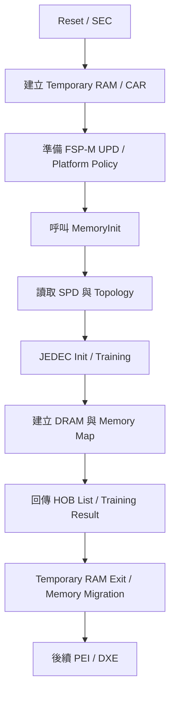
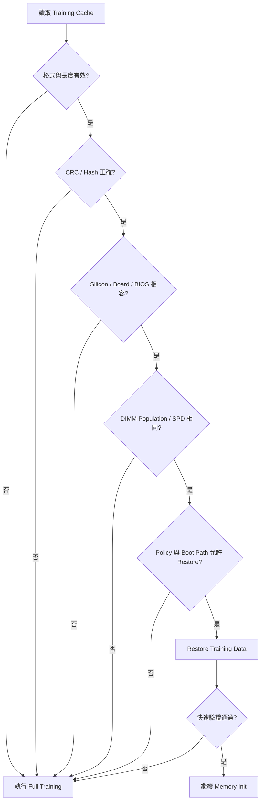
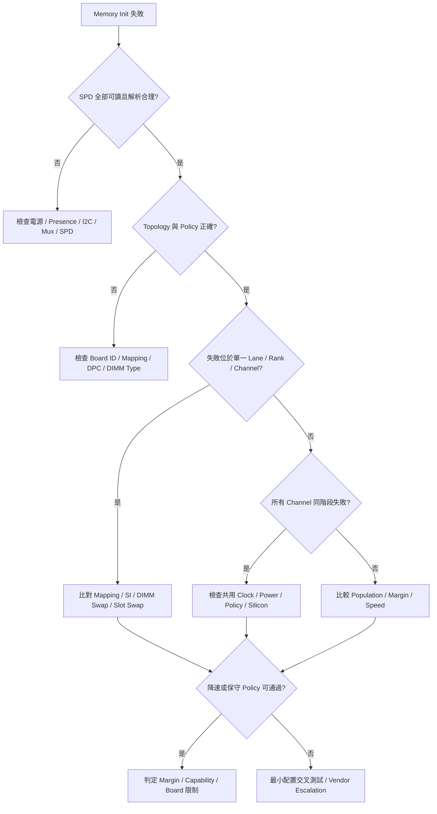

# 9. Memory Reference Code 與 DRAM Training

## 適用範圍

本章說明平台韌體如何透過 Memory Reference Code（MRC）、FSP-M 或 Silicon Vendor 提供的記憶體初始化模組，完成 DRAM 拓樸辨識、參數設定、JEDEC 初始化、Training、ECC／RAS 設定與最終 Memory Map 建立。

本章聚焦於下列內容：

- SPD、板級拓樸與記憶體參數來源
- MRC／FSP-M 的輸入、輸出與平台責任邊界
- JEDEC 初始化與常見 DRAM Training 階段
- Training Data Cache、Memory Context Restore 與 Fast Boot
- ECC、Scrub、錯誤回報、Memory Map 與保留區
- Memory Sparing、Mirroring 與 Address Range RAS
- Cold Boot、Warm Reset、S3 Resume 與不同 Reset Path
- Training 失敗資訊、邊界條件、降速與停用資源策略
- Bring-up、量產驗證、錯誤注入與問題排查

本章以 DDR4／DDR5 類平台的共通概念為主。實際 Training 項目、演算法名稱、暫存器、UPD 欄位、記憶體控制器能力與 RAS 功能，會依 CPU／SoC、Silicon Stepping、DIMM 類型及供應商實作而不同。文件中以 `<Silicon>`、`<Platform>`、`<Project>` 標示需由專案補齊的內容。

本章不公開或假設特定 Silicon Vendor 的封閉演算法，也不把範例中的名稱視為所有平台都必須具備的流程。若專案使用 Intel FSP、AMD AGESA、ARM Server Silicon Package 或其他初始化框架，應以該版本的 Integration Guide、Binary Interface 與平台設計文件為準。

## 適用讀者

- 負責 BIOS／UEFI、MRC、FSP、AGESA、Silicon Initialization 或 Memory Init 的開發與整合人員
- 負責 DDR Layout、SI／PI、SPD、CPLD／BMC I²C 拓樸與主機板 Bring-up 的工程人員
- 執行 DIMM 相容性、ECC／RAS、Memory Map、Fast Boot 或量產驗證的人員
- 排查無法開機、記憶體容量異常、Training 不穩定、可修正／不可修正錯誤及 OS Memory Map 問題的人員

## 快速導覽

- [釐清 SPD、Topology 與參數來源](#91-spdtopology-與記憶體參數來源)
- [理解 MRC／FSP-M 介面與 Policy](#92-mrcfsp-m-介面與輸入-policy)
- [掌握 JEDEC 初始化與 Training](#93-jedec-初始化與-dram-training)
- [管理 Training Data Cache 與 Fast Boot](#94-training-data-cache-與-fast-boot)
- [設定 ECC、RAS 與 Memory Map](#95-eccrasmemory-map-與保留區)
- [理解 Sparing、Mirroring 與進階 RAS](#96-memory-sparingmirroring-與-address-range-ras選用)
- [區分不同 Reset Path](#97-cold-bootwarm-reset-與不同-reset-path)
- [排查 Training 失敗與降速](#98-training-失敗資訊邊界條件與降速策略)
- [執行驗證與回歸測試](#99-驗證測試與問題排查)

---

## 9.1 SPD、Topology 與記憶體參數來源

### 9.1.1 記憶體初始化的輸入來源

記憶體初始化不是只讀取 SPD 後直接開始 Training。Silicon 初始化模組通常會整合多個來源：

| 來源 | 典型內容 | 主要責任端 |
|---|---|---|
| SPD | DRAM 類型、容量、Rank、Bus Width、Timing、速度等級、模組資訊 | DIMM Vendor／JEDEC |
| Board Topology | Channel、Subchannel、Slot、DQS／DQ Mapping、CA Mapping、Rcomp、走線拓樸 | Board／BIOS Platform Team |
| Setup／Policy | 速度上限、ECC、Scrub、Sparing、Mirroring、Fast Boot | Product／BIOS Team |
| Silicon Fuse／Stepping | Controller 能力、最大速度、已知限制、工作電壓範圍 | Silicon Vendor |
| CPU／SoC Configuration | Socket、IMC 數量、NUMA、互連與 Address Decode | Silicon／Platform |
| BMC／CPLD／Strap | DIMM Presence、I²C Mux、板型、SKU、電源狀態 | Platform Hardware／BMC |
| Cached Training Data | 前次成功 Training 結果與有效性資訊 | BIOS／Silicon Init Module |

所有來源都應在呼叫 MRC／FSP-M 前完成一致性檢查。若 SPD 表示兩個 Rank，但平台政策或硬體 Presence 資料表示插槽不存在，後續錯誤不宜直接歸類為 Training 演算法問題。

### 9.1.2 SPD 讀取路徑

常見 SPD 讀取路徑為：

```text
CPU / SoC
  -> SMBus / I2C Controller
  -> I2C Mux / Switch（若有）
  -> DIMM SPD Hub / EEPROM
  -> SPD Data
```

伺服器平台也可能由 BMC、CPLD 或 Baseboard Management Sideband 協助控制 Mux、Presence 或電源，但主機韌體是否直接由 BMC 取得 SPD，需依平台架構確認。

排查 SPD 時應記錄：

- Socket、IMC、Channel、Subchannel、Slot
- SMBus／I²C Bus 與 Slave Address
- Mux 選擇狀態
- Presence Detect 狀態
- SPD 讀取長度、頁面與回傳狀態
- CRC／Checksum 結果
- SPD Raw Dump 與解析結果
- DIMM Manufacturer、Part Number、Revision 與 Serial Number

### 9.1.3 SPD 讀取失敗的分層判斷

| 觀測結果 | 較可能的層級 | 建議檢查 |
|---|---|---|
| Controller 不存在 | Silicon／Early Init | Clock、Reset、PCI／MMIO Decode、Silicon Policy |
| Bus Timeout／NACK | Board／I²C | DIMM Presence、電源、Mux、Address、Pull-up、Bus Stuck |
| 可讀但 CRC 錯誤 | DIMM／傳輸 | SPD 內容、訊號完整性、讀取頁面、模組品質 |
| SPD 正常但拓樸錯誤 | Platform Policy | Channel／Slot 對應、DQS／DQ Mapping、Board ID |
| 單一 DIMM 正常，多 DIMM 失敗 | Loading／Topology | Rank／DPC 限制、走線、速度 Policy、電源 |

### 9.1.4 Topology 的表示方式

平台應有一份可追溯的記憶體拓樸定義，至少包含：

```text
Socket
  -> Integrated Memory Controller
      -> Channel
          -> Subchannel（若適用）
              -> DIMM Slot
                  -> Rank
                      -> Device / Byte Lane
```

對每個插槽，文件應列出：

- 是否實體存在
- DIMM Type：UDIMM、RDIMM、LRDIMM、SODIMM、Memory Down 等
- 最大 DPC（DIMMs Per Channel）
- 支援 Rank 與容量
- DQ／DQS／CA Mapping
- SPD 位址與 Mux 路徑
- Presence Detect／Power Enable
- 與 SMBIOS Locator 的對應名稱

### 9.1.5 參數優先順序

同一參數可能同時存在於 SPD、Silicon Default 與平台 Policy。專案應定義明確優先順序，例如：

```text
安全或 Silicon 限制
  > Board 電氣限制
  > 使用者／產品 Policy
  > SPD 宣告能力
  > Silicon 預設值
```

實際套用時通常取共同可支援範圍，而不是單純以最高設定覆蓋。例如 DIMM 宣告 DDR5-5600，但 Board Layout、CPU SKU 或 2DPC Policy 只支援較低速度時，初始化模組應選擇可共同支援的資料率。

### 9.1.6 SPD 與平台安全性

SPD 屬於外部輸入資料，解析時要檢查：

- 長度與頁面範圍
- CRC／Checksum
- 欄位保留值
- Timing 換算是否溢位
- 容量、Rank、Width 組合是否合理
- 字串是否終止及是否含非預期內容
- 是否超過 Silicon／Board 能力

不得在未檢查範圍的情況下，直接用 SPD 欄位配置陣列大小、Address Decode 或記憶體保留區。

---

## 9.2 MRC／FSP-M 介面與輸入 Policy

### 9.2.1 MRC、FSP-M 與平台韌體的分工

Memory Reference Code 是 Silicon Vendor 提供的記憶體初始化邏輯。部分平台以原始碼 Library、Binary Module、FSP-M、AGESA 或其他 Silicon Package 形式提供。

| 區域 | 主要責任 |
|---|---|
| Silicon Init Module | Controller 初始化、DRAM 命令序列、Training、Timing、Address Decode、部分 RAS |
| Board／Platform Code | SPD 路徑、Board ID、Topology、Mapping、Rcomp、電源與 Reset 前置條件 |
| Product Policy | 速度、ECC、Fast Boot、Sparing、Mirroring、錯誤處理及降級策略 |
| PEI／SEC Integration | Temporary RAM、堆疊、HOB、CAR、呼叫順序與錯誤傳遞 |
| DXE／OS Interface | Memory Map、SMBIOS、ACPI、RAS Table、錯誤記錄與管理介面 |

平台不應修改封閉 MRC 的內部假設；相對地，MRC 也無法自行知道實際 Board Routing、Slot Population Rule 或產品降級政策。兩者必須透過穩定的輸入介面交接。

### 9.2.2 FSP-M 的典型位置

在採用 Intel FSP 類架構的平台中，FSP-M 通常負責 Memory Initialization，並在完成後提供可用記憶體資訊與相關 HOB。簡化流程如下：



函式名稱、呼叫模式、HOB 內容與 Temporary RAM Exit 流程，應依目標 FSP 版本與整合模式確認。

### 9.2.3 輸入 Policy 分類

建議將輸入項目分成下列類別管理：

| 類別 | 內容 |
|---|---|
| Board 固定資料 | DQ/DQS Mapping、Rcomp、Slot Mask、Memory Down SPD |
| SKU 資料 | Channel 數、DIMM Type、最大速度、容量限制 |
| 使用者設定 | Memory Speed、ECC、Fast Boot、RAS Mode |
| Boot Mode | Cold、Warm、S3、Capsule、Recovery、Watchdog |
| Debug Policy | Training Log Level、Margin Tool、錯誤注入開關 |
| 安全 Policy | Cache 驗證、未受信任 SPD 的限制、敏感 Log 控制 |

### 9.2.4 Policy 建立與驗證順序

建議流程：

1. 取得 Board ID、SKU、Silicon Stepping 與 Boot Mode。
2. 載入 Silicon 預設 Policy。
3. 套用 Board 固定資料。
4. 套用產品／Setup Policy。
5. 依 Silicon、DIMM Population 與安全限制裁切設定。
6. 驗證欄位間相依關係。
7. 計算 Policy Hash 或保存 Debug Snapshot。
8. 呼叫 MRC／FSP-M。

### 9.2.5 常見 Policy 相依關係

- 啟用 Memory Mirroring 時，Channel 配對與容量必須符合限制。
- 啟用 ECC 時，DIMM、Controller 與資料寬度必須支援。
- 啟用 Fast Boot 時，Cache 必須可驗證且 Boot Path 允許 Restore。
- 速度上限受 CPU SKU、DPC、DIMM Type、Rank、Board Revision 及電壓限制共同影響。
- 部分 Debug Margin 功能會延長開機時間，不應在正常量產 Policy 無條件啟用。

### 9.2.6 輸出與交接資料

MRC／FSP-M 完成後，平台通常需要取得：

- 可用 DRAM Range
- Reserved／MMIO／TSEG／UMA 等區域
- DIMM／Channel Population 與最終速度
- Training 結果或 Cached Data
- ECC／RAS 能力與啟用狀態
- 錯誤碼、降級狀態與停用資源
- 後續 Silicon Init 所需的 HOB／資料結構

平台應保存「輸入 Policy Snapshot」與「輸出摘要」，方便比較不同 BIOS、DIMM、Board Revision 或 Reset Path 的差異。

---

## 9.3 JEDEC 初始化與 DRAM Training

### 9.3.1 初始化與 Training 的差異

JEDEC 初始化負責讓 DRAM 從 Reset／Power-up 狀態進入可接受命令的工作狀態；Training 則是在實際平台電氣條件下，尋找可靠的時序、電壓與延遲視窗。

簡化階段如下：

```text
電源與 Reset 前置條件
  -> Clock / PLL
  -> DRAM Reset / CKE 時序
  -> Mode Register 設定
  -> ZQ / Impedance 校準
  -> Command / Address Training
  -> Write Leveling
  -> Read / Write Timing Centering
  -> Voltage Centering / Vref Training
  -> Rank / Channel 相關校準
  -> Memory Test / Alias Check
  -> ECC / Scrub / Address Decode
```

實際順序與項目會因 DDR 世代、DIMM Type 與 Controller 而異。

### 9.3.2 Training 的觀測單位

Training 結果可能以不同粒度保存：

- Socket
- IMC
- Channel／Subchannel
- DIMM／Rank
- Byte Lane
- DQ Bit
- Command／Address Group

排查 Log 應盡量包含失敗粒度。只記錄「Memory Training Failed」不足以判斷是單一 Byte Lane、整個 Rank、Channel，或所有記憶體控制器失敗。

### 9.3.3 常見 Training 項目

| 項目 | 目的 | 主要適用世代／條件 | 常見失敗方向 |
|---|---|---|---|
| Write Leveling | 對齊 DRAM Clock 與 DQS 寫入時序 | DDR4／DDR5 常見；實際流程依 Controller | CK／DQS 走線、Rank、DIMM Loading |
| Read Gate／DQS Gate | 找到有效 Read DQS 接收窗口 | DDR4／DDR5 常見 | DQS、ODT、雜訊、錯誤 Rank |
| Read Timing Centering | 將取樣點置於 Read Eye 中心 | DDR4／DDR5 常見 | SI、速度過高、Byte Lane Mapping |
| Write Timing Centering | 將 Write DQ／DQS 置於穩定窗口 | DDR4／DDR5 常見 | DQ／DQS Mapping、Vref、ODT |
| Read／Write Vref Training | 尋找可靠電壓取樣範圍 | DDR4／DDR5；Vref 類型與控制方式不同 | 電源雜訊、DIMM 品質、Layout |
| Command／Address Training | 對齊 CA／CS／CKE 等命令訊號 | DDR4／DDR5；RDIMM／LRDIMM 流程通常更複雜 | CA Routing、DIMM Type、RCD 設定 |
| ODT／Drive Strength Optimization | 選擇較合適的終端與驅動組合 | DDR4／DDR5，是否獨立呈現依 Silicon | Loading、DPC、DIMM 組合、Board Topology |
| Round Trip Latency | 設定 Controller 至 DRAM 往返延遲 | DDR4／DDR5 常見 | Rank、Channel、Topology、速度 |
| Receive Enable | 找到資料返回起點 | DDR4／DDR5 常見 | Read Path、DQS Gate、Controller |
| CA Parity／CRC Path Verification | 驗證受支援命令、位址或資料保護路徑 | 依 DDR 世代、DIMM Type 與平台功能；DDR5／Server DIMM 較常見 | RCD、CA Routing、Parity Policy、錯誤注入殘留 |
| On-die ECC／ECC Data Path Check | 確認 DRAM 內部或外部 ECC 相關狀態與資料路徑 | DDR5 On-die ECC 為 DRAM 內部能力；是否存在可見的獨立 Training Stage 依 Silicon 實作 | DRAM Device、外部 ECC Lane、Controller Policy、錯誤回報路徑 |

表中名稱是共通概念，不代表每一個 DDR4／DDR5 平台都會以獨立階段呈現。尤其 DDR5 On-die ECC 通常由 DRAM 內部處理，不等同於系統層級 ECC，也不應假設所有 MRC 都有名為「DQ ECC Training」的固定階段。Silicon Log 可能使用不同縮寫，應依 Vendor 文件建立專案自己的名稱與世代對照表。

### 9.3.4 Training Window 與 Margin

Training 成功不等同於具有足夠量產 Margin。平台應區分：

- Pass：找到可工作的點
- Marginal Pass：窗口很窄，環境變化後可能失敗
- Strong Pass：在規格要求範圍內具備足夠 Timing／Voltage Margin

建議記錄：

```text
Left Edge / Right Edge
Low Vref / High Vref
Center Point
Window Width
Guard Band
Pass / Marginal / Fail
```

若 Silicon Module 只回傳 Pass／Fail，仍可透過 Vendor Margin Tool、壓力測試與溫度／電壓條件補足量產判斷。

### 9.3.5 DIMM Population Rules

不同 Population 會改變 Loading 與最高支援速度：

- 1DPC 與 2DPC
- Single Rank、Dual Rank、Quad Rank
- UDIMM、RDIMM、LRDIMM
- 對稱與非對稱容量
- 混插 Vendor、Speed Bin 或 Revision
- Memory Down 與可插拔 DIMM 混合

文件應把「Silicon 理論能力」「Board 驗證能力」「產品允許規則」分開描述。MRC 能夠完成 Training，不代表該混插方式已通過產品相容性驗證。

### 9.3.6 Training 完成後的基本檢查

- 最終資料率是否符合 Policy 與 Population Rule
- 所有預期 Channel／DIMM／Rank 是否啟用
- 容量加總是否正確
- ECC 是否依 Policy 啟用
- 是否發生降速、停用 Rank 或停用 Channel
- Memory Test／Alias Check 是否通過
- Training Margin 是否符合量產門檻
- MRC 輸出與 SMBIOS／OS 所見是否一致

---

## 9.4 Training Data Cache 與 Fast Boot

### 9.4.1 Cache 的目的

完整 DRAM Training 會增加開機時間。平台可保存前次成功的 Training Data，在硬體與設定未變更時執行 Memory Context Restore 或 Fast Boot，減少重複 Training。

Cache 不應只保存 Delay／Vref 數值，也應保存足以驗證適用性的 Metadata。

### 9.4.2 建議的 Cache Metadata

| 欄位 | 用途 |
|---|---|
| Cache Format Version | 判斷資料結構是否相容 |
| Silicon ID／Stepping | 避免跨不相容 Silicon 使用 |
| BIOS／MRC Version | 韌體或演算法更新時失效 |
| Board ID／Revision | 避免跨 Board Layout 使用 |
| DIMM Fingerprint | 確認 SPD、Serial、Part Number、Population 未變 |
| Policy Hash | 確認速度、ECC、RAS 等設定一致 |
| Boot／Power Context | 區分 Cold、Warm、S3 與電源遺失 |
| Payload Length | 邊界檢查 |
| CRC／Hash | 檢查資料完整性 |
| Success Marker | 確認前次 Training 已完整結束 |

#### Cache 儲存位置

Training Cache 的儲存位置會影響持久性、安全邊界、更新策略與可承受寫入次數：

| 儲存位置 | 適用情境 | 優點 | 主要限制與檢查項目 |
|---|---|---|---|
| SPI Flash 專用區域 | 需要跨 AC Cycle 保存，且資料量較大 | 可由韌體自訂格式、A／B Copy 與更新流程 | 擦寫壽命、斷電一致性、Region 權限、Capsule Update 保留策略 |
| UEFI Non-Volatile Variable | 資料量較小，需使用 Variable Service 管理 | 可沿用 Variable 屬性、配額與存取介面 | Variable Store 空間與 GC、Runtime 寫入權限、Authenticated Variable 是否適用 |
| BMC／Management Controller 儲存區 | 伺服器平台需集中備份、版本管理或跨主機板流程 | 可由管理端保存多份資料並提供稽核 | Host／BMC 介面可用時序、身份綁定、完整性、版本同步與失聯回退 |
| DRAM 保留區 | Warm Reset、S3 Resume 或 DRAM 電源持續的短期 Context | 讀寫快速，不消耗 Flash 擦寫次數 | AC Cycle 後失效；需避免被 OS、DMA 或 Memory Clear 覆寫 |
| CMOS／小型持久儲存 | 只保存狀態旗標、Generation 或摘要 | 流程簡單 | 容量極小，不適合完整 Training Payload；電池與清除策略需確認 |

選擇儲存位置時，至少應評估資料大小、寫入頻率、斷電保護、存取權限、Rollback／Downgrade、Firmware Update、Board／DIMM 身份綁定與復原方式。若 Payload 與 Metadata 分開保存，兩者必須具有共同的 Generation、Digest 或其他一致性識別，避免新舊資料交叉配對。

### 9.4.3 Cache 有效性判斷



### 9.4.4 Cache 失效條件

常見失效條件：

- DIMM 新增、移除或更換
- SPD 內容或 Firmware Revision 變更
- BIOS／MRC／FSP 版本不相容
- Board ID／Revision 變更
- Memory Speed、ECC、RAS 或 Topology Policy 改變
- AC Power Loss 後平台不允許 Restore
- 前次開機 Training 未完成
- Cache CRC／Hash 錯誤
- Watchdog、Machine Check 或 Memory Error Policy 要求 Full Training

### 9.4.5 Cache 寫入一致性

Training Cache 更新可能遭遇斷電。建議採用：

1. 先寫入新 Payload 與 Metadata。
2. 驗證寫入內容。
3. 最後更新 Success／Active Marker。
4. 必要時使用 A／B Copy 或 Generation Counter。
5. 開機時選擇最新且完整的一份。

不得先覆蓋唯一有效 Cache，才開始寫入新資料。

### 9.4.6 Cache 的安全邊界

Training Data 可能包含硬體校準資料與平台拓樸資訊。保存時應考慮：

- Variable／Flash Region 的存取權限
- Runtime 是否可寫
- Capsule Update 是否保留或清除
- 是否需要完整性保護
- Debug Tool 是否可讀出敏感平台資料
- 損毀資料是否會造成越界寫入或錯誤 Register Programming

任何 Cache Payload 在使用前都應完成長度、版本與完整性檢查。

### 9.4.7 Fast Boot 失敗回退

Restore 失敗時，建議：

```text
Restore 失敗
  -> 記錄失敗階段與 Cache Identity
  -> 將本次 Cache 標記為不可用
  -> 執行 Full Training
  -> 若 Full Training 成功，建立新 Cache
  -> 若仍失敗，進入降速／停用資源／Recovery Policy
```

平台應避免反覆 Restore 同一份已知失敗的 Cache，造成無限 Reset Loop。

---

## 9.5 ECC、RAS、Memory Map 與保留區

### 9.5.1 ECC 啟用條件

ECC 是否可啟用，取決於：

- Memory Controller 能力
- DIMM Type 與資料寬度
- Board Routing
- Product／Setup Policy
- Memory Mode，例如 Mirroring 或特定 RAS 模式

韌體應分別回報：

- ECC Capable
- ECC Requested
- ECC Enabled
- ECC Initialization／Scrub Completed
- ECC Degraded／Disabled Reason

不可只因 Setup 顯示 Enabled，就假設硬體已在 ECC 模式工作。

### 9.5.2 ECC 初始化與 Scrub

啟用 ECC 後，記憶體中的 ECC Code 必須與資料一致。平台可能透過初始化寫入、Memory Clear、Hardware Scrub 或其他機制建立有效 ECC 狀態。

常見區分：

| 類型 | 用途 |
|---|---|
| Initial Memory Clear | 首次建立有效資料與 ECC 狀態 |
| Patrol Scrub | 背景巡檢並修正可修正錯誤 |
| Demand Scrub | 讀取時發現可修正錯誤後回寫修正資料 |
| Software Page Scrub | OS／管理軟體針對指定頁面處理 |

Scrub Policy 會影響開機時間、記憶體頻寬與 RAS 行為，應記錄 Rate、範圍、啟動時機與排除區域。

### 9.5.3 錯誤分類與回報路徑

```text
DRAM / Memory Controller
  -> Corrected / Uncorrected Error Status
  -> Machine Check / RAS Register
  -> Firmware First 或 OS First
  -> ACPI APEI / GHES / Error Record
  -> OS Event / BMC SEL / Telemetry
```

平台應定義：

- Correctable Error（CE）門檻
- Uncorrectable Error（UE）處置
- Poison／Containment 行為
- 是否觸發 NMI、SCI、Machine Check 或 Reset
- BMC SEL 與 OS Event 的去重方式
- 重開機後是否保留錯誤紀錄

### 9.5.4 Memory Map 建立

Memory Map 會把實體位址空間分成：

- 可供一般系統使用的 DRAM
- Firmware Reserved
- SMRAM／TSEG
- MMIO Hole
- PCIe／CXL Window
- UMA／Graphics Reserved
- ACPI NVS／Reclaim
- Persistent／Special Purpose Memory（若有）
- Crash Kernel／Ras Reserved（依平台）

簡化示意：

```text
低位址
  [Legacy / Firmware Reserved]
  [Usable DRAM]
  [MMIO Hole]
4 GB 邊界
  [Remapped DRAM]
  [PCIe / CXL MMIO Window]
  [Usable High DRAM]
高位址
```

實際排列由平台 Address Decode、PCI Resource、TOLUD／TOUUD 類 Register、IOMMU 與裝置需求決定。

### 9.5.5 Memory Map 一致性

下列資訊應彼此一致：

- MRC／FSP HOB
- UEFI Memory Map
- SMBIOS Type 16／17／19／20
- ACPI SRAT／SLIT／HMAT（若適用）
- OS `e820`／EFI Memory Map／NUMA Node
- BMC Inventory
- 實體 DIMM Population

若總安裝容量與 OS 可用容量不同，先拆成：

```text
Installed Capacity
- Hardware Reserved
- Firmware Reserved
- MMIO / Device Window
- RAS Redundancy Capacity
- Disabled / Failed Resources
= OS Usable Capacity
```

#### 容量落差診斷流程

若 BIOS／MRC 顯示的安裝容量正確，但 OS 可用容量低於預期，建議依序比對：

1. 確認 MRC／FSP 輸出的 `Installed Capacity`、啟用 Channel／Rank 與停用資源，先排除 Training 降級造成的容量減少。
2. 加總 UEFI Memory Map 中可供一般 OS 使用的區域。通常可先觀察 `EfiConventionalMemory`，但 OS 最終可用容量仍會受 Loader、Kernel、ACPI 與 Runtime 保留影響，不宜只用單一 Type 當作最終結論。
3. 依 Base、Length 與 Type 排序 Memory Map，找出異常偏大的 `EfiReservedMemoryType`、`EfiRuntimeServicesCode／Data`、`EfiACPIReclaimMemory`、`EfiACPIMemoryNVS` 或 MMIO Range。
4. 檢查低位址 MMIO Hole、PCIe／CXL Window、TOLUD 類邊界與 Remap 設定，確認低於 4 GB 的 DRAM 是否已正確重映射到高位址，而不是直接遺失。
5. 若啟用 Mirroring、Sparing、UMA 或其他 Hardware Reserved 功能，確認容量折減符合 Policy，且 `Installed`、`Protected`、`Reserved` 與 `Usable` 的定義在 BIOS、SMBIOS、BMC 與 OS 間一致。
6. 檢查 SMBIOS Type 16／17／19／20 的容量與 Range 是否重疊或缺漏；`Maximum Capacity` 表示陣列能力上限，不應直接當作目前可用容量。
7. 檢查 ACPI SRAT Memory Affinity 的 Base、Length、Enabled 與 Proximity Domain，確認沒有遺漏可用 Range，也沒有把 Reserved／Disabled Range 宣告為可用 NUMA Memory。
8. 最後比對 OS 的 EFI Memory Map、`e820`、NUMA Node、Kernel Command Line 與 Crash Kernel／Huge Page 等保留設定，區分韌體保留與 OS 自行保留。

建議保存一份依位址排序的 Range 對照表：

```text
Base | End | Length | MRC/HOB Type | UEFI Type | SRAT Node | OS Result | Owner
```

容量問題的重點是找出「從哪一個交接點開始出現差異」，而不是只比較 BIOS Setup 與 OS 顯示的兩個總數。

### 9.5.6 NUMA 與 Interleave

多 Socket 或多 IMC 平台需定義：

- Channel Interleave
- Rank Interleave
- Socket Interleave
- NUMA Node Boundary
- Local／Remote Memory
- SNC／NPS 或 Silicon 對應模式

啟用跨 Socket Interleave 可能改變 OS 所見 NUMA 結構。SMBIOS 容量正確不代表 SRAT／HMAT 一定正確，需分別驗證。

### 9.5.7 保留區重疊檢查

建立 Memory Map 時應檢查：

- Range Base + Length 是否溢位
- Range 是否重疊
- Alignment 是否符合要求
- 是否超過實際 DRAM Top
- MMIO Window 是否覆蓋可用 DRAM
- SMRAM／安全區域是否被一般 OS Map 公開
- S3 Resume／Crash Dump 所需區域是否保持一致

---

## 9.6 Memory Sparing、Mirroring 與 Address Range RAS（選用）

本節只適用於具備相應 Memory Controller 能力的高階伺服器平台。若產品不支援，應在平台功能表與測試報告明確標示不適用。

### 9.6.1 Sparing

Memory Sparing 會保留部分記憶體資源作為備援，在錯誤達到政策門檻時切換。

可能粒度包括：

- Rank Sparing
- Bank／Bank Group Sparing
- Channel Sparing
- Device-Level Correction／Adaptive Device Correction（依 Silicon）

啟用前應確認：

- 保留容量與可用容量折減
- Spare Resource 是否已初始化與 Scrub
- 觸發門檻
- Failover 是否在線完成
- 重開機後的狀態延續方式
- OS、BMC 與管理軟體如何呈現 Degraded Mode

### 9.6.2 Mirroring

Memory Mirroring 將相同資料寫入配對資源，提高容錯能力，但會降低可用容量。

平台需定義：

- Channel／IMC／Socket 配對規則
- 對稱容量要求
- Address Mapping
- Primary／Mirror 狀態
- Failover／Degraded Mode
- 是否支援 Partial Mirror 或 Address Range Mirror

### 9.6.3 Address Range RAS

部分平台可只對指定 Address Range 啟用較高保護，例如：

- Firmware／Hypervisor Critical Range
- Kernel／Crash Dump Range
- In-Memory Database Critical Range
- Mirror-on-Write 或特殊保護區

韌體需把 Range Policy 與 OS 介面同步，避免 OS 把保護區誤當一般可移動頁面或錯誤理解容量。

### 9.6.4 Poison、Page Offlining 與 Scrub 分工

| 機制 | 主要層級 | 用途 |
|---|---|---|
| Memory Poison | Hardware／Architecture | 標示資料已不可可信，避免靜默使用 |
| Patrol Scrub | Hardware／Firmware Policy | 背景掃描並處理可修正錯誤 |
| Demand Scrub | Memory Controller | 讀取發現 CE 後回寫修正資料 |
| Page Offlining | OS | 將高風險或錯誤頁面移出使用集合 |
| Sparing／Mirroring | Memory Controller／Firmware Policy | 提供資源備援或資料冗餘 |

這些機制互補，不能互相替代。

### 9.6.5 資訊一致性

啟用進階 RAS 後，至少比對：

- MRC／Silicon RAS 狀態
- SMBIOS Memory Error／Array／Device 資訊
- ACPI SRAT／HMAT／APEI
- OS RAS Log
- BMC Inventory／SEL
- Redfish Memory Resource（若支援）

### 9.6.6 驗證重點

- 啟用後容量折減符合計算
- Sparing Trigger 與 Failover 成功
- Mirroring 配對與 Address Range 正確
- CE／UE 注入後，Firmware、OS、BMC 記錄一致
- Degraded Mode 在重開機後符合政策
- Firmware Update 前後 RAS 設定與狀態不被錯誤重置

---

## 9.7 Cold Boot、Warm Reset 與不同 Reset Path

### 9.7.1 Reset Path 不等同

不同 Reset 可能保留不同硬體狀態：

| Path | DRAM 電源／Context | Cache 使用可能性 | 建議決策邏輯 |
|---|---|---|---|
| G3／AC Cycle | DRAM 與 Controller Context 遺失 | 只有持久 Cache 可供驗證 | 不預設 `CacheValid = FALSE`；先依 9.4.3 驗證持久 Cache。若平台或 Silicon 不允許 G3 Restore、驗證失敗或電源條件要求重訓，執行 Full Training |
| S5 Cold Boot | 依平台電源設計，多半需重建 Controller | 可依平台 | 驗證 Cache、Reset Cause 與 DIMM／Policy；有效且平台允許時 Restore，否則 Full Training |
| Warm Reset | DRAM 與部分 Controller Context 可能保留 | 較高 | 優先使用符合本次 Reset Scope 的 Restore／Preserved Context；快速驗證失敗後切換 Full Training，並避免重複使用同一失效 Context |
| S3 Resume | DRAM 維持 Self-Refresh，Resume Context 必須相符 | 必須使用受驗證的 Resume Context | 不可直接執行會破壞內容的 Full Training。Context 或 Self-Refresh 驗證失敗時，依平台與 OS 契約執行受控 Reset／Cold Boot，而不是在原 Resume Path 繼續 |
| Watchdog Reset | 依 Watchdog Reset Scope，狀態可能不確定 | 需結合失敗階段判斷 | 若前次失敗位於 Memory Init／Restore，採保守 Full Training；若有可信 Reset Cause 與 Context，可依平台政策 Restore，但需記錄決策原因 |
| Capsule／Update Reset | DRAM 狀態依更新流程；MRC／FSP 版本可能改變 | Cache 可能不相容 | 比對 Cache Format、MRC／FSP、Policy 與 Board／DIMM Identity；任一不相容即 Full Training，成功後產生新 Generation |

表中為決策框架，不是所有 Silicon 都支援相同 Restore Path。尤其 G3／AC Cycle 後，DRAM Context 必然遺失，但持久化 Training Cache 不一定必須失效；是否可 Restore 應以 Silicon Vendor 規格與平台驗證結果為準。

### 9.7.2 Boot Mode 判斷

Boot Mode 判斷可能來自：

- Reset Cause Register
- PM／Power State Register
- ACPI Sleep Type
- Firmware Update State
- Watchdog Status
- BMC／CPLD Reset Reason
- 前次 Boot Success Marker

若不同來源矛盾，應採較保守的 Full Training 或 Recovery Path，並記錄原始狀態供排查。

### 9.7.3 S3 Resume 注意事項

S3 Resume 的重點是保存既有 DRAM 內容，因此：

- 不可執行會破壞內容的完整 Memory Clear
- 不可無條件重新配置不相容的 Address Decode
- 必須確認 Self-Refresh 與電源維持狀態
- Resume Context 必須與目前 Silicon／Policy 相容
- 失敗時是否允許轉 Cold Boot，需依 OS 與平台政策明確定義

### 9.7.4 Warm Reset Loop

若 Warm Reset 一直使用同一份失效 Context，可能形成 Reset Loop。建議保存：

- Reset Attempt Counter
- 前次失敗階段
- Cache／Context Generation
- 是否已嘗試 Full Training
- 是否已降速或停用資源

超過門檻後應切換到保守路徑或停留在可診斷狀態。

### 9.7.5 更新與降版

BIOS／MRC 更新後，Cached Training Data 是否保留，至少取決於：

- Cache Format Version
- MRC／FSP 相容性宣告
- Silicon Stepping
- Policy 結構版本
- Board Revision
- 已知問題與安全修正

降版時更應保守處理，避免新版 Cache 被舊版程式誤解。

---

## 9.8 Training 失敗資訊、邊界條件與降速策略

### 9.8.1 失敗資訊的最低要求

建議每次 Memory Init 至少保留：

```text
BIOS / MRC / FSP Version
Board ID / Revision
CPU / SoC ID / Stepping
Reset Cause / Boot Mode
DIMM Population / SPD Fingerprint
Requested / Final Memory Speed
Failed Stage
Socket / IMC / Channel / DIMM / Rank / Byte Lane
Raw Error Code
Retry / Downshift / Disable Action
Final Capacity / ECC / RAS State
```

### 9.8.2 錯誤分類

| 類型 | 範例 | 優先排查 |
|---|---|---|
| 前置條件 | DRAM 電源、Reset、Clock 未就緒 | Power Sequence、CPLD、PMIC、Clock |
| SPD／Topology | NACK、CRC、Mapping 錯誤 | Bus、Mux、SPD、Board Policy |
| Training | 無有效窗口、Lane Fail | SI／PI、速度、ODT、Mapping、DIMM |
| Memory Test | Alias、Stuck Bit、Pattern Fail | Address／Data Routing、DRAM、Controller |
| Cache Restore | Context 不相容、快速驗證失敗 | Cache Metadata、Reset Path、版本 |
| Memory Map | Range 重疊、容量錯誤 | Address Decode、Reserved Range、PCI Window |
| RAS | ECC 初始化或 Scrub 失敗 | ECC Policy、Controller、錯誤注入狀態 |

### 9.8.3 降速與停用資源策略

可採用的 Recovery Action 包含：

1. 重新執行同一 Training 階段。
2. 重新執行完整 Training。
3. 降低 Memory Data Rate。
4. 使用較保守 Timing／ODT／Vref Policy。
5. 停用失敗 Rank。
6. 停用失敗 DIMM／Channel。
7. 進入最小記憶體 Recovery Mode。
8. 停止開機並提供可診斷錯誤。

每一步都應有門檻與終止條件，不可無限 Retry。

### 9.8.4 降級政策的產品要求

平台需決定：

- 是否允許少一條 DIMM 繼續開機
- 是否允許非對稱 Channel
- 是否允許 ECC 被停用後繼續
- 是否允許低於產品宣告速度
- 何種情況必須停止開機
- 如何通知 BMC、OS 與使用者
- 下一次開機是否再次嘗試被停用資源

伺服器產品通常需要明確的 Degraded Mode 與管理事件；用戶端產品可能偏向自動降速，但仍需保留診斷資訊。

### 9.8.5 邊界條件

- 最小／最大容量
- 單 DIMM、滿插、1DPC、2DPC
- 最大 Rank
- 不同 Vendor／Revision 混插
- 最低／最高支援速度
- 高低溫、電壓邊界
- CPU／DIMM／Board 最差組合
- 連續 AC Cycle／Warm Reset
- Cache 有效／失效交替
- ECC／RAS 各模式

### 9.8.6 Diagnostic Flow



#### 降速後通過的判讀方式

降速或採用較保守 Policy 後能完成 Training，只能證明平台在較低壓力條件下可工作，不代表原問題已修復。可依下列方向繼續收斂：

| 方向 | 證據與後續驗證 |
|---|---|
| SI／PI 裕度不足 | 比較高速與降速的 Timing／Vref Margin；檢查 Layout、ODT、Drive Strength、Rcomp、電源雜訊與溫度敏感度 |
| DIMM 個體或批次裕度不足 | 將同一 DIMM 換到已知良好 Board／Slot，並以同 Part Number 的多支樣品交叉測試；依 QVL 規則判定 Fail、Conditional Pass 或降級使用 |
| Board Topology 限制 | 比較 1DPC／2DPC、近端／遠端 Slot、不同 Board Revision 與已知良好板；確認宣告速度是否高於實際 Layout 能力 |
| Policy 過度樂觀 | 檢查 CPU SKU、Stepping、DIMM Type、Rank、DPC、Board Revision 與 Vendor 限制表；修正 Auto Speed、ODT 或 Guard Band Policy |
| Mapping／Population 問題 | 確認降速是否只是掩蓋 DQ／DQS／CA Mapping、錯誤 Rank 宣告或不支援混插；仍需回到 Topology 與 SPD 證據確認 |

建議收斂順序：

1. 保存原速度與降速後的完整 Training／Margin 差異。
2. 固定較低速度建立穩定基準，但不要立即作為正式修正。
3. 交換 DIMM、Slot、Board 與 CPU，判斷問題隨哪個元件移動。
4. 比較 1DPC／2DPC、溫度與電壓邊界。
5. 依證據調整 Layout、QVL、速度表或 Policy。
6. 回到原目標速度重新執行完整回歸；若產品決定降級規格，需同步更新規格、Setup、SMBIOS／管理資訊與測試門檻。

### 9.8.7 交叉替換方法

排查硬體與韌體邊界時，可使用：

- 同一 DIMM 換 Slot
- 同一 Slot 換已知良好 DIMM
- 同一 Board 換 CPU
- 同一 CPU 換 Board
- 單 DIMM 最小配置
- 固定較低速度
- 關閉 Cache，強制 Full Training
- 比較不同 BIOS／MRC Version

每次只改一個變數，並保留完整 Log，才能判斷問題隨 DIMM、Slot、Board、CPU 還是 Firmware 移動。

---

## 9.9 驗證、測試與問題排查

### 9.9.1 測試環境紀錄

| 類別 | 必要資訊 |
|---|---|
| 韌體 | BIOS、MRC／FSP／AGESA 版本、設定值、Build ID |
| Silicon | CPU／SoC SKU、Stepping、Socket、Microcode |
| 主機板 | Board ID、Revision、BOM、CPLD／BMC 版本 |
| DIMM | Vendor、Part Number、Revision、容量、Rank、Speed Bin、SPD Dump |
| 拓樸 | Socket／Channel／Slot、DPC、Population |
| 電源環境 | AC Source、PMIC、電壓、溫度 |
| Boot Path | G3、S5、Warm Reset、S3、Watchdog、Update Reset |
| 工具 | Serial Log、Logic Analyzer、Scope、Margin Tool、Error Injection Tool |

### 9.9.2 基本功能測試

- 所有支援 DIMM Population 可完成 Full Training
- 最終速度符合規格
- 容量、Rank、Channel 與 SMBIOS／OS 一致
- ECC／Scrub 依 Policy 生效
- Fast Boot Restore 成功，且與 Full Training 結果一致
- DIMM 更換後 Cache 正確失效
- BIOS 更新／降版後 Cache 行為符合版本政策
- Cold、Warm、AC Cycle 與 S3 路徑均符合預期

### 9.9.3 壓力與 Margin 測試

- 高溫／低溫 Boot Cycle
- 電壓上下限
- 大量 AC Cycle／Warm Reset
- Memory Stress Test
- Read／Write Timing Margin
- Vref Margin
- 滿插與最差 Population
- 多 Vendor DIMM 相容性
- 長時間 ECC CE 監控

### 9.9.4 錯誤注入

| 注入情境 | 目的 |
|---|---|
| SPD NACK／CRC Error | 驗證讀取錯誤與 DIMM 排除政策 |
| Cache CRC Error | 驗證 Full Training 回退 |
| Training Stage Fail | 驗證 Retry／Downshift／Disable 流程 |
| Correctable ECC Error | 驗證 CE 記錄、Scrub 與門檻 |
| Uncorrectable ECC Error | 驗證 Poison、Containment、Reset／Fatal Policy |
| Memory Map 衝突 | 驗證 Range Check 與停止條件 |
| Power Loss During Cache Write | 驗證 A／B Copy 或有效 Marker |
| Sparing／Mirroring Failover | 驗證 RAS 切換與管理事件 |

錯誤注入應在具備復原能力的實驗室環境執行，並確認不會破壞唯一的量產金鑰、SPD、BMC FRU 或不可回復的硬體設定。

### 9.9.5 建議 Log 節點

```text
[MEM] Enter MemoryInit
[MEM] BootMode / ResetCause
[MEM] BoardId / CpuId / Stepping
[MEM] SPD Read: Sx/Cx/Dx Status
[MEM] Population Summary
[MEM] Requested Speed / Final Speed
[MEM] Cache: Found / Valid / Rejected Reason
[MEM] Training Stage Start / End
[MEM] Failure Location: IMC / Channel / Rank / Byte
[MEM] Retry / Downshift / Disable Action
[MEM] ECC / Scrub / RAS State
[MEM] Total / Usable / Reserved Memory
[MEM] Exit Status / HOB Summary
```

量產 Log 應避免輸出不必要的序號、完整硬體 Fingerprint 或 Vendor 封閉演算法資料。Debug Build 與 Release Build 的 Log 級別應分開管理。

### 9.9.6 症狀與排查入口

| 症狀 | 最後成功點 | 下一個交接點 | 優先方向 |
|---|---|---|---|
| 無 Memory Init Log | SEC／Temporary RAM | MRC／FSP-M Entry | CAR、堆疊、Binary、呼叫參數 |
| SPD 讀取失敗 | I²C Controller Ready | SPD Transaction | 電源、Presence、Mux、Address |
| 單一 Channel Training Fail | SPD／Policy 完成 | Channel Training | Mapping、Slot、DIMM、SI／PI |
| 全部 Channel 同時失敗 | Policy 建立完成 | 共用 JEDEC／Training 階段 | Clock、Reset、Power、共用 Policy |
| Cold Boot 成功、Warm Reset 失敗 | Full Training | Context Restore | Reset Cause、Cache、保留狀態 |
| Warm Boot 成功、AC Cycle 失敗 | Restore Path | Full Training 前置條件 | Power Sequence、SPD、Cold Policy |
| 容量少一半 | Training 完成 | Address Decode／Resource Enable | Rank／Channel 停用、Mirror、Map |
| BIOS 顯示容量正確、OS 較少 | MRC Map 正確 | HOB／UEFI／ACPI／OS | Reserved Range、MMIO、SRAT |
| ECC Setup Enabled 但無 ECC | Policy 已要求 | Controller Enable／Scrub | DIMM 能力、Mode、初始化狀態 |
| 每次都 Full Training | Cache 寫入 | Cache 驗證 | Metadata、CRC、Version、DIMM Fingerprint |

### 9.9.7 建議收斂順序

本節延續第一章 0.4.1 的統一排查方法：

```text
現象
  -> 最後成功點
  -> 下一個交接點
  -> 證據比對
  -> 最小變更驗證
  -> 回歸範圍
```

Memory 問題建議依序收斂：

1. 確認問題在進入 MRC 前、SPD／Topology、Training、Memory Test、Map，或後續 OS 介面。
2. 固定 BIOS、Board、CPU、DIMM 與設定版本。
3. 保存 SPD Raw Data、Policy Snapshot 與完整 Training Log。
4. 以單 DIMM、已知良好 Slot、較低速度建立最小可開機配置。
5. 一次只替換 DIMM、Slot、CPU、Board 或 Firmware 的其中一項。
6. 比較 Cold、Warm、AC Cycle 與 Cache Disable 結果。
7. 若降速可通過，進一步判斷 Margin、Population Rule 或 Board SI／PI。
8. 驗證最終容量、ECC、RAS、SMBIOS、ACPI 與 OS 結果。
9. 將修正擴展到完整 DIMM QVL、各 SKU、溫度／電壓與 Reset Matrix。

### 9.9.8 回歸測試矩陣

| 維度 | 測試值 |
|---|---|
| Reset | G3、S5、Warm Reset、S3、Watchdog、Update Reset |
| Population | 單 DIMM、1DPC、2DPC、滿插、非對稱 |
| DIMM | Vendor、容量、Rank、Speed Bin、Revision |
| Silicon | CPU SKU、Stepping、Socket 數 |
| Board | Revision、BOM、CPLD／BMC 版本 |
| Policy | Auto、固定速度、ECC、Fast Boot、RAS Mode |
| Environment | 高溫、低溫、電壓上下限 |
| Firmware | 更新前、更新後、降版、Cache 保留／清除 |

### 9.9.9 平台例外註記

- Memory Down 平台沒有可替換 DIMM，應改以 Board Swap、Channel Disable、測試 Coupon、Margin Tool 與 X-ray／量測資料判斷。
- 封裝式 Silicon Binary 可能只提供摘要錯誤碼，需透過 Vendor Debug Build、Trace Hub、Status Code 或專用工具取得更細粒度資訊。
- Headless Server 應透過 BMC POST Code、SOL、SEL、Redfish Inventory 與 BIOS Log 保存 Memory Init 結果。
- 部分平台為符合開機時間要求，量產模式不輸出完整 Training Log；應保留可控的 Debug Policy，且不能因開啟 Debug 而改變 Training Timing 到無法重現問題。
- 不支援 ECC、Sparing、Mirroring 或 S3 的 SKU，需在功能表、測試計畫與管理介面一致標示不適用。

平台例外至少應記錄適用 SKU、原因、替代觀測點、Pass／Fail 判準與回歸範圍。

---

## 9.10 安全性、相容性與維護建議

### 9.10.1 安全性

- SPD、Cache 與外部 Policy 均視為需驗證的輸入。
- 所有長度、索引、Channel／DIMM 數量與位址計算都要做範圍檢查。
- Training Cache 應有版本、完整性與有效 Marker。
- 不可信 Cache 不得直接用來寫入任意記憶體控制器暫存器。
- Debug Log 不應洩漏不必要的硬體序號、機密拓樸或 Vendor 封閉資料。
- SMRAM、Secure Memory 與 Firmware Reserved Range 不得暴露給一般 OS。

### 9.10.2 相容性

- MRC／FSP／AGESA 更新應明確定義 Cache 相容性。
- BIOS Update／Downgrade 應驗證 Memory Policy Migration。
- 新 DIMM Revision／Vendor 應納入 QVL 與最差 Margin 驗證。
- Silicon Stepping 差異應由 Policy 或版本表管理，不宜散落在平台程式中。
- SMBIOS、ACPI、BMC Inventory 與 OS 所見容量及 Locator 應一致。

### 9.10.3 維護原則

- 將 Silicon Default、Board 固定資料、Product Policy 與 User Setting 分層管理。
- 每次 Memory Init 保存可比對的 Input／Output 摘要。
- 任何降速、停用 Rank／Channel 或 RAS Degraded Mode 都應可觀測。
- 修改 Topology、Mapping 或 Reserved Range 時，同步更新硬體文件與測試矩陣。
- 不把單次 Training Pass 當作 SI／PI 與量產穩定性的充分證據。

---

## 9.11 本章重點

- DRAM 初始化的輸入不只來自 SPD，也包含 Board Topology、Silicon 能力、產品 Policy、Reset Path 與 Cached Training Data。
- Training 名稱與階段會隨 DDR 世代、DIMM Type 與 Silicon 改變；DDR5 On-die ECC 不等同系統層級 ECC，也不必然對應獨立的韌體 Training 階段。
- MRC／FSP-M 負責 Silicon 細節，平台負責提供正確的拓樸、電氣參數、設定與錯誤政策。
- JEDEC 初始化讓 DRAM 進入工作狀態；Training 則尋找可靠的時序與電壓窗口。
- Training 成功不代表 Margin 足夠，量產仍需涵蓋 Population、溫度、電壓與 DIMM QVL。
- Fast Boot Cache 必須以版本、Silicon、Board、DIMM、Policy 與完整性資料驗證，失敗時回退 Full Training。
- ECC 啟用、ECC 初始化與 Scrub 完成是不同狀態，應分別回報。
- Memory Map 必須與 HOB、UEFI、SMBIOS、ACPI、OS 與 BMC Inventory 一致。
- Sparing、Mirroring、Poison、Scrub 與 Page Offlining 分屬不同保護層級，不可互相替代。
- Cold、Warm、S3、Watchdog 與更新 Reset 可能保留不同 Context，不應共用同一假設。
- 排查應先確認最後成功點，再以最小配置、交叉替換、降速與 Cache Disable 縮小範圍。

## 9.12 參考資料

- UEFI Specification：Boot Services、Runtime Services、Memory Map 與 Variable 相關章節
- UEFI Platform Initialization Specification：SEC、PEI、HOB、Memory Initialization 與 S3 Resume 相關章節
- JEDEC DDR4／DDR5、SPD、RDIMM／LRDIMM 與 RAS 相關標準，依平台授權版本查閱
- EDK II MdePkg、MdeModulePkg、UefiCpuPkg 與平台 Memory Init 整合文件
- Intel FSP Integration Guide／FSP API Specification，若專案採用 FSP
- AMD AGESA 或其他 Silicon Vendor Memory Initialization 文件，依專案授權版本查閱
- ACPI Specification：SRAT、SLIT、HMAT、APEI／GHES 相關章節
- SMBIOS Specification：Physical Memory Array、Memory Device、Memory Array Mapped Address 等結構
- `<Project>` Memory Topology／Schematic／Layout／SI／PI Report
- `<Project>` DIMM QVL、Memory Margin、RAS、BIOS Update 與量產測試報告

> 文件狀態：Draft。Silicon Vendor 版本、DDR 世代、DIMM Type、UPD／Policy 欄位、Training Stage 名稱、錯誤碼、Memory Map、RAS 能力與量產門檻，仍需由章節負責人依實際專案補充及驗證。
