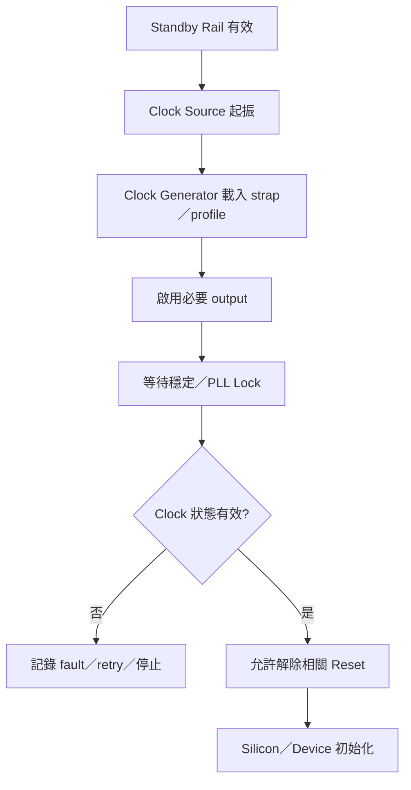
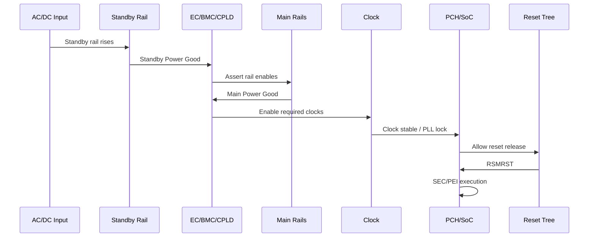

# 10. Clock、Reset、Power Rail 與電源時序

狀態：Draft  
文件用途：說明 BIOS／UEFI 平台中 Clock、Reset、Power Rail 與電源時序的相依關係、韌體介入點、驗證方式及問題排查框架。本文以一般伺服器與 PC 類 PCH／SoC 平台為主要脈絡；所有訊號極性、電壓、延遲、timeout、register bit、GPIO pad 與狀態轉換條件，仍須依採用的 silicon datasheet、board schematic、power tree、clock tree、CPLD／EC 規格及平台設計文件校正。

## 適用範圍

本章涵蓋：

- Clock generator、crystal、BCLK、reference clock、PLL 與 clock buffer 的角色。
- Always-on、resume、main、memory、CPU core 與周邊 Power Rail 的相依關係。
- RSMRST#、PLTRST#、SYS_RST#、PERST#、PWROK、Power Good 與 SLP_Sx# 的概念性時序。
- PCH／SoC power state machine 與 BIOS、EC、BMC、CPLD、PMIC 的責任邊界。
- Cold Boot、Warm Reset、Global Reset、Power Cycle 與 AC Cycle 的差異。
- Clock／Power／Reset timeout、錯誤處理、retry、safe fallback 與故障證據保存。
- 使用示波器、邏輯分析儀、GPIO checkpoint、POST code、register dump 與 serial log 的驗證方式。
- 新平台 Bring-up、量產回歸及 intermittent boot failure 的收斂流程。

本章不提供特定平台的固定時序值，也不將訊號名稱視為跨廠商完全等價。不同 CPU／SoC／PCH、PMIC、EC、CPLD 或 ATX／DC-SCM／自訂電源架構可能使用不同名稱、極性與狀態機。

## 適用讀者

- 負責 BIOS／UEFI、Silicon Init、Board Bring-up 或電源管理的人員。
- 負責 schematic、power tree、clock tree、CPLD／EC／BMC firmware 的硬體與韌體人員。
- 負責示波器量測、失敗分析、量產測試與跨團隊問題收斂的人員。
- 需要分析「無 POST」「偶發開不了機」「Warm Reset 正常但 Cold Boot 失敗」等問題的人員。

## 快速導覽

- [10.1 系統觀念與責任邊界](#101-系統觀念與責任邊界)：先建立 Power、Clock、Reset 的相依模型。
- [10.2 Clock 架構](#102-clock-generatorbclkreference-clock-與-pll-初始化)：確認 clock 的來源、分配、穩定與啟用時機。
- [10.3 Reset Domain](#103-reset-domain-與關鍵-reset-訊號)：區分 reset 的來源、範圍與解除條件。
- [10.4 Power Rail 與狀態轉換](#104-power-railpower-goodslp_sx-與電源狀態轉換)：由 rail 與 handshake 理解 power sequence。
- [10.5 Power State Machine](#105-pchsoC-power-state-machine-與韌體介入點)：定位 BIOS、EC、BMC、CPLD 與 silicon 的控制邊界。
- [10.6 Boot／Reset 類型](#106-cold-bootwarm-resetglobal-reset-與-ac-cycle)：選擇正確測試與復現方式。
- [10.7 故障偵測與 Timeout](#107-clockpowerreset-故障偵測與-timeout-policy)：避免無限等待與隱藏失敗。
- [10.8 量測與驗證](#108-示波器邏輯分析儀gpio-與暫存器驗證)：建立可重複且可判定的量測方法。
- [10.9 Bring-up 流程](#109-clockpowerreset-bring-up-系統化流程)：按風險與相依順序逐步導入。
- [10.10 常見問題](#1010-常見問題與排查)：依症狀選擇觀測點。
- [10.11 測試矩陣](#1011-驗證與測試矩陣)：覆蓋 reset、電源、SKU、溫度與錯誤注入。

## 建議系統地圖

```text
AC／DC Input
    │
    ▼
Standby Rail ──> EC／BMC／CPLD／PCH Resume Well
    │                       │
    │                       ├─ Power Button／Wake Event
    │                       ├─ SLP_Sx#／Enable Control
    │                       └─ Reset／Power Good Aggregation
    ▼
Main Rails ──> Memory／PCH／SoC／CPU Core／PCIe／Storage
    │
    ├─ Power Good／PWROK
    ├─ Clock Enable／Clock Stable
    └─ Reset Release
            │
            ▼
       SEC → PEI → DXE → BDS → OS
```

核心相依關係通常可概括為：

```text
Power 穩定
  → Clock 有效且 PLL lock
  → Reset 依規格解除
  → Silicon 開始執行與初始化
  → Firmware 建立後續裝置與作業系統介面
```

實際平台可能存在平行路徑、局部 reset、clock request handshake 或「先有 clock、再啟 rail」等例外。所有例外都必須以 silicon 與 board 規格為準。

## 10.1 系統觀念與責任邊界

Clock、Power 與 Reset 不是三條彼此獨立的訊號，而是一組相互約束的狀態機。若只從 BIOS serial log 觀察，容易將「CPU 尚未開始執行」誤判為 firmware hang；若只看單一 Power Good，也可能忽略 reference clock 未啟動或 reset 未解除。

### 10.1.1 三個關鍵問題

1. **誰提供它？** 來源是 VR、PMIC、clock generator、PCH／SoC、EC、BMC、CPLD，還是外部 supervisor？
2. **誰允許它改變？** 是硬體自動狀態機、GPIO、sideband bus、firmware register，還是多方 handshake？
3. **誰證明它有效？** 以 Power Good、PLL Lock、clock detect、reset status、POST code、register 或實際波形判定？

### 10.1.2 責任邊界

| 元件 | 常見責任 | BIOS 應確認 |
|---|---|---|
| PSU／VR／PMIC | 產生 rail、回報 Power Good、保護過流／過壓／欠壓 | rail 是否達標、fault 是否鎖存、enable 順序 |
| Clock Generator／Buffer | 產生與分配 BCLK／reference clock、spread spectrum、output enable | profile、輸出頻率、穩定時間、lock／LOS 狀態 |
| EC／BMC／CPLD | 電源按鍵、rail enable、reset gating、timeout、fault latch | ownership、狀態機版本、事件與 fault log |
| PCH／SoC | sleep state、resume well、power state machine、platform reset | state register、sleep signal、reset cause |
| BIOS／UEFI | policy、裝置初始化、clock request／reset control、錯誤記錄 | 介入時機、timeout、fallback、最終 register |
| Board | wiring、pull-up、level shift、rail domain、clock tree、reset fan-out | schematic net、電壓域、極性、測點與 population |

### 10.1.3 文件與量測的黃金法則

> **每一條時序要求都必須能對應到「來源文件、訊號測點、預期範圍與 Pass／Fail 判定」。**

「Rail 看起來正常」「Clock 應該有」「Reset 大概有解除」都不足以關閉問題。需記錄量測點、探棒設定、觸發條件、時間基準及規格上下限。

## 10.2 Clock Generator、BCLK、Reference Clock 與 PLL 初始化

### 10.2.1 Clock 類型

| 類型 | 典型用途 | 主要風險 |
|---|---|---|
| Crystal／Oscillator | 基礎時脈來源 | 起振時間、頻率誤差、負載電容、振幅 |
| BCLK | CPU／SoC 基礎時脈 | 頻率、jitter、spread spectrum、上電時機 |
| PCIe Reference Clock | Root Port、endpoint、retimer | Common／SRNS／SRIS 架構、CLKREQ#、SSC 相容性 |
| RTC Clock | RTC／低功耗 domain | coin-cell、always-on rail、低溫啟振 |
| Memory Reference Clock | DRAM PHY／controller | training 前穩定、拓撲、頻率 profile |
| Peripheral Clock | USB、SATA、eSPI、TPM、Super I/O 等 | gating、source selection、跨電壓域 |

### 10.2.2 Clock Tree 應記錄的資料

- Clock source、名目頻率與允許誤差。
- Spread Spectrum 是否啟用及其 profile。
- Clock buffer input／output mapping。
- Output enable、power-down、CLKREQ# 或 request／acknowledge 關係。
- 每一輸出的 consumer、電壓域與終端方式。
- 上電後至穩定的最大時間，以及 reset release 前的 setup time。
- Clock generator profile 的設定介面，例如 strap、SMBus／I2C 或 EEPROM。
- 不同 Board Revision／SKU 的 population 差異。

### 10.2.3 Firmware 初始化順序



並非所有 clock 都由 BIOS 設定。若 clock generator 必須在 CPU 執行前提供 BCLK，profile 可能由 pin strap、外部 EEPROM、CPLD 或固定硬體決定；BIOS 的角色可能只剩讀回、驗證或設定較晚啟用的輸出。

### 10.2.4 PLL 與 Lock

- PLL Lock bit 只代表特定 PLL 的內部狀態，不一定能證明板端輸出波形符合規格。
- 讀取 lock bit 前需確認 register 所屬 rail、clock domain 與 reset 已有效。
- 不應以固定 delay 完全取代 status poll，除非硬體沒有可讀狀態且規格明定保守等待時間。
- Polling 應有 timeout，並保存最後讀值與已等待時間。
- 若 Lock 曾短暫成立又掉落，單次讀值可能漏掉問題，應配合 fault latch 或示波器量測。

### 10.2.5 PCIe Clock 常見模式

- **Common Clock：** Root Complex 與 endpoint 使用共同 reference clock。
- **SRNS：** 不同 source，且不使用相同 SSC profile。
- **SRIS：** 獨立 source，兩端可各自使用 SSC，需由元件與平台共同支援。

選擇模式時需同步確認 BIOS policy、retimer、endpoint capability、clock generator profile 與 board topology。僅修改 PCIe port register 而未修改實際 clock 架構，可能造成 link training 不穩定。

### 10.2.6 Clock 設定表範本

| Clock ID | Source | Frequency | Consumer | Enable 條件 | Stable 判定 | Board 差異 |
|---|---|---:|---|---|---|---|
| CLK_CPU_BCLK | 待填 | 待填 | CPU／SoC | Standby／Main rail 條件 | PLL Lock＋波形 | SKU／Fab |
| CLK_PCIE_SLOT1 | 待填 | 待填 | Slot 1 | CLKREQ#／Policy | Clock detect＋波形 | 有無 retimer |
| CLK_RTC | 待填 | 待填 | RTC domain | Always-on | Register／波形 | Battery option |

## 10.3 Reset Domain 與關鍵 Reset 訊號

### 10.3.1 Reset 不是單一全域事件

平台通常包含多個 reset domain：

- CPU core／package reset。
- PCH／SoC global reset。
- Resume well／RTC domain reset。
- Platform reset。
- PCIe／USB／storage 等周邊 reset。
- EC／BMC／CPLD 自身 reset。
- Security engine、management engine 或其他獨立 domain reset。

因此「系統有 reset」仍需追問：哪個 source 觸發、哪些 domain 被重設、哪些 state／register／rail 被保留。

### 10.3.2 常見訊號的概念角色

| 訊號 | 概念用途 | 驗證重點 |
|---|---|---|
| RSMRST# | Resume well／低功耗域 ready 後解除相關 reset | standby rail、RTC／resume clock、解除時間 |
| PLTRST# | 平台與多數下游裝置的 reset | 與 PWROK、clock stable、PERST# 的相對時間 |
| SYS_RST# | 系統層級 reset request／distribution | 來源、debounce、pulse width、domain coverage |
| PERST# | PCIe endpoint／slot reset | reference clock、power stable、規格要求的 delay |
| PWROK／Power Good | 表示一組 rail 達到允許範圍 | aggregation 邏輯、glitch filter、deassert path |

名稱與極性必須以平台文件為準。相同名稱在不同平台的來源或涵蓋範圍也可能不同。

### 10.3.3 Reset Source 與 Cause

reset cause 應集中解碼並在被清除前保存。可能來源包括：

- Power-on reset。
- Power button／external reset button。
- Watchdog timeout。
- Firmware requested reset。
- Global reset request。
- Thermal／VR fault／power failure。
- Security／management engine request。
- Sleep state transition failure。
- Brownout 或 Power Good deassert。

建議建立統一資料結構：

```c
typedef struct {
  UINT32 RawResetStatus;
  UINT32 RawPowerStatus;
  UINT32 DecodedCause;
  UINT32 BootCount;
  BOOLEAN PreviousBootFailed;
} PLATFORM_RESET_CONTEXT;
```

讀取順序需符合 W1C、read-to-clear 或 latch 規則。若過早清除 status，後續 DXE／BMC／OS 將失去證據。

### 10.3.4 Reset 解除條件

一般原則：

1. 對應 Power Rail 已進入規格範圍。
2. Power Good 已穩定並通過 glitch／debounce 條件。
3. 必要 reference clock 已存在且穩定。
4. 上游 silicon／controller 已離開內部 reset。
5. 最小 setup／hold／delay 已滿足。
6. Firmware policy 允許該裝置啟動。

若裝置需要 reset asserted while clock absent 或反過來，必須依該裝置規格處理，不可使用全平台共用假設。

### 10.3.5 Reset 控制反模式

- 多個 owner 同時驅動同一 reset net，卻沒有 arbitration。
- BIOS、CPLD 與 BMC 對 reset 極性或 pulse width 的定義不一致。
- 只寫 GPIO output，不讀回 pad／CPLD status 或裝置狀態。
- 使用固定 delay 掩蓋 Power Good 或 Clock Lock 不穩。
- Warm Reset path 正常就假設 Cold Boot path 也正確。
- 清除 reset cause 後才開始 serial log，導致失敗來源遺失。

## 10.4 Power Rail、Power Good、SLP_Sx# 與電源狀態轉換

### 10.4.1 Power Rail 分類

| 分類 | 常見角色 | 重要觀測 |
|---|---|---|
| Always-on／Standby | EC／BMC／CPLD、RTC、PCH resume well | AC 插入後上升、待機功耗、低壓 reset |
| Resume Rail | 支援 wake／sleep state 保存 | SLP_Sx#、RSMRST#、wake source |
| Main Rail | PCH／SoC、DRAM、I/O、slot | enable、ramp、Power Good、掉電順序 |
| Core／Dynamic Rail | CPU／GPU／SoC core | SVID／PMBus、load transient、VR fault |
| Auxiliary Rail | PCIe AUX、storage standby、管理介面 | 裝置在 S5／G3 的預期狀態 |

### 10.4.2 Rail 表範本

| Rail | Voltage | Source | Enable Owner | Dependency | Power Good | Ramp／Timeout | Consumer |
|---|---:|---|---|---|---|---|---|
| V_STBY | 待填 | 待填 | PSU／硬體 | AC input | PG_STBY | 待填 | EC／BMC／CPLD |
| V_MEM | 待填 | 待填 | CPLD／PMIC | Standby＋SLP condition | PG_MEM | 待填 | DRAM |
| V_CORE | 待填 | 待填 | VR／Silicon | Main rail＋handshake | VR_PGOOD | 待填 | CPU／SoC |

表格需由 schematic、VR／PMIC 規格與 board design guide 共同確認，不能只從 BIOS 原始碼反推。

### 10.4.3 Power Good 的限制

Power Good 通常是數位摘要，不能取代 rail 波形量測。需確認：

- Assert／deassert threshold 與 hysteresis。
- 是否經過 CPLD 重新計時、AND aggregation 或 glitch filter。
- Rail overshoot、undershoot、ramp rate 與單調性。
- 在負載切換時 Power Good 是否短暫掉落。
- Fault latch 是否需要 AC Cycle 或特定 clear sequence。

### 10.4.4 SLP_Sx# 與 ACPI 狀態

SLP_S3#、SLP_S4#、SLP_S5# 等訊號常用於控制不同 sleep state 的 rail，但實際使用方式取決於 silicon 與 board design。文件應對每個狀態記錄：

- 哪些 rail 保留、關閉或延遲關閉。
- 哪些 clock 持續、gated 或重新啟動。
- 哪些 reset asserted／deasserted。
- EC／BMC／CPLD 所見狀態與預期輸出。
- Wake source、debounce 與 timeout。
- BIOS／OS 進入及離開該狀態的 register／table 支援。

### 10.4.5 概念性電源時序



此圖只表達相依概念，不代表任何特定平台的固定順序。

## 10.5 PCH／SoC Power State Machine 與韌體介入點

### 10.5.1 狀態機觀點

電源問題應以「目前狀態、進入條件、退出條件、timeout、失敗狀態」描述，而不是只列訊號先後。

```text
G3／Mechanical Off
  → Standby Ready
  → Resume Well Ready
  → Power Sequence Active
  → Main Power Good
  → Reset Release
  → Firmware Running
  → OS Runtime／Sleep State
```

### 10.5.2 韌體可能介入的位置

- Pre-memory policy：clock、VR、memory、GPIO、power limit。
- Early GPIO：rail enable、reset、mux、strap sampling。
- Sideband／I2C／PMBus：clock generator、PMIC、VR、CPLD 設定。
- Power state register：sleep type、wake status、power failure policy。
- Reset API：cold／warm／shutdown／platform-specific reset。
- DXE／ACPI：提供 OS 所需的 sleep／wake／power resource 描述。
- SMM：處理部分 power button、thermal、sleep、reset 或 firmware update 事件。

### 10.5.3 Ownership Matrix

| 項目 | Silicon | BIOS | EC／BMC／CPLD | Board |
|---|---|---|---|---|
| Rail 物理產生 | 規格需求 | Policy／監測 | Enable／狀態機 | VR／PMIC／wiring |
| Clock profile | 支援模式 | 選擇／驗證 | Pre-boot 載入時可能參與 | Generator／buffer topology |
| Reset release | 內部條件 | 裝置 reset／policy | Gating／fan-out | Pull／level shift／net |
| Sleep transition | Power state machine | ACPI／SMM／policy | Rail sequence | 電源域設計 |
| Fault handling | Status／protection | 記錄／retry／reset request | Latch／shutdown／telemetry | Test point／protection circuit |

單一訊號有多個參與者時，必須指定唯一 owner 與其他角色的讀回／請求介面。

### 10.5.4 Firmware 不應承擔的工作

- 用長 delay 補救不符合規格的 rail ramp 或 clock 起振。
- 在未知 Board ID 下啟用可能造成電氣衝突的 rail／GPIO。
- 忽略 VR／PMIC fault 並持續解除 reset。
- 將硬體保護機制改成只依賴 BIOS polling。
- 在不具備原子性與復原能力時更新 CPLD／PMIC 關鍵設定。

## 10.6 Cold Boot、Warm Reset、Global Reset 與 AC Cycle

### 10.6.1 名詞與差異

| 類型 | Power Rail | Clock／PLL | Reset Domain | 狀態保留 | 適用排查 |
|---|---|---|---|---|---|
| Cold Boot | Main rail 通常重新建立 | 多數重新起始 | 廣泛 | 少量 standby／RTC 狀態 | 上電時序、memory training、strap |
| Warm Reset | 多數 rail 保持 | 多數 clock 保持或短暫重設 | 部分 domain | 較多 | firmware reset path、裝置重置 |
| Global Reset | 依平台定義 | 可能重新初始化更多 domain | 較 Warm Reset 廣 | 依規格 | silicon／management domain 同步 |
| Power Cycle | 主電源關閉再開啟 | 重新建立 | 廣泛 | standby 可能保留 | main rail、VR fault、CPLD state |
| AC Cycle | AC input 移除至 standby rail 消失 | 全部重新起始 | 最廣 | coin-cell／非揮發資料可能保留 | latch fault、G3 path、首次上電 |

不可只靠命令名稱判斷 reset 深度。必須以 reset cause、rail 波形及平台規格確認實際涵蓋的 domain。

### 10.6.2 測試前的精確定義

每個測試案例應記錄：

- 如何觸發，例如 UEFI ResetSystem、OS reboot、watchdog、BMC power command、實體按鍵。
- 哪些 rail 必須掉電，以及掉電至何種閾值。
- AC off time 或 discharge time。
- 哪些 register、SRAM、CPLD latch、VR fault 應清除或保留。
- 預期 reset cause。
- 下一次開機是否執行完整 memory training。

### 10.6.3 常見不對稱現象

- Warm Reset 正常、Cold Boot 失敗：優先查 rail、clock、strap、pre-memory GPIO 與 memory init。
- Cold Boot 正常、Warm Reset 失敗：優先查殘留裝置狀態、reset coverage、bus master、SMM／watchdog。
- Power Cycle 無法復原、AC Cycle 可復原：可能有 standby domain、CPLD／EC latch、VR fault 未清除。
- 第一次 AC 插入失敗、第二次成功：可能是起振、ramp、EEPROM profile 載入、debounce 或 timeout margin。

## 10.7 Clock／Power／Reset 故障偵測與 Timeout Policy

### 10.7.1 為何必須有 Timeout

無限等待會讓系統停在無法判讀的狀態，也可能讓 watchdog、BMC 或 service processor 將問題誤判成一般 hang。每一個 firmware-controlled poll 都應定義：

- 預期狀態。
- Poll interval。
- 最大等待時間。
- Timeout 後保存哪些 register／GPIO／telemetry。
- 是否允許 retry。
- retry 前需重設哪些 domain。
- 最終行為是降級、reset、shutdown 還是停機。

### 10.7.2 Timeout 表範本

| 等待項目 | Owner | Poll／Delay | Timeout | Retry | 失敗行為 | 保存證據 |
|---|---|---:|---:|---:|---|---|
| PLL Lock | BIOS／Silicon | 待填 | 待填 | 待填 | Red／Yellow | Status、clock ID、elapsed time |
| VR Power Good | CPLD／BIOS | 待填 | 待填 | 待填 | Shutdown | PMBus fault、GPIO、rail |
| PCIe Link | BIOS | 待填 | 待填 | 待填 | Disable port／繼續 | LTSSM、speed、width |
| Reset Release Ack | BIOS／CPLD | 待填 | 待填 | 待填 | Stop／reset | Cause、GPIO、CPLD state |

### 10.7.3 Red／Yellow／Green 策略

- **Red，停止或安全關機：** rail 超規、VR fault、必要 BCLK 缺失、關鍵 reset 不定、可能傷害硬體的未知狀態。
- **Yellow，受限降級：** 非必要 PCIe slot clock failure、可停用的周邊、失去冗餘但仍可安全啟動。
- **Green，正常：** 所有必要條件均通過，設定與量測在核准範圍內。

Yellow path 必須明確停用受影響功能並留下事件，不可只忽略錯誤繼續啟動。

### 10.7.4 Retry 原則

- Retry 前必須知道第一次失敗留下哪些 state。
- 若 retry 沒有重設真正的 fault domain，只是再次 poll，通常無助於復原。
- 次數應有限，並避免延長 boot time 到無法接受。
- 每次 retry 都應記錄 cause、elapsed time 與結果。
- 量產版不應用大量 retry 掩蓋 margin 問題。

### 10.7.5 Fault Record

```c
typedef struct {
  UINT32 Signature;
  UINT16 Revision;
  UINT16 FaultType;
  UINT32 BootCount;
  UINT32 ResetCause;
  UINT32 ClockStatus;
  UINT32 PowerStatus;
  UINT32 TimeoutUs;
  UINT8  BoardId;
  UINT8  FabId;
  UINT8  SkuId;
  UINT8  RetryCount;
} PLATFORM_SEQUENCE_FAULT_RECORD;
```

若保存於 variable、CMOS、BMC SEL、CPLD scratch register 或其他持久區域，需考慮寫入壽命、原子性、版本、CRC、敏感資料與失敗復原。

## 10.8 示波器、邏輯分析儀、GPIO 與暫存器驗證

### 10.8.1 工具選擇

| 工具 | 適合觀測 | 不足之處 |
|---|---|---|
| 示波器 | rail ramp、overshoot、jitter 概觀、reset／PG 相對時間 | 多通道數位解碼有限，探棒可能影響訊號 |
| 邏輯分析儀 | 多個低速數位訊號、I2C／SMBus、狀態機順序 | 不能準確量測類比 rail 與高速 clock signal integrity |
| Differential／Active Probe | 高速／小振幅 clock、差動訊號 | 使用與接地方式要求高 |
| POST Card／GPIO Checkpoint | Firmware 執行階段 | CPU 未執行前無訊息，checkpoint 本身也可能受阻 |
| Serial Log | Policy、register、timeout、phase | 無法證明板端電氣波形 |
| Register Dump | Reset cause、PLL／PG／state status | 可能為 latched／read-to-clear，且需理解取樣時機 |
| BMC／CPLD／PMBus Log | Power state、VR fault、telemetry | 時間戳需與 BIOS／scope 對齊 |

### 10.8.2 量測計畫

每次量測至少記錄：

- Board ID、Fab Revision、SKU、CPU／SoC stepping。
- BIOS、EC、BMC、CPLD、PMIC／VR firmware 版本。
- 測點名稱、schematic page、實體位置。
- Probe 型號、bandwidth、attenuation、接地方式。
- Trigger source、threshold、time scale、sample rate。
- AC／DC coupling 與 bandwidth limit。
- 測試溫度、輸入電壓、負載及 reset 類型。
- 規格來源、預期範圍及 Pass／Fail。

### 10.8.3 建議通道配置

四通道示波器可先使用：

1. Standby／Main Power Good。
2. 目標 Rail。
3. 必要 Reference Clock 或 Clock Enable。
4. RSMRST#／PLTRST#／PERST# 中與問題最相關者。

若通道不足，應分次量測並保留共同 trigger／reference channel，否則不同 capture 的時間無法可靠對齊。

### 10.8.4 GPIO／POST Checkpoint

```c
DEBUG ((DEBUG_INFO, "SEQ: BeforeClockInit\n"));
PlatformCheckpoint (CHECKPOINT_BEFORE_CLOCK_INIT);

Status = InitializePlatformClock ();

PlatformCheckpoint (CHECKPOINT_AFTER_CLOCK_INIT);
DEBUG ((DEBUG_INFO, "SEQ: ClockInit Status=%r\n", Status));
```

Checkpoint 應具備：

- 唯一編號與 boot phase。
- 對照表與版本。
- 不會改變關鍵 strap／reset／power GPIO 的安全保證。
- 在 Release Build 中的保留或移除政策。
- 與示波器 trigger 對齊的方法。

### 10.8.5 Register 取樣順序

1. 先讀可能 read-to-clear 的 register 並保存 raw value。
2. 讀 reset／wake／power failure cause。
3. 讀 rail／clock／PLL／reset status。
4. 讀 firmware policy 與實際 hardware state。
5. 需要時才清除 status，並記錄清除值。

只保存解碼後文字可能遺失未知 bit。建議 raw value 與 decoded result 同時保留。

### 10.8.6 波形判讀提醒

- 數位 threshold crossing 不代表 rail 已滿足穩態與 ripple 規格。
- Power Good 邊緣正常，不代表 Power Good 前的 rail ramp 正常。
- Clock 有頻率，不代表 amplitude、common-mode、jitter 或 SSC 正確。
- Reset pulse 看得到，不代表所有下游裝置都收到相同 pulse width。
- 探棒接地線過長可能產生假 ringing；需先排除量測方法造成的現象。

## 10.9 Clock／Power／Reset Bring-up 系統化流程

### 10.9.1 階段 0：建立可追蹤基準

- 固定 schematic、power tree、clock tree、BOM 與 Board Revision。
- 固定 BIOS、EC、BMC、CPLD、VR／PMIC firmware 與 silicon package。
- 建立 net name 對照表，處理 schematic、CPLD code、BIOS GPIO 名稱不一致。
- 保存參考板正常波形、register dump、serial log 與完整版本資訊。
- 確認測點與安全量測方式。

### 10.9.2 階段 1：Standby 與 G3 路徑

- AC 插入後 Standby Rail 的 ramp、Power Good 與穩態。
- EC／BMC／CPLD reset release 與 firmware 啟動。
- RTC／resume clock 及 RSMRST# 前置條件。
- Power button、wake input 與初始 latch 狀態。

出口條件：standby domain 可重複進入穩定狀態，且 fault／reset cause 可讀。

### 10.9.3 階段 2：Main Rail Sequence

- Enable 的來源、順序與相對延遲。
- 每條 rail 的 ramp、overshoot、settling 與 Power Good。
- VR／PMIC／CPLD fault status。
- Power Good aggregation 與 glitch filter。

出口條件：多次 AC Cycle／Power Cycle 均能進入穩定 Main Power Good，無 fault latch。

### 10.9.4 階段 3：Clock 與 PLL

- 必要 clock 是否在 reset release 前穩定。
- Clock generator profile、output mapping 與 Board population 一致。
- BCLK／reference clock 頻率與 enable 條件。
- PLL Lock、loss-of-signal 與 clock request handshake。

出口條件：必要 clock 在規格時間內有效，且波形與 status 互相支持。

### 10.9.5 階段 4：Reset Tree

- RSMRST#、PLTRST#、SYS_RST# 與裝置 reset 的來源及 fan-out。
- Reset deassert 與 Power Good／Clock Stable 的相對時間。
- Pulse width、glitch、level shifting 與上拉電壓域。
- Cold／Warm／Global reset 的 domain coverage。

出口條件：所有必要 reset 依規格解除，reset cause 與實際觸發一致。

### 10.9.6 階段 5：Firmware 與裝置導入

建議順序：

1. SEC／PEI checkpoint 與 reset cause。
2. Memory initialization。
3. SPI／Variable／Fault-Tolerant Write。
4. PCI host bridge 與基本 I/O。
5. PCIe slot、retimer、storage、network。
6. ACPI sleep／wake、SMM、watchdog。
7. Firmware update、recovery 與安全功能。

每次只加入一組可觀測功能，並保留上一個可用版本。

### 10.9.7 暫時性 Workaround

Bring-up 初期可能以延長 delay、重試、固定 clock profile 或停用裝置暫時收斂問題。所有 workaround 應：

- 綁定 Issue Tracker ID。
- 記錄適用 Board／Fab／SKU／Stepping。
- 說明硬體或 silicon 條件。
- 指定 owner 與移除版本。
- 不可將超規波形標記為可接受。
- 量產前重新審查；能以硬體修正者，不應永久依賴 firmware timing 補償。

```c
// WORKAROUND: PWR-2041, A0 stepping only.
// Extend PG debounce until CPLD v1.3 is deployed.
// Remove after Board Fab.C and Silicon B0 validation.
```

### 10.9.8 收斂順序

```text
版本與量測基準
  → Standby Rail／控制器啟動
  → Main Rail／Power Good
  → Clock／PLL
  → Reset Tree
  → SEC／PEI／Memory
  → DXE 裝置
  → Sleep／Wake／Watchdog
  → Update／Recovery／Security
  → 全 SKU／Fab／Stepping／溫度回歸
```

## 10.10 常見問題與排查

### 10.10.1 完全無反應

| 首要觀測 | 可能方向 | 下一步 |
|---|---|---|
| AC input／Standby Rail | PSU、fuse、hot-swap、standby VR | 量測輸入與 Standby PG |
| EC／BMC／CPLD reset | 控制器未啟動 | 確認 clock、boot flash、reset |
| Power button／wake | 輸入極性、debounce、狀態機 | 邏輯分析儀與 controller log |
| Main rail enable | sequence 未開始或被 fault 阻止 | 查 fault latch、state register |

### 10.10.2 有上電但無 POST

| 首要觀測 | 可能方向 | 下一步 |
|---|---|---|
| Main Power Good | Rail 未穩或 aggregate PG 未成立 | 同步量測 rail 與 PG |
| BCLK／必要 clock | Clock generator profile／enable／起振 | Scope＋clock status |
| RSMRST#／PLTRST# | 前置條件不足、reset gating | 對齊 clock／PG／reset 波形 |
| SPI activity | CPU 未離開 reset或 Boot Flash 路徑 | Probe CS#／CLK／data、檢查 strap |
| POST／GPIO checkpoint | 停在 SEC／PEI | 對照 checkpoint 版本與 serial log |

### 10.10.3 偶發 Cold Boot 失敗

- Rail ramp、Power Good glitch 或 discharge 不一致。
- Crystal／PLL 在低溫或特定 AC off time 下起振較慢。
- Board ID／strap sampling 靠近臨界時間。
- EEPROM／CPLD profile 尚未 ready。
- Timeout 太貼近典型值，未涵蓋規格最大值。
- 記憶體 training、VR transient 或負載組合造成 margin 問題。

排查時應用示波器的 segmented memory、persistence 或 sequence mode 擷取多次開機，不能只比較單次成功與單次失敗。

### 10.10.4 Warm Reset 失敗

- Reset domain 不足，device／retimer／controller 保留舊狀態。
- Bus master／DMA 未停止。
- Clock gating／CLKREQ# 狀態與下一次初始化假設不一致。
- Watchdog 或 reset cause 讀取／清除順序錯誤。
- SMM／BMC／CPLD 同時觸發不同 reset。

### 10.10.5 AC Cycle 才能復原

- Standby powered latch 未被 Power Cycle 清除。
- CPLD／EC／BMC state machine 卡在 fault state。
- VR／PMIC fault 需要移除輸入電源。
- RTC／resume domain register 未被一般 reset 清除。
- 裝置 AUX power 保留狀態。

### 10.10.6 PCIe Link 不穩

- Reference clock mode 與 endpoint／retimer policy 不一致。
- PERST# 與 reference clock／power 的相對時間不符。
- CLKREQ# wiring、pull-up 或 clock buffer gating 錯誤。
- Retimer firmware／reset／power／clock sequence 不完整。
- Bifurcation、lane reversal、link speed policy 與 board wiring 不一致。

### 10.10.7 Sleep／Wake 失敗

- SLP_Sx# 對 rail 的 mapping 錯誤。
- Wake source 沒有供電或被 reset。
- ACPI table 宣告與硬體 wiring 不一致。
- EC／BMC／CPLD 未辨識 state transition。
- Resume clock、RSMRST# 或 context restore 順序錯誤。

### 10.10.8 通用排查流程

1. 固定可重現條件與版本。
2. 判定 CPU 是否曾開始執行。
3. 由 Standby Rail 往 Main Rail、Clock、Reset、SPI／POST 逐層量測。
4. 保存 reset／power／fault raw status，避免先清除。
5. 對齊 scope、CPLD／BMC log、POST code 與 BIOS serial log 的時間軸。
6. 與參考板或最近可用版本做單一變因比較。
7. 修正後覆蓋 Cold／Warm／Global／Power／AC Cycle。
8. 將 workaround、量測證據與回歸結果關聯到同一 issue。

## 10.11 驗證與測試矩陣

### 10.11.1 基本矩陣

- [ ] Cold Boot。
- [ ] Warm Reset。
- [ ] Global Reset。
- [ ] Watchdog Reset。
- [ ] BMC／EC／CPLD requested reset。
- [ ] Power Cycle。
- [ ] AC Cycle，包含不同 AC off time。
- [ ] Power button 短按、長按與 debounce 邊界。
- [ ] S3／S4／S5 或平台支援的 sleep state。
- [ ] 更新成功、更新失敗及更新中斷電。

### 10.11.2 硬體矩陣

- [ ] 每個 Board ID、Fab Revision、SKU／BOM。
- [ ] 每個 CPU／SoC／PCH stepping。
- [ ] 不同 PSU、VR／PMIC、clock generator 與 CPLD／EC 版本。
- [ ] 不同 memory population。
- [ ] PCIe card、retimer、storage 與 network 組合。
- [ ] 有無 AUX power／standby device 的組合。

### 10.11.3 環境與 Margin

- [ ] 輸入電壓上下限。
- [ ] 高溫、低溫與溫度循環。
- [ ] 最小與最大負載。
- [ ] 快速 AC 切換、brownout、短暫 interruption，依安全測試規範執行。
- [ ] Rail ramp、Power Good、clock start-up、reset delay 的規格邊界。
- [ ] 長時間 reset／power cycle 壓力測試。

### 10.11.4 錯誤注入

錯誤注入需由硬體與安全負責人核准，並使用可控設備：

- [ ] 延遲或移除非必要 clock，確認 Yellow 降級路徑。
- [ ] 模擬 Power Good timeout，不得繞過硬體保護。
- [ ] 保持裝置 reset asserted，驗證 timeout 與記錄。
- [ ] 注入無效 Board ID／CPLD 狀態。
- [ ] 模擬 watchdog、VR fault 或 update interruption。
- [ ] 驗證 retry 次數、最終停止條件與 fault record。

不得以短路 rail、停用過流保護或其他可能傷害人員與硬體的方法進行錯誤注入。

### 10.11.5 Pass／Fail 證據

每個測項至少保存：

- 完整 firmware／hardware versions。
- BIOS image hash 與 build profile。
- reset／power 類型及執行次數。
- 波形檔、scope screenshot 與量測設定。
- Clock／Power／Reset raw register。
- BMC／EC／CPLD／PMBus log。
- BIOS serial log、POST code 與 checkpoint。
- 預期值、實際值、規格來源與判定。

## 10.12 安全性、資料完整性與維護注意事項

前述時序設計多涉及跨控制器的硬體狀態與持久化 fault 資料。若控制介面可被非授權軟體存取，或更新途中破壞 CPLD／EC／PMIC 設定，可能造成無法啟動、保護機制失效或硬體受損，因此需納入信任邊界與失敗復原設計。

### 10.12.1 控制權限

- 限制對 PMBus、clock generator、CPLD、reset GPIO 與 power-control register 的寫入權限。
- SMM／runtime handler 必須驗證 command、buffer、index、range 與呼叫狀態。
- OS 可見的 ACPI method 不應允許任意切換高風險 rail／reset。
- BMC／host 共用控制資源時，需定義 arbitration、lock 與 ownership transfer。
- Manufacturing override、debug unlock 與 forced power sequence 必須與量產模式隔離。

### 10.12.2 更新與相容性

- BIOS、EC、BMC、CPLD、PMIC config 與 silicon package 應建立相容矩陣。
- 更新順序需避免新 BIOS 搭配舊 CPLD 時採用不相容的 handshake。
- 關鍵設定更新需有版本、CRC／hash、原子性與復原路徑。
- 回滾時要確認舊版是否理解新的 fault record、state schema 與 power policy。
- AC 中斷後需能辨識更新階段，不可留下未定義的 rail／reset 控制狀態。

### 10.12.3 Telemetry 與敏感資料

- Fault log 應保存足夠的 raw state，但避免輸出金鑰、認證資料或未遮蔽的機密製造資訊。
- 持久化紀錄需有 revision、length、CRC 與寫入壽命策略。
- 時間戳需說明來源，避免 BIOS、BMC 與 CPLD 使用不同時基卻直接比較。
- Release Build 應保存符號、MAP、image hash 與對應來源版本，供位址反查。

## 10.13 提交前檢查清單

- [ ] 每條 rail、clock、reset 的 owner、source、consumer 與極性已確認。
- [ ] 關鍵時序值皆有 datasheet／schematic／design guide 來源。
- [ ] Board Revision／SKU／Stepping 差異已資料化並可追蹤。
- [ ] 所有 polling 都有 timeout、錯誤記錄與最終行為。
- [ ] Red／Yellow／Green 分級已由 BIOS、硬體與安全人員審查。
- [ ] Reset cause 在清除前已保存 raw value。
- [ ] BIOS、EC、BMC、CPLD 與 PMIC／VR 版本相容性已確認。
- [ ] Cold／Warm／Global／Power／AC Cycle 均已驗證。
- [ ] Scope 波形與 register／log 結果互相支持。
- [ ] Workaround 有 issue、owner、適用範圍與移除條件。
- [ ] Release artifacts 包含 BIOS image、hash、MAP／symbols、BuildReport 與測試證據。
- [ ] 未知 Board ID、clock failure、Power Good timeout 與 reset failure 均有安全處理。
- [ ] 更新中斷電與跨版本回復已驗證。

## 10.14 本章三個關鍵問題

1. **電源是否真的穩定？** 不能只看 Power Good，還要確認 rail 的 ramp、overshoot、settling、負載變化與 fault latch。
2. **Clock 與 Reset 是否在正確時間有效？** 必須同時檢查來源、PLL／clock status、板端波形，以及 reset 的 domain、pulse width 與解除條件。
3. **失敗能否被證明與安全收斂？** 每個 poll 都需有 timeout，每個 reset／power failure 都需保存 raw cause，Red 狀態必須安全停止，Yellow 狀態必須明確降級並留下事件。

當這三個問題都能由規格、波形、register、log 與測試紀錄回答時，Clock／Power／Reset 才能由「經驗調整」轉為可驗證、可維護的工程系統。

## 10.15 參考資料

- UEFI Specification。
- UEFI Platform Initialization Specification。
- ACPI Specification，包含系統電源狀態、sleep／wake 與 reset 相關定義。
- EDK II 文件、ResetSystemLib、PlatformHookLib、相關 PEIM／DXE／SMM 原始碼。
- 採用平台的 CPU／SoC／PCH datasheet、BIOS Writer's Guide、EDS、PDG、errata。
- Clock generator、clock buffer、oscillator、retimer datasheet 與 programming guide。
- VR／PMIC／PSU／hot-swap controller datasheet、PMBus command 定義與 fault 規格。
- EC／BMC／CPLD power state machine、register map 與 firmware interface 文件。
- Board schematic、power tree、clock tree、GPIO table、BOM 與 PCB／Fab Revision 記錄。
- PCI Express Base Specification、Card Electromechanical Specification 及平台採用的 clocking 規格。
- 專案內部 issue、scope waveform、failure analysis、release manifest 與驗證報告。

> 文件維護提醒：正式發佈前，請將「待填」欄位替換為專案核准值，並補上 schematic page、net name、test point、register、bit definition、timeout、量測條件與規格版本。任何時序數值都不應從其他平台直接沿用。
