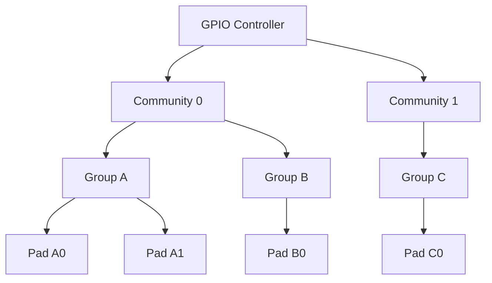
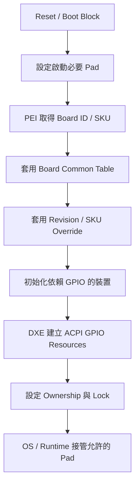

# 11. GPIO、Pinmux 與板級設定

狀態：Draft  
文件用途：本章說明 BIOS 如何依平台原理圖、SoC／PCH Pad 能力、Board Revision 與 SKU Policy，建立 GPIO、Native Function、Pin Multiplexing、Interrupt、Wake 與安全鎖定設定。實際 Community、Group、Pad ID、Native Function、Register、Reset Domain 與電氣限制，仍須由平台負責人依 Silicon 文件及硬體設計補充與驗證。

## 適用範圍

本章涵蓋：

- GPIO Community、Group、Pad 與編號方式
- Pad Mode、Direction、Output State、Pull、Drive、Reset Domain 與 Ownership
- Native Function 與 GPIO Pin Multiplexing
- GPIO Table 的來源、產生、載入與 SKU／Board Revision Override
- Boot Block、PEI、DXE、SMM 與 Runtime 的讀寫限制
- GPIO Interrupt、Wake、Debounce 與鎖定
- Register Dump、邏輯分析儀、示波器與板級量測
- Bring-up、錯誤注入、復原與常見問題排查

本章不涵蓋：

- GPIO Controller 內部 RTL 設計
- 作業系統 GPIO Framework 的完整實作
- EC、CPLD 或外接 GPIO Expander 的完整韌體設計
- PCIe、I2C、SPI、UART 等控制器本身的完整初始化
- 未公開的 Silicon Register 定義
- 量產治具與自動測試系統的完整設計

若同一 Pin 可由 BIOS、Management Engine、EC、BMC、CPLD、SMM 或 OS 控制，必須先釐清訊號所有權、切換時機與衝突避免方式。

## 適用讀者

- BIOS、UEFI、EDK II 與平台韌體開發人員
- Board Bring-up、硬體、SI／PI 與 Validation 人員
- 維護 GPIO Table、Pinmux、Board ID 與 SKU Policy 的人員
- 排查無法開機、裝置未出現、中斷、Wake 或電源時序問題的人員
- 維護 Manufacturing、Recovery 與 Debug BIOS 的人員

## 建議先備知識

- UEFI／PI 的 SEC、PEI、DXE、SMM 與 BDS 階段
- SoC／PCH GPIO Controller、Pad、Community 與 Group 概念
- 原理圖 Net Name、Power Rail、Reset、Strap 與上拉／下拉電阻
- GPIO Input／Output、Open Drain、Interrupt Trigger 與 Debounce
- ACPI GpioIo／GpioInt Resource Descriptor
- Board ID、SKU、BOM、Fab Revision 與 Setup／PCD Policy
- 萬用電表、示波器、邏輯分析儀與 Register Dump 工具

## 11.1 GPIO Community、Group、Pad 與編號方式

### 11.1.1 階層與責任

GPIO Controller 常將 Pad 依硬體架構分成 Community 與 Group。不同 Community 可能具有獨立的 MMIO／PCR 存取方式、電源域、Reset Domain、Interrupt Routing 或鎖定暫存器。



實際命名可能是 Community／Group／Bank／Port／Pad，應以目標 Silicon 文件與專案 Library 定義為準。

### 11.1.2 Pad 識別方式

平台文件應同時保留下列識別資訊，避免只記錄某一套編號：

| 識別項目 | 用途 | 範例格式 |
|---|---|---|
| Schematic Net Name | 對照板級訊號 | `PWR_BTN_N`、`LAN_RST_N` |
| Ball／Pin Name | 對照封裝與 Layout | `<待填>` |
| Silicon Pad Name | 對照 Datasheet | `GPP_A12` 或等效名稱 |
| GPIO Library ID | BIOS Table 使用 | `<待填>` |
| Community／Group／Index | Register 定位 | `<待填>` |
| ACPI Pin Number | OS Resource 使用 | `<待填>` |
| Linux／OS Line Name | OS 除錯 | `<待填>` |

不同編號空間不一定能直接互換。BIOS Pad ID、ACPI Pin Number、OS GPIO Line 與原理圖 Pin Name 必須透過正式對照表管理。

### 11.1.3 Pad Capability

並非所有 Pad 都支援相同功能。每個 Pad 應確認：

- 可用 Native Function 數量
- 是否支援 GPIO Input／Output
- 是否支援 Open Drain
- Pull-up／Pull-down 選項
- Drive Strength 或 Slew Rate
- Interrupt／Wake 能力
- Reset Domain
- 電源域與容忍電壓
- Host／CSME／ISH／PMC 或其他控制器 Ownership
- 是否為 Strap、Debug、JTAG 或安全敏感 Pin

對不支援的組合寫入設定，可能被硬體忽略、保留原值，或造成未定義行為。

## 11.2 Pad Mode、Direction、Pull、Drive、Reset Domain 與 Ownership

### 11.2.1 Pad Mode

Pad Mode 決定 Pin 由 GPIO Controller 控制，或連接至 UART、I2C、SPI、PCIe Sideband、Clock、Power Management 等 Native Function。

| Mode | 用途 | 檢查重點 |
|---|---|---|
| GPIO | 一般輸入或輸出 | Direction、Output State、Pull、Interrupt |
| Native Function 1..N | 由周邊控制器使用 | Function Number、Controller Enable、時脈與電源 |
| Hi-Z／Disabled | 不驅動或保留 | 外部 Bias、Leakage、安全需求 |

設定 Native Function 並不代表對應控制器已可使用。仍須確認控制器時脈、Reset、Power Domain、PCI／MMIO 資源及後續驅動初始化。

### 11.2.2 Direction 與初始輸出值

對輸出 Pad，應先規劃安全的初始電位，再切換 Direction，以降低 Glitch 風險。概念順序如下：

1. 確認外部電源與受控裝置狀態。
2. 設定安全的 Output State。
3. 設定 Pull 與電氣屬性。
4. 切換為 GPIO Output 或指定 Native Function。
5. 讀回 Pad Configuration。
6. 使用量測工具確認實際電位與時序。

若 API 或硬體採整筆原子設定，應確認 Library 已處理 Output State 與 Direction 的安全順序。

### 11.2.3 Pull、Drive 與外部電阻

內部 Pull 不可只依軟體需求決定，必須與原理圖上的外部 Pull、裝置輸入規格、電壓域及漏電流一起評估。

| 項目 | 檢查內容 |
|---|---|
| Internal Pull | None、Pull-up、Pull-down、強度與可用電源域 |
| External Bias | 外部電阻值、接至哪個 Rail、Rail 啟動時間 |
| Drive Strength | 負載、邊緣速度、EMI 與訊號完整性 |
| Open Drain | 是否需要外部 Pull-up，High 狀態是否由外部形成 |
| Voltage Tolerance | Pad 與外部裝置 I/O 電壓是否相容 |

禁止由 BIOS 同時啟用與板上強力外部 Bias 相反的內部 Pull，除非已完成電氣評估。

### 11.2.4 Reset Domain

Reset Domain 決定 Pad 設定在不同 Reset 或低功耗事件後是否保留。常見概念包括 Power-good、Deep Reset、Platform Reset、Resume Reset 或 Host Reset，實際名稱依 Silicon 而異。

選擇 Reset Domain 時應考量：

- Power Sequence 是否要求跨 Warm Reset 保持
- Resume 是否需恢復輸出或 Native Function
- Watchdog Reset 是否可能留下危險電位
- Recovery 是否能重新取得控制權
- OS 或 SMM 是否會重新配置該 Pad
- 外部裝置是否容許短暫 Glitch

### 11.2.5 Ownership

Pad Ownership 可分為 Configuration Ownership、GPIO Driver Ownership、Interrupt Ownership 或平台特定類型。平台應記錄：

- 哪個 Firmware／Controller 可修改 Pad Configuration
- 哪個 Agent 接收 Interrupt
- OS 是否可透過 ACPI 取得該 GPIO
- 是否在 EndOfDxe、ReadyToBoot 或其他階段轉移所有權
- Lock 後由誰負責後續電源狀態切換

Ownership 設定錯誤時，常見現象包括 BIOS 寫入無效、OS 無法取得 GPIO、Interrupt 送到錯誤 Agent，或 Runtime 設定被其他控制器覆寫。

## 11.3 Native Function 與 GPIO Pin Multiplexing 對照表

### 11.3.1 Pinmux 設計原則

Pinmux 應以 Silicon Pin List、原理圖與 Board Layout 三方交叉確認，不應只複製 Reference Board Table。新平台常見差異包括：

- 相同控制器改用另一組可替代 Pin
- 不同 SKU 裝置有裝或未裝
- Board Revision 更換 Reset、Interrupt 或 Presence Pin
- Debug SKU 將量產功能改為 UART／JTAG
- Strap Pin 在取樣完成後才允許改作 GPIO
- 共用 Pin 需配合 Mux、Buffer 或 Level Shifter Enable

### 11.3.2 建議 Pinmux 對照表

| Net Name | Pad | Ball | Mode | Native Function | Direction | Active Level | Pull | Reset Domain | Owner | 使用階段 | 備註 |
|---|---|---|---|---|---|---|---|---|---|---|---|
| `<待填>` | `<待填>` | `<待填>` | `<待填>` | `<待填>` | `<待填>` | `<待填>` | `<待填>` | `<待填>` | `<待填>` | `<待填>` | `<待填>` |

### 11.3.3 Active-low 命名

Net Name 中的 `_N`、`#`、`L` 通常代表 Active-low，但仍應以原理圖與元件規格確認。文件需同時記錄：

- 實體電位：High／Low
- 邏輯狀態：Asserted／Deasserted
- API 值：0／1
- 初始安全狀態

避免只寫「Enable = 1」而未說明實體電位與 Active Level。

### 11.3.4 Strap 與多用途 Pin

Strap Pin 可能在特定 Reset 邊緣取樣。若取樣完成後改作 GPIO 或 Native Function，應確認：

1. 外部電阻可形成正確 Strap 值。
2. BIOS 不會在取樣前驅動相反電位。
3. 切換時機符合 Silicon 規格。
4. Warm Reset、Global Reset 與 AC Cycle 的取樣行為已分別驗證。
5. Manufacturing／Debug 工具不會破壞 Strap。

## 11.4 GPIO Table 的產生、載入時機與 SKU Override

### 11.4.1 Table 來源

GPIO Table 應由可追蹤的板級資料產生或維護，常見來源包括：

- 原理圖 Net List／Pin List
- Silicon Vendor GPIO 設定工具
- EDK II／Silicon Package 的 Pad Configuration 結構
- Platform DSC／FDF／PCD
- Board ID、Fab ID、BOM ID 與 SKU Policy
- 專案維護的 CSV／YAML／JSON 或試算表

若使用工具產生 C Header 或 Binary Table，Repository 應保留來源檔、工具版本、產生命令與輸出差異，避免只提交無法回查的產物。

### 11.4.2 分層方式

建議將設定分為：

| 層級 | 內容 | 原則 |
|---|---|---|
| Silicon Default | 未由平台覆寫的安全預設 | 由 Silicon Package 維護 |
| Board Common | 同系列板共用訊號 | 避免重複定義 |
| Board Revision | Fab／Revision 差異 | 以明確條件覆寫 |
| SKU／BOM | 裝置有無與功能差異 | 與實際辨識來源對齊 |
| Boot Mode | Recovery／Manufacturing／Debug | 控制影響範圍與解除條件 |

Override 應以 Pad ID 為鍵進行明確合併，並檢查重複項目、衝突設定與未命中條件。不可只依 Table 排列順序推測最終值。

### 11.4.3 載入階段



早期設定應只包含啟動必要項目，例如 Flash Mux、Power Enable、Reset、Board ID Strap 或 Debug UART。完整 Table 應在 Board ID 與電源前置條件可用後套用。

### 11.4.4 Table 欄位

| 欄位 | 說明 | 驗證方式 |
|---|---|---|
| Pad ID | 唯一 Pad 識別 | 對照 Silicon Header 與 Pin List |
| Mode | GPIO 或 Native Function | Register Dump、周邊功能測試 |
| Direction／State | 輸入、輸出與初始值 | Readback、示波器 |
| Pull／Drive | 內部 Bias 與驅動能力 | Register Dump、電氣量測 |
| Reset Domain | Reset 後保留行為 | Reset Matrix 測試 |
| Interrupt／Wake | Trigger、Route、Wake | 中斷與睡眠喚醒測試 |
| Ownership | Host／OS／其他 Agent | Ownership Register、OS 測試 |
| Lock | 設定或輸出鎖定 | Lock Readback、負向測試 |

## 11.5 早期開機、PEI、DXE 與 Runtime 的讀寫限制

### 11.5.1 階段別可用性

| 階段 | 常見用途 | 主要限制 |
|---|---|---|
| Reset／Boot Block | Flash、Debug、基本 Power／Reset | 記憶體與服務尚不可用，Board ID 可能未知 |
| Pre-memory PEI | Memory／Silicon 前置 GPIO | 僅能使用早期 Library 與固定資源 |
| Post-memory PEI | 套用主要 Board Table | 可使用 HOB 與完整 Policy，但 DXE Protocol 尚不可用 |
| DXE | ACPI、裝置初始化、事件與 Lock | 需避免重複改寫已投入使用的訊號 |
| SMM | 電源事件、受保護控制 | 需有明確的 SMI 來源與存取授權 |
| Runtime／OS | OS 擁有的 GPIO | 受 ACPI Resource、Ownership 與 Lock 限制 |

### 11.5.2 讀寫限制

- Pad 所屬 Power Domain 未上電時，Readback 可能無效。
- 某些 Register 只能透過 Sideband／PCR／Mailbox 存取。
- Configuration Lock 後，後續寫入可能被忽略。
- Output State Lock 與 Configuration Lock 可能是不同機制。
- OS 擁有的 Pad 不應再由非協調的 DXE／SMM 程式任意改寫。
- Resume Path 應依 Reset Domain 與 Context Save／Restore 規則處理。
- 使用 Read-Modify-Write 時，需避免覆寫同 Register 中其他 Pad 或保留位元。

### 11.5.3 ACPI 與 OS 介面

交由 OS 使用的 GPIO，應在 ACPI 中以正確的 GpioIo、GpioInt 或平台對應資源描述，並確認：

- Controller Resource 與 Pin Number 正確
- Active Level、Edge／Level、Shared／Exclusive 正確
- Pull 與 Debounce 描述符合硬體
- Consumer Device 與 Resource Source 連結正確
- BIOS Table、ACPI 與 OS Driver 對同一 Pin 的定義一致

## 11.6 Interrupt、Wake、Debounce 與安全鎖定

### 11.6.1 Interrupt 設定

GPIO Interrupt 應確認：

- Edge 或 Level Trigger
- Rising、Falling、Both Edge 或 Active Level
- Interrupt Route 與目標 Agent
- Mask／Enable 狀態
- Pending Status 清除方式
- Shared Interrupt 支援
- Input Synchronization 與電源域

對 Level Trigger 訊號，若來源未解除就清除 Status，Interrupt 可能立即再次觸發；對 Edge Trigger 訊號，若在 Enable 前未清除舊 Status，可能產生非預期事件。

### 11.6.2 Wake

Wake-capable GPIO 需同時確認 Pad Power Domain、Wake Route、ACPI Wake 描述、睡眠狀態與外部訊號保持時間。一般功能 Interrupt 可用，不代表該 Pad 一定能從所有低功耗狀態喚醒系統。

### 11.6.3 Debounce

Debounce 可由 GPIO Controller、外部電路、EC／CPLD 或軟體完成。設定前應確認：

- 訊號來源是機械開關或數位裝置
- 最短有效脈衝寬度
- Debounce Clock 與可用範圍
- 是否影響 Wake Latency
- Edge Event 是否可能被濾除

### 11.6.4 鎖定

常見鎖定類型包括：

- Pad Configuration Lock
- Output State Lock
- Ownership Lock
- Interrupt Route Lock
- Community／Group Lock

鎖定順序建議：

1. 套用 Board Common 與 SKU Override。
2. 初始化依賴該 Pad 的裝置。
3. 完成 Readback 與板級量測。
4. 建立 ACPI／Runtime 所需資源。
5. 確認 S3／S4／Recovery 的恢復需求。
6. 依平台安全政策設定 Lock。
7. 再次讀回 Lock 狀態。

不應在 AP／CPU 類章節的通用假設下推導 GPIO Lock 行為；實際 Lock 是否跨 Reset 保留、是否可由 SMM 解鎖，必須依 Silicon 文件確認。

### 11.6.5 安全敏感訊號

下列類型通常需特別審查：

- Flash Write Protect
- BIOS／Recovery Select
- Security Override／Manufacturing Mode
- TPM／Discrete Security Device Reset
- Debug UART／JTAG Enable
- Power Button／Reset Button
- Chassis Intrusion
- Boot Strap
- 外部裝置的 Power Enable 與 Reset

Release BIOS 應避免提供未授權的 Runtime 介面修改安全敏感 Pad。

## 11.7 Register Dump、Loopback 與板級量測驗證

### 11.7.1 驗證層次

GPIO 驗證不應只停留在 Table 內容，建議依序確認：

1. Source Table 是否正確。
2. Build 是否納入預期 Table／Override。
3. BIOS Log 是否選到正確 Board／SKU。
4. Pad Register Readback 是否符合設定。
5. Pin 實際電位、波形與時序是否符合原理圖。
6. 受控裝置是否產生預期功能。
7. OS／ACPI 觀察結果是否一致。
8. Reset／Sleep／Recovery 後是否仍符合需求。

### 11.7.2 Register Dump

建議每筆 Dump 包含：

```text
[GPIO] Board/SKU          : <value>
[GPIO] Net name           : <value>
[GPIO] Pad ID             : <value>
[GPIO] Community/Group    : <value>
[GPIO] Mode               : <value>
[GPIO] Direction/State    : <value>
[GPIO] Pull/Drive         : <value>
[GPIO] Reset domain       : <value>
[GPIO] Ownership          : <value>
[GPIO] Interrupt/Wake     : <value>
[GPIO] Config lock        : <value>
[GPIO] Output lock        : <value>
[GPIO] Raw register       : <value>
```

Release BIOS 是否輸出原始 Register、實體位址或安全敏感訊號名稱，應依資訊揭露政策處理。

### 11.7.3 Loopback 與功能測試

若硬體提供測試點、Loopback、CPLD 回讀或外接治具，可執行：

- Output High／Low 與 Input Readback
- Open Drain 搭配外部 Pull-up
- Interrupt Rising／Falling／Level Trigger
- Debounce 前後脈衝比較
- Wake Event
- Reset Domain 保留測試
- Mux 切換前後的 Native Function 測試

不可對連接電源、Reset、Strap、Flash Write Protect 或其他高風險訊號直接執行任意 Toggle。測試清單必須由硬體負責人核准。

### 11.7.4 板級量測

| 工具 | 適合觀測 | 注意事項 |
|---|---|---|
| 萬用電表 | 穩態 High／Low、Rail | 不適合短脈衝與 Glitch |
| 示波器 | 邊緣、Glitch、時序、電壓 | Probe 負載與接地方式 |
| 邏輯分析儀 | 多訊號關係、數位時序 | Threshold 與取樣率 |
| Register Tool | Pad 設定與狀態 | 存取權限、Lock、Read Side Effect |
| POST／Serial Log | 初始化階段與 Policy | 時序與實際電位需交叉驗證 |

## 11.8 驗證與測試

### 11.8.1 測試環境

| 項目 | 紀錄內容 |
|---|---|
| Platform／Board Revision | `<待填>` |
| SKU／BOM／Fab ID | `<待填>` |
| CPU／SoC／PCH Stepping | `<待填>` |
| BIOS／Silicon Package | `<待填>` |
| EC／BMC／CPLD Version | `<待填>` |
| GPIO Table Revision | `<待填>` |
| 原理圖 Revision | `<待填>` |
| 作業系統與 Driver | `<待填>` |
| 量測工具與 Probe | `<待填>` |
| 測試案例與 Log 路徑 | `<待填>` |

### 11.8.2 基本測試

- 每個 Pad 的 Mode、Direction、State、Pull、Reset Domain 與 Owner 符合 Table。
- Native Function 對應控制器可正常工作。
- Output Power／Reset Sequence 符合元件規格。
- Input、Presence、Interrupt 與 Wake 可正確偵測。
- ACPI GPIO Resource 與 OS Driver 一致。
- Board Revision 與 SKU Override 只影響目標平台。
- Lock 前後行為符合安全政策。
- Cold Boot、Warm Reset、Global Reset、AC Cycle、Watchdog 與 Resume 均符合預期。

### 11.8.3 錯誤注入

錯誤注入應使用可復原的 Debug Image，並避開可能損壞硬體或破壞安全狀態的訊號。可測試：

- 不存在或不支援的 Pad ID
- 重複且衝突的 Table Entry
- 無效 Native Function
- 錯誤 Board ID／SKU Override
- Interrupt Route 或 Trigger 錯誤
- Wake 未啟用或 Power Domain 不相容
- Lock 後再次寫入
- Resume 時未恢復必要設定

預期 BIOS 應在 Build、Table 驗證或初始化階段偵測問題，避免越界寫入，也不應讓單一無效 Entry 破壞整個 Community。

### 11.8.4 Pass／Fail

| 項目 | Pass 條件 | Fail 條件 |
|---|---|---|
| Table 套用 | 最終 Readback 與目標設定一致 | Entry 未套用、被錯誤 Override 或寫入錯 Pad |
| 電位與時序 | 符合元件與原理圖需求 | Glitch、電壓錯誤或時序超限 |
| Native Function | 控制器與 Pinmux 均正確 | Controller 啟用但 Pinmux 錯誤，或反之 |
| Interrupt／Wake | 指定條件下只觸發預期事件 | 漏事件、重複事件或錯誤喚醒 |
| Reset／Resume | 各路徑結果符合矩陣 | 特定 Reset 後狀態殘留或遺失 |
| Lock | 保護項目無法被未授權修改 | 過早鎖定或鎖定後仍可改寫 |

## 11.9 常見問題與排查

### 11.9.1 建議順序

1. 確認 Net Name、Pad、Ball 與 Board Revision。
2. 確認該 Pad 的 Capability 與電壓域。
3. 確認 BIOS 選到正確 Board ID／SKU Table。
4. 確認是否有重複 Entry 或後續 Override。
5. 確認 Pad Mode 與控制器初始化互相匹配。
6. 確認 Direction、Output State、Pull 與 Active Level。
7. 確認 Ownership、Power Domain、Reset Domain 與 Lock。
8. 讀取 Pad Register 與 Interrupt Status。
9. 以示波器／邏輯分析儀量測實體 Pin。
10. 比對 ACPI Resource 與 OS Driver。
11. 交叉測試 Reset、Resume、SKU、Board Revision 與 BIOS 版本。

### 11.9.2 症狀對照

| 症狀 | 首要觀測點 | 排查方向 |
|---|---|---|
| BIOS 寫入後無變化 | Ownership、Lock、Pad Capability | 寫入被忽略、錯誤 Pad ID、Power Domain 未啟用 |
| 裝置未出現 | Pinmux、Power Enable、Reset | Native Function 與 Controller 不一致 |
| 輸出電位相反 | Active Level、Output State | `_N` 解讀、外部 Buffer 反相 |
| 開機瞬間出現 Glitch | Direction／State 寫入順序 | 初始值、外部 Pull、Reset Domain |
| Warm Reset 才失敗 | Reset Domain、保留狀態 | Pad 未重新初始化或保持舊狀態 |
| Interrupt 不觸發 | Trigger、Route、Mask、Ownership | Edge／Level、Status 清除、ACPI 描述 |
| Interrupt Storm | Level 未解除、Floating Input | 外部訊號、Pull、Debounce、清除順序 |
| 無法 Wake | Wake Route、Power Domain、ACPI | 睡眠狀態不支援、訊號脈寬不足 |
| OS 啟動後設定改變 | ACPI／Driver Ownership | OS 重新配置、Runtime Agent 衝突 |
| 只有特定 SKU 失敗 | Override、BOM、Board ID | 條件判斷或 Table 合併錯誤 |

### 11.9.3 正常與異常 Log

正常流程：

```text
GPIO board identity detected
GPIO common table selected
GPIO revision override applied
GPIO SKU override applied
GPIO table validation passed
GPIO pad programming completed
GPIO readback verification passed
GPIO ownership configured
GPIO lock policy applied
```

異常流程：

```text
GPIO board identity unknown
GPIO fallback table selected
GPIO duplicate pad entry detected
GPIO unsupported native function
GPIO write blocked by ownership or lock
GPIO readback mismatch
GPIO initialization entered degraded mode
```

## 11.10 安全性與相容性

### 11.10.1 安全原則

- 安全敏感 Pad 應採最小權限與明確 Ownership。
- Release BIOS 不應提供任意 GPIO Read／Write 介面。
- Manufacturing／Debug Override 應有進入條件、使用紀錄與退出機制。
- Lock 前需完成 Recovery、Resume 與 SMM 使用需求評估。
- GPIO Table 與產生工具應納入版本控管及 Code Review。
- 未使用 Pad 應依硬體安全與漏電需求設定，不可一律假設為 Input Floating。

### 11.10.2 相容性矩陣

| BIOS | Silicon Package | Board Rev. | SKU／BOM | GPIO Table | EC／CPLD | 驗證狀態 |
|---|---|---|---|---|---|---|
| `<待填>` | `<待填>` | `<待填>` | `<待填>` | `<待填>` | `<待填>` | `<待填>` |

### 11.10.3 更新與 Recovery

BIOS 更新若同時改變 GPIO Table，應確認：

- 更新前後 Power／Reset Pin 不會產生危險轉態
- Recovery Image 支援目前 Board Revision
- 降版不會套用舊板錯誤 Pinmux
- A／B Image 的 Board ID 與 GPIO Policy 相容
- 更新中斷後仍能維持 Flash、Power Button 與 Recovery 必要 Pin

## 11.11 平台資料補充清單

### 11.11.1 基本資料

- SoC／PCH 與 Stepping：`<待填>`
- GPIO Controller／Community 數量：`<待填>`
- Board／Fab／BOM／SKU 清單：`<待填>`
- GPIO Table 來源與 Revision：`<待填>`
- Silicon GPIO 工具與版本：`<待填>`
- 原理圖與 Pin List Revision：`<待填>`
- BIOS／Silicon Package 基準：`<待填>`

### 11.11.2 GPIO 模組對照

| 功能 | BIOS Phase | Module／File | Silicon Interface | Owner |
|---|---|---|---|---|
| Early GPIO | `<待填>` | `<待填>` | `<待填>` | `<待填>` |
| Board ID Detect | `<待填>` | `<待填>` | `<待填>` | `<待填>` |
| Main GPIO Table | `<待填>` | `<待填>` | `<待填>` | `<待填>` |
| SKU Override | `<待填>` | `<待填>` | `<待填>` | `<待填>` |
| ACPI GPIO Resource | `<待填>` | `<待填>` | `<待填>` | `<待填>` |
| Lock Policy | `<待填>` | `<待填>` | `<待填>` | `<待填>` |

### 11.11.3 Reset／Resume 支援矩陣

| Reset／State | Pad 設定保留 | Output 保留 | Ownership／Lock | BIOS 所需處理 | 驗證結果 |
|---|---|---|---|---|---|
| Cold Boot | 依 Silicon 初始值 | 依 Silicon 初始值 | 重新建立 | 完整 GPIO 初始化 | `<待填>` |
| Warm Reset | `<待確認>` | `<待確認>` | `<待確認>` | 依 Reset Domain 重設 | `<待填>` |
| Global Reset | `<待確認>` | `<待確認>` | `<待確認>` | 驗證 Strap 與 Power Sequence | `<待填>` |
| S3 Resume | `<待確認>` | `<待確認>` | `<待確認>` | Restore／Reprogram 必要 Pad | `<待填>` |
| Watchdog Reset | `<待確認>` | `<待確認>` | `<待確認>` | 確保安全輸出與 Recovery | `<待填>` |
| Recovery Boot | 依進入路徑 | 依平台而定 | 需保留必要控制權 | 使用 Recovery GPIO Table | `<待填>` |

「驗證結果」建議填入 Pass／Fail 或具體觀測值，例如 Pad Register、實體電位、Interrupt 次數及對應測試案例或 Log 位置。

## 11.12 提交前檢查清單

- [ ] 已定義本章涵蓋與非涵蓋範圍。
- [ ] 已建立 Net Name、Ball、Pad ID、ACPI Pin 的對照表。
- [ ] 已確認每個 Pad 的 Capability、電壓域與外部電阻。
- [ ] 已釐清 Mode、Direction、Output State、Pull 與 Active Level。
- [ ] 已確認 Reset Domain、Ownership、Interrupt、Wake 與 Lock。
- [ ] 已區分 Early、Common、Board Revision、SKU 與 Boot Mode Table。
- [ ] 已檢查重複 Entry、衝突 Override 與無效 Pad ID。
- [ ] 已確認 Native Function 與 Controller 初始化一致。
- [ ] 已用 Register Dump 與板級量測交叉驗證。
- [ ] 已確認 ACPI Resource 與 OS Driver 一致。
- [ ] 已覆蓋 Cold Boot、Warm Reset、Global Reset、AC Cycle、Watchdog 與 Resume。
- [ ] 已驗證安全敏感 Pad 與 Lock Policy。
- [ ] 已確認 Recovery／降版能支援目前 Board Revision。
- [ ] 已建立 BIOS、Silicon、Board、SKU、GPIO Table 相容性矩陣。
- [ ] 所有 `<待填>` 與 `<待確認>` 已由平台負責人補齊。

## 11.13 參考資料

| 參考資料 | 建議對應小節 |
|---|---|
| UEFI Specification | 11.5、11.8 |
| UEFI Platform Initialization Specification | 11.4、11.5 |
| EDK II GPIO／Platform Library 文件與來源碼 | 11.4、11.5、11.7 |
| CPU／SoC／PCH Datasheet | 11.1、11.2、11.3 |
| CPU／SoC／PCH GPIO Programming Guide | 11.1 至 11.7 |
| CPU／SoC／PCH Register Reference | 11.2、11.6、11.7 |
| ACPI Specification | 11.5.3、11.6、11.8 |
| Board Schematic、Layout 與 Pin List | 11.1、11.2、11.3、11.7 |
| 外部裝置 Datasheet | 11.2、11.3、11.7 |
| GPIO 設定工具使用手冊 | 11.4 |
| 專案 Board／SKU Policy | 11.4、11.10、11.11 |
| Bring-up Test Plan 與量測報告 | 11.7、11.8、11.9 |
| 專案 Issue 與除錯紀錄 | 11.8、11.9 |

引用外部規格時，應記錄文件名稱、版本、發布日期與文件編號；引用內部文件時，應記錄路徑、Revision、Owner 與最後確認日期。
